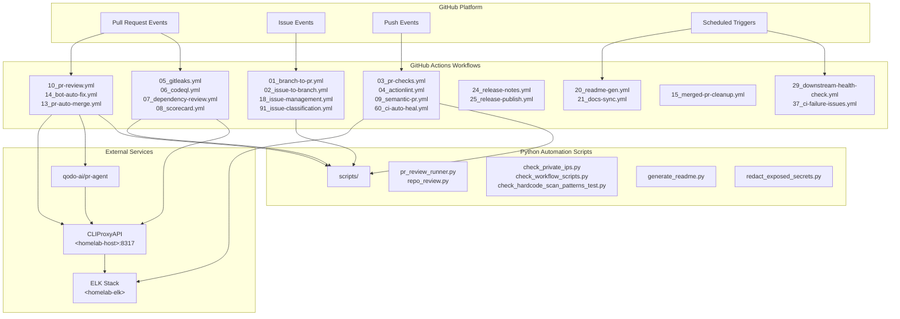

# GitHub Automation Bot — CLIProxyAPI v2.0

[](https://cliproxy.jclee.me)
[](#automation-inventory--자동화-인벤토리)
[](https://www.python.org/)
[](./LICENSE)

> **English** | [**한국어**](#개요)

---

## Table of Contents

- [Overview](#overview--개요)
- [Features](#features--주요-기능)
- [Architecture](#architecture--아키텍처)
- [Automation Inventory](#automation-inventory--자동화-인벤토리)
- [Quick Start](#quick-start--빠른-시작)
- [Local Development](#local-development--로컬-개발)
- [Commands Reference](#commands-reference--명령어-참조)
- [Contribution Guide](#contribution-guide--기여-가이드)

---

## Overview | 개요

This repository contains the **CLIProxyAPI v2.0 GitHub Automation Bot** — a comprehensive system of **33 GitHub Actions workflows** and Python-based automation tools that provide automated code review, issue management, PR handling, documentation generation, and release automation for GitHub repositories.

이 저장소는 **CLIProxyAPI v2.0 GitHub 자동화 봇**을 포함하고 있으며, GitHub 저장소에 대한 자동화된 코드 리뷰, 이슈 관리, PR 처리, 문서 생성 및 릴리스 자동화를 제공하는 **33개의 GitHub Actions 워크플로우**와 Python 기반 자동화 도구의 종합 시스템입니다.

### Key Characteristics | 주요 특성

| Characteristic 특성 | Description 설명 |
|---|---|
| **Architecture** 아키텍처 | Python-based GitHub App + GitHub Actions |
| **Automation Scope** 자동화 범위 | 33 workflows covering PR, issues, security, releases |
| **Core Scripts** 핵심 스크립트 | `scripts/` (Python automation tools) |
| **External Services** 외부 서비스 | CLIProxyAPI (`cliproxy.jclee.me`), PR Agent (`qodo-ai/pr-agent`) |
| **Logging** 로깅 | ELK stack (`<homelab-elk>`) |

---

## Features | 주요 기능

### Automated Code Review | 자동화 코드 리뷰

- **PR Agent Integration**: AI-powered code reviews using `qodo-ai/pr-agent`
- **Gitleaks Scanning**: Automated secrets and credentials detection
- **CodeQL Analysis**: Static security analysis for vulnerability detection
- **Dependency Review**: Automated dependency vulnerability scanning

### Issue Management | 이슈 관리

- **Automatic Branch Creation**: Branch creation from issues via `01_branch-to-pr.yml`
- **Issue-to-Branch Workflow**: Automated branch creation for issue tracking
- **Issue Classification**: Automatic issue categorization and labeling
- **Backfill Automation**: Historical issue data synchronization

### Pull Request Automation | 풀 리퀘스트 자동화

- **Semantic PR Validation**: Ensuring conventional commit format
- **Auto-Merge**: Automated PR merging based on status checks
- **Auto-Fix**: Bot-initiated fixes for common issues
- **Cleanup**: Automatic branch cleanup after PR merge

### Documentation | 문서화

- **README Generation**: Automated README.md generation and updates
- **Docs Sync**: Synchronized documentation across repositories
- **Release Notes**: Automated release note generation and publishing

### Security & Compliance | 보안 및 규정 준수

- **Dependency Scanning**: Dependency Review and vulnerability detection
- **Scorecard**: Security scorecards for supply chain health
- **Hardcode Detection**: Scanning for hardcoded credentials and private IPs
- **Secret Redaction**: Automated secret redaction in logs

### CI/CD | CI/CD

- **Status Checks**: Comprehensive PR validation checks
- **Actionlint**: Workflow syntax validation
- **Auto-Heal**: Self-healing CI pipeline for transient failures
- **Downstream Health Check**: Monitoring dependent repository health

---

## Architecture | 아키텍처



---

## Automation Inventory | 자동화 인벤토리

### GitHub Actions Workflows | GitHub Actions 워크플로우 (33 Total)

#### Pull Request Workflows | 풀 리퀘스트 워크플로우

| Workflow File | Description |
|---|---|
| `01_branch-to-pr.yml` | Creates branches from PRs for targeted development |
| `03_pr-checks.yml` | Core PR validation checks (lint, test, build) |
| `09_semantic-pr.yml` | Validates semantic PR titles and commit messages |
| `10_pr-review.yml` | Main PR review automation workflow |
| `13_pr-auto-merge.yml` | Automatically merges PRs meeting criteria |
| `14_bot-auto-fix.yml` | Bot-initiated automatic fixes for common issues |
| `15_merged-pr-cleanup.yml` | Cleans up branches and artifacts after merge |
| `44_reusable-pr-checks.yml` | Reusable workflow for PR validation checks |
| `security/11_pr-review.yml` | Security-focused PR review workflow |

#### Issue Management Workflows | 이슈 관리 워크플로우

| Workflow File | Description |
|---|---|
| `02_issue-to-branch.yml` | Creates branches from issues for development |
| `18_issue-management.yml` | Main issue management and triage automation |
| `19_issue-backfill.yml` | Backfills historical issue data |
| `37_ci-failure-issues.yml` | Creates issues from CI failures |
| `43_reusable-issue-management.yml` | Reusable workflow for issue management |
| `91_issue-classification.yml` | Auto-classifies and labels issues |

#### Security Workflows | 보안 워크플로우

| Workflow File | Description |
|---|---|
| `05_gitleaks.yml` | Secrets and credentials scanning |
| `06_codeql.yml` | CodeQL static analysis |
| `07_dependency-review.yml` | Dependency vulnerability scanning |
| `08_scorecard.yml` | Security scorecard assessment |
| `45_reusable-gitleaks.yml` | Reusable workflow for secrets scanning |

#### Documentation Workflows | 문서화 워크플로우

| Workflow File | Description |
|---|---|
| `20_readme-gen.yml` | Automated README.md generation |
| `21_docs-sync.yml` | Documentation synchronization across repos |
| `42_reusable-docs-sync.yml` | Reusable workflow for docs sync |

#### Release Workflows | 릴리스 워크플로우

| Workflow File | Description |
|---|---|
| `24_release-notes.yml` | Automated release note generation |
| `25_release-publish.yml` | Release publishing automation |

#### CI/CD Workflows | CI/CD 워크플로우

| Workflow File | Description |
|---|---|
| `04_actionlint.yml` | GitHub Actions workflow syntax validation |
| `12_dependabot-auto-merge.yml` | Auto-merges Dependabot PRs |
| `29_downstream-health-check.yml` | Monitors downstream repository health |
| `60_ci-auto-heal.yml` | Self-healing CI pipeline for failures |
| `ci.yml` | Main CI workflow |
| `auto-merge.yml` | Generic auto-merge workflow |
| `labeler.yml` | Automatic label management |
| `welcome.yml` | Welcome message for new contributors |

#### Reusable Workflows | 재사용 가능한 워크플로우

| Workflow File | Description |
|---|---|
| `42_reusable-docs-sync.yml` | Reusable documentation sync |
| `43_reusable-issue-management.yml` | Reusable issue management |
| `44_reusable-pr-checks.yml` | Reusable PR checks |
| `45_reusable-gitleaks.yml` | Reusable secrets scanning |

### Python Automation Scripts | Python 자동화 스크립트

All scripts are located in the `scripts/` directory.

| Script | Purpose |
|---|---|
| `pr_review_runner.py` | Orchestrates PR review automation |
| `repo_review.py` | Repository-level review automation |
| `check_private_ips.py` | Scans for hardcoded private IP addresses |
| `check_workflow_scripts.py` | Validates workflow file configurations |
| `check_hardcode_scan_patterns_test.py` | Tests for hardcoded pattern detection |
| `generate_readme.py` | Generates and updates README.md files |
| `redact_exposed_secrets.py` | Redacts secrets from logs and output |
| `issue_classification_workflow_test.py` | Tests for issue classification logic |
| `issue_classifier_js_test.py` | JavaScript issue classification tests |
| `pr_review_runner_test.py` | Tests for PR review runner |
| `check_private_ips_test.py` | Tests for private IP checker |
| `check_workflow_scripts_test.py` | Tests for workflow script validator |
| `readme_mermaid_test.py` | Tests for README Mermaid diagrams |

### External Integrations | 외부 통합

| Service | Endpoint | Purpose |
|---|---|---|
| **CLIProxyAPI** | `https://cliproxy.jclee.me/v1` | AI proxy service for automation |
| **PR Agent** | `qodo-ai/pr-agent` | AI-powered code review |
| **ELK Stack** | `<homelab-elk>` | Centralized logging |

---

## Quick Start | 빠른 시작

### Prerequisites | 사전 요구사항

- Python 3.x
- Git
- GitHub CLI (optional)
- Docker (for containerized execution)

### Installation | 설치

1. **Clone the repository**

   ```bash
   git clone <repository-url>
   cd <repository-name>
   ```

2. **Install Python dependencies**

   ```bash
   pip install -r requirements.txt
   pip install -r requirements-dev.txt
   ```

3. **Verify installation**

   ```bash
   python scripts/check_private_ips.py --help
   python scripts/pr_review_runner.py --help
   ```

### Basic Usage | 기본 사용법

#### Run PR Review Locally | 로컬에서 PR 리뷰 실행

```bash
python scripts/pr_review_runner.py \
  --repo <owner>/<repo> \
  --pr-number <pr_number> \
  --api-url https://cliproxy.jclee.me/v1
```

#### Scan for Private IPs | 프라이빗 IP 스캔

```bash
python scripts/check_private_ips.py \
  --path ./ \
  --exclude "_bot-scripts|venv|__pycache__"
```

#### Validate Workflow Files | 워크플로우 파일 검증

```bash
python scripts/check_workflow_scripts.py \
  --workflows-dir ./.github/workflows
```

#### Generate README | README 생성

```bash
python scripts/generate_readme.py \
  --template docs/TEMPLATE.md \
  --output README.md
```

---

## Local Development | 로컬 개발

### Development Environment Setup | 개발 환경 설정

1. **Create a virtual environment**

   ```bash
   python -m venv venv
   source venv/bin/activate  # Linux/macOS
   # or
   .\venv\Scripts\activate  # Windows
   ```

2. **Install dependencies**

   ```bash
   pip install -r requirements.txt
   pip install -r requirements-dev.txt
   ```

3. **Set up environment variables**

   ```bash
   export CL_PROXY_API_URL="https://cliproxy.jclee.me/v1"
   export GH_TOKEN="your_github_token"
   export ELK_ENDPOINT="http://<homelab-elk>:9200"
   ```

### Running Tests | 테스트 실행

```bash
# Run all tests
pytest

# Run specific test files
pytest scripts/check_private_ips_test.py
pytest scripts/pr_review_runner_test.py
pytest scripts/check_workflow_scripts_test.py

# Run with coverage
pytest --cov=. --cov-report=html
```

### Docker-Based Development | Docker 기반 개발

#### Build GitHub App Container

```bash
docker build -f _bot-scripts/Dockerfile.github_app -t cli-proxy-app .
```

#### Build GitHub Action Container

```bash
docker build -f _bot-scripts/Dockerfile.github_action -t cli-proxy-action .
```

#### Run with Docker Compose

```bash
docker compose -f _bot-scripts/docker-compose.github_app.yml up
```

### LXC-Specific Deployment | LXC 특수 배포

For LXC container environments:

```bash
docker compose -f _bot-scripts/docker-compose.github_app.yml.lxc up
```

---

## Commands Reference | 명령어 참조

### Python Scripts | Python 스크립트

| Command | Description |
|---|---|
| `python scripts/pr_review_runner.py [args]` | Run PR review automation |
| `python scripts/repo_review.py [args]` | Run repository-level review |
| `python scripts/check_private_ips.py [args]` | Scan for hardcoded private IPs |
| `python scripts/check_workflow_scripts.py [args]` | Validate workflow files |
| `python scripts/generate_readme.py [args]` | Generate README documentation |
| `python scripts/redact_exposed_secrets.py [args]` | Redact secrets from output |

### Makefile Commands | Makefile 명령어

From `_bot-scripts/Makefile`:

```bash
make help              # Show available targets
make install           # Install dependencies
make lint              # Run linting
make test              # Run tests
make build             # Build containers
make deploy            # Deploy application
```

### GitHub CLI Commands | GitHub CLI 명령어

```bash
# Trigger workflow dispatch
gh workflow run 10_pr-review.yml \
  --field pr_number=123 \
  --field repo=owner/repo

# View workflow runs
gh run list --workflow=10_pr-review.yml

# Check workflow status
gh run view <run-id> --log
```

---

## Repository Structure | 저장소 구조

```
/
├── .github/
│   └── workflows/              # GitHub Actions workflow definitions
│       ├── 01_branch-to-pr.yml
│       ├── 02_issue-to-branch.yml
│       ├── 03_pr-checks.yml
│       ├── 04_actionlint.yml
│       ├── 05_gitleaks.yml
│       ├── 06_codeql.yml
│       ├── 07_dependency-review.yml
│       ├── 08_scorecard.yml
│       ├── 09_semantic-pr.yml
│       ├── 10_pr-review.yml
│       ├── 12_dependabot-auto-merge.yml
│       ├── 13_pr-auto-merge.yml
│       ├── 14_bot-auto-fix.yml
│       ├── 15_merged-pr-cleanup.yml
│       ├── 18_issue-management.yml
│       ├── 19_issue-backfill.yml
│       ├── 20_readme-gen.yml
│       ├── 21_docs-sync.yml
│       ├── 24_release-notes.yml
│       ├── 25_release-publish.yml
│       ├── 29_downstream-health-check.yml
│       ├── 37_ci-failure-issues.yml
│       ├── 42_reusable-docs-sync.yml
│       ├── 43_reusable-issue-management.yml
│       ├── 44_reusable-pr-checks.yml
│       ├── 45_reusable-gitleaks.yml
│       ├── 60_ci-auto-heal.yml
│       ├── 91_issue-classification.yml
│       ├── auto-merge.yml
│       ├── ci.yml
│       ├── labeler.yml
│       ├── welcome.yml
│       └── security/
│           └── 11_pr-review.yml
├── scripts/                    # Python automation scripts
│   ├── pr_review_runner.py
│   ├── repo_review.py
│   ├── check_private_ips.py
│   ├── check_workflow_scripts.py
│   ├── generate_readme.py
│   ├── redact_exposed_secrets.py
│   ├── check_hardcode_scan_patterns_test.py
│   ├── issue_classification_workflow_test.py
│   ├── issue_classifier_js_test.py
│   ├── pr_review_runner_test.py
│   ├── check_private_ips_test.py
│   ├── check_workflow_scripts_test.py
│   ├── readme_mermaid_test.py
│   └── go.mod
├── docs/                       # Documentation
│   ├── ALERT-REPOSITORY-XWIKI.md
│   ├── DEPLOYMENT.md
│   ├── LEGACY-CLEANUP-REPORT.md
│   ├── QUICK-START.md
│   └── RELEASE-NOTES.md
├── tests/                      # Test suite
│   └── README.md
├── demo/                       # Demo materials
│   └── README.md
├── security_alert/              # Security alert configurations
│   ├── README.md
│   └── app.manifest
├── _bot-scripts/               # Bot deployment configurations
│   ├── Dockerfile.github_app
│   ├── Dockerfile.github_action
│   ├── docker-compose.github_app.yml
│   ├── docker-compose.github_app.yml.lxc
│   ├── filebeat.yml
│   ├── pyproject.toml
│   ├── requirements.txt
│   ├── requirements-dev.txt
│   ├── setup.py
│   ├── Makefile
│   ├── README.md
│   ├── AGENTS.md
│   ├── CODE_OF_CONDUCT.md
│   ├── CONTRIBUTING.md
│   ├── LICENSE
│   ├── MANIFEST.in
│   ├── NOTICE
│   └── SECURITY.md
├── CONTRIBUTING.md
├── LICENSE
└── README.md
```

---

## Contribution Guide | 기여 가이드

### Getting Started | 시작하기

1. **Fork the repository**
2. **Create a feature branch**

   ```bash
   git checkout -b feature/your-feature-name
   ```

3. **Make your changes**
4. **Run tests**

   ```bash
   pytest scripts/ -v
   ```

5. **Commit using conventional commits**

   ```bash
   git commit -m "feat: add new automation feature"
   ```

6. **Push and create a Pull Request**

   ```bash
   git push origin feature/your-feature-name
   ```

### Code Style | 코드 스타일

- Follow PEP 8 guidelines for Python code
- Use type hints where applicable
- Write docstrings for all public functions and classes
- Ensure all scripts have proper argument parsing with `--help` documentation

### Testing Requirements | 테스트 요구사항

- All new scripts must include corresponding test files
- Test files should follow the naming convention: `<script_name>_test.py`
- Maintain existing test coverage
- Run full test suite before submitting PR

### Workflow Development Guidelines | 워크플로우 개발 가이드

- Use numeric prefixes for workflow file naming (e.g., `XX_name.yml`)
- Include `on:` triggers explicitly
- Use reusable workflows where applicable
- Follow GitHub Actions best practices
- Validate workflow syntax with `actionlint`

### Pull Request Review Process | 풀 리퀘스트 리뷰 프로세스

1. Automated checks must pass (`03_pr-checks.yml`)
2. At least one reviewer approval required
3. No unresolved conversations
4. Branch must be up to date with target branch

### Reporting Issues | 이슈 보고

- Use GitHub Issues for bug reports and feature requests
- Include reproduction steps for bugs
- Specify environment details (Python version, OS, etc.)
- Tag appropriately using `18_issue-management.yml` labels

### Security Considerations | 보안 고려사항

- Never commit secrets or credentials to the repository
- Use GitHub Secrets for sensitive data
- Follow security scanning guidelines in `SECURITY.md`
- Report vulnerabilities according to `SECURITY.md` policy

---

## Documentation References | 문서 참고 자료

- [Quick Start Guide](./docs/QUICK-START.md)
- [Deployment Guide](./docs/DEPLOYMENT.md)
- [Release Notes](./docs/RELEASE-NOTES.md)
- [Legacy Cleanup Report](./docs/LEGACY-CLEANUP-REPORT.md)
- [XWiki Alert](./docs/ALERT-REPOSITORY-XWIKI.md)

---

## License | 라이선스

Proprietary - All rights reserved. See [LICENSE](./LICENSE) for details.

---

## Contact | 연락처

- **Documentation**: See [docs/](docs/)
- **Security Issues**: See [SECURITY.md](./_bot-scripts/SECURITY.md)
- **Bot Service**: <https://bot.jclee.me>
- **API Endpoint**: <https://cliproxy.jclee.me>
