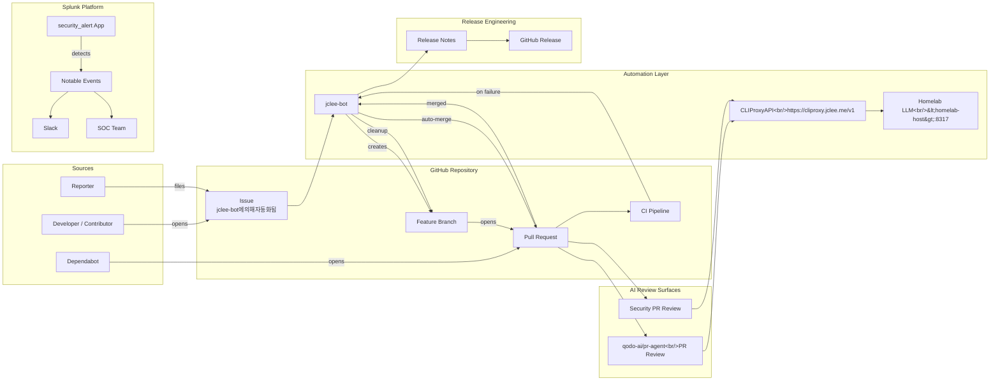
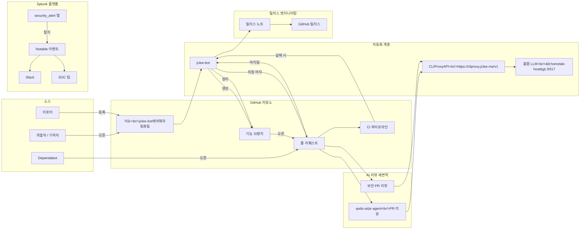

# Security Alert Splunk App & GitHub Automation

[](#automation-inventory--%EC%9E%90%EB%8F%99%ED%99%94-%EC%9D%B8%EB%B2%84%EC%A0%80%EB%A6%AC)
[](#overview--%EA%B0%9C%EC%9A%94)
[](https://cliproxy.jclee.me)
[](https://github.com/qodo-ai/pr-agent)
[](#automation-surfaces-owned-by-jclee-bot--jclee-bot%EA%B0%80-%EC%86%8C%EC%9C%A0%ED%95%98%EB%8A%94-%EC%9E%90%EB%8F%99%ED%99%94-%EC%84%B8%EB%A9%B4%EC%A0%81)
[](https://bot.jclee.me)
[](./LICENSE)
[](#automation-inventory--%EC%9E%90%EB%8F%99%ED%99%94-%EC%9D%B8%EB%B2%84%EC%A0%80%EB%A6%AC)
[](#automation-inventory--%EC%9E%90%EB%8F%99%ED%99%94-%EC%9D%B8%EB%B2%84%EC%A0%80%EB%A6%AC)

> **English | 한국어**
> This README is published in a bilingual format. Each major section contains both English and Korean explanations so contributors can navigate the system in either language.
> 본 README는 영문/한글 이중 언어로 작성되었습니다. 각 주요 섹션은 영어와 한국어 설명을 함께 제공하여 두 언어 모두로 시스템을 파악할 수 있도록 구성되어 있습니다.

---

## Table of Contents | 목차

- [Overview | 개요](#overview--%EA%B0%9C%EC%9A%94)
- [Features | 주요 기능](#features--%EC%A3%BC%EC%9A%94-%EA%B8%B0%EB%8A%A5)
- [Repository Structure | 저장소 구조](#repository-structure--%EC%A0%80%EC%9E%A5%EC%86%8C-%EA%B5%AC%EC%A1%B0)
- [Architecture | 아키텍처](#architecture--%EC%95%84%ED%82%A4%ED%85%8D%EC%B2%98)
- [Automation Inventory | 자동화 인벤토리](#automation-inventory--%EC%9E%90%EB%8F%99%ED%99%94-%EC%9D%B8%EB%B2%84%EC%A0%80%EB%A6%AC)
- [Automation Surfaces Owned by jclee-bot | jclee-bot가 소유하는 자동화 세면적](#automation-surfaces-owned-by-jclee-bot--jclee-bot%EA%B0%80-%EC%86%8C%EC%9C%A0%ED%95%98%EB%8A%94-%EC%9E%90%EB%8F%99%ED%99%94-%EC%84%B8%EB%A9%B4%EC%A0%81)
- [Go Tools | Go 도구](#go-tools--go-%EB%8F%84%EA%B5%AC)
- [Quick Start | 빠른 시작](#quick-start--%EB%B9%A0%EB%A5%B8-%EC%8B%9C%EC%9E%91)
- [Local Development | 로컬 개발](#local-development--%EB%A1%9C%EC%BB%AC-%EA%B0%9C%EB%B0%9C)
- [Commands Reference | 명령어 참조](#commands-reference--%EB%AA%85%EB%A0%B9%EC%96%B4-%EC%B0%B8%EC%A1%B0)
- [Contribution Guide | 기여 가이드](#contribution-guide--%EA%B8%B0%EC%97%AC-%EA%B0%80%EC%9D%B4%EB%93%9C)

---

## Overview | 개요

### English

This repository packages two production-grade artifacts:

1. **`security_alert/` — Splunk App**: A Splunk add-on that turns raw security events into actionable alerts. It ships an alert builder, an alert management dashboard, a data explorer dashboard, a "easy alert builder", and Slack/format utilities (`safe_fmt.py`, `slack.py`). Notable events can be dispatched to Slack for SOC review.
2. **`.github/workflows/` — GitHub Automation**: A fleet of 14 GitHub Actions workflows orchestrated primarily by the **`jclee-bot`** identity. The automation covers the full developer lifecycle: issue → branch → PR → review → merge → cleanup → release.

All AI-assisted automation (PR review, security review, release notes) is routed through a self-hosted **CLIProxyAPI** at `https://cliproxy.jclee.me/v1`, which in turn forwards requests to a private homelab backend. The [`qodo-ai/pr-agent`](https://github.com/qodo-ai/pr-agent) project is used as the upstream review engine. Bot-managed behavior on issues is marked with the canonical marker **`jclee-bot에의해자동화됨`**.

### 한국어

본 저장소는 두 가지 운영 등급 산출물을 함께 제공합니다.

1. **`security_alert/` — Splunk 앱**: 원시 보안 이벤트를 실행 가능한 알림으로 전환하는 Splunk 애드온입니다. 알림 빌더, 알림 관리 대시보드, 데이터 탐색기 대시보드, "이지 알림 빌더"와 Slack/포맷 유틸리티(`safe_fmt.py`, `slack.py`)를 포함합니다. Notable 이벤트는 SOC 검토를 위해 Slack으로 전송될 수 있습니다.
2. **`.github/workflows/` — GitHub 자동화**: 주로 **`jclee-bot`** 신원으로 오케스트레이션되는 14개의 GitHub Actions 워크플로우 플릿입니다. 이슈 → 브랜치 → PR → 리뷰 → 머지 → 정리 → 릴리스에 이르는 개발자 라이프사이클 전체를 다룹니다.

PR 리뷰, 보안 리뷰, 릴리스 노트 등 모든 AI 보조 자동화는 자체 호스팅 **CLIProxyAPI**(`https://cliproxy.jclee.me/v1`)를 경유하며, 해당 프록시는 다시 사설 홈랩 백엔드로 요청을 전달합니다. [`qodo-ai/pr-agent`](https://github.com/qodo-ai/pr-agent)가 업스트림 리뷰 엔진으로 사용됩니다. 이슈에 대한 봇 관리 동작은 표준 마커 **`jclee-bot에의해자동화됨`** 로 표기됩니다.

---

## Features | 주요 기능

### English

- **Splunk alert authoring**: Full Splunk app layout (`app.manifest`, `default/`, `metadata/`, `bin/`, `data/ui/`) with alert action, macros, props, saved searches, and transforms.
- **Custom dashboards**: Alert management, data explorer, and easy alert builder XML views.
- **Slack delivery**: Python alert scripts format and ship notable events to Slack via the `slack.py` and `safe_fmt.py` modules.
- **End-to-end GitHub automation**: Issue → branch → PR → review → merge → cleanup → release.
- **AI-powered PR review**: Integrates `qodo-ai/pr-agent` for code review and a parallel security-focused PR review surface.
- **Auto-merge**: Auto-merge for Dependabot and ordinary PRs under configured guardrails.
- **Auto-fix loop**: `14_bot-auto-fix.yml` opens follow-up patches when static analysis or tests fail.
- **Self-healing CI**: `37_ci-failure-issues.yml` opens or updates issues when CI fails.
- **Release engineering**: `24_release-notes.yml` and `25_release-publish.yml` automate changelog drafting and GitHub release publishing.
- **Downstream health checks**: `29_downstream-health-check.yml` pings a downstream homelab stack at `https://cliproxy.jclee.me` and `https://bot.jclee.me`.
- **Issue backfill**: `19_issue-backfill.yml` reconciles stale or missing issues against repository state.

### 한국어

- **Splunk 알림 작성**: Splunk 앱 표준 레이아웃(`app.manifest`, `default/`, `metadata/`, `bin/`, `data/ui/`)과 알림 액션, 매크로, props, 저장된 검색, transforms를 제공합니다.
- **커스텀 대시보드**: 알림 관리, 데이터 탐색기, 이지 알림 빌더 XML 뷰를 포함합니다.
- **Slack 전송**: Python 알림 스크립트가 `slack.py`와 `safe_fmt.py` 모듈을 통해 Notable 이벤트를 Slack으로 포맷팅/전송합니다.
- **엔드투엔드 GitHub 자동화**: 이슈 → 브랜치 → PR → 리뷰 → 머지 → 정리 → 릴리스를 자동화합니다.
- **AI 기반 PR 리뷰**: 코드 리뷰를 위해 `qodo-ai/pr-agent`를 통합하고, 보안 중심 PR 리뷰 세면적을 병렬로 운영합니다.
- **자동 머지**: 사전 정의된 가드레일 하에서 Dependabot 및 일반 PR을 자동 머지합니다.
- **자동 수정 루프**: `14_bot-auto-fix.yml`은 정적 분석 또는 테스트 실패 시 후속 패치를 엽니다.
- **자가 치유 CI**: `37_ci-failure-issues.yml`은 CI 실패 시 이슈를 새로 열거나 갱신합니다.
- **릴리스 엔지니어링**: `24_release-notes.yml`과 `25_release-publish.yml`이 changelog 초안 작성과 GitHub 릴리스 게시를 자동화합니다.
- **다운스트림 헬스 체크**: `29_downstream-health-check.yml`이 `https://cliproxy.jclee.me` 및 `https://bot.jclee.me` 다운스트림 홈랩 스택에 헬스 체크를 수행합니다.
- **이슈 백필**: `19_issue-backfill.yml`이 저장소 상태와 비교하여 오래되었거나 누락된 이슈를 보정합니다.

---

## Repository Structure | 저장소 구조

### English

The repository ships as a single repo with three top-level concerns: the Splunk app, human-facing documentation, and the GitHub automation surface. Workflow files live under `.github/workflows/` and are treated as **implementation triggers**, not as the documentation source of truth — see the [Automation Inventory](#automation-inventory--%EC%9E%90%EB%8F%99%ED%99%94-%EC%9D%B8%EB%B2%84%EC%A0%80%EB%A6%AC) section for the real taxonomy.

### 한국어

저장소는 단일 리포지토리에 세 가지 최상위 관심사를 함께 싣습니다. Splunk 앱, 사용자 대상 문서, 그리고 GitHub 자동화 세면적입니다. 워크플로우 파일은 `.github/workflows/`에 있으며 문서의 진실 공급원이 아닌 **구현 트리거**로 취급됩니다. 실제 분류는 [자동화 인벤토리](#automation-inventory--%EC%9E%90%EB%8F%99%ED%99%94-%EC%9D%B8%EB%B2%84%EC%A0%80%EB%A6%AC) 섹션을 참고하십시오.

```
.
├── CONTRIBUTING.md
├── LICENSE
├── README.md
├── resume/
│   ├── API.md
│   ├── ARCHITECTURE.md
│   ├── DEPLOYMENT.md
│   └── TROUBLESHOOTING.md
├── docs/
│   ├── ALERT-REPOSITORY-XWIKI.md
│   ├── DEPLOYMENT.md
│   ├── LEGACY-CLEANUP-REPORT.md
│   ├── QUICK-START.md
│   └── RELEASE-NOTES.md
├── demo/
│   └── README.md
├── security_alert/                         # Splunk add-on (root of the app)
│   ├── README.md
│   ├── app.manifest
│   ├── bin/                                # Alert action scripts (Python)
│   │   ├── safe_fmt.py
│   │   ├── six.py
│   │   └── slack.py
│   ├── metadata/
│   │   └── default.meta
│   ├── default/                            # Splunk conf files
│   │   ├── alert_actions.conf
│   │   ├── app.conf
│   │   ├── macros.conf
│   │   ├── props.conf
│   │   ├── savedsearches.conf
│   │   ├── transforms.conf
│   │   └── data/
│   │       └── ui/
│   │           ├── nav/
│   │           │   └── default.xml
│   │           └── views/
│   │               ├── alert-builder.xml
│   │               ├── alert-management-dashboard.xml
│   │               ├── data-explorer-dashboard.xml
│   │               └── easy_alert_builder.xml
│   └── lib/python3/                        # Vendored runtime deps for Splunk
│       ├── urllib3/
│       ├── idna-3.11.dist-info/
│       └── charset_normalizer-3.4.4.dist-info/
└── .github/
    └── workflows/                          # 14 GitHub Actions (triggers only)
```

> **Note | 참고**: The `lib/python3/` directory contains vendored third-party packages required by the Splunk scripts at runtime. They are intentionally pinned and should not be modified locally.

---

## Architecture | 아키텍처

### English

The system has three collaborating planes:

- **Data plane** — the `security_alert/` Splunk app, which ingests events, generates alerts, and dispatches them to Slack and the SOC team.
- **Collaboration plane** — GitHub Issues, branches, PRs, and the CI pipeline.
- **Automation plane** — `jclee-bot` orchestrating workflows, calling the self-hosted `CLIProxyAPI`, which fans out to the homelab LLM backend. `qodo-ai/pr-agent` is the upstream review engine consumed by the AI surfaces.



### 한국어

본 시스템은 다음 세 가지 협력 평면으로 구성됩니다.

- **데이터 평면** — `security_alert/` Splunk 앱. 이벤트를 수집하고 알림을 생성하여 Slack과 SOC 팀으로 전송합니다.
- **협업 평면** — GitHub 이슈, 브랜치, PR 그리고 CI 파이프라인입니다.
- **자동화 평면** — `jclee-bot`이 워크플로우를 오케스트레이션하고, 자체 호스팅 `CLIProxyAPI`를 호출하며, 프록시는 다시 홈랩 LLM 백엔드로 요청을 전달합니다. `qodo-ai/pr-agent`가 AI 세면적이 소비하는 업스트림 리뷰 엔진입니다.



---

## Automation Inventory | 자동화 인벤토리

### English

> Workflows under `.github/workflows/` are **implementation triggers** — they are not the source of truth for what the automation does. This section is the source of truth. The taxonomy below groups the 14 workflows by automation surface, so readers can reason about intent without grepping YAML.

The README generator that wrote this section is `gpt-5.5`, with `minimax-m3` available as a fallback through `CLIProxyAPI`.

| Surface | Intent | Mutating? | Owner |
|---|---|---|---|
| Issue Triage | Convert incoming issues into triage notes and (where applicable) branches | Partial | jclee-bot |
| PR Authoring | Lift a branch into a pull request with the right template | Yes | jclee-bot |
| AI PR Review | Use `qodo-ai/pr-agent` for code-quality comments | No (comments) | jclee-bot (AI-assisted) |
| Security PR Review | Detect secrets, dangerous APIs, and policy violations | No (comments) | jclee-bot (AI-assisted) |
| Auto-Merge (PR) | Merge PRs that pass all required checks | **Yes** | jclee-bot |
| Auto-Merge (Dependabot) | Merge safe Dependabot updates | **Yes** | jclee-bot |
| Bot Auto-Fix | Open a follow-up patch when checks fail | **Yes** | jclee-bot |
| Merged PR Cleanup | Delete merged feature branches | **Yes** | jclee-bot |
| Issue Backfill | Reconcile stale or missing issues | Partial | jclee-bot |
| Release Notes | Draft changelogs from merged PRs | **Yes** | jclee-bot |
| Release Publish | Publish a GitHub release tag | **Yes** | jclee-bot |
| Downstream Health Check | Probe `https://cliproxy.jclee.me` and `https://bot.jclee.me` | No | jclee-bot |
| CI Failure Issues | Open or update issues on CI failure | Partial | jclee-bot |
| CI | Run the build, lint, and Splunk conf validation | No | Maintainers |

### 한국어

> `.github/workflows/`의 워크플로우는 **구현 트리거**이며 자동화의 의도를 정의하는 진실 공급원이 아닙니다. 본 섹션이 진실 공급원입니다. 아래 분류는 14개 워크플로우를 자동화 세면적 단위로 묶어, YAML을 직접 뒤지지 않고도 의도를 파악할 수 있도록 구성합니다.

본 섹션을 작성한 README 생성기는 `gpt-5.5`이며, `minimax-m3`은 `CLIProxyAPI`를 통한 폴백으로 사용 가능합니다.

| 세면적 | 의도 | 상태 변경 여부 | 오너 |
|---|---|---|---|
| 이슈 분류 | 들어오는 이슈를 분류 노트로 변환하고 필요한 경우 브랜치 생성 | 일부 | jclee-bot |
| PR 작성 | 브랜치를 적절한 템플릿의 PR로 승격 | 변경 | jclee-bot |
| AI PR 리뷰 | 코드 품질 코멘트를 위해 `qodo-ai/pr-agent` 사용 | 변경 없음(코멘트) | jclee-bot (AI 보조) |
| 보안 PR 리뷰 | 시크릿, 위험 API, 정책 위반 탐지 | 변경 없음(코멘트) | jclee-bot (AI 보조) |
| 자동 머지 (PR) | 필수 체크를 통과한 PR 머지 | **변경** | jclee-bot |
| 자동 머지 (Dependabot) | 안전한 Dependabot 업데이트를 머지 | **변경** | jclee-bot |
| 봇 자동 수정 | 체크 실패 시 후속 패치를 오픈 | **변경** | jclee-bot |
| 머지된 PR 정리 | 머지된 기능 브랜치를 삭제 | **변경** | jclee-bot |
| 이슈 백필 | 오래되었거나 누락된 이슈를 보정 | 일부 | jclee-bot |
| 릴리스 노트 | 머지된 PR로부터 changelog 초안 작성 | **변경** | jclee-bot |
| 릴리스 게시 | GitHub 릴리스 태그 게시 | **변경** | jclee-bot |
| 다운스트림 헬스 체크 | `https://cliproxy.jclee.me` 및 `https://bot.jclee.me` 프로빙 | 변경 없음 | jclee-bot |
| CI 실패 이슈 | CI 실패 시 이슈를 새로 열거나 갱신 | 일부 | jclee-bot |
| CI | 빌드, 린트, Splunk conf 검증 실행 | 변경 없음 | 메인테이너 |

---

## Automation Surfaces Owned by jclee-bot | jclee-bot가 소유하는 자동화 세면적

### English

`jclee-bot` is the identity under which all mutating automation is executed. Issues that are picked up by the bot receive the canonical marker **`jclee-bot에의해자동화됨`** so contributors can distinguish bot behavior from human maintainer behavior.

The bot owns the following surfaces:

- **Issue automation** — Triage, backfill, and `jclee-bot에의해자동화됨`-marked follow-ups. Any issue that transitions to an actionable branch must show the marker.
- **Branch automation** — Issue-to-branch and branch-to-PR conversion, including PR template population.
- **Review automation** — `qodo-ai/pr-agent`-powered code review and a parallel security PR review. Both are non-mutating (comment-only).
- **Merge automation** — Auto-merge for both ordinary PRs and Dependabot updates, gated by branch protection and required checks.
- **Self-healing automation** — `14_bot-auto-fix.yml` opens follow-up patches; `37_ci-failure-issues.yml` files CI failures as issues.
- **Release automation** — Drafts release notes from merged PRs and publishes GitHub releases.
- **Lifecycle automation** — Cleans up merged branches; reconciles stale issues.
- **Observability automation** — Probes the public endpoints `https://cliproxy.jclee.me` and `https://bot.jclee.me` to detect downstream outages.

The CI workflow (`ci.yml`) is the only mutating-adjacent surface owned by human maintainers; it does not bypass the jclee-bot review surfaces.

### 한국어

`jclee-bot`은 상태를 변경하는 모든 자동화가 실행되는 신원입니다. 봇이 처리한 이슈에는 표준 마커 **`jclee-bot에의해자동화됨`** 가 부여되어, 기여자가 봇 동작과 휴먼 메인테이너 동작을 구분할 수 있습니다.

봇이 소유하는 세면적은 다음과 같습니다.

- **이슈 자동화** — 분류, 백필, `jclee-bot에의해자동화됨` 마크가 붙은 후속 조치. 실행 가능한 브랜치로 전환되는 모든 이슈에는 마커가 표기되어야 합니다.
- **브랜치 자동화** — 이슈 → 브랜치 및 브랜치 → PR 변환, PR 템플릿 자동 채움.
- **리뷰 자동화** — `qodo-ai/pr-agent` 기반 코드 리뷰와 병렬 보안 PR 리뷰. 둘 다 상태를 변경하지 않습니다(코멘트 전용).
- **머지 자동화** — 일반 PR과 Dependabot 업데이트의 자동 머지. 브랜치 보호 규칙과 필수 체크로 게이팅됩니다.
- **자가 치유 자동화** — `14_bot-auto-fix.yml`이 후속 패치를 열고, `37_ci-failure-issues.yml`이 CI 실패를 이슈로 파일링합니다.
- **릴리스 자동화** — 머지된 PR로부터 릴리스 노트를 초안 작성하고 GitHub 릴리스를 게시합니다.
- **라이프사이클 자동화** — 머지된 브랜치를 정리하고 오래된 이슈를 보정합니다.
- **관측 자동화** — 공개 엔드포인트 `https://cliproxy.jclee.me` 및 `https://bot.jclee.me`를 프로빙하여 다운스트림 장애를 탐지합니다.

CI 워크플로우(`ci.yml`)는 휴먼 메인테이너가 소유하는 유일한 상태 변경 인접 세면적이며, jclee-bot 리뷰 세면적을 우회하지 않습니다.

---

## Go Tools | Go 도구

### English

This repository does **not** ship any Go-based command-line tools. All automation is delivered as GitHub Actions workflows orchestrated by `jclee-bot`. There is no `cmd/`, `bin/`, or Go module in this repo. The `bin/` directory inside `security_alert/` contains Python alert action scripts and is unrelated.

If you need a developer-facing CLI for this repository, prefer the official `gh` CLI (see [Commands Reference](#commands-reference--%EB%AA%85%EB%A0%B9%EC%96%B4-%EC%B0%B8%EC%A1%B0)).

### 한국어

본 저장소는 **Go 기반 CLI 도구를 제공하지 않습니다.** 모든 자동화는 `jclee-bot`이 오케스트레이션하는 GitHub Actions 워크플로우로 제공됩니다. 저장소 내에 `cmd/`, `bin/`, Go 모듈은 존재하지 않습니다. `security_alert/bin/`은 Python 알림 액션 스크립트 디렉터리이며 Go 도구와 무관합니다.

개발자용 CLI가 필요한 경우 [명령어 참조](#commands-reference--%EB%AA%85%EB%A0%B9%EC%96%B4-%EC%B0%B8%EC%A1%B0) 섹션의 공식 `gh` CLI 사용을 권장합니다.

---

## Quick Start | 빠른 시작

### English

1. **Clone the repository**

   ```bash
   git clone <repo-url> security-alert
   cd security-alert
   ```

2. **Install the Splunk app** on a development Splunk instance

   ```bash
   # From the repo root
   cp -R security_alert $SPLUNK_HOME/etc/apps/security_alert
   $SPLUNK_HOME/bin/splunk restart
   ```

3. **Verify the app loads**

   ```bash
   $SPLUNK_HOME/bin/splunk btool check --app=security_alert
   ```

4. **Configure GitHub repository secrets** for bot automation:

   - `BOT_TOKEN` — a PAT for `jclee-bot`
   - `CLI_PROXY_URL` — defaults to `https://cliproxy.jclee.me/v1`
   - `PR_AGENT_TOKEN` — token for `qodo-ai/pr-agent`

5. **Open a test issue** to confirm `jclee-bot에의해자동화됨` triage behavior.

### 한국어

1. **저장소 클론**

   ```bash
   git clone <repo-url> security-alert
   cd security-alert
   ```

2. **개발용 Splunk 인스턴스에 Splunk 앱 설치**

   ```bash
   # 저장소 루트에서 실행
   cp -R security_alert $SPLUNK_HOME/etc/apps/security_alert
   $SPLUNK_HOME/bin/splunk restart
   ```

3. **앱이 정상 로드되는지 확인**

   ```bash
   $SPLUNK_HOME/bin/splunk btool check --app=security_alert
   ```

4. **봇 자동화를 위한 GitHub 저장소 시크릿 설정**

   - `BOT_TOKEN` — `jclee-bot`용 PAT
   - `CLI_PROXY_URL` — 기본값 `https://cliproxy.jclee.me/v1`
   - `PR_AGENT_TOKEN` — `qodo-ai/pr-agent`용 토큰

5. **`jclee-bot에의해자동화됨` 분류 동작을 확인하기 위해 테스트 이슈를 오픈합니다.**

---

## Local Development | 로컬 개발

### English

#### Splunk app development

- Use Splunk 9.x for parity with the dashboards and saved searches.
- After editing any `*.conf` or `*.xml` file under `security_alert/`, validate with `btool check`.
- Python scripts under `security_alert/bin/` must remain compatible with Splunk's bundled Python runtime; do not assume newer syntax than Python 3.7.
- Vendored packages under `security_alert/lib/python3/` are pinned and should only be upgraded deliberately.

#### GitHub automation development

- Branch names should match the convention enforced by `01_branch-to-pr.yml` and `02_issue-to-branch.yml`.
- Test mutating automation in a fork before touching `main`.
- All mutating actions (auto-merge, auto-fix, release publish, branch cleanup) must remain owned by `jclee-bot`.
- The bot-facing endpoints used in tests are `https://cliproxy.jclee.me/v1` (AI proxy) and `https://bot.jclee.me` (control plane).

#### Documentation development

- Bilingual sections are required for any new top-level heading.
- Use placeholders such as `<homelab-host>` or `<homelab-elk>`; never paste private IP addresses into the repository.

### 한국어

#### Splunk 앱 개발

- 대시보드와 저장된 검색과의 정합성을 위해 Splunk 9.x를 사용하십시오.
- `security_alert/` 하위의 `*.conf` 또는 `*.xml` 파일을 수정한 후에는 `btool check`로 검증합니다.
- `security_alert/bin/`의 Python 스크립트는 Splunk에 번들된 Python 런타임과 호환되어야 하며 Python 3.7보다 새로운 문법을 가정해서는 안 됩니다.
- `security_alert/lib/python3/`의 벤더링 패키지는 버전이 고정되어 있으므로 의도적으로만 업그레이드하십시오.

#### GitHub 자동화 개발

- 브랜치명은 `01_branch-to-pr.yml` 및 `02_issue-to-branch.yml`이 강제하는 규칙을 따라야 합니다.
- `main` 브랜치를 건드리기 전에 포크에서 상태 변경 자동화를 테스트하십시오.
- 자동 머지, 자동 수정, 릴리스 게시, 브랜치 정리 등 모든 상태 변경 작업은 `jclee-bot` 소유로 유지되어야 합니다.
- 테스트에서 사용되는 봇 엔드포인트는 `https://cliproxy.jclee.me/v1`(AI 프록시)와 `https://bot.jclee.me`(컨트롤 플레인)입니다.

#### 문서 개발

- 새로운 최상위 헤딩에는 영문/한글 이중 언어가 모두 필요합니다.
- `<homelab-host>`, `<homelab-elk>` 같은 자리표지자를 사용하고 사설 IP 주소를 저장소에 절대 붙여넣지 마십시오.

---

## Commands Reference | 명령어 참조

### English

#### Git & GitHub

```bash
# Clone
git clone <repo-url> security-alert && cd security-alert

# Create a feature branch (must match bot naming conventions)
git checkout -b feat/<short-description>

# Push and let jclee-bot open the PR
git push -u origin HEAD

# Watch automation runs
gh run watch

# Re-run a failed workflow
gh run rerun <run-id>

# Open an issue that will be picked up by the bot
gh issue create --title "..." --body "..."
```

#### Splunk

```bash
# Validate the app's conf files
$SPLUNK_HOME/bin/splunk btool check --app=security_alert

# List dashboards registered by the app
$SPLUNK_HOME/bin/splunk display dashboards --app=security_alert

# Run a saved search manually
curl -k -u admin:changeme \
  "https://localhost:8089/services/search/jobs?output_mode=json" \
  -d "search=search_name_here"

# Tail internal logs while testing an alert action
$SPLUNK_HOME/bin/splunk _internal call /services/search/jobs/<sid>
```

#### Python (alert action scripts)

```bash
# Smoke-test the Slack alert script locally
python3 security_alert/bin/safe_fmt.py <<< "sample payload"

# Lint (if configured)
python3 -m py_compile security_alert/bin/slack.py
```

#### CLIProxyAPI

```bash
# Health probe
curl -fsS https://cliproxy.jclee.me/healthz

# Manual completion through the proxy (illustrative)
curl -fsS https://cliproxy.jclee.me/v1/completions \
  -H "Authorization: Bearer $CLI_PROXY_TOKEN" \
  -H "Content-Type: application/json" \
  -d '{"model":"minimax-m3","prompt":"hello"}'
```

### 한국어

#### Git & GitHub

```bash
# 클론
git clone <repo-url> security-alert && cd security-alert

# 기능 브랜치 생성 (봇 명명 규칙 준수)
git checkout -b feat/<short-description>

# 푸시 후 jclee-bot이 PR을 열도록 둠
git push -u origin HEAD

# 자동화 실행 모니터링
gh run watch

# 실패한 워크플로우 재실행
gh run rerun <run-id>

# 봇이 처리할 이슈 오픈
gh issue create --title "..." --body "..."
```

#### Splunk

```bash
# 앱 conf 파일 검증
$SPLUNK_HOME/bin/splunk btool check --app=security_alert

# 앱이 등록한 대시보드 나열
$SPLUNK_HOME/bin/splunk display dashboards --app=security_alert

# 저장된 검색 수동 실행
curl -k -u admin:changeme \
  "https://localhost:8089/services/search/jobs?output_mode=json" \
  -d "search=search_name_here"

# 알림 액션 테스트 중 내부 로그 모니터링
$SPLUNK_HOME/bin/splunk _internal call /services/search/jobs/<sid>
```

#### Python (알림 액션 스크립트)

```bash
# Slack 알림 스크립트 로컬 스모크 테스트
python3 security_alert/bin/safe_fmt.py <<< "sample payload"

# 린트(설정된 경우)
python3 -m py_compile security_alert/bin/slack.py
```

#### CLIProxyAPI

```bash
# 헬스 체크
curl -fsS https://cliproxy.jclee.me/healthz

# 프록시를 통한 수동 호출(예시)
curl -fsS https://cliproxy.jclee.me/v1/completions \
  -H "Authorization: Bearer $CLI_PROXY_TOKEN" \
  -H "Content-Type: application/json" \
  -d '{"model":"minimax-m3","prompt":"hello"}'
```

---

## Contribution Guide | 기여 가이드

### English

We welcome contributions to both the Splunk app and the GitHub automation.

**Before opening a PR:**

1. Open or find an issue describing the change. Bot-managed behavior on the issue will be tagged `jclee-bot에의해자동화됨`.
2. Create a feature branch that follows the bot's naming convention (otherwise `02_issue-to-branch.yml` and `01_branch-to-pr.yml` will not pick it up).
3. Keep diffs small and focused.

**Coding standards:**

- Splunk confs must pass `btool check --app=security_alert`.
- Python scripts must remain Python 3.7-compatible and must not introduce new third-party dependencies without updating `lib/python3/`.
- Workflow changes must keep all mutating actions attributed to `jclee-bot`.
- Never commit private/internal IP addresses — use `<homelab-host>`, `<homelab-elk>`, or other placeholders.

**Review process:**

- `qodo-ai/pr-agent` will post an automated code review.
- The security PR review surface will scan for secrets and policy violations.
- Maintainers may request changes; once required checks pass, auto-merge will activate.
- After merge, `15_merged-pr-cleanup.yml` will remove the branch.

**Release process:**

- `24_release-notes.yml` drafts release notes from merged PRs.
- `25_release-publish.yml` publishes the GitHub release.
- A human maintainer must approve the release before publish.

See [`CONTRIBUTING.md`](./CONTRIBUTING.md) for the full policy and [`LICENSE`](./LICENSE) for licensing terms.

### 한국어

Splunk 앱과 GitHub 자동화 양쪽 모두에 기여를 환영합니다.

**PR을 열기 전에:**

1. 변경 사항을 설명하는 이슈를 열거나 찾습니다. 봇이 처리하는 동작은 이슈에 `jclee-bot에의해자동화됨`으로 태그됩니다.
2. 봇의 명명 규칙을 따르는 기능 브랜치를 생성합니다(그렇지 않으면 `02_issue-to-branch.yml`과 `01_branch-to-pr.yml`이 인식하지 못합니다).
3. diff는 작고 집중된 상태로 유지합니다.

**코딩 표준:**

- Splunk conf는 `btool check --app=security_alert`를 통과해야 합니다.
- Python 스크립트는 Python 3.7 호환을 유지해야 하며, `lib/python3/`를 갱신하지 않고 새로운 서드파티 의존성을 추가해서는 안 됩니다.
- 워크플로우 변경 시 모든 상태 변경 작업이 `jclee-bot`에 귀속되도록 유지해야 합니다.
- 사설/내부 IP 주소는 절대 커밋하지 말고 `<homelab-host>`, `<homelab-elk>` 같은 자리표지자를 사용하십시오.

**리뷰 절차:**

- `qodo-ai/pr-agent`가 자동 코드 리뷰를 게시합니다.
- 보안 PR 리뷰 세면적이 시크릿과 정책 위반을 스캔합니다.
- 메인테이너가 변경을 요청할 수 있으며, 필수 체크가 통과되면 자동 머지가 활성화됩니다.
- 머지 후 `15_merged-pr-cleanup.yml`이 브랜치를 제거합니다.

**릴리스 절차:**

- `24_release-notes.yml`이 머지된 PR로부터 릴리스 노트를 초안 작성합니다.
- `25_release-publish.yml`이 GitHub 릴리스를 게시합니다.
- 게시 전 휴먼 메인테이너의 승인이 필요합니다.

전체 정책은 [`CONTRIBUTING.md`](./CONTRIBUTING.md)를, 라이선스 조건은 [`LICENSE`](./LICENSE)를 참고하십시오.

---

*Maintained by the `jclee-bot` automation owner. AI assistance routed through [`CLIProxyAPI`](https://cliproxy.jclee.me) with [`qodo-ai/pr-agent`](https://github.com/qodo-ai/pr-agent).*
*`*jclee-bot` 자동화 오너가 유지보수합니다. AI 지원은 [`CLIProxyAPI`](https://cliproxy.jclee.me)를 통해 라우팅되며 [`qodo-ai/pr-agent`](https://github.com/qodo-ai/pr-agent)를 사용합니다.*