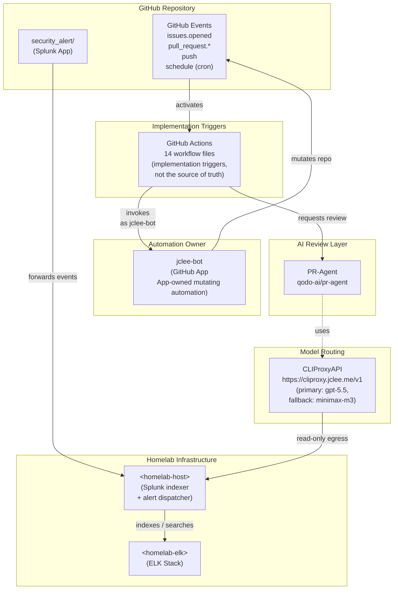

# Security Alert Splunk App & GitHub Automation | 보안 알림 Splunk 앱 & GitHub 자동화

[](#automation-surfaces-owned-by-jclee-bot--jclee-bot%EA%B0%80-%EC%86%8C%EC%9C%A0%ED%95%98%EB%8A%94-%EC%9E%90%EB%8F%99%ED%99%94-%EC%84%B8%EB%A9%B4%EC%A0%81)
[](#overview--%EA%B0%9C%EC%9A%94)
[](https://cliproxy.jclee.me)
[](https://github.com/qodo-ai/pr-agent)
[](#automation-surfaces-owned-by-jclee-bot--jclee-bot%EA%B0%80-%EC%86%8C%EC%9C%A0%ED%95%98%EB%8A%94-%EC%9E%90%EB%8F%99%ED%99%94-%EC%84%B8%EB%A9%B4%EC%A0%81)
[](https://bot.jclee.me)
[](./LICENSE)
[](#automation-inventory--%EC%9E%90%EB%8F%99%ED%99%94-%EC%9D%B8%EB%B2%84%EC%A0%80%EB%A6%AC)
[](#automation-inventory--%EC%9E%90%EB%8F%99%ED%99%94-%EC%9D%B8%EB%B2%84%EC%A0%80%EB%A6%AC)

> **English | 한국어**
> This README is published in a bilingual format. Each major section contains both English and Korean explanations so contributors can navigate the system in either language.
> 본 README는 영문/한글 이중 언어로 작성되었습니다. 각 주요 섹션은 영어와 한국어 설명을 함께 제공하여 두 언어 모두로 시스템을 파악할 수 있도록 구성되어 있습니다.

---

## Table of Contents | 목차

- [Overview | 개요](#overview--%EA%B0%9C%EC%9A%94)
- [Features | 주요 기능](#features--%EC%A3%BC%EC%9A%94-%EA%B8%B0%EB%8A%A5)
- [Architecture | 아키텍처](#architecture--%EC%95%84%ED%82%A4%ED%85%8D%EC%B2%98)
- [Repository Structure | 저장소 구조](#repository-structure--%EC%A0%80%EC%9E%A5%EC%86%8C-%EA%B5%AC%EC%A1%B0)
- [Automation Surfaces Owned by jclee-bot | jclee-bot가 소유하는 자동화 세면적](#automation-surfaces-owned-by-jclee-bot--jclee-bot%EA%B0%80-%EC%86%8C%EC%9C%A0%ED%95%98%EB%8A%94-%EC%9E%90%EB%8F%99%ED%99%94-%EC%84%B8%EB%A9%B4%EC%A0%81)
- [Go Automation Tools | Go 자동화 도구](#go-automation-tools--go-%EC%9E%90%EB%8F%99%ED%99%94-%EB%8F%84%EA%B5%AC)
- [Quick Start | 빠른 시작](#quick-start--%EB%B9%A0%EB%A5%B8-%EC%8B%9C%EC%9E%91)
- [Local Development | 로컬 개발](#local-development--%EB%A1%9C%EC%BB%AC-%EA%B0%9C%EB%B0%9C)
- [Commands Reference | 명령어 레퍼런스](#commands-reference--%EB%AA%85%EB%A0%B9%EC%96%B4-%EB%A0%88%ED%8D%BC%EB%9E%80%EC%8A%A4)
- [Contributing | 기여 가이드](#contributing--%EA%B8%B0%EC%97%AC-%EA%B0%80%EC%9D%B4%EB%93%9C)
- [License | 라이선스](#license--%EB%9D%BC%EC%9D%B4%EC%84%A0%EC%8A%A4)

---

## Overview | 개요

**EN —** This repository packages two closely related deliverables:

1. A production-grade **Splunk app** (`security_alert/`) that ingests security events, normalizes them through a custom CIM-compliant props/transforms pipeline, and surfaces them via an Alert Builder dashboard, an Alert Management dashboard, and a Data Explorer dashboard. The app ships with a Slack alert action and an XWiki alert repository integration.
2. A **GitHub automation control plane** for the surrounding engineering workflow — issue triage, branch/PR scaffolding, automated PR review, Dependabot auto-merge, post-merge cleanup, release notes, release publishing, CI failure issue creation, and downstream health checks. All mutating automation is owned by the **`jclee-bot`** GitHub App.

The repository is intended to be operated as a single coherent platform: the Splunk app handles **detection and response**, while the GitHub automation handles **software delivery and lifecycle hygiene**. Both halves are bound together by shared vocabulary (alerts ↔ issues) and a common automation owner.

**KR —** 본 저장소는 두 가지 핵심 결과물을 함께 제공합니다.

1. **Splunk 앱** (`security_alert/`) — 보안 이벤트를 수집하고, CIM 호환 props/transforms 파이프라인으로 정규화한 뒤, Alert Builder 대시보드 / Alert Management 대시보드 / Data Explorer 대시보드로 시각화합니다. Slack 알림 액션과 XWiki 알림 리포지토리 연동이 포함되어 있습니다.
2. **GitHub 자동화 컨트롤 플레인** — 이슈 분류, 브랜치/PR 스캐폴딩, 자동 PR 리뷰, Dependabot 자동 병합, 병합 후 정리, 릴리스 노트, 릴리스 퍼블리싱, CI 실패 이슈 생성, 다운스트림 헬스 체크 등 엔지니어링 워크플로우 전반을 자동화합니다. 모든 변형(mutating) 자동화는 **`jclee-bot`** GitHub App이 소유합니다.

Splunk 앱은 **탐지/대응**을 담당하고, GitHub 자동화는 **소프트웨어 전달/생애주기 관리**를 담당합니다. 두 영역은 동일한 어휘(이슈 ↔ 알림)와 단일 자동화 오너를 통해 결합됩니다.

---

## Features | 주요 기능

### Splunk App | Splunk 앱

- **Alert Builder Dashboard** — `default/data/ui/views/alert-builder.xml` provides a guided UI for assembling alert definitions from CIM fields without hand-writing SPL.
- **Alert Management Dashboard** — `default/data/ui/views/alert-management-dashboard.xml` centralizes live alerts with owner, severity, and suppression state.
- **Data Explorer Dashboard** — `default/data/ui/views/data-explorer-dashboard.xml` offers an exploratory view over normalized event data.
- **Easy Alert Builder** — `default/data/ui/views/easy_alert_builder.xml` provides a low-friction path for less technical analysts.
- **Custom search commands** (`bin/safe_fmt.py`, `bin/slack.py`, `bin/six.py`) — including a Slack alerting custom command and a safe formatting helper.
- **CIM-compliant normalization** — `props.conf`, `transforms.conf`, `macros.conf` define field extractions, lookup tables, and reusable macros.
- **XWiki alert repository integration** — see [`docs/ALERT-REPOSITORY-XWIKI.md`](docs/ALERT-REPOSITORY-XWIKI.md).
- **Vendored Python runtime** — `lib/python3/` ships `urllib3`, `idna`, and `charset_normalizer` so the app runs deterministically across Splunk versions.

### GitHub Automation | GitHub 자동화

- **App-owned mutating automation** — every action that opens, closes, merges, edits, comments, labels, or assigns is performed by `jclee-bot`. The automation source of truth is the App, not individual workflow files.
- **Issue ↔ Branch ↔ PR lifecycle** — issues can be turned into branches and PRs with one command.
- **PR review automation** — first-party review combined with PR-Agent (`qodo-ai/pr-agent`) for deeper AI review.
- **Dependabot auto-merge** with safety checks for CI and review status.
- **Post-merge cleanup** of feature branches and stale remote refs.
- **Release notes drafting + publishing** — automated changelog generation tied to merged PRs.
- **Downstream health checks** — periodic verification of consumer repositories or services.
- **CI failure → issue creation** — failed CI runs become actionable issues automatically.
- **Bot auto-fix** — small, low-risk fixes are applied by the bot without human intervention.

> **EN:** Workflow files are implementation triggers; the *behavior* is owned by `jclee-bot`.
> **KR:** 워크플로우 파일은 실행 트리거이며, 실제 *동작*은 `jclee-bot`이 소유합니다.

---

## Architecture | 아키텍처

The platform is split into a **data plane** (Splunk detection/response) and a **control plane** (GitHub automation), bridged by the `jclee-bot` GitHub App and the homelab infrastructure.



**Reading the diagram | 다이어그램 읽기**

- **Solid arrows** denote direct, in-band control flow.
- **Dashed arrows** denote indirect, out-of-band egress (the PR-Agent/CLIProxy path).
- **Subgraphs** group ownership: `SRC` is the repository surface, `OWNER` is the single automation principal, `TRIG` is the implementation layer (workflow files), `REVIEW` is the AI review layer, `MODEL` is the model routing layer, and `HOMELAB` is the operator-owned infrastructure.

> **EN:** The exact homelab hostnames (`<homelab-host>`, `<homelab-elk>`) are intentionally left as placeholders so this README never embeds private network identifiers.
> **KR:** 홈랩 호스트명(`<homelab-host>`, `<homelab-elk>`)은 사설 네트워크 식별자가 README에 하드코딩되지 않도록 의도적으로 자리표시자로 남겨두었습니다.

---

## Repository Structure | 저장소 구조

The repository is intentionally flat at the top level. There is no `_bot-scripts/` directory — that name only ever appears as a transient CI checkout path, never as a real source-controlled directory.

```
.
├── CONTRIBUTING.md
├── LICENSE
├── README.md
├── resume/
│   ├── API.md
│   ├── ARCHITECTURE.md
│   ├── DEPLOYMENT.md
│   └── TROUBLESHOOTING.md
├── docs/
│   ├── ALERT-REPOSITORY-XWIKI.md
│   ├── DEPLOYMENT.md
│   ├── LEGACY-CLEANUP-REPORT.md
│   ├── QUICK-START.md
│   └── RELEASE-NOTES.md
├── demo/
│   └── README.md
└── security_alert/
    ├── README.md
    ├── app.manifest
    ├── bin/
    │   ├── safe_fmt.py
    │   ├── six.py
    │   └── slack.py
    ├── metadata/
    │   └── default.meta
    ├── default/
    │   ├── alert_actions.conf
    │   ├── app.conf
    │   ├── macros.conf
    │   ├── props.conf
    │   ├── savedsearches.conf
    │   ├── transforms.conf
    │   └── data/
    │       └── ui/
    │           ├── nav/
    │           │   └── default.xml
    │           └── views/
    │               ├── alert-builder.xml
    │               ├── alert-management-dashboard.xml
    │               ├── data-explorer-dashboard.xml
    │               └── easy_alert_builder.xml
    └── lib/
        └── python3/
            ├── idna-3.11.dist-info/
            ├── urllib3/
            └── charset_normalizer-3.4.4.dist-info/
```

---

## Automation Surfaces Owned by jclee-bot | jclee-bot가 소유하는 자동화 세면적

The automation is partitioned into named **surfaces**, not raw workflow files. Each surface is owned by `jclee-bot`; the workflow files in the repo are merely the triggers that invoke the bot's behavior. If you are looking for "what runs when," look at the surface — not the YAML.

### EN — Surface Catalog

| Surface | Intent | Trigger type | Owner |
|---|---|---|---|
| `issue-to-branch` | Turn a well-formed issue into a working branch. | issue event | `jclee-bot` |
| `branch-to-pr` | Open a PR from an in-progress branch. | push / label event | `jclee-bot` |
| `pr-review` | First-party automated review on every PR. | pull_request event | `jclee-bot` |
| `security-pr-review` | Stricter review for security-labeled PRs. | pull_request + label | `jclee-bot` |
| `dependabot-auto-merge` | Auto-merge safe Dependabot updates after CI passes. | pull_request event | `jclee-bot` |
| `pr-auto-merge` | Auto-merge approved PRs that meet all checks. | pull_request event | `jclee-bot` |
| `bot-auto-fix` | Apply trivial, low-risk fixes from the bot itself. | comment / label event | `jclee-bot` |
| `merged-pr-cleanup` | Delete merged feature branches. | pull_request closed | `jclee-bot` |
| `issue-backfill` | Backfill missing context on legacy issues. | workflow_dispatch | `jclee-bot` |
| `release-notes` | Draft release notes from merged PRs. | push to default branch | `jclee-bot` |
| `release-publish` | Publish a tagged release using the drafted notes. | push of tag | `jclee-bot` |
| `downstream-health-check` | Periodically verify downstream consumers. | schedule | `jclee-bot` |
| `ci-failure-issues` | Convert failing CI runs into actionable issues. | workflow_run event | `jclee-bot` |
| `ci` | The base CI pipeline (lint, build, test). | push / pull_request | `jclee-bot` |

> **EN:** Workflow files are implementation triggers. They are not the source of truth. If a workflow file changes, the surface owned by `jclee-bot` does not necessarily change. Conversely, if `jclee-bot`'s behavior changes, the surface changes even if the workflow YAML is identical.
>
> The repository uses the exact marker **`jclee-bot에의해자동화됨`** on issues that are produced or managed by automation. This marker is a stable, grep-able contract: do not edit, rename, or localize it.

### KR — 세면적 카탈로그

| 세면적 | 의도 | 트리거 종류 | 오너 |
|---|---|---|---|
| `issue-to-branch` | 형식이 갖춰진 이슈를 작업 브랜치로 변환 | issue 이벤트 | `jclee-bot` |
| `branch-to-pr` | 작업 브랜치에서 PR을 생성 | push / label 이벤트 | `jclee-bot` |
| `pr-review` | 모든 PR에 대한 1차 자동 리뷰 | pull_request 이벤트 | `jclee-bot` |
| `security-pr-review` | security 라벨이 붙은 PR에 대한 강화 리뷰 | pull_request + label | `jclee-bot` |
| `dependabot-auto-merge` | CI 통과 후 안전한 Dependabot 업데이트 자동 병합 | pull_request 이벤트 | `jclee-bot` |
| `pr-auto-merge` | 모든 체크를 통과한 승인 PR 자동 병합 | pull_request 이벤트 | `jclee-bot` |
| `bot-auto-fix` | 사소하고 위험도가 낮은 수정을 봇이 직접 적용 | comment / label 이벤트 | `jclee-bot` |
| `merged-pr-cleanup` | 병합된 피처 브랜치 정리 | pull_request closed | `jclee-bot` |
| `issue-backfill` | 기존 이슈에 누락된 컨텍스트 보강 | workflow_dispatch | `jclee-bot` |
| `release-notes` | 병합된 PR로부터 릴리스 노트 초안 작성 | 기본 브랜치 push | `jclee-bot` |
| `release-publish` | 작성된 노트로 태그 기반 릴리스 게시 | 태그 push | `jclee-bot` |
| `downstream-health-check` | 다운스트림 컨슈머 주기적 검증 | schedule | `jclee-bot` |
| `ci-failure-issues` | 실패한 CI 실행을 실행 가능한 이슈로 변환 | workflow_run 이벤트 | `jclee-bot` |
| `ci` | 기본 CI 파이프라인 (lint, build, test) | push / pull_request | `jclee-bot` |

> **KR:** 워크플로우 파일은 구현 트리거일 뿐 진실의 원천(source of truth)이 아닙니다. 워크플로우 파일이 변경되더라도 `jclee-bot`이 소유한 세면적이 반드시 변경되는 것은 아닙니다. 반대로 `jclee-bot`의 동작이 바뀌면 워크플로우 YAML이 동일하더라도 세면적은 변경됩니다.
>
> 저장소는 자동화에 의해 생성되거나 관리되는 이슈에 정확히 **`jclee-bot에의해자동화됨`** 마커를 사용합니다. 이 마커는 안정적인 grep 가능 계약이므로 임의로 편집/이름 변경/현지화하지 마십시오.

---

## Go Automation Tools | Go 자동화 도구

**EN —** This repository currently ships **zero** Go-based automation tools. All automation surfaces are implemented either as GitHub Actions workflow YAML (acting as triggers for `jclee-bot`) or as the Splunk app's Python search commands under `security_alert/bin/`.

If you are planning to introduce a Go tool:

1. Open an issue first and tag it `area: go-tools` so `jclee-bot` can scaffold the layout.
2. Place the Go module under a clearly-named top-level directory (e.g. `tools/<name>/`).
3. Provide a `Makefile`, a `go.mod` pinned to a supported Go version, and a `cmd/` entrypoint.
4. Document any new CLI subcommand in the **Commands Reference** section below.
5. Ensure the tool is invokable from `jclee-bot` via `workflow_dispatch` or a composite action.

Until then, treat the Go toolchain as **out of scope** for this repository.

**KR —** 본 저장소는 현재 **Go 기반 자동화 도구를 포함하지 않습니다.** 모든 자동화 세면적은 GitHub Actions 워크플로우 YAML(`jclee-bot`의 트리거 역할) 또는 `security_alert/bin/` 하위의 Splunk 앱 Python 검색 명령으로 구현됩니다.

Go 도구를 새로 도입하려는 경우:

1. 먼저 이슈를 열고 `area: go-tools` 라벨을 부착하여 `jclee-bot`이 레이아웃을 스캐폴딩하도록 합니다.
2. Go 모듈은 의미가 명확한 최상위 디렉터리(예: `tools/<name>/`)에 배치합니다.
3. `Makefile`, 지원되는 Go 버전에 고정된 `go.mod`, `cmd/` 진입점을 제공합니다.
4. 새로운 CLI 서브커맨드는 아래 **명령어 레퍼런스** 섹션에 문서화합니다.
5. `jclee-bot`이 `workflow_dispatch` 또는 composite action을 통해 호출할 수 있도록 보장합니다.

그 전까지는 Go 툴체인을 본 저장소의 **범위 밖(out of scope)** 으로 간주합니다.

---

## Quick Start | 빠른 시작

### EN — 5-Minute Quick Start

1. **Clone the repository.**
   ```bash
   git clone https://github.com/<your-org>/security-alert-platform.git
   cd security-alert-platform
   ```
2. **Install the Splunk app** by copying `security_alert/` into `$SPLUNK_HOME/etc/apps/` and restarting Splunk.
3. **Install the `jclee-bot` GitHub App** on your repository so all mutating automation is attributed correctly.
4. **Verify automation** by opening a test issue labeled `area: go-tools` and confirming the bot comments within ~60 seconds.
5. **Read the deeper guides** in [`docs/QUICK-START.md`](docs/QUICK-START.md) and [`docs/DEPLOYMENT.md`](docs/DEPLOYMENT.md).

### KR — 5분 빠른 시작

1. **저장소를 클론합니다.**
   ```bash
   git clone https://github.com/<your-org>/security-alert-platform.git
   cd security-alert-platform
   ```
2. `security_alert/` 디렉터리를 `$SPLUNK_HOME/etc/apps/`로 복사한 뒤 Splunk를 재시작하여 **Splunk 앱을 설치**합니다.
3. 저장소에 **`jclee-bot` GitHub App을 설치**하여 모든 변형 자동화가 올바르게 귀속되도록 합니다.
4. `area: go-tools` 라벨이 붙은 테스트 이슈를 열어 **자동화를 검증**하고, 봇이 약 60초 이내에 댓글을 남기는지 확인합니다.
5. [`docs/QUICK-START.md`](docs/QUICK-START.md)와 [`docs/DEPLOYMENT.md`](docs/DEPLOYMENT.md)의 심화 가이드를 참고합니다.

---

## Local Development | 로컬 개발

### Prerequisites | 사전 요구사항

- Splunk Enterprise or Splunk Cloud (≥ 9.0 recommended)
- Python 3.9+ (matches the runtime vendored under `security_alert/lib/python3/`)
- A GitHub repository with `jclee-bot` installed and granted the scopes: `contents:write`, `issues:write`, `pull_requests:write`, `checks:read`, `actions:read`
- Network egress to `https://cliproxy.jclee.me/v1` (PR-Agent / CLIProxyAPI)
- Network egress to `bot.jclee.me` (bot webhook)

### Local Splunk sandbox | 로컬 Splunk 샌드박스

1. Run Splunk in a container or VM reachable as `<homelab-host>` on your local network.
2. Symlink or copy the app:
   ```bash
   ln -s "$(pwd)/security_alert" "$SPLUNK_HOME/etc/apps/security_alert"
   "$SPLUNK_HOME/bin/splunk" restart
   ```
3. Validate by opening the Alert Builder dashboard:
   `http://<homelab-host>:8000/en-US/app/security_alert/alert-builder`

### Iterating on automation | 자동화 반복 개발

- Use **ephemeral labels** like `area: go-tools` or `triage: needs-bot` on a draft issue, then watch the Actions tab — you should see workflow runs attributed to `jclee-bot`.
- The `bot-auto-fix` surface is safe to invoke repeatedly; it is idempotent on already-applied suggestions.
- The `downstream-health-check` surface posts to `bot.jclee.me`; check the bot dashboard for results.

> **EN:** Never commit real homelab hostnames, container IDs, or private IPs into the repo. Use `<homelab-host>` / `<homelab-elk>` placeholders everywhere.
> **KR:** 실제 홈랩 호스트명, 컨테이너 ID, 사설 IP는 저장소에 커밋하지 마십시오. 항상 `<homelab-host>` / `<homelab-elk>` 자리표시자를 사용하십시오.

---

## Commands Reference | 명령어 레퍼런스

### Splunk search commands (shipped with the app) | Splunk 검색 명령

| Command | Module | Purpose |
|---|---|---|
| `safe_fmt` | `bin/safe_fmt.py` | Format values safely into alert payloads (no injection). |
| `slack` | `bin/slack.py` | Send a Slack message from a search. |
| `six` | `bin/six.py` | Python 2/3 compatibility shim for older Splunk versions. |

### Splunk configuration files | Splunk 설정 파일

| File | Role |
|---|---|
| `default/app.conf` | App identity, label, version. |
| `default/props.conf` | Field extractions and event types. |
| `default/transforms.conf` | Lookup definitions, regex transforms. |
| `default/macros.conf` | Reusable SPL macros. |
| `default/savedsearches.conf` | Pre-built alerts and reports. |
| `default/alert_actions.conf` | Alert action bindings (Slack, XWiki). |

### GitHub automation (invoked via bot comments or labels) | GitHub 자동화

| Surface | How to invoke | Example |
|---|---|---|
| `issue-to-branch` | Comment `/bot branch` on an issue. | `/bot branch feature/x` |
| `branch-to-pr` | Comment `/bot pr` on a PR-ready branch's tracking issue. | `/bot pr --draft` |
| `pr-review` | Automatic on PR open. | (no manual trigger) |
| `security-pr-review` | Automatic when PR has `security` label. | (no manual trigger) |
| `dependabot-auto-merge` | Automatic once Dependabot CI passes. | (no manual trigger) |
| `pr-auto-merge` | Automatic once approvals and checks pass. | (no manual trigger) |
| `bot-auto-fix` | Comment `/bot fix` on a PR. | `/bot fix --lint` |
| `merged-pr-cleanup` | Automatic on PR merge. | (no manual trigger) |
| `issue-backfill` | Comment `/bot backfill` on a legacy issue. | `/bot backfill` |
| `release-notes` | Automatic on push to default branch. | (no manual trigger) |
| `release-publish` | Push a semver tag; bot publishes via `bot.jclee.me`. | `git tag v1.2.3 && git push --tags` |
| `downstream-health-check` | Schedule-driven; manual rerun via `Actions → Downstream Health Check → Run workflow`. | (UI) |
| `ci-failure-issues` | Automatic on `workflow_run` failure. | (no manual trigger) |
| `ci` | Automatic on push / pull_request. | (no manual trigger) |

### CLIProxyAPI model routing | CLIProxyAPI 모델 라우팅

| Role | Model | Endpoint |
|---|---|---|
| Primary | `gpt-5.5` | `https://cliproxy.jclee.me/v1` |
| Fallback | `minimax-m3` | `https://cliproxy.jclee.me/v1` |

PR-Agent uses this routing transparently; the bot itself does not embed model credentials.

---

## Contributing | 기여 가이드

Please read [`CONTRIBUTING.md`](CONTRIBUTING.md) before opening a pull request. Highlights:

- **One surface per PR.** PRs should map cleanly to a single automation surface or to a single Splunk app component. Mixed-purpose PRs are harder for `jclee-bot` to review and auto-merge.
- **Do not edit surfaces silently.** If you intend to change a surface's behavior, label the PR `surface:<name>` (e.g. `surface:pr-review`) so the bot can route it through the security PR review surface.
- **Mark automated issues consistently.** Any issue produced by automation must carry the exact marker **`jclee-bot에의해자동화됨`**. This marker is a stable contract; do not translate it.
- **No private IPs.** Do not introduce RFC1918 addresses (`192.168.x.x`, `10.x.x.x`, `172.16-31.x.x`) or LXC container numbers into source, docs, comments, or commit messages. Use `<homelab-host>` / `<homelab-elk>` placeholders.
- **External links.** Only link to the following external endpoints:
  - `https://cliproxy.jclee.me`
  - `https://bot.jclee.me`
  - `https://github.com/qodo-ai/pr-agent`
- **Markdownlint.** Do not use bold or italic text in place of a real `#` heading.
- **Mermaid diagrams.** Use a `flowchart TD` block; any node label containing `<...>` must be a quoted string with HTML-escaped brackets (`&lt;...&gt;`).

---

## License | 라이선스

See [`LICENSE`](./LICENSE) for the full text. The Splunk app, the vendored Python runtime under `security_alert/lib/python3/`, and the GitHub automation configuration are distributed under the terms stated in that file. Each vendored package retains its own license as documented in its respective `*.dist-info/METADATA` file.

---

### Automation Inventory | 자동화 인벤토리

- **Primary README-generation model:** `gpt-5.5`
- **Fallback README-generation model:** `minimax-m3` (served via CLIProxyAPI at `https://cliproxy.jclee.me/v1`)
- **PR review model routing:** PR-Agent (`qodo-ai/pr-agent`) → CLIProxyAPI → primary/fallback
- **Automation owner:** `jclee-bot` (single owner of all mutating surfaces)
- **Bot webhook:** `https://bot.jclee.me`