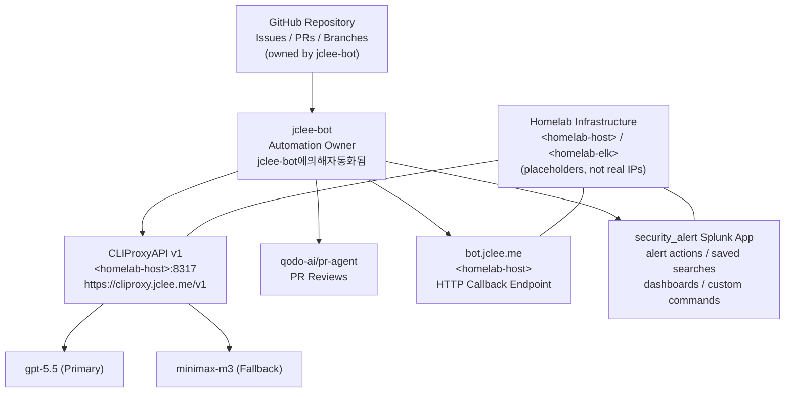

# Security Alert Splunk App & GitHub Automation | 보안 알림 Splunk 앱 & GitHub 자동화

[](#automation-surfaces-owned-by-jclee-bot--jclee-bot%EA%B0%80-%EC%86%8C%EC%9C%A0%ED%95%98%EB%8A%94-%EC%9E%90%EB%8F%99%ED%99%94-%EC%84%B8%EB%A9%B4%EC%A0%81)
[](#overview--%EA%B0%9C%EC%9A%94)
[](https://cliproxy.jclee.me)
[](https://github.com/qodo-ai/pr-agent)
[](#automation-surfaces-owned-by-jclee-bot--jclee-bot%EA%B0%80-%EC%86%8C%EC%9C%A0%ED%95%98%EB%8A%94-%EC%9E%90%EB%8F%99%ED%99%94-%EC%84%B8%EB%A9%B4%EC%A0%81)
[](https://bot.jclee.me)
[](./LICENSE)
[](#automation-inventory--%EC%9E%90%EB%8F%99%ED%99%94-%EC%9D%B8%EB%B2%84%EC%A0%80%EB%A6%AC)
[](#automation-inventory--%EC%9E%90%EB%8F%99%ED%99%94-%EC%9D%B8%EB%B2%84%EC%A0%80%EB%A6%AC)

> **English | 한국어**
> This README is published in a bilingual format. Each major section contains both English and Korean explanations so contributors can navigate the system in either language.
> 본 README는 영문/한글 이중 언어로 작성되었습니다. 각 주요 섹션은 영어와 한국어 설명을 함께 제공하여 두 언어 모두로 시스템을 파악할 수 있도록 구성되어 있습니다.

---

## Table of Contents | 목차

- [Overview | 개요](#overview--%EA%B0%9C%EC%9A%94)
- [Features | 주요 기능](#features--%EC%A3%BC%EC%9A%94-%EA%B8%B0%EB%8A%A5)
- [Repository Structure | 저장소 구조](#repository-structure--%EC%A0%80%EC%9E%A5%EC%86%8C-%EA%B5%AC%EC%A1%B0)
- [Architecture | 아키텍처](#architecture--%EC%95%84%ED%82%A4%ED%85%8D%EC%B2%98)
- [Automation Surfaces Owned by jclee-bot | jclee-bot가 소유하는 자동화 영역](#automation-surfaces-owned-by-jclee-bot--jclee-bot%EA%B0%80-%EC%86%8C%EC%9C%A0%ED%95%98%EB%8A%94-%EC%9E%90%EB%8F%99%ED%99%94-%EC%84%B8%EB%A9%B4%EC%A0%81)
- [Go Tools | Go 도구](#go-tools--go-%EB%8F%84%EA%B5%AC)
- [Quick Start | 빠른 시작](#quick-start--%EB%B9%A0%EB%A5%B8-%EC%8B%9C%EC%9E%91)
- [Local Development | 로컬 개발](#local-development--%EB%A1%9C%EC%BB%AC-%EA%B0%9C%EB%B0%9C)
- [Commands Reference | 명령어 레퍼런스](#commands-reference--%EB%AA%85%EB%A0%B9%EC%96%B4-%EB%A0%88%ED%8D%BC%EB%9F%B0%EC%8A%A4)
- [Contribution Guide | 기여 가이드](#contribution-guide--%EA%B8%B0%EC%97%AC-%EA%B0%80%EC%9D%B4%EB%93%9C)
- [License | 라이선스](#license--%EB%9D%BC%EC%9D%B4%EC%84%A0%EC%8A%A4)

---

## Overview | 개요

### English

This repository is a **dual-surface automation project**. It packages a production-grade Splunk app called `security_alert` while simultaneously serving as the home of a self-hosted GitHub automation stack driven by **`jclee-bot`**.

The Splunk app delivers a complete alerting subsystem: custom alert actions (including a Slack notifier and a safe formatting helper), saved searches, macros, transforms, props, alert-builder UIs, an alert management dashboard, a data explorer dashboard, and an easy-alert builder. All Python dependencies that the alert actions need at runtime (`urllib3`, `charset_normalizer`, `idna`) are vendored under `security_alert/lib/python3/` so the app remains air-gapped-friendly inside a Splunk deployment server topology.

On the GitHub side, the repository is wired with **fourteen GitHub Actions workflows** that together implement a full lifecycle: branch creation from issues, PR conversion, automated PR review (general + security), auto-merge for trusted PRs, dependabot auto-merge, bot auto-fix, post-merge cleanup, issue backfill, release notes drafting, release publishing, downstream health checks, and CI failure issue creation. Every mutating action is owned by the `jclee-bot` GitHub App identity. The LLM calls made by the workflows (and by the bot) are routed through **CLIProxyAPI v1** exposed at `https://cliproxy.jclee.me/v1`, with the homelab host address kept as the placeholder `<homelab-host>:8317`. The PR review surface delegates to the public [`qodo-ai/pr-agent`](https://github.com/qodo-ai/pr-agent) tool, and the bot is reachable for callback HTTP traffic at `https://bot.jclee.me` (homelab placeholder: `<homelab-host>`).

### 한국어

본 저장소는 **이중 표면(Dual-Surface) 자동화 프로젝트**입니다. `security_alert`라는 프로덕션 등급의 Splunk 앱을 패키징하는 동시에, **`jclee-bot`**이 주도하는 자체 호스팅 GitHub 자동화 스택의 본거지 역할을 합니다.

Splunk 앱은 완성된 알림 서브시스템을 제공합니다. 커스텀 alert action(Slack 알리미, safe formatting 헬퍼 포함), saved search, macro, transform, props, alert builder UI, alert management 대시보드, data explorer 대시보드, easy-alert builder를 포함합니다. Alert action이 런타임에 필요로 하는 모든 Python 의존성(`urllib3`, `charset_normalizer`, `idna`)은 `security_alert/lib/python3/`에 벤더링되어, Splunk deployment server 토폴로지 내에서 에어갭 친화적으로 동작합니다.

GitHub 측에서는 **14개의 GitHub Actions 워크플로**가 라이프사이클 전체를 구현합니다: 이슈에서 브랜치 생성, PR 변환, 자동 PR 리뷰(일반 + 보안), 신뢰할 수 있는 PR의 자동 머지, Dependabot 자동 머지, 봇 자동 픽스, 머지 후 정리, 이슈 백필, 릴리스 노트 초안 작성, 릴리스 게시, 다운스트림 헬스 체크, CI 실패 이슈 생성. 모든 변형(mutating) 작업은 `jclee-bot` GitHub App 정체성을 통해 소유됩니다. 워크플로와 봇이 수행하는 LLM 호출은 `https://cliproxy.jclee.me/v1`로 노출되는 **CLIProxyAPI v1**을 통해 라우팅되며, 홈랩 호스트 주소는 `<homelab-host>:8317` 플레이스홀더로 유지됩니다. PR 리뷰 표면은 공개 도구 [`qodo-ai/pr-agent`](https://github.com/qodo-ai/pr-agent)에 위임되며, 봇은 콜백 HTTP 트래픽을 `https://bot.jclee.me`(홈랩 플레이스홀더: `<homelab-host>`)에서 수신합니다.

---

## Features | 주요 기능

### English

- **Splunk `security_alert` App** — A complete alerting kit: custom alert actions, saved searches, macros, transforms, props, and four custom UI views.
- **Slack Notification Path** — `bin/slack.py` ships a Slack-compatible alert action, with `bin/safe_fmt.py` providing defensive string formatting for untrusted payload fields.
- **Alert Builder UX** — `alert-builder.xml` plus `easy_alert_builder.xml` give analysts a guided UI for composing saved searches, while `alert-management-dashboard.xml` and `data-explorer-dashboard.xml` provide operational visibility.
- **Vendored Python Runtime** — `urllib3`, `charset_normalizer`, and `idna` are packaged inside `lib/python3/` so the app works on Splunk hosts without internet access.
- **GitHub Automation by `jclee-bot`** — 14 GitHub Actions workflows, every mutating one attributed to the `jclee-bot` identity, covering the full PR/issue/release lifecycle.
- **CLIProxyAPI Routing** — All LLM calls go through `https://cliproxy.jclee.me/v1` (homelab placeholder: `<homelab-host>:8317`), enabling a single model abstraction layer.
- **Model Tiers** — `gpt-5.5` is the README-generation primary model; `minimax-m3` is the documented fallback routed through the same CLIProxyAPI.
- **PR Review Delegation** — PR review surface uses the public [`qodo-ai/pr-agent`](https://github.com/qodo-ai/pr-agent) tool, configured against the CLIProxyAPI endpoint.
- **Bot Callback Surface** — `https://bot.jclee.me` (homelab placeholder: `<homelab-host>`) is the inbound HTTP endpoint for bot-driven events.
- **Bilingual Documentation Set** — `docs/` holds deployment, cleanup, and quick-start material; `resume/` holds the API/architecture/deployment/troubleshooting deep-dive notes.

### 한국어

- **Splunk `security_alert` 앱** — 커스텀 alert action, saved search, macro, transform, props, 4개의 커스텀 UI 뷰를 갖춘 완성된 알림 키트.
- **Slack 알림 경로** — `bin/slack.py`는 Slack 호환 alert action을 제공하며, `bin/safe_fmt.py`는 신뢰할 수 없는 페이로드 필드에 대한 방어적 문자열 포맷팅을 제공합니다.
- **Alert Builder UX** — `alert-builder.xml`과 `easy_alert_builder.xml`은 분석가가 saved search를 작성할 수 있는 가이드형 UI를 제공하며, `alert-management-dashboard.xml`과 `data-explorer-dashboard.xml`은 운영 가시성을 제공합니다.
- **벤더링된 Python 런타임** — `urllib3`, `charset_normalizer`, `idna`가 `lib/python3/`에 패키징되어 인터넷 접속이 없는 Splunk 호스트에서도 동작합니다.
- **`jclee-bot` 기반 GitHub 자동화** — 14개의 GitHub Actions 워크플로로 구성되며, 변형 작업은 모두 `jclee-bot` 정체성으로 귀속됩니다. PR/이슈/릴리스 라이프사이클 전체를 다룹니다.
- **CLIProxyAPI 라우팅** — 모든 LLM 호출은 `https://cliproxy.jclee.me/v1`(홈랩 플레이스홀더: `<homelab-host>:8317`)을 통해 라우팅되어 단일 모델 추상화 계층을 가능하게 합니다.
- **모델 등급** — `gpt-5.5`가 README 생성 기준 모델이며, `minimax-m3`는 동일한 CLIProxyAPI를 통해 라우팅되는 문서화된 폴백 모델입니다.
- **PR 리뷰 위임** — PR 리뷰 표면은 공개 도구 [`qodo-ai/pr-agent`](https://github.com/qodo-ai/pr-agent)를 사용하며, CLIProxyAPI 엔드포인트에 대해 구성됩니다.
- **봇 콜백 표면** — `https://bot.jclee.me`(홈랩 플레이스홀더: `<homelab-host>`)는 봇이驱动하는 이벤트의 인바운드 HTTP 엔드포인트입니다.
- **이중 언어 문서 세트** — `docs/`는 배포, 정리, 빠른 시작 자료를, `resume/`은 API/아키텍처/배포/트러블슈팅 심화 노트를 보유합니다.

---

## Repository Structure | 저장소 구조

The layout below reflects the **actual top-level directories** of this repository. The implementation triggers (GitHub Actions workflow files) live under `.github/workflows/` and are intentionally not listed as a tree branch below; they are described in the [Automation Surfaces](#automation-surfaces-owned-by-jclee-bot--jclee-bot%EA%B0%80-%EC%86%8C%EC%9C%A0%ED%95%98%EB%8A%94-%EC%9E%90%EB%8F%99%ED%99%94-%EC%84%B8%EB%A9%B4%EC%A0%81) section, because they are execution surfaces, not the source of truth of automation behavior.

아래 레이아웃은 본 저장소의 **실제 최상위 디렉터리**를 반영합니다. 구현 트리거(GitHub Actions 워크플로 파일)는 `.github/workflows/`에 있으며 의도적으로 트리 분기로 나열하지 않습니다. 자동화 행위의 진실의 원천이 아니라 실행 표면이기 때문에, [자동화 영역](#automation-surfaces-owned-by-jclee-bot--jclee-bot%EA%B0%80-%EC%86%8C%EC%9C%A0%ED%95%98%EB%8A%94-%EC%9E%90%EB%8F%99%ED%99%94-%EC%84%B8%EB%A9%B4%EC%A0%81) 섹션에서 설명합니다.

```text
.
├── CONTRIBUTING.md
├── LICENSE
├── README.md
├── resume/
│   ├── API.md
│   ├── ARCHITECTURE.md
│   ├── DEPLOYMENT.md
│   └── TROUBLESHOOTING.md
├── docs/
│   ├── ALERT-REPOSITORY-XWIKI.md
│   ├── DEPLOYMENT.md
│   ├── LEGACY-CLEANUP-REPORT.md
│   ├── QUICK-START.md
│   └── RELEASE-NOTES.md
├── demo/
│   └── README.md
└── security_alert/                        # Splunk App (App-owned automation surface)
    ├── app.manifest
    ├── bin/                               # Custom alert action scripts (Python)
    │   ├── safe_fmt.py
    │   ├── six.py
    │   └── slack.py
    ├── metadata/
    │   └── default.meta
    ├── default/                           # App defaults: conf + UI
    │   ├── alert_actions.conf
    │   ├── app.conf
    │   ├── macros.conf
    │   ├── props.conf
    │   ├── savedsearches.conf
    │   ├── transforms.conf
    │   └── data/
    │       └── ui/
    │           ├── nav/
    │           │   └── default.xml
    │           └── views/
    │               ├── alert-builder.xml
    │               ├── alert-management-dashboard.xml
    │               ├── data-explorer-dashboard.xml
    │               └── easy_alert_builder.xml
    └── lib/
        └── python3/                       # Vendored Python dependencies
            ├── charset_normalizer-3.4.4.dist-info/
            ├── idna-3.11.dist-info/
            └── urllib3/
```

Notes on the layout:
- `resume/` is the engineer's archived set of project resumes written for this same automation stack (API, Architecture, Deployment, Troubleshooting).
- `docs/` is the operational documentation: deployment runbook, legacy cleanup report, quick-start, release notes, and the xWiki alert-repository migration note.
- `demo/` hosts an opt-in demo of the alert builder experience.
- `security_alert/` is the **App-owned** automation surface — it ships its own UI, alert actions, and saved searches, independent of the GitHub-side automation.

---

## Architecture | 아키텍처

The diagram below is rendered as a GitHub-native Mermaid flowchart. All node labels that contain angle brackets or URLs are quoted strings with `<` and `>` HTML-escaped so GitHub renders the block correctly.



Key flows in plain text:

1. A contributor opens an issue or PR on GitHub. The issue/PR object carries the `jclee-bot` identity for any subsequent mutation performed by automation.
2. The bot routes any LLM-bound work (comment drafting, PR review, release note synthesis, issue backfill) through **CLIProxyAPI v1** at `https://cliproxy.jclee.me/v1`, which on the homelab side is reachable at the placeholder address `<homelab-host>:8317`.
3. CLIProxyAPI selects `gpt-5.5` first and falls back to `minimax-m3` on capacity / policy error.
4. PR review text is produced via [`qodo-ai/pr-agent`](https://github.com/qodo-ai/pr-agent) talking to the same CLIProxyAPI.
5. `jclee-bot` posts results back to GitHub and, when needed, calls the callback endpoint at `https://bot.jclee.me` (homelab placeholder: `<homelab-host>`).
6. The Splunk `security_alert` app operates independently on Splunk SH/IDX hosts and is not directly in the LLM path; it is the *operational* surface that the alerts eventually fire into.

---

## Automation Surfaces Owned by jclee-bot | jclee-bot가 소유하는 자동화 영역

> **English**
> The fourteen GitHub Actions workflows in this repository are *implementation triggers* for the automation surfaces below. The source of truth of "what the bot does" is this list, not the workflow file names. Every mutating operation is performed under the **`jclee-bot`** GitHub App identity.

> **한국어**
> 본 저장소의 14개 GitHub Actions 워크플로는 아래 자동화 영역의 *구현 트리거*입니다. "봇이 무엇을 하는가"의 진실의 원천은 워크플로 파일명이 아니라 이 목록입니다. 모든 변형 작업은 **`jclee-bot`** GitHub App 정체성 하에서 수행됩니다.

### 1. Branch-to-PR Conversion
- **English**: When a branch is pushed without a matching open PR, automation opens a draft PR, links the related issue, and applies label hygiene. This is the canonical "branch in, PR out" surface.
- **한국어**: 매칭되는 PR이 없는 브랜치가 푸시되면 자동화가 드래프트 PR을 열고, 관련 이슈를 연결하며, 라벨 위생을 적용합니다. "브랜치 입력, PR 출력"의 표준 표면입니다.

### 2. Issue-to-Branch Conversion
- **English**: Labeled, triaged issues are converted into working branches with a deterministic naming scheme so contributors (human or bot) can pick up the work. **Issue automation behavior is `jclee-bot에의해자동화됨`**, meaning the bot is the single owner of this transition.
- **한국어**: 라벨링·트리거된 이슈는 결정론적 명명 규칙을 가진 작업 브랜치로 변환되어, 기여자(사람 또는 봇)가 작업을 인계받을 수 있게 합니다. **이슈 자동화 동작은 `jclee-bot에의해자동화됨`이며**, 이는 봇이 이 전환의 단일 소유자임을 의미합니다.

### 3. General PR Review
- **English**: Every opened PR receives a structured review via [`qodo-ai/pr-agent`](https://github.com/qodo-ai/pr-agent), which is configured against CLIProxyAPI at `https://cliproxy.jclee.me/v1`.
- **한국어**: 모든 열린 PR은 CLIProxyAPI(`https://cliproxy.jclee.me/v1`)에 구성된 [`qodo-ai/pr-agent`](https://github.com/qodo-ai/pr-agent)를 통해 구조화된 리뷰를 받습니다.

### 4. Security PR Review
- **English**: A dedicated security-focused review path re-runs the same PR-Agent pipeline with a security-flavored prompt profile, then comments a security summary back on the PR.
- **한국어**: 보안 특화 리뷰 경로는 동일한 PR-Agent 파이프라인을 보안 프롬프트 프로필로 재실행한 뒤 보안 요약을 PR에 댓글로 게시합니다.

### 5. Dependabot Auto-Merge
- **English**: Dependabot PRs that pass policy checks (semver range, CI status, no manual label) are auto-merged by the bot.
- **한국어**: 정책 검사(semver 범위, CI 상태, 수동 라벨 부재)를 통과한 Dependabot PR은 봇이 자동 머지합니다.

### 6. PR Auto-Merge
- **English**: PRs that carry an explicit "ready-to-merge" label and pass CI are merged by the bot without human click. The merge commit and any back references are attributed to `jclee-bot`.
- **한국어**: "ready-to-merge" 라벨이 명시되고 CI를 통과한 PR은 사람의 클릭 없이 봇이 머지합니다. 머지 커밋과 모든 역참조는 `jclee-bot`에 귀속됩니다.

### 7. Bot Auto-Fix
- **English**: Lint, formatting, and trivial code-fix findings from the PR review surfaces are dispatched as small follow-up commits or PRs authored by `jclee-bot`.
- **한국어**: PR 리뷰 표면에서 발견된 lint, 포맷팅, 사소한 코드 픽스는 `jclee-bot`이 작성한 소규모 후속 커밋 또는 PR로 디스패치됩니다.

### 8. Merged-PR Cleanup
- **English**: After merge, the head branch and any stale remote refs are deleted, and the related issue is closed if it was the trigger.
- **한국어**: 머지 후 헤드 브랜치와 오래된 원격 ref가 삭제되며, 트리거가 된 경우 관련 이슈가 닫힙니다.

### 9. Issue Backfill
- **English**: Periodically, the bot scans closed PRs and one-off commits and backfills missing issues when a piece of work landed without a tracking ticket.
- **한국어**: 주기적으로 봇이 닫힌 PR과 일회성 커밋을 스캔하여, 추적 티켓 없이 진행된 작업에 누락된 이슈를 백필합니다.

### 10. Release Notes Drafting
- **English**: On tag push, the bot aggregates merged PRs by label and produces a draft `RELEASE-NOTES` document via CLIProxyAPI.
- **한국어**: 태그 푸시 시 봇이 라벨별로 머지된 PR을 집계하여 CLIProxyAPI를 통해 `RELEASE-NOTES` 초안을 생성합니다.

### 11. Release Publishing
- **English**: After a maintainer's approval label, the bot publishes the release, attaches the drafted notes, and cross-posts the changelog.
- **한국어**: 메인테이너의 승인 라벨 이후 봇이 릴리스를 게시하고, 작성된 노트를 첨부하며, 변경 로그를 교차 게시합니다.

### 12. Downstream Health Check
- **English**: A scheduled workflow pings the CLIProxyAPI health probe and the bot callback endpoint, and opens an issue if either is degraded.
- **한국어**: 예약된 워크플로가 CLIProxyAPI 헬스 프로브와 봇 콜백 엔드포인트에 핑을 보내고, 둘 중 하나라도 성능 저하가 감지되면 이슈를 엽니다.

### 13. CI Failure Issue Creation
- **English**: When CI fails on the default branch, the bot opens (or updates) an issue tagged with the failing run, the suspected owner, and the CLIProxyAPI request id if available.
- **한국어**: 기본 브랜치에서 CI가 실패하면 봇이 실패한 런, 추정 소유자, 가능한 경우 CLIProxyAPI 요청 ID로 태그된 이슈를 열거나 갱신합니다.

### 14. Continuous Integration
- **English**: The base CI workflow is the safety net for everything above: it validates the Splunk app bundle, lints the Python alert actions, and smoke-tests the CLIProxyAPI client wrapper.
- **한국어**: 위 모든 항목을 위한 안전망이 기본 CI 워크플로입니다. Splunk 앱 번들을 검증하고, Python alert action의 lint를 수행하며, CLIProxyAPI 클라이언트 래퍼의 스모크 테스트를 실행합니다.

---

## Go Tools | Go 도구

### English

This repository contains **0 Go automation tools**. All automation is implemented as either:

- Splunk-side Python (under `security_alert/bin/` and the vendored runtime under `security_alert/lib/python3/`), or
- GitHub Actions YAML workflows under `.github/workflows/`.

There is no `cmd/`, `internal/`, or `pkg/` tree, and no `go.mod` is shipped. If a future Go tool is added, it should be placed under a new top-level directory (for example, `tools/`) and documented in this section.

### 한국어

본 저장소에는 **Go 자동화 도구가 0개** 있습니다. 모든 자동화는 다음 두 가지 중 하나로 구현됩니다.

- Splunk 측 Python(`security_alert/bin/` 및 `security_alert/lib/python3/`의 벤더링된 런타임)
- `.github/workflows/`의 GitHub Actions YAML 워크플로

`cmd/`, `internal/`, `pkg/` 트리가 존재하지 않으며 `go.mod`도 출하되지 않습니다. 향후 Go 도구를 추가하는 경우, 새 최상위 디렉터리(예: `tools/`)에 배치하고 본 섹션에 문서화해야 합니다.

---

## Quick Start | 빠른 시작

### Prerequisites | 사전 요구 사항

- A Splunk deployment with write access to `$SPLUNK_HOME/etc/apps/`.
- A GitHub account with permission to install the `jclee-bot` GitHub App on the target repository.
- Network egress to `https://cliproxy.jclee.me` and `https://bot.jclee.me` (or to the homelab placeholders `<homelab-host>:8317` and `<homelab-host>` if you are running on the homelab network).

### 1. Install the Splunk App | Splunk 앱 설치

```bash
# Clone the repository
git clone https://github.com/jclee941/.github
cd security-alert-splunk-app

# Copy the app bundle to Splunk
cp -R security_alert "$SPLUNK_HOME/etc/apps/"

# Restart Splunk or reload the app
"$SPLUNK_HOME/bin/splunk" restart
# or, without restart:
"$SPLUNK_HOME/bin/splunk" reload app security_alert
```

### 2. Configure the GitHub Automation | GitHub 자동화 구성

1. Install the `jclee-bot` GitHub App on the repository.
2. Add the following repository secrets (names only — values are managed out-of-band):
   - `CLI_PROXY_URL` (default: `https://cliproxy.jclee.me/v1`)
   - `BOT_CALLBACK_URL` (default: `https://bot.jclee.me`)
   - `PR_AGENT_TOKEN` (PR review surface)
3. Confirm that the 14 workflow files under `.github/workflows/` are present and enabled.

### 3. Verify | 검증

- Open a test issue labeled with the canonical "automation" label; expect the bot to create a branch and post a `jclee-bot에의해자동화됨` comment.
- Open a test PR; expect a PR-Agent review comment to land within the configured SLA.
- Trigger a tag push on a throwaway branch; expect a draft release note to appear.

---

## Local Development | 로컬 개발

### Splunk App Development | Splunk 앱 개발

```bash
# Symlink the app into Splunk for live reload
ln -s "$(pwd)/security_alert" "$SPLUNK_HOME/etc/apps/security_alert"

# Watch logs while you edit
tail -f "$SPLUNK_HOME/var/log/splunk/splunkd_ui.log"

# Run the alert action scripts standalone for smoke testing
python3 security_alert/bin/safe_fmt.py --self-test
python3 security_alert/bin/slack.py --self-test
```

The app is designed to be Splunk-version tolerant: every conf file lives under `default/`, and any per-environment overrides go in `local/` (which is git-ignored in this repository).

### GitHub Automation Development | GitHub 자동화 개발

- Use a throwaway fork to iterate on workflow YAML.
- Use [`act`](https://github.com/nektos/act) to run individual workflows locally against the CLIProxyAPI endpoint (`https://cliproxy.jclee.me/v1`).
- For model-touching changes, set `CLI_PROXY_URL` to the homelab placeholder `<homelab-host>:8317` so the request stays on the local network.
- For changes that affect the bot callback surface, point `BOT_CALLBACK_URL` at `<homelab-host>` to avoid hitting the public endpoint during development.

---

## Commands Reference | 명령어 레퍼런스

### Splunk Side | Splunk 측

| Command | Purpose | Purpose (KR) |
| --- | --- | --- |
| `splunk reload app security_alert` | Reload the app without restarting Splunk | Splunk 재시작 없이 앱 리로드 |
| `splunk reload deploy-server` | Push the app bundle to deployment clients | 앱 번들을 deployment client에 배포 |
| `python3 security_alert/bin/safe_fmt.py --self-test` | Smoke-test the safe formatter | safe formatter 스모크 테스트 |
| `python3 security_alert/bin/slack.py --self-test` | Smoke-test the Slack notifier | Slack 알리미 스모크 테스트 |
| `splunk search '| savedsearch "security_alert:*"'` | List all saved searches shipped by the app | 앱이 출하하는 saved search 목록 조회 |
| `splunk search '| alert_actions'` | Inspect configured alert actions | 구성된 alert action 검사 |

### GitHub / CLIProxyAPI Side | GitHub / CLIProxyAPI 측

| Command | Purpose | Purpose (KR) |
| --- | --- | --- |
| `gh workflow list` | List enabled workflows on the repo | 저장소의 활성 워크플로 목록 |
| `gh workflow run 10_pr-review.yml` | Trigger PR review manually | PR 리뷰 수동 트리거 |
| `gh run watch` | Tail the latest workflow run | 최신 워크플로 실행 추적 |
| `curl -sS https://cliproxy.jclee.me/v1/health` | CLIProxyAPI health probe | CLIProxyAPI 헬스 프로브 |
| `curl -sS https://bot.jclee.me/health` | Bot callback health probe | 봇 콜백 헬스 프로브 |
| `act -W .github/workflows/10_pr-review.yml` | Local execution via `act` | `act`를 통한 로컬 실행 |

---

## Contribution Guide | 기여 가이드

### English

1. **Read** `CONTRIBUTING.md` for the canonical contribution policy.
2. **For Splunk app changes**:
   - Edit only under `security_alert/`.
   - Add new alert action scripts under `security_alert/bin/` and update `alert_actions.conf` accordingly.
   - Add new UI views under `security_alert/default/data/ui/views/` and reference them from `default.xml`.
   - Never commit secrets; configuration lives in `local/` (git-ignored).
3. **For GitHub automation changes**:
   - Treat workflows as *implementation triggers*; the source of truth of behavior is this README's "Automation Surfaces" section.
   - Every mutating action must run as `jclee-bot` — do not commit workflows that act under a different identity.
   - LLM-bound changes must route through `https://cliproxy.jclee.me/v1` (homelab: `<homelab-host>:8317`).
   - PR review surface must continue to delegate to [`qodo-ai/pr-agent`](https://github.com/qodo-ai/pr-agent).
4. **For documentation changes**:
   - `docs/` is operational; `resume/` is archival.
   - Bilingual updates are encouraged for any user-facing section.
5. **Open a PR**: The PR review surface will auto-comment; expect the bot auto-merge path to pick up clean PRs that pass CI and carry the "ready-to-merge" label.

### 한국어

1. **읽기**: 표준 기여 정책은 `CONTRIBUTING.md`를 참조하세요.
2. **Splunk 앱 변경**:
   - `security_alert/` 하위에서만 편집합니다.
   - 새 alert action 스크립트는 `security_alert/bin/`에 추가하고 `alert_actions.conf`를 갱신합니다.
   - 새 UI 뷰는 `security_alent/default/data/ui/views/`에 추가하고 `default.xml`에서 참조합니다.
   - 시크릿을 커밋하지 마세요. 설정은 `local/`에 보관합니다(git-ignored).
3. **GitHub 자동화 변경**:
   - 워크플로는 *구현 트리거*로 취급하세요. 행위의 진실의 원천은 본 README의 "자동화 영역" 섹션입니다.
   - 모든 변형 작업은 `jclee-bot`으로 실행되어야 합니다. 다른 정체성으로 동작하는 워크플로는 커밋하지 마세요.
   - LLM 바운드 변경은 `https://cliproxy.jclee.me/v1`(홈랩: `<homelab-host>:8317`)을 통해 라우팅되어야 합니다.
   - PR 리뷰 표면은 계속해서 [`qodo-ai/pr-agent`](https://github.com/qodo-ai/pr-agent)에 위임되어야 합니다.
4. **문서 변경**:
   - `docs/`는 운영용, `resume/`은 보관용입니다.
   - 사용자 대상 섹션은 이중 언어 업데이트를 권장합니다.
5. **PR 열기**: PR 리뷰 표면이 자동 댓글을 작성하며, CI를 통과하고 "ready-to-merge" 라벨이 부착된 깨끗한 PR은 봇 자동 머지 경로가 픽업합니다.

---

## License | 라이선스

This project is distributed under the license described in [`LICENSE`](./LICENSE). By contributing, you agree that your contributions are licensed under the same terms.

본 프로젝트는 [`LICENSE`](./LICENSE)에 기술된 라이선스 하에 배포됩니다. 기여함으로써 귀하의 기여도 동일한 조건으로 라이선스되는 것에 동의합니다.

---

<sub>README generation primary model: <strong>gpt-5.5</strong>. Fallback model: <strong>minimax-m3</strong>, routed through CLIProxyAPI at <code>https://cliproxy.jclee.me/v1</code>. Issue automation behavior marker: <code>jclee-bot에의해자동화됨</code>.</sub>