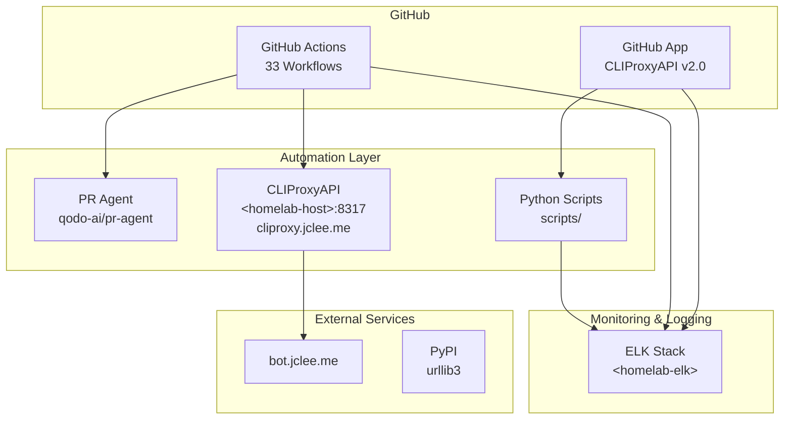

# GitHub Automation Bot — CLIProxyAPI v2.0

[](https://cliproxy.jclee.me)
[](#automation-inventory--자동화-인벤토리)
[](https://www.python.org/)
[](./LICENSE)

> **English** | [**한국어**](#개요)

---

## Table of Contents

- [Overview](#overview--개요)
- [Features](#features--주요-기능)
- [Architecture](#architecture--아키텍처)
- [Automation Inventory](#automation-inventory--자동화-인벤토리)
- [Quick Start](#quick-start--빠른-시작)
- [Local Development](#local-development--로컬-개발)
- [Commands Reference](#commands-reference--명령어-참조)
- [Contribution Guide](#contribution-guide--기여-가이드)

---

## Overview | 개요

This repository contains the **CLIProxyAPI v2.0 GitHub Automation Bot** — a comprehensive system of **33 GitHub Actions workflows** and Python-based automation tools that provide automated code review, issue management, PR handling, documentation generation, and release automation for GitHub repositories.

이 저장소는 **CLIProxyAPI v2.0 GitHub 자동화 봇**을 포함하고 있으며, GitHub 저장소에 대한 자동화된 코드 리뷰, 이슈 관리, PR 처리, 문서 생성 및 릴리스 자동화를 제공하는 **33개의 GitHub Actions 워크플로우**와 Python 기반 자동화 도구의 종합 시스템입니다.

### Key Characteristics | 주요 특성

| Characteristic 특성 | Description 설명 |
|---|---|
| **Architecture** 아키텍처 | Python-based GitHub App + GitHub Actions |
| **Automation Scope** 자동화 범위 | 33 workflows covering PR, issues, security, releases |
| **Core Scripts** 핵심 스크립트 | `scripts/` (Python automation tools) |
| **External Services** 외부 서비스 | CLIProxyAPI (`cliproxy.jclee.me`), PR Agent (`qodo-ai/pr-agent`) |
| **Logging** 로깅 | ELK stack (`<homelab-elk>`) |

---

## Features | 주요 기능

### Automated Code Review | 자동화 코드 리뷰

- **PR Agent Integration**: AI-powered code reviews using `qodo-ai/pr-agent`
- **Automated Review Comments**: AI-generated feedback on PR changes
- **PR Review Workflow**: `10_pr-review.yml` orchestrates review automation

### Issue Management | 이슈 관리

- **Automated Classification**: AI-driven issue categorization (`91_issue-classification.yml`)
- **Branch Creation**: Auto-create branches from issues (`02_issue-to-branch.yml`)
- **Backfill Automation**: Fill missing issue data (`19_issue-backfill.yml`)
- **GitHub App Integration**: CLIProxyAPI v2.0 for issue handling

### Pull Request Automation | 풀 리퀘스트 자동화

- **Auto-Merge**: Automatic PR merging on approval (`13_pr-auto-merge.yml`)
- **Dependabot Integration**: Auto-merge dependency updates (`12_dependabot-auto-merge.yml`)
- **PR Checks**: Comprehensive validation (`03_pr-checks.yml`)
- **Semantic PR**: Enforce semantic versioning in PR titles (`09_semantic-pr.yml`)
- **Merge Cleanup**: Automatic branch cleanup after merge (`15_merged-pr-cleanup.yml`)

### Security Automation | 보안 자동화

- **Gitleaks Scan**: Secret detection in commits (`05_gitleaks.yml`)
- **CodeQL Analysis**: Static security analysis (`06_codeql.yml`)
- **Dependency Review**: Vulnerability scanning (`07_dependency-review.yml`)
- **Scorecard**: OpenSSF security scoring (`08_scorecard.yml`)
- **Action Lint**: Workflow validation (`04_actionlint.yml`)
- **Private IP Detection**: Scan for hardcoded IPs (`scripts/check_private_ips.py`)

### Documentation Automation | 문서 자동화

- **README Generation**: Auto-generate README from structure (`20_readme-gen.yml`)
- **Docs Sync**: Synchronize documentation (`21_docs-sync.yml`, `42_reusable-docs-sync.yml`)
- **Release Notes**: Automated release note generation (`24_release-notes.yml`)

### Release Automation | 릴리스 자동화

- **Release Publishing**: Publish releases automatically (`25_release-publish.yml`)
- **Version Management**: Semantic version enforcement
- **Downstream Health Check**: Validate downstream compatibility (`29_downstream-health-check.yml`)

### CI/CD Automation | CI/CD 자동화

- **CI Failure Issues**: Auto-create issues for CI failures (`37_ci-failure-issues.yml`)
- **CI Auto-Heal**: Self-healing CI pipeline (`60_ci-auto-heal.yml`)
- **Health Monitoring**: Monitor repository health

### Bot Auto-Fix | 봇 자동 수정

- **Self-Fixing PRs**: Bot can automatically fix issues (`14_bot-auto-fix.yml`)
- **Automated Remediation**: Apply fixes without human intervention

---

## Architecture | 아키텍처



### Data Flow | 데이터 흐름

1. **Event Trigger**: GitHub event (PR, issue, push) triggers workflow
2. **Workflow Orchestration**: GitHub Actions executes workflow steps
3. **Automation Execution**: Python scripts / PR Agent process the event
4. **External Communication**: CLIProxyAPI communicates with external bot service
5. **Logging**: All actions logged to ELK stack for monitoring

---

## Automation Inventory | 자동화 인벤토리

### GitHub Actions Workflows | GitHub Actions 워크플로우

| File | Trigger | Purpose |
|---|---|---|
| `01_branch-to-pr.yml` | push | Create PR from branch |
| `02_issue-to-branch.yml` | issues | Create branch from issue |
| `03_pr-checks.yml` | pull_request | Run PR validation checks |
| `04_actionlint.yml` | workflow_dispatch, push | Lint GitHub Actions workflows |
| `05_gitleaks.yml` | push, pull_request | Scan for secrets in code |
| `06_codeql.yml` | push, pull_request | Run CodeQL security analysis |
| `07_dependency-review.yml` | pull_request | Review dependency changes |
| `08_scorecard.yml` | push | OpenSSF security scorecard |
| `09_semantic-pr.yml` | pull_request | Enforce semantic PR titles |
| `10_pr-review.yml` | pull_request | AI-powered PR review |
| `12_dependabot-auto-merge.yml` | pull_request | Auto-merge Dependabot PRs |
| `13_pr-auto-merge.yml` | pull_request | Auto-merge approved PRs |
| `14_bot-auto-fix.yml` | pull_request | Bot self-fixing automation |
| `15_merged-pr-cleanup.yml` | pull_request | Clean up merged branches |
| `18_issue-management.yml` | issues, pull_request | Manage issue lifecycle |
| `19_issue-backfill.yml` | workflow_dispatch | Fill missing issue data |
| `20_readme-gen.yml` | push, workflow_dispatch | Auto-generate README |
| `21_docs-sync.yml` | push | Sync documentation |
| `24_release-notes.yml` | push | Generate release notes |
| `25_release-publish.yml` | release | Publish releases |
| `29_downstream-health-check.yml` | workflow_dispatch | Check downstream health |
| `37_ci-failure-issues.yml` | workflow_run | Create issues for CI failures |
| `42_reusable-docs-sync.yml` | workflow_call | Reusable docs sync workflow |
| `43_reusable-issue-management.yml` | workflow_call | Reusable issue management |
| `44_reusable-pr-checks.yml` | workflow_call | Reusable PR checks |
| `45_reusable-gitleaks.yml` | workflow_call | Reusable gitleaks scan |
| `60_ci-auto-heal.yml` | workflow_run | Auto-heal broken CI |
| `91_issue-classification.yml` | issues | Classify issues with AI |
| `auto-merge.yml` | pull_request | General auto-merge |
| `ci.yml` | push | Primary CI workflow |
| `labeler.yml` | pull_request | Auto-label PRs |
| `welcome.yml` | pull_request | Welcome new contributors |
| `security/11_pr-review.yml` | pull_request | Security-focused PR review |

### Python Automation Scripts | Python 자동화 스크립트

| Script | Purpose |
|---|---|
| `scripts/pr_review_runner.py` | Run AI-powered PR reviews |
| `scripts/repo_review.py` | Review repository health |
| `scripts/generate_readme.py` | Generate README from structure |
| `scripts/check_private_ips.py` | Scan for hardcoded private IPs |
| `scripts/check_hardcode_scan_patterns_test.py` | Test hardcode scanning patterns |
| `scripts/check_workflow_scripts.py` | Validate workflow scripts |
| `scripts/issue_classification_workflow_test.py` | Test issue classification |
| `scripts/issue_classifier_js_test.py` | JavaScript issue classifier tests |
| `scripts/pr_review_runner_test.py` | Test PR review runner |
| `scripts/readme_mermaid_test.py` | Validate Mermaid diagrams |
| `scripts/redact_exposed_secrets.py` | Redact exposed secrets |
| `scripts/check_workflow_scripts_test.py` | Test workflow script checker |

---

## Quick Start | 빠른 시작

### Prerequisites | 전제 조건

- Python 3.x
- Git
- Docker (for containerized development)
- GitHub account with repository access

### Installation | 설치

```bash
# Clone repository
git clone https://github.com/jclee941/.github
cd CLIProxyAPI

# Install dependencies
pip install -r _bot-scripts/requirements.txt
# or for development
pip install -r _bot-scripts/requirements-dev.txt
```

### Initial Setup | 초기 설정

1. **GitHub App Installation**: Install CLIProxyAPI v2.0 GitHub App on target repositories
2. **Environment Variables**: Configure required secrets in GitHub repository settings
3. **Workflow Enable**: Enable desired workflows in repository settings

---

## Local Development | 로컬 개발

### Environment Setup | 환경 설정

```bash
# Create virtual environment (recommended)
python3 -m venv venv
source venv/bin/activate  # Linux/macOS
# or
venv\Scripts\activate     # Windows

# Install dependencies
pip install -e _bot-scripts/
pip install -r _bot-scripts/requirements-dev.txt
```

### Docker Development | Docker 개발

```bash
# Build GitHub Action image
docker build -f _bot-scripts/Dockerfile.github_action -t cli-proxy-action .

# Build GitHub App image
docker build -f _bot-scripts/Dockerfile.github_app -t cli-proxy-app .

# Run with docker-compose
docker-compose -f _bot-scripts/docker-compose.github_app.yml up
```

### Testing | 테스트

```bash
# Run all tests
pytest tests/

# Run specific test file
pytest tests/ -v

# Run with coverage
pytest --cov=_bot-scripts tests/

# Run script-specific tests
python -m pytest _bot-scripts/scripts/check_private_ips_test.py
python -m pytest _bot-scripts/scripts/check_hardcode_scan_patterns_test.py
python -m pytest _bot-scripts/scripts/check_workflow_scripts_test.py
python -m pytest _bot-scripts/scripts/pr_review_runner_test.py
python -m pytest _bot-scripts/scripts/readme_mermaid_test.py
python -m pytest _bot-scripts/scripts/issue_classification_workflow_test.py
```

### Local CI Simulation | 로컬 CI 시뮬레이션

```bash
# Simulate PR checks locally
act -l  # List available workflows
act -W .github/workflows/03_pr-checks.yml -v

# Simulate PR review
act -W .github/workflows/10_pr-review.yml -v
```

---

## Commands Reference | 명령어 참조

### Make Commands | Make 명령어

```bash
make help              # Show available make targets
make lint             # Run linting
make test             # Run tests
make build            # Build Docker images
make clean            # Clean build artifacts
```

### Python Scripts | Python 스크립트

```bash
# Generate README
python _bot-scripts/scripts/generate_readme.py

# Check for private IPs
python _bot-scripts/scripts/check_private_ips.py --path .

# Redact exposed secrets
python _bot-scripts/scripts/redact_exposed_secrets.py --input secrets.txt

# Run PR review
python _bot-scripts/scripts/pr_review_runner.py --pr-url https://github.com/owner/repo/pull/123

# Repo review
python _bot-scripts/scripts/repo_review.py --repo owner/repo

# Check workflow scripts
python _bot-scripts/scripts/check_workflow_scripts.py --workflow-dir .github/workflows
```

### GitHub Actions Workflows | GitHub Actions 워크플로우

#### PR Workflows | PR 워크플로우

```bash
# Trigger PR checks manually
gh workflow run 03_pr-checks.yml -f pr_url=https://github.com/owner/repo/pull/123

# Trigger PR review manually
gh workflow run 10_pr-review.yml -f pr_url=https://github.com/owner/repo/pull/123

# Trigger auto-merge
gh workflow run 13_pr-auto-merge.yml -f pr_url=https://github.com/owner/repo/pull/123
```

#### Issue Workflows | 이슈 워크플로우

```bash
# Trigger issue classification
gh workflow run 91_issue-classification.yml -f issue_number=123

# Trigger issue backfill
gh workflow run 19_issue-backfill.yml -f issue_number=123
```

#### Documentation Workflows | 문서 워크플로우

```bash
# Trigger README generation
gh workflow run 20_readme-gen.yml

# Trigger docs sync
gh workflow run 21_docs-sync.yml
```

#### Release Workflows | 릴리스 워크플로우

```bash
# Trigger release notes generation
gh workflow run 24_release-notes.yml -f version=1.0.0

# Trigger release publish
gh workflow run 25_release-publish.yml -f tag=v1.0.0
```

---

## Contribution Guide | 기여 가이드

### Getting Started | 시작하기

1. Fork the repository
2. Create a feature branch (`git checkout -b feature/amazing-feature`)
3. Commit your changes (`git commit -m 'Add amazing feature'`)
4. Push to the branch (`git push origin feature/amazing-feature`)
5. Open a Pull Request

### Development Standards | 개발 표준

- **Code Style**: Follow PEP 8 guidelines
- **Type Hints**: Use type hints for all Python functions
- **Documentation**: Document all public functions and classes
- **Testing**: Write tests for new functionality (minimum 80% coverage)
- **Linting**: Ensure code passes all linting checks

### Commit Message Format | 커밋 메시지 형식

```
<type>(<scope>): <description>

[optional body]

[optional footer]
```

**Types**: `feat`, `fix`, `docs`, `style`, `refactor`, `test`, `chore`

### Pull Request Process | 풀 리퀘스트 프로세스

1. Ensure all tests pass locally
2. Update documentation if needed
3. Follow the commit message format
4. Request review from maintainers
5. Address all review comments
6. Squash commits if necessary

### Workflow Development | 워크플로우 개발

When adding new workflows:

1. Use appropriate numeric prefix (e.g., `50_new-workflow.yml`)
2. Follow naming conventions in `workflows/`
3. Include `name:` field for display
4. Add to this README's automation inventory
5. Add tests in `tests/`
6. Update `_bot-scripts/scripts/AGENTS.md` if agent-related

### Security Considerations | 보안 고려사항

- Never commit secrets or credentials
- Use GitHub Secrets for sensitive data
- Run `check_private_ips.py` before committing
- Run `gitleaks` scan before submitting PR
- Follow secure coding practices

### Resources | 리소스

- [CONTRIBUTING.md](./CONTRIBUTING.md) - Contribution guidelines
- [`_bot-scripts/CONTRIBUTING.md`](./_bot-scripts/CONTRIBUTING.md) - Bot contribution guidelines
- [`_bot-scripts/AGENTS.md`](./_bot-scripts/AGENTS.md) - Agent documentation
- [`docs/QUICK-START.md`](./docs/QUICK-START.md) - Quick start guide
- [`docs/DEPLOYMENT.md`](./docs/DEPLOYMENT.md) - Deployment instructions

---

## License | 라이선스

Copyright (c) 2024 CLIProxyAPI. All rights reserved.

See [LICENSE](./LICENSE) and [`_bot-scripts/LICENSE`](./_bot-scripts/LICENSE) for details.

---

> Generated by **CLIProxyAPI v2.0** | [bot.jclee.me](https://bot.jclee.me) | [cliproxy.jclee.me](https://cliproxy.jclee.me)
