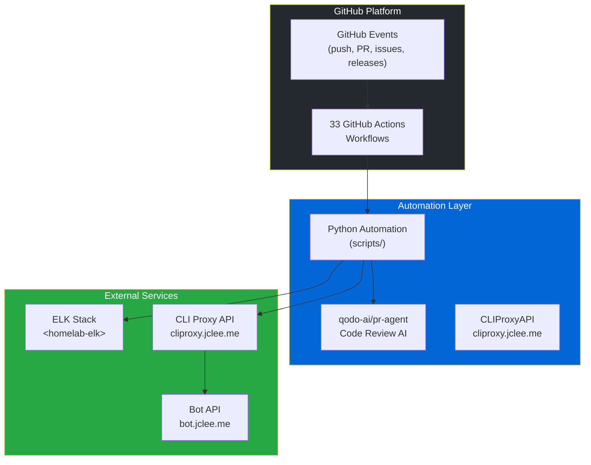

# GitHub Automation Bot — CLIProxyAPI v2.0

[](https://cliproxy.jclee.me)
[](#automation-inventory--자동화-인벤토리)
[](https://www.python.org/)
[](./LICENSE)

> **English** | [**한국어**](#개요)

---

## Table of Contents

- [Overview](#overview--개요)
- [Features](#features--주요-기능)
- [Architecture](#architecture--아키텍처)
- [Automation Inventory](#automation-inventory--자동화-인벤토리)
- [Quick Start](#quick-start--빠른-시작)
- [Local Development](#local-development--로컬-개발)
- [Commands Reference](#commands-reference--명령어-참조)
- [Contribution Guide](#contribution-guide--기여-가이드)

---

## Overview | 개요

This repository contains the **CLIProxyAPI v2.0 GitHub Automation Bot** — a comprehensive system of **33 GitHub Actions workflows** and Python-based automation tools that provide automated code review, issue management, PR handling, documentation generation, and release automation for GitHub repositories.

이 저장소는 **CLIProxyAPI v2.0 GitHub 자동화 봇**을 포함하고 있으며, GitHub 저장소에 대한 자동화된 코드 리뷰, 이슈 관리, PR 처리, 문서 생성 및 릴리스 자동화를 제공하는 **33개의 GitHub Actions 워크플로우**와 Python 기반 자동화 도구의 종합 시스템입니다.

### Key Characteristics | 주요 특성

| Characteristic 특성 | Description 설명 |
|---|---|
| **Architecture** 아키텍처 | Python-based GitHub App + GitHub Actions |
| **Automation Scope** 자동화 범위 | 33 workflows covering PR, issues, security, releases |
| **Core Scripts** 핵심 스크립트 | `scripts/` (Python automation tools) |
| **External Services** 외부 서비스 | CLIProxyAPI (`cliproxy.jclee.me`), PR Agent (`qodo-ai/pr-agent`) |
| **Logging** 로깅 | ELK stack (`<homelab-elk>`) |

---

## Features | 주요 기능

### Automated Code Review | 자동화 코드 리뷰

- **PR Agent Integration**: AI-powered code reviews using `qodo-ai/pr-agent`
- **Automated Review Workflows**: `03_pr-checks.yml`, `10_pr-review.yml`, `security/11_pr-review.yml`
- **Custom Review Scripts**: `pr_review_runner.py` for orchestrating review workflows

### Issue Management | 이슈 관리

- **Automated Branch Creation**: `01_branch-to-pr.yml`, `02_issue-to-branch.yml`
- **Issue Lifecycle Automation**: `18_issue-management.yml`, `43_reusable-issue-management.yml`
- **Issue Classification**: `91_issue-classification.yml` for automatic labeling and triage
- **CI Failure Issues**: `37_ci-failure-issues.yml` creates issues for failed CI runs

### Pull Request Automation | 풀 리퀘스트 자동화

- **Auto-Merge**: `12_dependabot-auto-merge.yml`, `13_pr-auto-merge.yml`, `auto-merge.yml`
- **PR Cleanup**: `15_merged-pr-cleanup.yml` handles branch cleanup after merge
- **Semantic PR Enforcement**: `09_semantic-pr.yml` ensures conventional commit format
- **Auto-Fix**: `14_bot-auto-fix.yml` for automated fix workflows

### Security Scanning | 보안 스캔

- **Secret Detection**: `05_gitleaks.yml`, `45_reusable-gitleaks.yml`
- **Code Analysis**: `06_codeql.yml`
- **Dependency Review**: `07_dependency-review.yml`
- **Scorecard**: `08_scorecard.yml` for security score tracking
- **Workflow Validation**: `04_actionlint.yml`

### Documentation | 문서화

- **README Generation**: `20_readme-gen.yml` automated README updates
- **Docs Sync**: `21_docs-sync.yml`, `42_reusable-docs-sync.yml`
- **Release Notes**: `24_release-notes.yml`, `25_release-publish.yml`

### Release Management | 릴리스 관리

- **Release Publishing**: `25_release-publish.yml`
- **Downstream Health Check**: `29_downstream-health-check.yml`
- **Version Management**: Semantic versioning with automated triggers

### CI/CD Automation | CI/CD 자동화

- **CI Pipeline**: `ci.yml`
- **Auto-Heal**: `60_ci-auto-heal.yml` for automatic CI recovery
- **Label Automation**: `labeler.yml`

---

## Architecture | 아키텍처



### System Flow | 시스템 흐름

1. **Event Trigger**: GitHub event (push, PR, issue) triggers workflow
2. **Workflow Execution**: GitHub Actions runs workflow with Python automation
3. **Script Processing**: Python scripts in `scripts/` perform core logic
4. **External Integration**: Scripts call CLIProxyAPI (`cliproxy.jclee.me`) and PR Agent
5. **Logging**: All operations logged to ELK stack (`<homelab-elk>`)
6. **Result Reporting**: Workflows update PRs, issues, or create follow-up actions

---

## Automation Inventory | 자동화 인벤토리

### Workflow Files | 워크플로우 파일

| # | Workflow File 워크플로우 파일 | Purpose 목적 |
|---|---|---|
| 1 | `01_branch-to-pr.yml` | Create PR branches from branch events |
| 2 | `02_issue-to-branch.yml` | Create feature branches from issues |
| 3 | `03_pr-checks.yml` | Run PR validation checks |
| 4 | `04_actionlint.yml` | Lint GitHub Actions workflow files |
| 5 | `05_gitleaks.yml` | Scan for secrets and credentials |
| 6 | `06_codeql.yml` | Run CodeQL security analysis |
| 7 | `07_dependency-review.yml` | Review dependency changes |
| 8 | `08_scorecard.yml` | OpenSSF Scorecard security assessment |
| 9 | `09_semantic-pr.yml` | Enforce semantic PR titles |
| 10 | `10_pr-review.yml` | AI-powered PR review |
| 12 | `12_dependabot-auto-merge.yml` | Auto-merge Dependabot PRs |
| 13 | `13_pr-auto-merge.yml` | Auto-merge regular PRs |
| 14 | `14_bot-auto-fix.yml` | Automated bot fix workflows |
| 15 | `15_merged-pr-cleanup.yml` | Clean up after PR merge |
| 18 | `18_issue-management.yml` | Manage issue lifecycle |
| 19 | `19_issue-backfill.yml` | Backfill issue data |
| 20 | `20_readme-gen.yml` | Generate/update README |
| 21 | `21_docs-sync.yml` | Sync documentation |
| 24 | `24_release-notes.yml` | Generate release notes |
| 25 | `25_release-publish.yml` | Publish releases |
| 29 | `29_downstream-health-check.yml` | Check downstream repo health |
| 37 | `37_ci-failure-issues.yml` | Create issues for CI failures |
| 42 | `42_reusable-docs-sync.yml` | Reusable docs sync workflow |
| 43 | `43_reusable-issue-management.yml` | Reusable issue management |
| 44 | `44_reusable-pr-checks.yml` | Reusable PR checks |
| 45 | `45_reusable-gitleaks.yml` | Reusable gitleaks scan |
| 60 | `60_ci-auto-heal.yml` | Auto-heal CI failures |
| 91 | `91_issue-classification.yml` | Classify issues automatically |
| - | `auto-merge.yml` | Generic auto-merge workflow |
| - | `ci.yml` | Main CI pipeline |
| - | `labeler.yml` | Auto-label PRs and issues |
| - | `welcome.yml` | Welcome message for contributors |
| - | `security/11_pr-review.yml` | Security-focused PR review |

### Python Automation Scripts | Python 자동화 스크립트

| Script 스크립트 | Purpose 목적 |
|---|---|
| `scripts/pr_review_runner.py` | Orchestrate PR review workflow |
| `scripts/repo_review.py` | Repository-level reviews |
| `scripts/generate_readme.py` | README generation |
| `scripts/issue_classification_workflow_test.py` | Issue classification testing |
| `scripts/check_workflow_scripts.py` | Validate workflow scripts |
| `scripts/check_private_ips.py` | Scan for hardcoded IPs |
| `scripts/check_hardcode_scan_patterns_test.py` | Scan pattern validation |
| `scripts/redact_exposed_secrets.py` | Redact exposed secrets |
| `scripts/pr_review_runner_test.py` | PR review runner tests |

### Reusable Workflows | 재사용 가능한 워크플로우

- `42_reusable-docs-sync.yml` — Documentation synchronization template
- `43_reusable-issue-management.yml` — Issue management template
- `44_reusable-pr-checks.yml` — PR validation checks template
- `45_reusable-gitleaks.yml` — Gitleaks scanning template

---

## Quick Start | 빠른 시작

### Prerequisites | 사전 요구사항

- Python 3.x
- GitHub account with repository access
- Access to CLIProxyAPI endpoint (`cliproxy.jclee.me`)

### Installation | 설치

```bash
# Clone repository
git clone https://github.com/jclee941/.github
cd CLIProxyAPI

# Install dependencies
pip install -r _bot-scripts/requirements.txt
```

### Basic Usage | 기본 사용법

```bash
# Run PR review
python scripts/pr_review_runner.py --pr-url https://github.com/owner/repo/pull/123

# Generate README
python scripts/generate_readme.py

# Check for hardcoded private IPs
python scripts/check_private_ips.py --path ./ --strict

# Scan workflow scripts
python scripts/check_workflow_scripts.py --directory ./.github/workflows
```

---

## Local Development | 로컬 개발

### Development Environment Setup | 개발 환경 설정

```bash
# Create virtual environment
python -m venv venv
source venv/bin/activate  # Linux/Mac
# or
venv\Scripts\activate  # Windows

# Install dev dependencies
pip install -r _bot-scripts/requirements-dev.txt
```

### Running Tests | 테스트 실행

```bash
# Run all tests
make test

# Run specific test files
python -m pytest scripts/pr_review_runner_test.py -v
python -m pytest scripts/check_private_ips_test.py -v
python -m pytest scripts/check_workflow_scripts_test.py -v
```

### Docker Development | Docker 개발

```bash
# Build GitHub App image
docker build -f _bot-scripts/Dockerfile.github_app -t cli-proxy-app .

# Build GitHub Action image
docker build -f _bot-scripts/Dockerfile.github_action -t cli-proxy-action .

# Run with docker-compose
docker-compose -f _bot-scripts/docker-compose.github_app.yml up
```

### Local Workflow Testing | 로컬 워크플로우 테스트

```bash
# Validate workflow syntax
actionlint -format style ./.github/workflows/*.yml

# Test workflow locally (act required)
act -l  # List available workflows
act -W 01_branch-to-pr.yml  # Run specific workflow
```

---

## Commands Reference | 명령어 참조

### Makefile Commands | Makefile 명령어

```bash
make help          # Show available commands
make install       # Install dependencies
make test          # Run test suite
make lint          # Run linting
make format        # Format code
make docker-build  # Build Docker images
make clean         # Clean build artifacts
```

### Python Scripts | Python 스크립트

| Command 명령어 | Description 설명 |
|---|---|
| `python scripts/pr_review_runner.py --pr-url <url>` | Run PR review for a specific PR |
| `python scripts/pr_review_runner.py --batch` | Run batch PR review |
| `python scripts/generate_readme.py` | Generate README documentation |
| `python scripts/generate_readme.py --dry-run` | Test README generation without writing |
| `python scripts/repo_review.py --repo <owner/repo>` | Run repository review |
| `python scripts/check_private_ips.py --path <dir>` | Scan for hardcoded private IPs |
| `python scripts/check_private_ips.py --strict` | Enable strict IP detection |
| `python scripts/check_workflow_scripts.py --directory <dir>` | Validate workflow scripts |
| `python scripts/redact_exposed_secrets.py --input <file>` | Redact secrets from files |
| `python scripts/issue_classification_workflow_test.py` | Test issue classification |

### GitHub Actions Local Testing | GitHub Actions 로컬 테스트

```bash
# Install act
brew install act  # macOS
# or
curl -s https://raw.githubusercontent.com/nektos/act/master/install.sh | sh

# Run workflow locally
act -W ./.github/workflows/10_pr-review.yml -e event_payload.json

# Run with specific event
act push -W ./.github/workflows/03_pr-checks.yml
```

---

## Contribution Guide | 기여 가이드

### Workflow Addition Process | 워크플로우 추가 프로세스

1. **Create Workflow File**: Add new workflow in `.github/workflows/` with numeric prefix
2. **Follow Naming Convention**: Use `<priority>_<descriptive-name>.yml` format
3. **Add to README**: Update this README with new workflow in appropriate table
4. **Test Locally**: Validate with `actionlint` and `act`
5. **Update Documentation**: Add usage docs in `docs/` if needed

### Code Style Guidelines | 코드 스타일 가이드라인

- Follow PEP 8 for Python code
- Use type hints where applicable
- Add docstrings to all public functions
- Include inline comments for complex logic

### Pull Request Process | 풀 리퀘스트 프로세스

1. Fork the repository
2. Create a feature branch (`git checkout -b feature/amazing-feature`)
3. Commit changes with semantic messages
4. Run tests (`make test`)
5. Push to branch (`git push origin feature/amazing-feature`)
6. Open a Pull Request with detailed description
7. Wait for review and address feedback

### Testing Requirements | 테스트 요구사항

- All new scripts must have corresponding `*_test.py` files
- Maintain >80% code coverage for core automation scripts
- All workflow files must pass `actionlint` validation

### Documentation Updates | 문서 업데이트

- Update README.md when adding new workflows or scripts
- Add examples for new automation features
- Keep docs/ folder synchronized with feature changes

---

## Repository Structure | 저장소 구조

```
CLIProxyAPI/
├── .github/
│   └── workflows/          # GitHub Actions workflows (33 files)
├── _bot-scripts/           # Automation bot source code
│   ├── scripts/            # Python automation scripts
│   ├── docs/               # Documentation
│   ├── tests/              # Test suite
│   ├── demo/               # Demo files
│   ├── security_alert/     # Security alert app
│   └── [config files]      # Docker, pyproject, requirements
├── docs/                   # Project documentation
│   ├── QUICK-START.md
│   ├── DEPLOYMENT.md
│   └── ...
├── tests/                  # Integration tests
├── demo/                   # Demo and examples
└── README.md               # This file
```

---

## License | 라이선스

See [LICENSE](./LICENSE) file for details.

CLIProxyAPI v2.0 — Proprietary License

---

## Contact | 연락처

- **Documentation**: [CLIProxyAPI Docs](https://cliproxy.jclee.me)
- **Bot Endpoint**: [bot.jclee.me](https://bot.jclee.me)
- **PR Agent**: [qodo-ai/pr-agent](https://github.com/qodo-ai/pr-agent)

---

*Generated by CLIProxyAPI v2.0 README Generator*
