# Comprehensive Bilingual README.md Generator

I'll analyze the repository structure and generate a comprehensive bilingual README.md.

## Analysis

**Repository:** GitHub Automation Bot System (CLIProxyAPI v2.0)
**Core Directory:** `_bot-scripts/` (GitHub Actions bot with automation scripts)
**Workflows:** 33 workflow files (prefixed numbering pattern)
**Go Tools:** 0 (Python-based automation)
**External APIs:** CLIProxyAPI (cliproxy.jclee.me), PR Agent (qodo-ai/pr-agent)

---

## Generated README.md

```markdown
# GitHub Automation Bot - CLIProxyAPI v2.0

[](https://cliproxy.jclee.me)
[](#automation-inventory--자동화-인벤토리)
[](https://www.python.org/)
[](./LICENSE)

> **English** | [한국어](#개요)

---

## Table of Contents

- [Overview](#overview--개요)
- [Features](#features--주요-기능)
- [Architecture](#architecture--아키텍처)
- [Automation Inventory](#automation-inventory--자동화-인벤토리)
- [Quick Start](#quick-start--빠른-시작)
- [Local Development](#local-development--로컬-개발)
- [Commands Reference](#commands-reference--명령어-참조)
- [Contribution Guide](#contribution-guide--기여-가이드)

---

## Overview | 개요

This repository contains the **CLIProxyAPI v2.0 GitHub Automation Bot** - a comprehensive system of **33 GitHub Actions workflows** and Python-based automation tools that provide automated code review, issue management, PR handling, documentation generation, and release automation for GitHub repositories.

이 저장소는 **CLIProxyAPI v2.0 GitHub 자동화 봇**을 포함하고 있으며, GitHub 저장소에 대한 자동화된 코드 리뷰, 이슈 관리, PR 처리, 문서 생성 및 릴리스 자동화를 제공하는 **33개의 GitHub Actions 워크플로우**와 Python 기반 자동화 도구의 종합 시스템입니다.

### Key Characteristics | 주요 특성

| Characteristic 특성 | Description 설명 |
|---------------------|------------------|
| **Workflow Count 워크플로우 수** | 33 active GitHub Actions workflows 33개의 활성 GitHub Actions 워크플로우 |
| **Bot Engine 봇 엔진** | CLIProxyAPI v2.0 via custom REST endpoint CLIProxyAPI v2.0 (커스텀 REST 엔드포인트) |
| **AI Code Review AI 코드 리뷰** | qodo-ai/pr-agent for automated PR reviews 자동 PR 리뷰를 위한 qodo-ai/pr-agent |
| **Architecture 아키텍처** | Python + GitHub Actions + Docker containers Python + GitHub Actions + Docker 컨테이너 |
| **Automation Scope 자동화 범위** | PR checks, issue management, docs sync, releases PR 체크, 이슈 관리, 문서 동기화, 릴리스 |

---

## Features | 주요 기능

### 🤖 Automated Code Review
- **PR Review Workflow** (`10_pr-review.yml`, `security/11_pr-review.yml`): AI-powered PR reviews using qodo-ai/pr-agent
- **Secret Scanning** (`05_gitleaks.yml`): Automated hardcoded credential detection
- **Code Quality** (`06_codeql.yml`, `04_actionlint.yml`): Static analysis and workflow linting
- **Security Checks** (`07_dependency-review.yml`, `08_scorecard.yml`): Dependency vulnerability scanning

### 📋 Issue Management
- **Automated Branch Creation** (`02_issue-to-branch.yml`): Auto-create branches from issues
- **Issue Classification** (`91_issue-classification.yml`): AI-powered issue categorization
- **Issue Backfill** (`19_issue-backfill.yml`): Missing issue data recovery
- **CI Failure Issues** (`37_ci-failure-issues.yml`): Auto-create issues for CI failures

### 🔄 Pull Request Automation
- **Auto Merge** (`12_dependabot-auto-merge.yml`, `13_pr-auto-merge.yml`): Automatic PR merging
- **Semantic PR** (`09_semantic-pr.yml`): Enforce conventional commits
- **PR Cleanup** (`15_merged-pr-cleanup.yml`): Post-merge cleanup
- **Bot Auto-Fix** (`14_bot-auto-fix.yml`): Automated fix suggestions

### 📚 Documentation
- **README Generation** (`20_readme-gen.yml`): Automatic README.md updates
- **Docs Sync** (`21_docs-sync.yml`, `42_reusable-docs-sync.yml`): Cross-repository documentation sync
- **Release Notes** (`24_release-notes.yml`, `25_release-publish.yml`): Automated changelog generation

### 🚀 CI/CD Automation
- **Health Checks** (`29_downstream-health-check.yml`): Downstream dependency monitoring
- **CI Auto-Heal** (`60_ci-auto-heal.yml`): Automatic CI failure recovery
- **PR Checks** (`03_pr-checks.yml`, `44_reusable-pr-checks.yml`): Comprehensive PR validation

---

## Architecture | 아키텍처

```mermaid
flowchart TB
    subgraph GitHub["GitHub Repository"]
        A[Issue Created] --> B[01_branch-to-pr.yml]
        B --> C[02_issue-to-branch.yml]
        A --> D[18_issue-management.yml]
        D --> E[19_issue-backfill.yml]
    end

    subgraph PRAutomation["PR Automation"]
        F[PR Opened] --> G[03_pr-checks.yml]
        G --> H[04_actionlint.yml]
        G --> I[05_gitleaks.yml]
        G --> J[06_codeql.yml]
        G --> K[07_dependency-review.yml]
        G --> L[08_scorecard.yml]
        G --> M[09_semantic-pr.yml]
        F --> N[10_pr-review.yml]
        N --> O["qodo-ai/pr-agent"]
        O --> P[CLIProxyAPI]
        P --> Q[&lt;homelab-host&gt;:8317<br/>cliproxy.jclee.me]
        F --> R[12_dependabot-auto-merge.yml]
        F --> S[13_pr-auto-merge.yml]
        F --> T[14_bot-auto-fix.yml]
        M --> U[15_merged-pr-cleanup.yml]
    end

    subgraph DocsAutomation["Documentation Automation"]
        V[Code Change] --> W[20_readme-gen.yml]
        W --> X["generate_readme.py"]
        X --> Y[Mermaid Diagram<br/>Workflow Inventory]
        V --> Z[21_docs-sync.yml]
        V --> AA[24_release-notes.yml]
        AA --> AB[25_release-publish.yml]
    end

    subgraph Monitoring["Monitoring & Healing"]
        AC[CI Run] --> AD[37_ci-failure-issues.yml]
        AC --> AE[29_downstream-health-check.yml]
        AC --> AF[60_ci-auto-heal.yml]
    end

    subgraph Security["Security Scanning"]
        AG[PR Event] --> AH[05_gitleaks.yml]
        AH --> AI[45_reusable-gitleaks.yml]
        AG --> AJ[security/11_pr-review.yml]
    end

    subgraph Reusable["Reusable Workflows"]
        AK[42_reusable-docs-sync.yml]
        AL[43_reusable-issue-management.yml]
        AM[44_reusable-pr-checks.yml]
        AN[45_reusable-gitleaks.yml]
    end

    Q --> R
    R --> S
```



---

## Automation Inventory | 자동화 인벤토리

### GitHub Actions Workflows | GitHub Actions 워크플로우

| # | Workflow File 워크플로우 파일 | Purpose 목적 |
|---|-------------------------------|-------------|
| 1 | `01_branch-to-pr.yml` | Branch to PR transition automation 브랜치에서 PR 전환 자동화 |
| 2 | `02_issue-to-branch.yml` | Auto-create branch from issue 이슈에서 자동 브랜치 생성 |
| 3 | `03_pr-checks.yml` | Comprehensive PR validation suite 종합 PR 검증 |
| 4 | `04_actionlint.yml` | GitHub Actions workflow linting GitHub Actions 워크플로우 린팅 |
| 5 | `05_gitleaks.yml` | Hardcoded secret scanning 하드코딩된 시크릿 스캐닝 |
| 6 | `06_codeql.yml` | CodeQL static analysis CodeQL 정적 분석 |
| 7 | `07_dependency-review.yml` | Dependency vulnerability check 의존성 취약점 검사 |
| 8 | `08_scorecard.yml` | OpenSSF Security Scorecards OpenSSF 보안 점수 |
| 9 | `09_semantic-pr.yml` | Conventional commit enforcementConventional 커밋 강제 |
| 10 | `10_pr-review.yml` | AI PR review via qodo-ai/pr-agentqodo-ai/pr-agent를 통한 AI PR 리뷰 |
| 12 | `12_dependabot-auto-merge.yml` | Auto-merge Dependabot PRsDependabot PR 자동 병합 |
| 13 | `13_pr-auto-merge.yml` | Generic PR auto-merge일반 PR 자동 병합 |
| 14 | `14_bot-auto-fix.yml` | Bot-initiated automated fixes봇 발起的 자동 수정 |
| 15 | `15_merged-pr-cleanup.yml` | Post-merge cleanup tasks병합 후 정리 작업 |
| 18 | `18_issue-management.yml` | Issue lifecycle management이슈 수명 주기 관리 |
| 19 | `19_issue-backfill.yml` | Missing issue data recovery누락된 이슈 데이터 복구 |
| 20 | `20_readme-gen.yml` | Automated README generation자동 README 생성 |
| 21 | `21_docs-sync.yml` | Documentation synchronization문서 동기화 |
| 24 | `24_release-notes.yml` | Changelog generation변경 로그 생성 |
| 25 | `25_release-publish.yml` | Release publication릴리스 게시 |
| 29 | `29_downstream-health-check.yml` | Dependency health monitoring의존성 상태 모니터링 |
| 37 | `37_ci-failure-issues.yml` | Auto-create issues for CI failuresCI 실패용 자동 이슈 생성 |
| 42 | `42_reusable-docs-sync.yml` | Reusable docs sync workflow재사용 가능한 문서 동기화 |
| 43 | `43_reusable-issue-management.yml` | Reusable issue management재사용 가능한 이슈 관리 |
| 44 | `44_reusable-pr-checks.yml` | Reusable PR checks재사용 가능한 PR 체크 |
| 45 | `45_reusable-gitleaks.yml` | Reusable secret scanning재사용 가능한 시크릿 스캐닝 |
| 60 | `60_ci-auto-heal.yml` | CI failure auto-recoveryCI 실패 자동 복구 |
| 91 | `91_issue-classification.yml` | AI-powered issue classificationAI 기반 이슈 분류 |
| - | `auto-merge.yml` | Core auto-merge functionality핵심 자동 병합 기능 |
| - | `ci.yml` | Main CI pipeline주요 CI 파이프라인 |
| - | `labeler.yml` | PR label automationPR 라벨 자동화 |
| - | `welcome.yml` | New contributor welcome message새 기여자 환영 메시지 |
| - | `security/11_pr-review.yml` | Security-focused PR review보안 중심 PR 리뷰 |

### Automation Scripts | 자동화 스크립트

| Script 스크립트 | Purpose 목적 |
|----------------|-------------|
| `generate_readme.py` | README.md generation from templates 템플릿 기반 README.md 생성 |
| `pr_review_runner.py` | PR review orchestration PR 리뷰 오케스트레이션 |
| `repo_review.py` | Repository review automation저장소 리뷰 자동화 |
| `check_hardcode_scan_patterns_test.py` | Hardcoded pattern scanner testing하드코딩 패턴 스캐너 테스트 |
| `check_private_ips.py` | Private IP detection private IP 탐지 |
| `check_workflow_scripts.py` | Workflow validation 워크플로우 검증 |
| `issue_classification_workflow_test.py` | Issue classifier testing 이슈 분류기 테스트 |
| `issue_classifier_js_test.py` | JavaScript issue classifier testsJavaScript 이슈 분류기 테스트 |
| `redact_exposed_secrets.py` | Secret redaction utilities시크릿 삭제 유틸리티 |

### Tools & Infrastructure | 도구 및 인프라

| Component 컴포넌트 | Description 설명 |
|-------------------|------------------|
| **CLIProxyAPI** | Custom bot API endpoint 커스텀 봇 API 엔드포인트 |
| **qodo-ai/pr-agent** | AI-powered PR review agent AI 기반 PR 리뷰 에이전트 |
| **Gitleaks** | Secret scanning tool 시크릿 스캐닝 도구 |
| **CodeQL** | Security analysis engine 보안 분석 엔진 |
| **ActionLint** | Workflow linting tool 워크플로우 린팅 도구 |
| **Docker** | Containerized execution 컨테이너화된 실행 |

---

## Quick Start | 빠른 시작

### Prerequisites | 전제 조건

- Python 3.x
- Docker (for containerized workflows)
- GitHub Actions enabled
- Access to CLIProxyAPI endpoint

### Installation | 설치

```bash
# Clone repository
git clone https://github.com/jclee941/.github
cd CLIProxyAPI

# Install dependencies
pip install -r _bot-scripts/requirements.txt

# Install development dependencies
pip install -r _bot-scripts/requirements-dev.txt
```

### Bot Setup | 봇 설정

```bash
# Generate bot configuration
make config

# Verify bot connectivity
python _bot-scripts/scripts/check_workflow_scripts.py
```

---

## Local Development | 로컬 개발

### Environment Setup | 환경 설정

```bash
# Create virtual environment
python -m venv venv
source venv/bin/activate  # Linux/Mac
# or
.\venv\Scripts\Activate  # Windows

# Install dependencies
make dev-install

# Run tests
make test
```

### Running Workflows Locally | 로컬에서 워크플로우 실행

```bash
# Lint all workflow files
make lint

# Run specific check
make check-workflows

# Validate README generation
make check-readme
```

### Docker-based Development | Docker 기반 개발

```bash
# Build GitHub Action image
docker build -f _bot-scripts/Dockerfile.github_action -t cli-proxy-action .

# Build GitHub App image
docker build -f _bot-scripts/Dockerfile.github_app -t cli-proxy-app .

# Run with docker-compose
docker-compose -f _bot-scripts/docker-compose.github_app.yml up
```

---

## Commands Reference | 명령어 참조

### Makefile Commands | Makefile 명령어

| Command 명령어 | Description 설명 |
|--------------|----------------|
| `make help` | Display available commands 사용 가능한 명령어 표시 |
| `make lint` | Lint all workflow files 모든 워크플로우 파일 린팅 |
| `make test` | Run test suite 테스트 스위트 실행 |
| `make check-workflows` | Validate workflow syntax 워크플로우 구문 검증 |
| `make check-readme` | Verify README generation README 생성 검증 |
| `make dev-install` | Install development dependencies 개발 의존성 설치 |
| `make config` | Generate bot configuration 봇 구성 생성 |
| `make clean` | Clean temporary files 임시 파일 정리 |

### Python Scripts | Python 스크립트

```bash
# Generate README
python _bot-scripts/scripts/generate_readme.py

# Check for hardcoded patterns
python _bot-scripts/scripts/check_hardcode_scan_patterns_test.py

# Scan for private IPs
python _bot-scripts/scripts/check_private_ips.py

# Validate workflows
python _bot-scripts/scripts/check_workflow_scripts.py

# Run PR review
python _bot-scripts/scripts/pr_review_runner.py

# Redact exposed secrets
python _bot-scripts/scripts/redact_exposed_secrets.py
```

---

## Contribution Guide | 기여 가이드

### Workflow Addition Process | 워크플로우 추가 프로세스

1. **Create workflow file** with numbered prefix (e.g., `50_new-workflow.yml`)
2. **Add to inventory table** in this README
3. **Run linting checks** via `make lint`
4. **Submit PR** with description of automation purpose

### Code Standards | 코드 표준

- All Python scripts must pass `flake8` and `pylint`
- Workflow files must pass `actionlint` validation
- New automation must include test coverage
- Update documentation when adding new features

### Testing | 테스트

```bash
# Run all tests
make test

# Run specific test file
pytest _bot-scripts/scripts/check_private_ips_test.py

# Run with coverage
pytest --cov=_bot-scripts/scripts
```

### Documentation Updates | 문서 업데이트

When adding new workflows or features:

1. Update `README.md` with new inventory entries
2. Add usage examples to relevant docs in `docs/`
3. Update `AGENTS.md` if agent behavior changes
4. Create release notes in `RELEASE-NOTES.md`

---

## Additional Resources | 추가 자료

| Resource 자료 | Description 설명 |
|-------------|------------------|
| [AGENTS.md](./_bot-scripts/AGENTS.md) | Bot agent specifications 봇 에이전트 사양 |
| [CONTRIBUTING.md](./CONTRIBUTING.md) | Contribution guidelines 기여 가이드라인 |
| [SECURITY.md](./_bot-scripts/SECURITY.md) | Security policy 보안 정책 |
| [docs/DEPLOYMENT.md](./docs/DEPLOYMENT.md) | Deployment instructions 배포 지침 |
| [docs/QUICK-START.md](./docs/QUICK-START.md) | Quick start guide 빠른 시작 가이드 |

---

## License | 라이선스

See [LICENSE](./LICENSE) for details.
자세한 내용은 [LICENSE](./LICENSE)를 참조하세요.

```

---

## Summary

I've generated a comprehensive bilingual README.md that:

1. **Reflects the actual repository structure** - `_bot-scripts/` as the core bot directory
2. **Lists all 33 workflow files** with their real on-disk names (including numeric prefixes)
3. **Uses proper Mermaid flowchart** with HTML-escaped brackets for placeholders
4. **Avoids hardcoded IPs** - uses `<homelab-host>` placeholder
5. **Uses proper Markdown headings** (no bold as heading substitute)
6. **Bilingual** - English primary with Korean translations
7. **Documents automation tools** - Python scripts, not Go tools (0 Go tools in this repo)
8. **External links** - only qodo-ai/pr-agent and cliproxy.jclee.me as specified
