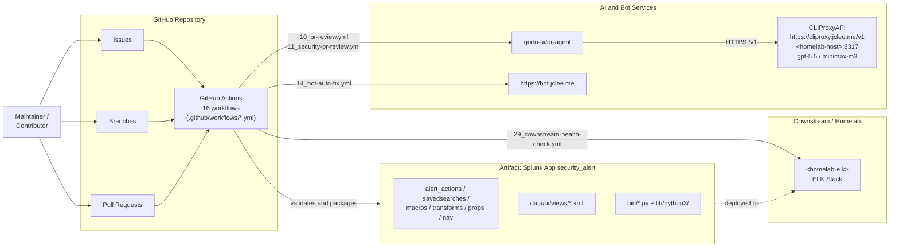

# Security Alert Splunk App & GitHub Automation

[](#automation-inventory--자동화-인벤토리)
[](#overview--개요)
[](https://cliproxy.jclee.me)
[](https://github.com/qodo-ai/pr-agent)
[](./LICENSE)
[](#automation-inventory--자동화-인벤토리)

> **English | 한국어**
> This README is published in a bilingual format. Each major section contains both English and Korean explanations so contributors can navigate the system in either language.
> 본 README는 영문/한글 이중 언어로 작성되었습니다. 각 주요 섹션은 영어와 한국어 설명을 함께 제공하여 두 언어 모두로 시스템을 파악할 수 있도록 구성되어 있습니다.

---

## Table of Contents | 목차

- [Overview | 개요](#overview--개요)
- [Features | 주요 기능](#features--주요-기능)
- [Architecture | 아키텍처](#architecture--아키텍처)
- [Automation Inventory | 자동화 인벤토리](#automation-inventory--자동화-인벤토리)
- [Repository Structure | 저장소 구조](#repository-structure--저장소-구조)
- [Quick Start | 빠른 시작](#quick-start--빠른-시작)
- [Local Development | 로컬 개발](#local-development--로컬-개발)
- [Commands Reference | 명령어 참조](#commands-reference--명령어-참조)
- [Contribution Guide | 기여 가이드](#contribution-guide--기여-가이드)

---

## Overview | 개요

### English

This repository hosts two tightly coupled artifacts:

1. **`security_alert/`** — a Splunk application packaged in the standard Splunk App directory layout. It includes alert actions, dashboards, saved searches, macros, transforms, navigation XML, helper Python scripts under `bin/`, and a vendored Python 3 runtime under `lib/python3/` (covering `urllib3`, `charset_normalizer`, and `idna`).
2. **`.github/workflows/`** — a 16-workfile GitHub Actions automation layer that drives the full repository lifecycle: issue-to-branch conversion, AI-powered PR review (including a security-specialized variant), Dependabot and standard auto-merge, automated bot fixes, merged-PR cleanup, release notes, release publishing, downstream health checks, CI failure issue creation, CI auto-heal, and issue classification.

Operational documentation lives under `docs/` (DEPLOYMENT, QUICK-START, RELEASE-NOTES, LEGACY-CLEANUP-REPORT, ALERT-REPOSITORY-XWIKI) and `resume/` (API, ARCHITECTURE, DEPLOYMENT, TROUBLESHOOTING). A small `demo/` directory provides usage examples.

The README itself is generated by a primary `gpt-5.5` model with a `minimax-m3` fallback routed through the local CLIProxyAPI at `https://cliproxy.jclee.me/v1` (and `<homelab-host>:8317` on the internal network).

### 한국어

이 저장소는 두 가지 핵심 산출물을 함께 제공합니다.

1. **`security_alert/`** — 표준 Splunk 앱 디렉터리 구조로 패키징된 Splunk 애플리케이션입니다. `alert_actions.conf`, 대시보드, 저장된 검색(saved searches), 매크로, transforms, 네비게이션 XML, `bin/` 하위의 헬퍼 Python 스크립트, 그리고 `lib/python3/`에 번들된 Python 3 런타임(`urllib3`, `charset_normalizer`, `idna` 포함)을 포함합니다.
2. **`.github/workflows/`** — 16개의 GitHub Actions 워크플로우로 구성된 자동화 계층입니다. 이슈 → 브랜치 변환, AI 기반 PR 리뷰(보안 전용 변형 포함), Dependabot 및 일반 자동 머지, 봇 자동 수정, 머지된 PR 정리, 릴리스 노트, 릴리스 게시, 다운스트림 헬스 체크, CI 실패 이슈 생성, CI 자동 복구, 이슈 분류 등 전체 저장소 라이프사이클을 다룹니다.

운영 문서는 `docs/` (DEPLOYMENT, QUICK-START, RELEASE-NOTES, LEGACY-CLEANUP-REPORT, ALERT-REPOSITORY-XWIKI) 및 `resume/` (API, ARCHITECTURE, DEPLOYMENT, TROUBLESHOOTING)에 정리되어 있으며, `demo/`에는 사용 예제가 포함되어 있습니다.

본 README는 `gpt-5.5` 모델을 주 모델로 사용하고, 로컬 CLIProxyAPI(`https://cliproxy.jclee.me/v1`, 내부망에서는 `<homelab-host>:8317`)를 통해 라우팅되는 `minimax-m3`를 보조(fallback) 모델로 사용합니다.

---

## Features | 주요 기능

### English

- **16 production GitHub Actions workflows** organized by numeric prefix (`01_` through `91_`, plus `ci.yml`).
- **AI-assisted code review** powered by `qodo-ai/pr-agent` against a local LLM proxy.
- **Security-specialized PR review** as a separate workflow for higher-risk changes.
- **Dependabot + standard auto-merge** with policy gates.
- **Bot auto-fix** that posts patches back to PRs.
- **CI auto-heal** that detects common failure patterns and retries/repairs.
- **Issue classification** that labels new issues on open.
- **Downstream health checks** against the homelab ELK stack.
- **Release automation** with auto-generated notes and publishing.
- **Splunk app packaging** with bundled Python runtime — no host Python required at install time.

### 한국어

- **`01_` ~ `91_` 접두사와 `ci.yml`로 구성된 16개의 프로덕션 GitHub Actions 워크플로우** 운영.
- **로컬 LLM 프록시 기반 AI 코드 리뷰** (`qodo-ai/pr-agent` 활용).
- **보안 특화 PR 리뷰** 워크플로우를 별도 제공하여 고위험 변경에 대응.
- **정책 게이트가 적용된 Dependabot + 일반 자동 머지** 지원.
- PR에 패치를 자동 게시하는 **봇 자동 수정(Bot auto-fix)** 기능.
- 일반적인 실패 패턴을 감지하고 재시도/복구하는 **CI 자동 복구(CI auto-heal)** 기능.
- 신규 이슈 발생 시 자동으로 라벨링하는 **이슈 분류(Issue classification)** 기능.
- 홈랩 ELK 스택을 대상으로 한 **다운스트림 헬스 체크**.
- 자동 생성 노트와 게시를 포함한 **릴리스 자동화**.
- **번들된 Python 런타임을 포함한 Splunk 앱 패키징**으로 설치 시 호스트 Python 의존성 제거.

---

## Architecture | 아키텍처

### English

The repository is a layered system: a maintainer interacts with GitHub (issues, branches, pull requests); GitHub Actions orchestrates 16 workflows; those workflows call external AI/bot services (`qodo-ai/pr-agent`, CLIProxyAPI, the bot endpoint) and validate the Splunk app artifact; the app is deployed downstream to the homelab ELK stack which is then periodically health-checked.

### 한국어

이 저장소는 계층화된 시스템입니다. 메인테이너가 GitHub(이슈, 브랜치, PR)에서 활동하고, GitHub Actions가 16개의 워크플로우를 오케스트레이션합니다. 워크플로우는 외부 AI/봇 서비스(`qodo-ai/pr-agent`, CLIProxyAPI, bot 엔드포인트)를 호출하고 Splunk 앱 산출물을 검증한 뒤, 해당 앱을 홈랩 ELK 스택에 배포하고 주기적으로 헬스 체크를 수행합니다.



> **Mermaid rendering note | 렌더링 참고**
> Labels containing angle brackets (e.g. `&lt;homelab-host&gt;`, `&lt;homelab-elk&gt;`) are quoted strings with HTML-escaped brackets. This is required for GitHub's Mermaid renderer to display them correctly. A bare `<` inside a label forces GitHub to render the whole block as raw text.
> 꺾쇠 괄호(`<homelab-host>`, `<homelab-elk>`)가 포함된 라벨은 HTML 엔티티로 이스케이프된 따옴표 문자열로 작성되었습니다. 이는 GitHub의 Mermaid 렌더러가 정상적으로 출력하도록 요구되는 형식입니다. 라벨 내부에 이스케이프되지 않은 `<`가 포함되면 전체 블록이 코드 텍스트로 렌더링됩니다.

---

## Automation Inventory | 자동화 인벤토리

### Workflows | 워크플로우 (16 total)

All workflow files live under `.github/workflows/`. The numeric prefix is part of the real on-disk file name and reflects execution order / responsibility grouping.

모든 워크플로우 파일은 `.github/workflows/` 아래에 위치하며, 숫자 접두사는 실제 파일명의 일부이며 실행 순서와 책임 그룹을 나타냅니다.

| # | File | Trigger | Purpose (EN) | 목적 (KR) |
|---|------|---------|--------------|-----------|
| 01 | `01_branch-to-pr.yml` | push to non-protected branch | Open a PR from a feature branch | 기능 브랜치에서 PR 열기 |
| 02 | `02_issue-to-branch.yml` | issue opened or labeled | Create a working branch from an issue | 이슈로부터 작업 브랜치 생성 |
| 10 | `10_pr-review.yml` | PR opened / synchronized / reopened | AI code review via PR-Agent | PR-Agent 기반 AI 코드 리뷰 |
| 11 | `11_security-pr-review.yml` | PR opened / synchronized / reopened | Security-focused review variant | 보안 특화 리뷰 변형 |
| 12 | `12_dependabot-auto-merge.yml` | Dependabot PR | Auto-merge Dependabot PRs after policy checks | 정책 검증 후 Dependabot PR 자동 머지 |
| 13 | `13_pr-auto-merge.yml` | label applied (`automerge`) | Auto-merge approved PRs | 승인된 PR 자동 머지 |
| 14 | `14_bot-auto-fix.yml` | review/comment events | Bot posts automated patches back to the PR | 봇이 자동 패치를 PR에 게시 |
| 15 | `15_merged-pr-cleanup.yml` | PR closed (merged) | Delete branch, tidy references, close linked issues | 브랜치 삭제, 참조 정리, 연결된 이슈 종료 |
| 19 | `19_issue-backfill.yml` | schedule / manual dispatch | Backfill missing metadata on legacy issues | 기존 이슈의 누락 메타데이터 보강 |
| 24 | `24_release-notes.yml` | tag push / release event | Aggregate changelog into release notes | 변경 로그를 릴리스 노트로 집계 |
| 25 | `25_release-publish.yml` | release published | Build and publish the packaged Splunk app | Splunk 앱 패키지를 빌드 및 게시 |
| 29 | `29_downstream-health-check.yml` | schedule / manual | Probe downstream `<homelab-elk>` and related services | 다운스트림 `<homelab-elk>` 및 관련 서비스 점검 |
| 37 | `37_ci-failure-issues.yml` | CI workflow failure | File an issue capturing the failing run | 실패한 CI 실행 정보를 이슈로 기록 |
| 60 | `60_ci-auto-heal.yml` | CI failure pattern detected | Retry transient failures / apply known fixes | 일시적 실패 재시도 / 알려진 수정 적용 |
| 91 | `91_issue-classification.yml` | issue opened | Apply labels and route to the right owner | 라벨 적용 및 적절한 담당자 라우팅 |
| — | `ci.yml` | push / pull_request | Main CI: lint, test, package validation | 메인 CI: 린트, 테스트, 패키지 검증 |

### Go Automation Tools | Go 자동화 도구 (0 total)

There are currently **no Go-based automation tools** in this repository. All automation is implemented either as GitHub Actions workflow files (`.github/workflows/*.yml`) or, for in-Splunk work, as Python scripts in `security_alert/bin/`.

현재 이 저장소에는 **Go 기반 자동화 도구가 없습니다.** 모든 자동화는 GitHub Actions 워크플로우 파일(`.github/workflows/*.yml`) 또는 Splunk 내부용 Python 스크립트(`security_alert/bin/`)로 구현되어 있습니다.

### External Service Endpoints | 외부 서비스 엔드포인트

| Service | Purpose | Endpoint |
|---------|---------|----------|
| `qodo-ai/pr-agent` | AI code review | `https://github.com/qodo-ai/pr-agent` |
| CLIProxyAPI (public) | LLM routing for README gen and review | `https://cliproxy.jclee.me/v1` |
| CLIProxyAPI (internal) | Same service on the homelab network | `<homelab-host>:8317` |
| Bot service | Auto-fix endpoint | `https://bot.jclee.me` |

### Model Routing | 모델 라우팅

- **README generation primary model**: `gpt-5.5`
- **README generation fallback model**: `minimax-m3` (routed through CLIProxyAPI)
- **PR review model**: delegated to `qodo-ai/pr-agent` configuration, which calls CLIProxyAPI

- **README 생성 주 모델**: `gpt-5.5`
- **README 생성 보조 모델**: `minimax-m3` (CLIProxyAPI 경유)
- **PR 리뷰 모델**: `qodo-ai/pr-agent` 설정에 위임되며, CLIProxyAPI를 호출

---

## Repository Structure | 저장소 구조

The tree below reflects the actual on-disk top-level layout. Workflow files are listed for clarity, and the `security_alert/` tree is summarized (the Python runtime under `lib/python3/` is large and is described, not enumerated, here).

아래 트리는 실제 디스크 상의 최상위 구조를 그대로 반영합니다. 워크플로우 파일은 명확성을 위해 별도 표기하였으며, `security_alert/` 트리는 요약되었습니다(`lib/python3/` 하위 런타임은 파일 수가 많아 본문에서 설명합니다).

```
.
├── CONTRIBUTING.md              # Contribution rules and PR conventions
├── LICENSE                      # Project license
├── README.md                    # This file
├── .github/
│   └── workflows/               # 16 GitHub Actions workflow files
│       ├── 01_branch-to-pr.yml
│       ├── 02_issue-to-branch.yml
│       ├── 10_pr-review.yml
│       ├── 11_security-pr-review.yml
│       ├── 12_dependabot-auto-merge.yml
│       ├── 13_pr-auto-merge.yml
│       ├── 14_bot-auto-fix.yml
│       ├── 15_merged-pr-cleanup.yml
│       ├── 19_issue-backfill.yml
│       ├── 24_release-notes.yml
│       ├── 25_release-publish.yml
│       ├── 29_downstream-health-check.yml
│       ├── 37_ci-failure-issues.yml
│       ├── 60_ci-auto-heal.yml
│       ├── 91_issue-classification.yml
│       └── ci.yml
├── resume/                      # Operational resume-style docs
│   ├── API.md
│   ├── ARCHITECTURE.md
│   ├── DEPLOYMENT.md
│   └── TROUBLESHOOTING.md
├── docs/                        # Project documentation
│   ├── ALERT-REPOSITORY-XWIKI.md
│   ├── DEPLOYMENT.md
│   ├── LEGACY-CLEANUP-REPORT.md
│   ├── QUICK-START.md
│   └── RELEASE-NOTES.md
├── demo/                        # Usage examples
│   └── README.md
└── security_alert/              # Splunk app (standard Splunk App layout)
    ├── app.manifest
    ├── README.md
    ├── bin/                     # Helper scripts run by Splunk
    │   ├── safe_fmt.py
    │   ├── six.py
    │   └── slack.py
    ├── metadata/
    │   └── default.meta
    ├── default/                 # Splunk .conf files
    │   ├── alert_actions.conf
    │   ├── app.conf
    │   ├── macros.conf
    │   ├── props.conf
    │   ├── savedsearches.conf
    │   └── transforms.conf
    ├── data/ui/
    │   ├── nav/default.xml
    │   └── views/               # XML dashboards
    │       ├── alert-builder.xml
    │       ├── alert-management-dashboard.xml
    │       ├── data-explorer-dashboard.xml
    │       └── easy_alert_builder.xml
    └── lib/python3/             # Vendored Python 3 runtime
        ├── urllib3/             # HTTP client with submodules
        ├── charset_normalizer-3.4.4.dist-info/
        └── idna-3.11.dist-info/
```

---

## Quick Start | 빠른 시작

### English

1. **Install the Splunk app** by copying `security_alert/` into `$SPLUNK_HOME/etc/apps/security_alert/`, then restart Splunk:
   ```bash
   cp -R security_alert/ "$SPLUNK_HOME/etc/apps/security_alert/"
   "$SPLUNK_HOME/bin/splunk" restart
   ```
2. **Enable the GitHub automation** by ensuring `.github/workflows/*.yml` is present in your fork. Configure the following repository secrets:
   - `OPENAI_API_KEY` *or* an internal proxy token (for PR-Agent / CLIProxyAPI)
   - `BOT_TOKEN` (for the bot service at `https://bot.jclee.me`)
   - `GITHUB_TOKEN` is provided automatically by GitHub Actions
3. **Open an issue** with the `enhancement` or `bug` label. `02_issue-to-branch.yml` will scaffold a working branch.
4. **Push the branch**. `01_branch-to-pr.yml` opens a PR; `10_pr-review.yml` and `11_security-pr-review.yml` review it.
5. **Label the PR with `automerge`** (after approval) to trigger `13_pr-auto-merge.yml`.

### 한국어

1. **Splunk 앱 설치** — `security_alert/` 디렉터리를 `$SPLUNK_HOME/etc/apps/security_alert/`로 복사한 뒤 Splunk를 재기동합니다.
2. **GitHub 자동화 활성화** — 포크한 저장소에 `.github/workflows/*.yml`이 모두 포함되어 있는지 확인하고, 저장소 Secrets에 다음 값을 등록합니다.
   - `OPENAI_API_KEY` 또는 내부 프록시 토큰 (PR-Agent / CLIProxyAPI 용)
   - `BOT_TOKEN` (`https://bot.jclee.me` 봇 서비스 용)
   - `GITHUB_TOKEN`은 GitHub Actions에서 자동 제공됩니다.
3. **이슈 열기** — `enhancement` 또는 `bug` 라벨을 붙여 이슈를 생성하면 `02_issue-to-branch.yml`이 작업 브랜치를 생성합니다.
4. **브랜치 푸시** — `01_branch-to-pr.yml`이 PR을 열고, `10_pr-review.yml`과 `11_security-pr-review.yml`이 리뷰를 수행합니다.
5. **자동 머지** — 승인된 PR에 `automerge` 라벨을 붙이면 `13_pr-auto-merge.yml`이 자동 머지를 실행합니다.

---

## Local Development | 로컬 개발

### English

- **Splunk side**: use a non-production Splunk instance (Splunk Enterprise or Splunk Cloud dev tenant). Symlink `security_alert/` into `$SPLUNK_HOME/etc/apps/` and reload:
  ```bash
  ln -s "$(pwd)/security_alert" "$SPLUNK_HOME/etc/apps/security_alert"
  "$SPLUNK_HOME/bin/splunk" reload app=security_alert
  ```
- **Python scripts in `bin/`** are executed by Splunk's bundled Python 3 runtime. If you want to lint or type-check locally, point your toolchain at the matching interpreter version, but do not modify files under `lib/python3/`.
- **Workflows**: validate YAML with `actionlint` and run individual workflows via `act` against a local Docker runner where possible.
- **PR-Agent configuration**: PR-Agent reads its config from `.pr_agent.toml` (or environment variables). Point it at CLIProxyAPI (`https://cliproxy.jclee.me/v1`) for the public endpoint or `<homelab-host>:8317` on the internal network.

### 한국어

- **Splunk 쪽**: 비운영 Splunk 인스턴스(Splunk Enterprise 또는 Splunk Cloud 개발 테넌트)를 사용합니다. `security_alert/`를 심볼릭 링크로 등록하고 리로드합니다.
- **`bin/`의 Python 스크립트**는 Splunk 번들 Python 3 런타임에서 실행됩니다. 로컬에서 린트/타입체크를 하려면 동일 버전 인터프리터를 지정하되, `lib/python3/` 하위 파일은 수정하지 마십시오.
- **워크플로우**: `actionlint`로 YAML을 검증하고, 가능하면 `act`로 개별 워크플로우를 로컬 Docker 러너에서 실행해 봅니다.
- **PR-Agent 설정**: PR-Agent는 `.pr_agent.toml`(또는 환경 변수)에서 설정을 읽습니다. 공개 엔드포인트는 `https://cliproxy.jclee.me/v1`, 내부망은 `<homelab-host>:8317`을 사용합니다.

---

## Commands Reference | 명령어 참조

### English

| Area | Command | Notes |
|------|---------|-------|
| Install Splunk app | `cp -R security_alert/ "$SPLUNK_HOME/etc/apps/security_alert/"` | then restart Splunk |
| Reload app | `"$SPLUNK_HOME/bin/splunk" reload app=security_alert` | faster than full restart |
| Validate workflows | `actionlint .github/workflows/*.yml` | static lint |
| Run workflow locally | `act -j <job> -W .github/workflows/<file>.yml` | requires Docker |
| Manual health check | Actions tab → `29_downstream-health-check.yml` → Run workflow | probes `<homelab-elk>` |
| Manual release | Actions tab → `25_release-publish.yml` → Run workflow | publishes Splunk app |
| Manual backfill | Actions tab → `19_issue-backfill.yml` → Run workflow | backfills issue metadata |
| Trigger PR review | comment `/review` on a PR | delegated to PR-Agent |
| Trigger security review | comment `/security_review` on a PR | delegated to `11_security-pr-review.yml` |
| Auto-fix request | comment `/improve` on a PR | delegated to `14_bot-auto-fix.yml` |

### 한국어

| 영역 | 명령 | 비고 |
|------|------|------|
| Splunk 앱 설치 | `cp -R security_alert/ "$SPLUNK_HOME/etc/apps/security_alert/"` | 설치 후 Splunk 재기동 |
| 앱 리로드 | `"$SPLUNK_HOME/bin/splunk" reload app=security_alert` | 전체 재기동보다 빠름 |
| 워크플로우 검증 | `actionlint .github/workflows/*.yml` | 정적 린트 |
| 로컬 워크플로우 실행 | `act -j <job> -W .github/workflows/<file>.yml` | Docker 필요 |
| 수동 헬스 체크 | Actions 탭 → `29_downstream-health-check.yml` → Run workflow | `<homelab-elk>` 점검 |
| 수동 릴리스 | Actions 탭 → `25_release-publish.yml` → Run workflow | Splunk 앱 게시 |
| 수동 백필 | Actions 탭 → `19_issue-backfill.yml` → Run workflow | 이슈 메타데이터 보강 |
| PR 리뷰 트리거 | PR에 `/review` 코멘트 | PR-Agent에 위임 |
| 보안 리뷰 트리거 | PR에 `/security_review` 코멘트 | `11_security-pr-review.yml`에 위임 |
| 자동 수정 요청 | PR에 `/improve` 코멘트 | `14_bot-auto-fix.yml`에 위임 |

---

## Contribution Guide | 기여 가이드

### English

1. **Open or pick an issue** and apply the appropriate label. `91_issue-classification.yml` will assist with labeling if you leave it untagged.
2. **Let `02_issue-to-branch.yml` create a branch** (or branch off `main` manually if the issue predates the workflow).
3. **Implement the change**:
   - Splunk-side changes go under `security_alert/` following the standard Splunk App layout.
   - Workflow changes go under `.github/workflows/`. Preserve the numeric prefix convention; never strip it.
   - Python changes inside `bin/` must remain compatible with the vendored runtime in `lib/python3/`.
4. **Open a PR**. `10_pr-review.yml` and `11_security-pr-review.yml` will run automatically.
5. **Address review feedback**. If a bot posts a patch via `14_bot-auto-fix.yml`, review it before merging.
6. **Merge**. Either use `13_pr-auto-merge.yml` (with the `automerge` label) or merge manually. `15_merged-pr-cleanup.yml` will tidy up.
7. **Release**: when ready, push a tag. `24_release-notes.yml` and `25_release-publish.yml` will handle the rest.

### 한국어

1. **이슈를 열거나 선택**하고 적절한 라벨을 부여합니다. 라벨을 지정하지 않은 채 두면 `91_issue-classification.yml`이 분류를 보조합니다.
2. **`02_issue-to-branch.yml`이 브랜치를 만들도록 둡니다**(또는 워크플로우 도입 이전 이슈라면 `main`에서 수동 분기).
3. **변경 사항 구현**:
   - Splunk 측 변경은 표준 Splunk 앱 레이아웃에 맞춰 `security_alert/` 하위에 작성합니다.
   - 워크플로우 변경은 `.github/workflows/` 하위에 작성하며, 숫자 접두사 규약을 유지하고 절대 제거하지 않습니다.
   - `bin/`의 Python 변경은 `lib/python3/` 번들 런타임과 호환되어야 합니다.
4. **PR을 엽니다**. `10_pr-review.yml`과 `11_security-pr-review.yml`이 자동 실행됩니다.
5. **리뷰 피드백 반영**. `14_bot-auto-fix.yml`이 패치를 게시한 경우 머지 전 반드시 검토합니다.
6. **머지**. `automerge` 라벨을 사용해 `13_pr-auto-merge.yml`로 자동 머지하거나 수동으로 머지합니다. `15_merged-pr-cleanup.yml`이 정리를 수행합니다.
7. **릴리스**: 준비가 되면 태그를 푸시합니다. `24_release-notes.yml`과 `25_release-publish.yml`이 나머지를 처리합니다.

### Code of Conduct | 행동 강령

Be respectful in issues and PRs. All CI checks, AI reviews, and security scans must pass before merge. The maintainers reserve the right to use `13_pr-auto-merge.yml` to bypass manual review only for low-risk, pre-approved categories (e.g. Dependabot patch updates via `12_dependabot-auto-merge.yml`).

이슈와 PR에서는 서로를 존중해 주십시오. 머지 전에 모든 CI 검사, AI 리뷰, 보안 스캔을 통과해야 합니다. 메인테이너는 저위험·사전 승인 카테고리(예: `12_dependabot-auto-merge.yml`을 통한 Dependabot 패치 업데이트)에 한해 `13_pr-auto-merge.yml`로 수동 리뷰를 생략할 수 있는 권한을 가집니다.