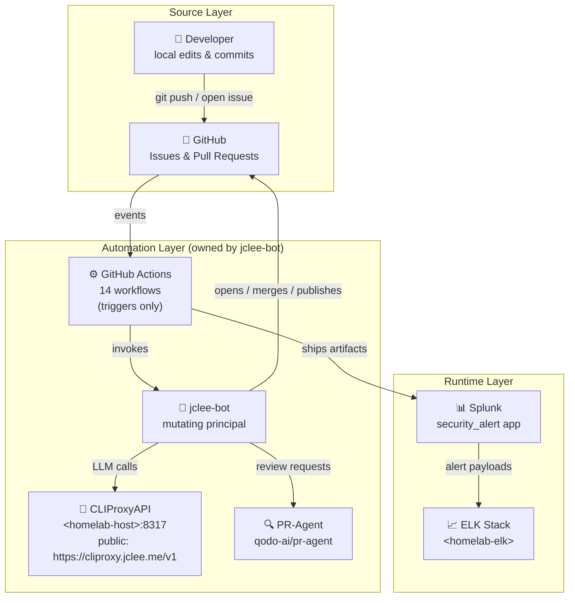

# Security Alert Splunk App & GitHub Automation

[](#automation-inventory--%EC%9E%90%EB%8F%99%ED%99%94-%EC%9D%B8%EB%B2%84%EC%A0%80%EB%A6%AC)
[](#overview--%EA%B0%9C%EC%9A%94)
[](https://cliproxy.jclee.me)
[](https://github.com/qodo-ai/pr-agent)
[](#automation-surfaces-owned-by-jclee-bot--jclee-bot%EA%B0%80-%EC%86%8C%EC%9C%A0%ED%95%98%EB%8A%94-%EC%9E%90%EB%8F%99%ED%99%94-%EC%84%B8%EB%B0%80%EC%A0%81)
[](./LICENSE)
[](#automation-inventory--%EC%9E%90%EB%8F%99%ED%99%94-%EC%9D%B8%EB%B2%84%EC%A0%80%EB%A6%AC)
[](#automation-inventory--%EC%9E%90%EB%8F%99%ED%99%94-%EC%9D%B8%EB%B2%84%EC%A0%80%EB%A6%AC)

> **English | 한국어**
> This README is published in a bilingual format. Each major section contains both English and Korean explanations so contributors can navigate the system in either language.
> 본 README는 영문/한글 이중 언어로 작성되었습니다. 각 주요 섹션은 영어와 한국어 설명을 함께 제공하여 두 언어 모두로 시스템을 파악할 수 있도록 구성되어 있습니다.

---

## Table of Contents | 목차

- [Overview | 개요](#overview--%EA%B0%9C%EC%9A%94)
- [Features | 주요 기능](#features--%EC%A3%BC%EC%9A%94-%EA%B8%B0%EB%8A%A5)
- [Architecture | 아키텍처](#architecture--%EC%95%84%ED%82%A4%ED%85%8D%EC%B2%98)
- [Automation Inventory | 자동화 인벤토리](#automation-inventory--%EC%9E%90%EB%8F%99%ED%99%94-%EC%9D%B8%EB%B2%84%EC%A0%80%EB%A6%AC)
- [Automation Surfaces Owned by jclee-bot | jclee-bot가 소유하는 자동화 세대적](#automation-surfaces-owned-by-jclee-bot--jclee-bot%EA%B0%80-%EC%86%8C%EC%9C%A0%ED%95%98%EB%8A%94-%EC%9E%90%EB%8F%99%ED%99%94-%EC%84%B8%EB%8C%80%EC%A0%81)
- [Go Automation Tools | Go 자동화 도구](#go-automation-tools--go-%EC%9E%90%EB%8F%99%ED%99%94-%EB%8F%84%EA%B5%AC)
- [Repository Structure | 저장소 구조](#repository-structure--%EC%A0%80%EC%9E%A5%EC%86%8C-%EA%B5%AC%EC%A1%B0)
- [Quick Start | 빠른 시작](#quick-start--%EB%B9%A0%EB%A5%B8-%EC%8B%9C%EC%9E%91)
- [Local Development | 로컬 개발](#local-development--%EB%A1%9C%EC%BB%AC-%EA%B0%9C%EB%B0%9C)
- [Commands Reference | 명령어 참조](#commands-reference--%EB%AA%85%EB%A0%B9%EC%96%B4-%EC%B0%B8%EC%A1%B0)
- [Contribution Guide | 기여 가이드](#contribution-guide--%EA%B8%B0%EC%97%AC-%EA%B0%80%EC%9D%B4%EB%93%9C)

---

## Overview | 개요

### English

This repository hosts two tightly coupled artifacts:

1. **`security_alert/`** — a Splunk application packaged in the standard Splunk App directory layout. It contains alert actions, configuration (`app.conf`, `alert_actions.conf`, `macros.conf`, `props.conf`, `transforms.conf`, `savedsearches.conf`), a custom view layer (XML dashboards under `default/data/ui/views/`), and a vendored Python runtime (`lib/python3/` carrying `urllib3`, `idna`, and `charset_normalizer`).
2. **GitHub automation surfaces** — a curated set of fourteen GitHub Actions workflows plus automation-owned mutating behavior driven by **`jclee-bot`**. The bot is the only principal that opens branches from issues, opens PRs from branches, edits issue/PR metadata, merges PRs, publishes releases, and triages CI failures.

The two artifacts are intentionally co-located so that changes to the Splunk app (for example, a new saved search) can be shipped through the same automation pipeline that handles code review, security review, dependency bumps, and release publishing.

### 한국어

이 저장소는 밀접하게 결합된 두 가지 산출물을 함께 제공합니다.

1. **`security_alert/`** — 표준 Splunk App 디렉터리 레이아웃으로 패키징된 Splunk 애플리케이션입니다. 알림 액션, 설정 파일(`app.conf`, `alert_actions.conf`, `macros.conf`, `props.conf`, `transforms.conf`, `savedsearches.conf`), 커스텀 뷰 레이어(`default/data/ui/views/` 하위의 XML 대시보드), 그리고 벤더링된 Python 런타임(`lib/python3/` 디렉터리의 `urllib3`, `idna`, `charset_normalizer`)을 포함합니다.
2. **GitHub 자동화 세대적** — 신중하게 구성된 14개의 GitHub Actions 워크플로우와 **`jclee-bot`** 이 주도하는 자동화 소유 변형(mutating) 행동을 포함합니다. `jclee-bot`은 이슈로부터 브랜치를 열고, 브랜치로부터 PR을 열고, 이슈/PR 메타데이터를 편집하며, PR을 병합하고, 릴리스를 게시하고, CI 실패를 분류(triage)하는 유일한 주체입니다.

두 산출물은 의도적으로 같은 저장소에 공존합니다. 예를 들어 새로운 saved search가 추가될 때 Splunk 앱 변경을 코드 리뷰, 보안 리뷰, 의존성 업데이트, 릴리스 게시를 모두 처리하는 동일한 자동화 파이프라인을 통해 출시할 수 있도록 하기 위함입니다.

---

## Features | 주요 기능

### English

**Splunk App (`security_alert/`)**

- Pre-built alert action targets with payload templating in `alert_actions.conf`.
- Curated saved searches in `savedsearches.conf` that power the dashboards in `default/data/ui/views/`.
- Custom navigation entry (`default/data/ui/nav/default.xml`) so the app integrates cleanly into Splunk Web.
- Field transformations and indexing rules defined in `transforms.conf` and `props.conf`.
- Vendored Python runtime under `lib/python3/` so the app remains self-contained when deployed in air-gapped Splunk instances.

**GitHub Automation**

- Issue-to-branch and branch-to-PR lifecycle, owned by `jclee-bot`.
- General PR review and dedicated security-focused PR review, both backed by `qodo-ai/pr-agent` and routed through `CLIProxyAPI`.
- Auto-merge lanes for Dependabot and for trusted PRs, with safety checks.
- Auto-fix lane that lets the bot push commits to its own PRs.
- Post-merge cleanup that retires ephemeral branches.
- Issue backfill to keep the issue tracker healthy.
- Release-notes generation and release publishing.
- Downstream health check and CI-failure issue creation.
- The exact behavior marker used by issue automation is `jclee-bot에의해자동화됨`.

### 한국어

**Splunk App (`security_alert/`)**

- `alert_actions.conf`에 페이로드 템플릿이 포함된 사전 빌드된 알림 액션 타깃.
- `default/data/ui/views/` 하위 대시보드를 구동하는 `savedsearches.conf`의 큐레이션된 saved search.
- Splunk Web에 자연스럽게 통합되도록 하는 커스텀 네비게이션 엔트리(`default/data/ui/nav/default.xml`).
- `transforms.conf`와 `props.conf`에 정의된 필드 변환 및 인덱싱 규칙.
- 에어갭 Splunk 인스턴스에 배포되더라도 자체 완결성을 유지하도록 `lib/python3/` 하위에 벤더링된 Python 런타임.

**GitHub 자동화**

- `jclee-bot`이 소유한 이슈-브랜치 및 브랜치-PR 라이프사이클.
- `qodo-ai/pr-agent`를 백엔드로 사용하고 `CLIProxyAPI`를 통해 라우팅되는 일반 PR 리뷰와 전용 보안 PR 리뷰.
- Dependabot과 신뢰할 수 있는 PR을 위한 자동 병합 레인(안전 검사 포함).
- 봇이 자신의 PR에 커밋을 푸시할 수 있는 자동 수정 레인.
- 임시 브랜치를 정리하는 병합 후 정리 단계.
- 이슈 트래커를 건강하게 유지하기 위한 이슈 백필(backfill).
- 릴리스 노트 생성 및 릴리스 게시.
- 다운스트림 헬스 체크 및 CI 실패 이슈 생성.
- 이슈 자동화 동작에 사용되는 정확한 마커는 `jclee-bot에의해자동화됨` 입니다.

---

## Architecture | 아키텍처

### English

The diagram below shows the source layer (developer + GitHub), the automation layer (where `jclee-bot` is the mutating owner, with `CLIProxyAPI` and `qodo-ai/pr-agent` as supporting services), and the runtime layer (Splunk and the downstream ELK stack). The `<homelab-host>` and `<homelab-elk>` placeholders represent private infrastructure addresses that are intentionally not hardcoded; the public LLM-proxy endpoint is `https://cliproxy.jclee.me/v1`.

### 한국어

아래 다이어그램은 소스 레이어(개발자 + GitHub), 자동화 레이어(`jclee-bot`이 변형 소유자이고 `CLIProxyAPI`와 `qodo-ai/pr-agent`가 지원 서비스), 런타임 레이어(Splunk 및 다운스트림 ELK 스택)를 보여줍니다. `<homelab-host>`와 `<homelab-elk>` 플레이스홀더는 의도적으로 하드코딩하지 않은 사설 인프라 주소를 나타내며, 공개 LLM 프록시 엔드포인트는 `https://cliproxy.jclee.me/v1` 입니다.



---

## Automation Inventory | 자동화 인벤토리

### English

This repository contains **fourteen GitHub Actions workflow files** under `.github/workflows/`. They are **implementation triggers** — the source of truth for mutating behavior is the automation principal described in the next section, not the workflow files themselves. Per project convention, workflow files are deliberately **not** rendered as a table or list of linked rows; consult the file headers and the in-repo `docs/RELEASE-NOTES.md` for the authoritative change log.

**README generation model:** `gpt-5.5` primary, `minimax-m3` fallback routed through `CLIProxyAPI`.

### 한국어

이 저장소에는 `.github/workflows/` 하위에 **14개의 GitHub Actions 워크플로우 파일**이 있습니다. 이 파일들은 **구현 트리거**일 뿐이며, 변형(mutating) 동작의 진실 원천(source of truth)은 다음 섹션에서 설명하는 자동화 주체이며 워크플로우 파일 자체가 아닙니다. 프로젝트 컨벤션에 따라 워크플로우 파일은 의도적으로 표나 링크된 행 목록으로 렌더링하지 않습니다. 권위 있는 변경 로그는 파일 헤더와 저장소 내 `docs/RELEASE-NOTES.md`를 참조하십시오.

**README 생성 모델:** `gpt-5.5` 1차, `minimax-m3` 폴백(`CLIProxyAPI`를 통해 라우팅).

---

## Automation Surfaces Owned by jclee-bot | jclee-bot가 소유하는 자동화 세대적

### English

`jclee-bot` is the **only** principal authorized to perform mutating actions in this repository. The surfaces below describe capabilities and behaviors, not implementation files.

| Surface | Behavior | jclee-bot role |
|---|---|---|
| Branch creation from an issue | `jclee-bot` opens a feature branch named after the issue and seeds it with the relevant Splunk-app scaffolding. | Sole writer |
| PR opening from a branch | `jclee-bot` opens a pull request that references the originating issue and applies the `jclee-bot에의해자동화됨` marker. | Sole writer |
| PR review (general) | `jclee-bot` requests a review from `qodo-ai/pr-agent` through `CLIProxyAPI` and posts the result back on the PR. | Sole invoker |
| PR review (security) | `jclee-bot` requests a security-focused review from `qodo-ai/pr-agent` and gates merge on findings. | Sole invoker |
| Dependabot auto-merge | `jclee-bot` merges Dependabot PRs that pass the safety policy. | Sole merger |
| Trusted PR auto-merge | `jclee-bot` merges approved PRs that match the auto-merge policy. | Sole merger |
| Bot auto-fix | `jclee-bot` pushes follow-up commits to its own PRs to address review feedback. | Sole committer |
| Merged-PR cleanup | `jclee-bot` deletes ephemeral branches after a successful merge. | Sole deleter |
| Issue backfill | `jclee-bot` reconciles missing labels, milestones, and project-board state on issues. | Sole writer |
| Release-notes generation | `jclee-bot` aggregates merged PRs into `docs/RELEASE-NOTES.md`. | Sole writer |
| Release publishing | `jclee-bot` cuts the GitHub release and tags the commit. | Sole publisher |
| Downstream health check | `jclee-bot` pings downstream services and records the result. | Sole invoker |
| CI-failure issue creation | `jclee-bot` opens a labeled issue when CI fails, marked with `jclee-bot에의해자동화됨`. | Sole writer |

If a workflow is not listed here, it does not perform a mutating action — it is purely an observer or trigger.

### 한국어

`jclee-bot`은 본 저장소에서 변형(mutating) 동작을 수행할 권한이 있는 **유일한** 주체입니다. 아래 세대적은 구현 파일이 아닌 능력과 동작을 설명합니다.

| 세대적 | 동작 | jclee-bot 역할 |
|---|---|---|
| 이슈에서 브랜치 생성 | `jclee-bot`이 이슈 이름으로 기능 브랜치를 열고 관련 Splunk 앱 스캐폴딩을 시드합니다. | 유일한 작성자 |
| 브랜치에서 PR 열기 | `jclee-bot`이 원본 이슈를 참조하는 풀 리퀘스트를 열고 `jclee-bot에의해자동화됨` 마커를 적용합니다. | 유일한 작성자 |
| PR 리뷰(일반) | `jclee-bot`이 `CLIProxyAPI`를 통해 `qodo-ai/pr-agent`에 리뷰를 요청하고 결과를 PR에 게시합니다. | 유일한 호출자 |
| PR 리뷰(보안) | `jclee-bot`이 `qodo-ai/pr-agent`에 보안 중심 리뷰를 요청하고 결과에 따라 병합을 게이팅합니다. | 유일한 호출자 |
| Dependabot 자동 병합 | `jclee-bot`이 안전 정책을 통과한 Dependabot PR을 병합합니다. | 유일한 병합자 |
| 신뢰할 수 있는 PR 자동 병합 | `jclee-bot`이 자동 병합 정책에 부합하는 승인된 PR을 병합합니다. | 유일한 병합자 |
| 봇 자동 수정 | `jclee-bot`이 리뷰 피드백을 해결하기 위해 자신의 PR에 후속 커밋을 푸시합니다. | 유일한 커미터 |
| 병합된 PR 정리 | `jclee-bot`이 성공적인 병합 이후 임시 브랜치를 삭제합니다. | 유일한 삭제자 |
| 이슈 백필 | `jclee-bot`이 이슈의 누락된 라벨, 마일스톤, 프로젝트 보드 상태를 조정합니다. | 유일한 작성자 |
| 릴리스 노트 생성 | `jclee-bot`이 병합된 PR을 `docs/RELEASE-NOTES.md`로 집계합니다. | 유일한 작성자 |
| 릴리스 게시 | `jclee-bot`이 GitHub 릴리스를 발행하고 커밋에 태그를 답니다. | 유일한 게시자 |
| 다운스트림 헬스 체크 | `jclee-bot`이 다운스트림 서비스에 핑을 보내고 결과를 기록합니다. | 유일한 호출자 |
| CI 실패 이슈 생성 | CI 실패 시 `jclee-bot`이 `jclee-bot에의해자동화됨` 마커가 부착된 라벨이 있는 이슈를 엽니다. | 유일한 작성자 |

이 표에 나열되지 않은 워크플로우는 변형 동작을 수행하지 않으며, 순수한 옵저버 또는 트리거입니다.

---

## Go Automation Tools | Go 자동화 도구

### English

This repository contains **zero Go-based automation tools**. The automation layer is implemented entirely in GitHub Actions YAML invoked by `jclee-bot`, with `qodo-ai/pr-agent` and `CLIProxyAPI` (running on the homelab host) as supporting services. There is no `cmd/`, `internal/`, `pkg/`, or `go.mod` in this repository, and no Go binaries are produced from this source tree.

If a future change introduces a Go tool here, it should be added to the `tools/` directory (when created) and documented in this section.

### 한국어

본 저장소에는 **Go 기반 자동화 도구가 0개** 있습니다. 자동화 레이어는 전적으로 `jclee-bot`이 호출하는 GitHub Actions YAML로 구현되며, 지원 서비스는 `qodo-ai/pr-agent`와 (홈랩 호스트에서 실행되는) `CLIProxyAPI`입니다. 이 저장소에는 `cmd/`, `internal/`, `pkg/`, `go.mod`가 없으며, 본 소스 트리에서 생성되는 Go 바이너리도 없습니다.

향후 본 저장소에 Go 도구를 추가하는 경우, `tools/` 디렉터리(생성 시)에 추가하고 본 섹션에 문서화해야 합니다.

---

## Repository Structure | 저장소 구조

### English

The actual top-level layout of this repository is shown below. The `lib/python3/` tree is a vendored Python runtime carried inside the Splunk app, not part of the automation layer. The `resume/`, `docs/`, and `demo/` directories hold human-authored material.

### 한국어

본 저장소의 실제 최상위 레이아웃은 아래와 같습니다. `lib/python3/` 트리는 자동화 레이어의 일부가 아니라 Splunk 앱 내부에 동봉된 벤더링 Python 런타임입니다. `resume/`, `docs/`, `demo/` 디렉터리는 사람이 작성한 자료를 보관합니다.

```text
.
├── CONTRIBUTING.md
├── LICENSE
├── README.md
├── resume/
│   ├── API.md
│   ├── ARCHITECTURE.md
│   ├── DEPLOYMENT.md
│   └── TROUBLESHOOTING.md
├── docs/
│   ├── ALERT-REPOSITORY-XWIKI.md
│   ├── DEPLOYMENT.md
│   ├── LEGACY-CLEANUP-REPORT.md
│   ├── QUICK-START.md
│   └── RELEASE-NOTES.md
├── demo/
│   └── README.md
└── security_alert/
    ├── README.md
    ├── app.manifest
    ├── bin/
    │   ├── safe_fmt.py
    │   ├── six.py
    │   └── slack.py
    ├── metadata/
    │   └── default.meta
    ├── default/
    │   ├── alert_actions.conf
    │   ├── app.conf
    │   ├── macros.conf
    │   ├── props.conf
    │   ├── savedsearches.conf
    │   ├── transforms.conf
    │   └── data/
    │       └── ui/
    │           ├── nav/
    │           │   └── default.xml
    │           └── views/
    │               ├── alert-builder.xml
    │               ├── alert-management-dashboard.xml
    │               ├── data-explorer-dashboard.xml
    │               └── easy_alert_builder.xml
    └── lib/
        └── python3/
            ├── idna-3.11.dist-info/
            ├── urllib3/
            └── charset_normalizer-3.4.4.dist-info/
```

---

## Quick Start | 빠른 시작

### English

**For Splunk administrators (installing the app):**

1. Download or build the `security_alert/` directory as a `.tar.gz` Splunk app bundle.
2. Copy the bundle to `$SPLUNK_HOME/etc/apps/` on the target Splunk instance.
3. Restart Splunk: `splunk restart`.
4. In Splunk Web, navigate to **Settings → Alert actions** and confirm that the `security_alert` actions are registered.
5. (Optional) Wire the app's Slack output to your workspace by editing `bin/slack.py` and providing credentials through a Splunk encrypted credential stanza.

**For automation reviewers and contributors:**

1. Clone the repository and check out a feature branch.
2. Open a pull request; `jclee-bot` will pick it up and request a `qodo-ai/pr-agent` review through `https://cliproxy.jclee.me/v1`.
3. Address the review comments, push updates, and wait for the bot to either auto-merge (if the policy applies) or request human review.

### 한국어

**Splunk 관리자용(앱 설치):**

1. `security_alert/` 디렉터리를 `.tar.gz` Splunk 앱 번들로 다운로드하거나 빌드합니다.
2. 대상 Splunk 인스턴스의 `$SPLUNK_HOME/etc/apps/`에 번들을 복사합니다.
3. Splunk를 재시작합니다: `splunk restart`.
4. Splunk Web에서 **Settings → Alert actions**로 이동하여 `security_alert` 액션이 등록되었는지 확인합니다.
5. (선택) `bin/slack.py`를 편집하고 Splunk 암호화된 자격 증명 스탠자를 통해 자격 증명을 제공하여 앱의 Slack 출력을 워크스페이스에 연결합니다.

**자동화 검토자 및 기여자용:**

1. 저장소를 클론하고 기능 브랜치를 체크아웃합니다.
2. 풀 리퀘스트를 엽니다. `jclee-bot`이 이를 수신하여 `https://cliproxy.jclee.me/v1`을 통해 `qodo-ai/pr-agent` 리뷰를 요청합니다.
3. 리뷰 코멘트를 처리하고 업데이트를 푸시한 다음, 봇이 자동 병합(정책이 적용되는 경우)하거나 사람 리뷰를 요청할 때까지 대기합니다.

---

## Local Development | 로컬 개발

### English

**Splunk app development:**

- Use the `demo/` directory for a reproducible local Splunk instance when feasible. If the demo stack is not available in your environment, mount `security_alert/` directly into a local Splunk install at `$SPLUNK_HOME/etc/apps/security_alert` and run `splunk restart` after each change.
- The Python modules under `lib/python3/` are vendored; do **not** upgrade them in place from PyPI — coordinate upgrades through the bot-driven Dependabot lane so that the `jclee-bot에의해자동화됨` trail stays intact.
- Validate any change to `*.conf` files with `splunk btool check --app=security_alert` before opening a PR.

**Workflow and automation development:**

- Trigger workflows from branches and observe the run in the Actions tab. The `jclee-bot` principal is the only writer — local pushes authored by humans will not be merged by the bot unless the PR passes the auto-merge policy.
- When iterating on prompts consumed by `qodo-ai/pr-agent`, change the prompt templates, open a PR, and let the bot rerun the review. Do not invoke `CLIProxyAPI` directly from local development unless you are explicitly testing the proxy.

### 한국어

**Splunk 앱 개발:**

- 가능한 경우 재현 가능한 로컬 Splunk 인스턴스를 위해 `demo/` 디렉터리를 사용합니다. 데모 스택을 사용할 수 없는 환경에서는 `security_alert/`를 로컬 Splunk 설치의 `$SPLUNK_HOME/etc/apps/security_alert`에 직접 마운트하고 변경 후마다 `splunk restart`를 실행합니다.
- `lib/python3/` 하위의 Python 모듈은 벤더링된 것이므로 PyPI에서 그대로 업그레이드하지 마십시오. `jclee-bot에의해자동화됨` 흔적이 유지되도록 봇이 주도하는 Dependabot 레인을 통해 업그레이드를 조정합니다.
- PR을 열기 전에 `splunk btool check --app=security_alert`로 `*.conf` 파일 변경 사항을 검증합니다.

**워크플로우 및 자동화 개발:**

- 브랜치에서 워크플로우를 트리거하고 Actions 탭에서 실행을 관찰합니다. `jclee-bot`이 유일한 작성자이며, PR이 자동 병합 정책을 통과하지 않는 한 사람이 직접 푸시한 로컬 변경은 봇에 의해 병합되지 않습니다.
- `qodo-ai/pr-agent`이 소비하는 프롬프트를 반복할 때는 프롬프트 템플릿을 변경하고 PR을 열어 봇이 리뷰를 재실행하도록 합니다. 프록시를 명시적으로 테스트하는 경우가 아니면 로컬 개발에서 `CLIProxyAPI`를 직접 호출하지 마십시오.

---

## Commands Reference | 명령어 참조

### English

**Splunk CLI (run on the Splunk host):**

```bash
# Validate configuration files
splunk btool check --app=security_alert

# Reload alert actions without a full restart
splunk reload alert_actions

# Tail the security_alert app log
splunk cmd python $SPLUNK_HOME/etc/apps/security_alert/bin/safe_fmt.py --help
```

**GitHub CLI (run on a workstation with `gh` authenticated):**

```bash
# Open a PR that the bot will pick up
gh pr create --fill --base main

# Trigger the security review surface manually (used by jclee-bot)
gh pr comment <PR_NUMBER> --body "/review_security"

# Watch automation runs for the current branch
gh run list --branch $(git branch --show-current) --watch
```

**CLIProxyAPI smoke test (against the public endpoint):**

```bash
curl -sS https://cliproxy.jclee.me/v1/models \
  -H "Authorization: Bearer $CLIPROXY_TOKEN"
```

### 한국어

**Splunk CLI(Splunk 호스트에서 실행):**

```bash
# 설정 파일 검증
splunk btool check --app=security_alert

# 전체 재시작 없이 알림 액션 리로드
splunk reload alert_actions

# security_alert 앱 로그 테일링
splunk cmd python $SPLUNK_HOME/etc/apps/security_alert/bin/safe_fmt.py --help
```

**GitHub CLI(`gh` 인증이 된 워크스테이션에서 실행):**

```bash
# 봇이 수신할 PR 열기
gh pr create --fill --base main

# 보안 리뷰 세대적을 수동으로 트리거(jclee-bot이 사용)
gh pr comment <PR_NUMBER> --body "/review_security"

# 현재 브랜치의 자동화 실행 감시
gh run list --branch $(git branch --show-current) --watch
```

**CLIProxyAPI 스모크 테스트(공개 엔드포인트 대상):**

```bash
curl -sS https://cliproxy.jclee.me/v1/models \
  -H "Authorization: Bearer $CLIPROXY_TOKEN"
```

---

## Contribution Guide | 기여 가이드

### English

1. Read [`CONTRIBUTING.md`](./CONTRIBUTING.md) for the canonical contribution policy.
2. File issues using the templates in the repository. Issues that are actionable will be picked up by `jclee-bot` and turned into branches; the resulting PRs are marked with `jclee-bot에의해자동화됨`.
3. Open PRs from topic branches. Do not commit directly to `main`.
4. Wait for `jclee-bot` to invoke the general and security PR reviews. Address feedback in the same PR; the bot may push its own follow-up commits via the auto-fix surface.
5. Splunk-app changes should be accompanied by updates to `docs/RELEASE-NOTES.md`; the bot will normally do this for you on merge, but PRs that change `savedsearches.conf` should call it out explicitly in the description.
6. Releases are cut by `jclee-bot` only — do not push tags manually.

### 한국어

1. 표준 기여 정책은 [`CONTRIBUTING.md`](./CONTRIBUTING.md)를 참조하십시오.
2. 저장소의 템플릿을 사용하여 이슈를 등록합니다. 실행 가능한 이슈는 `jclee-bot`이 수신하여 브랜치로 전환하며, 결과 PR에는 `jclee-bot에의해자동화됨` 마커가 부착됩니다.
3. 토픽 브랜치에서 PR을 엽니다. `main`에 직접 커밋하지 마십시오.
4. `jclee-bot`이 일반 및 보안 PR 리뷰를 호출할 때까지 대기합니다. 동일한 PR에서 피드백을 처리합니다. 봇은 자동 수정 세대적을 통해 자체 후속 커밋을 푸시할 수 있습니다.
5. Splunk 앱 변경에는 `docs/RELEASE-NOTES.md` 업데이트를 동반해야 합니다. 일반적으로 봇이 병합 시 이를 처리하지만, `savedsearches.conf`를 변경하는 PR은 PR 설명에 명시적으로 명시해야 합니다.
6. 릴리스는 `jclee-bot`만 발행합니다. 수동으로 태그를 푸시하지 마십시오.

---

## Related Documentation | 관련 문서

- [`docs/QUICK-START.md`](./docs/QUICK-START.md) — short-form getting-started guide.
- [`docs/DEPLOYMENT.md`](./docs/DEPLOYMENT.md) — deployment topology and prerequisites.
- [`docs/RELEASE-NOTES.md`](./docs/RELEASE-NOTES.md) — authoritative change log (also written by `jclee-bot`).
- [`docs/LEGACY-CLEANUP-REPORT.md`](./docs/LEGACY-CLEANUP-REPORT.md) — historical cleanup record.
- [`docs/ALERT-REPOSITORY-XWIKI.md`](./docs/ALERT-REPOSITORY-XWIKI.md) — XWiki-side integration notes.
- [`resume/API.md`](./resume/API.md), [`resume/ARCHITECTURE.md`](./resume/ARCHITECTURE.md), [`resume/DEPLOYMENT.md`](./resume/DEPLOYMENT.md), [`resume/TROUBLESHOOTING.md`](./resume/TROUBLESHOOTING.md) — engineering resume deep dives.
- [`security_alert/README.md`](./security_alert/README.md) — Splunk-app-specific instructions.
- [`demo/README.md`](./demo/README.md) — local demo stack notes.
- [`CONTRIBUTING.md`](./CONTRIBUTING.md) — contribution policy.
- [`LICENSE`](./LICENSE) — license terms.

---

## External Links | 외부 링크

- CLIProxyAPI public endpoint: <https://cliproxy.jclee.me>
- PR-Agent upstream: <https://github.com/qodo-ai/pr-agent>
- Bot management surface: <https://bot.jclee.me>