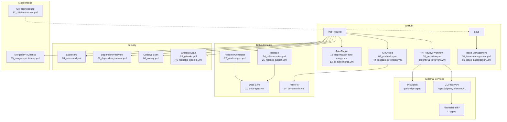

# GitHub Automation Bot — CLIProxyAPI v2.0

[](https://cliproxy.jclee.me)
[](#automation-inventory--자동화-인벤토리)
[](https://www.python.org/)
[](./LICENSE)

> **English** | [**한국어**](#개요)

---

## Table of Contents

- [Overview](#overview--개요)
- [Features](#features--주요-기능)
- [Architecture](#architecture--아키텍처)
- [Automation Inventory](#automation-inventory--자동화-인벤토리)
- [Quick Start](#quick-start--빠른-시작)
- [Local Development](#local-development--로컬-개발)
- [Commands Reference](#commands-reference--명령어-참조)
- [Contribution Guide](#contribution-guide--기여-가이드)

---

## Overview | 개요

This repository contains the **CLIProxyAPI v2.0 GitHub Automation Bot** — a comprehensive system of **33 GitHub Actions workflows** and Python-based automation tools that provide automated code review, issue management, PR handling, documentation generation, and release automation for GitHub repositories.

이 저장소는 **CLIProxyAPI v2.0 GitHub 자동화 봇**을 포함하고 있으며, GitHub 저장소에 대한 자동화된 코드 리뷰, 이슈 관리, PR 처리, 문서 생성 및 릴리스 자동화를 제공하는 **33개의 GitHub Actions 워크플로우**와 Python 기반 자동화 도구의 종합 시스템입니다.

### Key Characteristics | 주요 특성

| Characteristic 특성 | Description 설명 |
|---|---|
| **Architecture** 아키텍처 | Python-based GitHub App + GitHub Actions |
| **Automation Scope** 자동화 범위 | 33 workflows covering PR, issues, security, releases |
| **Core Scripts** 핵심 스크립트 | `scripts/` (Python automation tools) |
| **External Services** 외부 서비스 | CLIProxyAPI (`cliproxy.jclee.me`), PR Agent (`qodo-ai/pr-agent`) |
| **Logging** 로깅 | ELK stack (`<homelab-elk>`) |

---

## Features | 주요 기능

### Automated Code Review | 자동화 코드 리뷰

- **PR Agent Integration**: AI-powered code reviews using `qodo-ai/pr-agent`
- **PR Review Workflows**: `10_pr-review.yml`, `security/11_pr-review.yml`
- **Automated Fix Suggestions**: `14_bot-auto-fix.yml`

### Issue Management | 이슈 관리

- **Automatic Branch Creation**: `01_branch-to-pr.yml`, `02_issue-to-branch.yml`
- **Issue Classification**: `91_issue-classification.yml`
- **Backfill Automation**: `19_issue-backfill.yml`
- **Reusable Issue Management**: `43_reusable-issue-management.yml`

### Security Scanning | 보안 스캐닝

- **Gitleaks** (Secret Detection): `05_gitleaks.yml`, `45_reusable-gitleaks.yml`
- **CodeQL** (Code Analysis): `06_codeql.yml`
- **Dependency Review**: `07_dependency-review.yml`
- **Scorecard** (Supply Chain Security): `08_scorecard.yml`

### CI/CD Automation | CI/CD 자동화

- **PR Checks**: `03_pr-checks.yml`, `44_reusable-pr-checks.yml`
- **Actionlint** (Workflow Linting): `04_actionlint.yml`
- **Semantic PR**: `09_semantic-pr.yml`
- **CI Auto-Heal**: `60_ci-auto-heal.yml`
- **Downstream Health Check**: `29_downstream-health-check.yml`

### Auto Merge | 자동 병합

- **Dependabot Auto-Merge**: `12_dependabot-auto-merge.yml`
- **PR Auto-Merge**: `13_pr-auto-merge.yml`

### Documentation | 문서화

- **README Generation**: `20_readme-gen.yml`
- **Docs Sync**: `21_docs-sync.yml`, `42_reusable-docs-sync.yml`

### Release Automation | 릴리스 자동화

- **Release Notes**: `24_release-notes.yml`
- **Release Publish**: `25_release-publish.yml`

### Maintenance | 유지보수

- **Merged PR Cleanup**: `15_merged-pr-cleanup.yml`
- **CI Failure Issues**: `37_ci-failure-issues.yml`
- **Welcome Bot**: `welcome.yml`
- **Labeler**: `labeler.yml`

---

## Architecture | 아키텍처



---

## Automation Inventory | 자동화 인벤토리

### Workflow Files | 워크플로우 파일

#### Branch & PR Management | 브랜치 및 PR 관리

| File | Description |
|---|---|
| `01_branch-to-pr.yml` | Creates PR from branch |
| `02_issue-to-branch.yml` | Creates branch from issue |
| `13_pr-auto-merge.yml` | Automatic PR merging |

#### CI & Quality Checks | CI 및 품질 검사

| File | Description |
|---|---|
| `03_pr-checks.yml` | PR validation checks |
| `04_actionlint.yml` | GitHub Actions workflow linting |
| `09_semantic-pr.yml` | Semantic PR validation |
| `44_reusable-pr-checks.yml` | Reusable PR check workflow |
| `ci.yml` | Main CI workflow |

#### Security Scanning | 보안 스캐닝

| File | Description |
|---|---|
| `05_gitleaks.yml` | Secret detection |
| `06_codeql.yml` | CodeQL analysis |
| `07_dependency-review.yml` | Dependency vulnerability review |
| `08_scorecard.yml` | Supply chain security scorecard |
| `45_reusable-gitleaks.yml` | Reusable Gitleaks workflow |

#### Code Review | 코드 리뷰

| File | Description |
|---|---|
| `10_pr-review.yml` | PR review automation |
| `security/11_pr-review.yml` | Security-focused PR review |

#### Auto Merge | 자동 병합

| File | Description |
|---|---|
| `12_dependabot-auto-merge.yml` | Dependabot PR auto-merge |
| `auto-merge.yml` | Generic auto-merge workflow |

#### Issue Management | 이슈 관리

| File | Description |
|---|---|
| `18_issue-management.yml` | Issue lifecycle management |
| `19_issue-backfill.yml` | Issue data backfill |
| `43_reusable-issue-management.yml` | Reusable issue management |
| `91_issue-classification.yml` | AI-powered issue classification |

#### Documentation | 문서화

| File | Description |
|---|---|
| `20_readme-gen.yml` | Automated README generation |
| `21_docs-sync.yml` | Documentation synchronization |
| `42_reusable-docs-sync.yml` | Reusable docs sync workflow |

#### Release Automation | 릴리스 자동화

| File | Description |
|---|---|
| `24_release-notes.yml` | Release notes generation |
| `25_release-publish.yml` | Release publishing |

#### Bot Automation | 봇 자동화

| File | Description |
|---|---|
| `14_bot-auto-fix.yml` | Automated code fix suggestions |
| `15_merged-pr-cleanup.yml` | Post-merge cleanup |

#### Health & Monitoring | 상태 및 모니터링

| File | Description |
|---|---|
| `29_downstream-health-check.yml` | Downstream service health check |
| `37_ci-failure-issues.yml` | Creates issues for CI failures |
| `60_ci-auto-heal.yml` | Automatic CI healing |

#### Maintenance | 유지보수

| File | Description |
|---|---|
| `labeler.yml` | Automatic label management |
| `welcome.yml` | Welcome message for contributors |

### Python Automation Scripts | Python 자동화 스크립트

Located in `scripts/`:

| Script | Purpose |
|---|---|
| `check_hardcode_scan_patterns_test.py` | Scan for hardcoded patterns |
| `check_private_ips.py` | Detect private IP addresses |
| `check_workflow_scripts.py` | Validate workflow scripts |
| `generate_readme.py` | Generate README documentation |
| `issue_classification_workflow_test.py` | Test issue classification |
| `issue_classifier_js_test.py` | JavaScript issue classifier tests |
| `pr_review_runner.py` | Run PR review automation |
| `readme_mermaid_test.py` | Validate Mermaid diagrams |
| `redact_exposed_secrets.py` | Redact exposed secrets |
| `repo_review.py` | Repository review automation |

---

## Quick Start | 빠른 시작

### Prerequisites | 사전 요구사항

- Python 3.x
- GitHub CLI (`gh`)
- Access to CLIProxyAPI endpoint

### Installation | 설치

```bash
# Clone the repository
git clone https://github.com/your-org/CLIProxyAPI.git
cd CLIProxyAPI

# Install dependencies
pip install -r _bot-scripts/requirements.txt

# Install development dependencies
pip install -r _bot-scripts/requirements-dev.txt
```

### Basic Usage | 기본 사용법

```bash
# Run PR review
python scripts/pr_review_runner.py --pr-url https://github.com/owner/repo/pull/123

# Generate README
python scripts/generate_readme.py

# Check for private IPs
python scripts/check_private_ips.py --path ./your-code

# Scan workflow scripts
python scripts/check_workflow_scripts.py --path ./.github/workflows
```

---

## Local Development | 로컬 개발

### Environment Setup | 환경 설정

```bash
# Set environment variables
export CL_PROXY_API_URL="https://cliproxy.jclee.me/v1"
export GITHUB_TOKEN="your-github-token"

# Run tests
cd _bot-scripts
python -m pytest scripts/ -v
```

### Using Docker | Docker 사용

```bash
# Build GitHub Action image
docker build -f _bot-scripts/Dockerfile.github_action -t github-action-bot .

# Build GitHub App image
docker build -f _bot-scripts/Dockerfile.github_app -t github-app-bot .
```

### Running Workflows Locally | 로컬에서 워크플로우 실행

```bash
# Using act (GitHub Actions local runner)
act -W .github/workflows/10_pr-review.yml
```

---

## Commands Reference | 명령어 참조

### Makefile Commands | Makefile 명령어

```bash
make help          # Show available commands
make lint          # Run linting
make test          # Run tests
make build         # Build containers
make deploy        # Deploy to environment
```

### Python Scripts | Python 스크립트

| Command | Description |
|---|---|
| `python scripts/generate_readme.py` | Generate README.md |
| `python scripts/check_private_ips.py --path <dir>` | Scan for private IPs |
| `python scripts/check_workflow_scripts.py --path <dir>` | Validate workflows |
| `python scripts/pr_review_runner.py --pr-url <url>` | Run PR review |
| `python scripts/repo_review.py` | Run repository review |
| `python scripts/redact_exposed_secrets.py` | Redact secrets |

### GitHub CLI | GitHub CLI

```bash
# Trigger workflow dispatch
gh workflow run 20_readme-gen.yml

# View workflow runs
gh run list --workflow=10_pr-review.yml

# Check PR status
gh pr status
```

---

## Contribution Guide | 기여 가이드

Please read [`CONTRIBUTING.md`](./CONTRIBUTING.md) for details on our development workflow and contribution guidelines.

[`_bot-scripts/CONTRIBUTING.md`](./_bot-scripts/CONTRIBUTING.md) contains additional guidance for bot script development.

### Adding New Workflows | 새 워크플로우 추가

1. Create workflow file with numeric prefix (e.g., `50_new-workflow.yml`)
2. Follow naming conventions in [CONTRIBUTING.md](./CONTRIBUTING.md)
3. Add tests in `scripts/` directory
4. Update this README's automation inventory

### Code Style | 코드 스타일

- Python: Follow PEP 8
- YAML: Use 2-space indentation
- Workflows: Use reusable workflows where applicable

### Testing | 테스트

```bash
# Run all tests
cd _bot-scripts && python -m pytest

# Run specific test
python -m pytest scripts/pr_review_runner_test.py -v

# Run with coverage
python -m pytest --cov=. --cov-report=html
```

---

## License | 라이선스

Proprietary — see [`LICENSE`](./LICENSE) and [`_bot-scripts/LICENSE`](./_bot-scripts/LICENSE) for details.

---

## Contact | 연락처

- **CLIProxyAPI**: <https://cliproxy.jclee.me>
- **Bot Service**: <https://bot.jclee.me>

---

*Generated by CLIProxyAPI v2.0 — README Generator*
