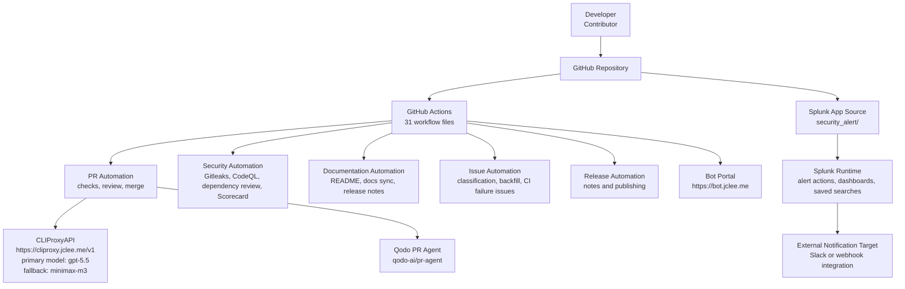

# Security Alert Splunk App & GitHub Automation

[](#automation-inventory--자동화-인벤토리)
[](#overview--개요)
[](https://cliproxy.jclee.me)
[](./LICENSE)

> English | 한국어  
> This README is bilingual. Each major section contains English and Korean descriptions.

---

## Table of Contents

- [Overview | 개요](#overview--개요)
- [Features | 주요 기능](#features--주요-기능)
- [Architecture | 아키텍처](#architecture--아키텍처)
- [Automation Inventory | 자동화 인벤토리](#automation-inventory--자동화-인벤토리)
- [Repository Structure | 저장소 구조](#repository-structure--저장소-구조)
- [Quick Start | 빠른 시작](#quick-start--빠른-시작)
- [Local Development | 로컬 개발](#local-development--로컬-개발)
- [Commands Reference | 명령어 참조](#commands-reference--명령어-참조)
- [Contribution Guide | 기여 가이드](#contribution-guide--기여-가이드)

---

## Overview | 개요

### English

This repository contains a Splunk application named `security_alert` together with extensive GitHub automation for pull request review, security scanning, documentation maintenance, release handling, issue triage, and CI self-healing.

The Splunk app includes alert actions, dashboards, saved searches, macros, transforms, and bundled Python dependencies used by the app runtime. The repository also includes operational documentation under `docs/` and `resume/`, plus a `demo/` area for examples or demonstrations.

GitHub automation is implemented with 31 workflow files. The automation integrates GitHub Actions, reusable workflows, security scanners, PR review automation, documentation generation, release publishing, and external AI-assisted services through CLIProxyAPI.

### 한국어

이 저장소는 `security_alert`라는 Splunk 애플리케이션과 PR 리뷰, 보안 스캔, 문서 유지보수, 릴리스 처리, 이슈 분류, CI 자가 복구를 위한 GitHub 자동화를 포함합니다.

Splunk 앱에는 alert action, dashboard, saved search, macro, transform, 그리고 앱 런타임에서 사용하는 Python 의존성이 포함되어 있습니다. 또한 `docs/`와 `resume/`에는 운영 및 배포 관련 문서가 있으며, `demo/`에는 예제 또는 데모 자료가 포함됩니다.

GitHub 자동화는 총 31개의 workflow 파일로 구성되어 있습니다. 이 자동화는 GitHub Actions, reusable workflow, 보안 스캐너, PR 리뷰 자동화, 문서 생성, 릴리스 배포, CLIProxyAPI 기반 AI 보조 서비스를 통합합니다.

---

## Features | 주요 기능

### English

- Splunk security alert application packaged under `security_alert/`
- Custom alert action configuration through `alert_actions.conf`
- Splunk dashboards and UI views for alert building, alert management, and data exploration
- Saved searches, props, transforms, macros, and navigation configuration
- Python helper scripts under `security_alert/bin/`
- Vendored Python libraries under `security_alert/lib/python3/`
- GitHub Actions automation for:
  - Branch and PR creation
  - Pull request checks and semantic PR validation
  - AI-assisted PR review
  - Security-focused PR review
  - Gitleaks secret scanning
  - CodeQL analysis
  - Dependency review
  - OpenSSF Scorecard checks
  - Dependabot auto-merge
  - Release notes and release publishing
  - Documentation synchronization
  - Issue classification and backfill
  - CI failure issue creation
  - CI auto-healing
  - Repository sanity checks through reusable workflows and CI gates

### 한국어

- `security_alert/` 아래에 패키징된 Splunk 보안 알림 앱
- `alert_actions.conf` 기반 custom alert action 설정
- alert builder, alert management, data explorer용 Splunk dashboard 및 UI view
- saved search, props, transforms, macro, navigation 설정
- `security_alert/bin/` 아래 Python helper script
- `security_alert/lib/python3/` 아래 vendored Python 라이브러리
- GitHub Actions 기반 자동화:
  - branch 및 PR 생성
  - PR check 및 semantic PR 검증
  - AI 기반 PR 리뷰
  - 보안 중심 PR 리뷰
  - Gitleaks secret scanning
  - CodeQL 분석
  - dependency review
  - OpenSSF Scorecard 점검
  - Dependabot 자동 병합
  - release note 생성 및 release publishing
  - 문서 동기화
  - issue classification 및 backfill
  - CI failure issue 생성
  - CI auto-healing
  - reusable workflow 및 CI gate 기반 저장소 sanity check

---

## Architecture | 아키텍처

### English

The repository has two major concerns:

1. Splunk application source and documentation.
2. GitHub automation workflows that maintain repository quality, security, releases, and documentation.

AI-assisted automation uses CLIProxyAPI as the public API endpoint. PR review automation may use Qodo PR Agent where configured.

### 한국어

이 저장소는 크게 두 영역으로 구성됩니다.

1. Splunk 애플리케이션 소스 및 문서.
2. 저장소 품질, 보안, 릴리스, 문서를 유지하는 GitHub 자동화 workflow.

AI 보조 자동화는 CLIProxyAPI public endpoint를 사용합니다. PR 리뷰 자동화는 설정에 따라 Qodo PR Agent를 사용할 수 있습니다.



---

## Automation Inventory | 자동화 인벤토리

### Summary | 요약

| Category | Count | 한국어 설명 |
|---|---:|---|
| GitHub Actions workflows | 31 | GitHub Actions workflow 파일 |
| Go automation tools | 0 | Go 기반 자동화 도구 없음 |
| Python helper scripts in app | 3 | Splunk 앱 내부 helper script |
| Reusable workflow files | 3 | 다른 workflow에서 호출 가능한 reusable workflow |

### GitHub Actions Workflow Files | GitHub Actions 워크플로우 파일

The following workflow files exist on disk and are listed with their real filenames.

아래 workflow 파일명은 실제 on-disk 파일명을 그대로 표시합니다.

| File | Purpose |
|---|---|
| `01_branch-to-pr.yml` | Creates or manages pull requests from automation-created branches. |
| `02_issue-to-branch.yml` | Creates branches from issues or issue-driven automation events. |
| `03_pr-checks.yml` | Runs pull request validation and repository checks. |
| `04_actionlint.yml` | Lints GitHub Actions workflow syntax and structure. |
| `05_gitleaks.yml` | Scans repository content for leaked secrets using Gitleaks. |
| `06_codeql.yml` | Runs CodeQL security analysis. |
| `07_dependency-review.yml` | Reviews dependency changes for known security risks. |
| `08_scorecard.yml` | Runs repository security posture checks using OpenSSF Scorecard. |
| `09_semantic-pr.yml` | Validates pull request title or metadata against semantic conventions. |
| `10_pr-review.yml` | Performs automated pull request review, including AI-assisted review where configured. |
| `11_security-pr-review.yml` | Performs security-focused review for pull requests. |
| `12_dependabot-auto-merge.yml` | Automatically merges eligible Dependabot pull requests. |
| `13_pr-auto-merge.yml` | Automatically merges pull requests that satisfy repository policy. |
| `14_bot-auto-fix.yml` | Applies automated fixes generated by bot workflows. |
| `15_merged-pr-cleanup.yml` | Cleans up branches or metadata after pull requests are merged. |
| `19_issue-backfill.yml` | Backfills issue metadata, labels, or automation state. |
| `20_readme-gen.yml` | Generates or refreshes README content. Primary model: `gpt-5.5`; fallback: `minimax-m3` through CLIProxyAPI. |
| `21_docs-sync.yml` | Synchronizes documentation content. |
| `24_release-notes.yml` | Generates release notes. |
| `25_release-publish.yml` | Publishes releases. |
| `29_downstream-health-check.yml` | Checks downstream service or integration health. |
| `37_ci-failure-issues.yml` | Creates or updates issues for CI failures. |
| `42_reusable-docs-sync.yml` | Reusable documentation synchronization workflow. |
| `44_reusable-pr-checks.yml` | Reusable pull request checks workflow. |
| `45_reusable-gitleaks.yml` | Reusable Gitleaks scanning workflow. |
| `60_ci-auto-heal.yml` | Attempts automated remediation for CI failures. |
| `91_issue-classification.yml` | Classifies issues using automation rules or AI-assisted classification. |
| `auto-merge.yml` | General auto-merge workflow. |
| `ci.yml` | Main continuous integration workflow. |
| `labeler.yml` | Applies labels based on repository configuration or file changes. |
| `welcome.yml` | Greets or guides new contributors and issue/PR authors. |

### Automation Tools | 자동화 도구

#### GitHub Actions and External Services

| Tool or Service | Usage |
|---|---|
| GitHub Actions | Primary automation runtime for CI, PR review, releases, documentation, and issue workflows. |
| CLIProxyAPI | AI and automation gateway available at `https://cliproxy.jclee.me/v1`. |
| Qodo PR Agent | AI-assisted pull request review integration: `qodo-ai/pr-agent`. |
| Gitleaks | Secret scanning. |
| CodeQL | Static security analysis. |
| Dependency Review | Pull request dependency risk analysis. |
| OpenSSF Scorecard | Repository security posture analysis. |
| actionlint | GitHub Actions workflow linting. |
| Dependabot | Dependency update pull requests and auto-merge integration. |

#### Repository Scripts

| File | Description |
|---|---|
| `security_alert/bin/safe_fmt.py` | Python helper script for safe formatting or output handling in the Splunk app. |
| `security_alert/bin/six.py` | Compatibility helper module bundled with the Splunk app. |
| `security_alert/bin/slack.py` | Slack-related helper script for alert notification behavior. |

#### Go Automation Tools

There are currently no Go automation tools in this repository.

현재 이 저장소에는 Go 기반 자동화 도구가 없습니다.

---

## Repository Structure | 저장소 구조

The top-level repository layout is:

```text
/
├── CONTRIBUTING.md
├── LICENSE
├── README.md
├── resume/
│   ├── API.md
│   ├── ARCHITECTURE.md
│   ├── DEPLOYMENT.md
│   └── TROUBLESHOOTING.md
├── docs/
│   ├── ALERT-REPOSITORY-XWIKI.md
│   ├── DEPLOYMENT.md
│   ├── LEGACY-CLEANUP-REPORT.md
│   ├── QUICK-START.md
│   └── RELEASE-NOTES.md
├── demo/
│   └── README.md
└── security_alert/
    ├── README.md
    ├── app.manifest
    ├── bin/
    ├── metadata/
    ├── default/
    └── lib/
```

### Key Paths | 주요 경로

| Path | Description | 한국어 설명 |
|---|---|---|
| `security_alert/` | Splunk application root | Splunk 애플리케이션 루트 |
| `security_alert/default/` | Splunk configuration files | Splunk 설정 파일 |
| `security_alert/default/data/ui/views/` | Splunk dashboard XML views | Splunk dashboard XML view |
| `security_alert/default/data/ui/nav/` | Splunk navigation configuration | Splunk navigation 설정 |
| `security_alert/bin/` | Python runtime scripts | Python 런타임 script |
| `security_alert/lib/python3/` | Vendored Python dependencies | 포함된 Python 의존성 |
| `docs/` | Operational and release documentation | 운영 및 릴리스 문서 |
| `resume/` | API, architecture, deployment, troubleshooting documentation | API, 아키텍처, 배포, 문제 해결 문서 |
| `demo/` | Demo documentation or examples | 데모 문서 또는 예제 |

---

## Quick Start | 빠른 시작

### English

Use this section to inspect, package, or deploy the Splunk app locally.

#### 1. Clone the repository

```bash
git clone <repository-url>
cd <repository-directory>
```

#### 2. Inspect the Splunk app

```bash
find security_alert -maxdepth 3 -type f | sort
```

#### 3. Review Splunk configuration

```bash
ls -la security_alert/default
cat security_alert/default/app.conf
cat security_alert/default/alert_actions.conf
```

#### 4. Package the app

```bash
tar \
  --exclude='.git' \
  --exclude='*.pyc' \
  --exclude='__pycache__' \
  -czf security_alert.tgz \
  security_alert
```

#### 5. Install in Splunk

Install the generated `security_alert.tgz` through Splunk Web or copy the `security_alert/` directory to your Splunk apps directory.

Example placeholder path:

```bash
cp -R security_alert <splunk-home>/etc/apps/security_alert
```

Restart Splunk if required by your environment.

### 한국어

이 섹션은 Splunk 앱을 로컬에서 확인, 패키징, 배포하는 기본 절차를 설명합니다.

#### 1. 저장소 복제

```bash
git clone <repository-url>
cd <repository-directory>
```

#### 2. Splunk 앱 구조 확인

```bash
find security_alert -maxdepth 3 -type f | sort
```

#### 3. Splunk 설정 확인

```bash
ls -la security_alert/default
cat security_alert/default/app.conf
cat security_alert/default/alert_actions.conf
```

#### 4. 앱 패키징

```bash
tar \
  --exclude='.git' \
  --exclude='*.pyc' \
  --exclude='__pycache__' \
  -czf security_alert.tgz \
  security_alert
```

#### 5. Splunk에 설치

생성된 `security_alert.tgz`를 Splunk Web을 통해 설치하거나 `security_alert/` 디렉터리를 Splunk apps 디렉터리로 복사합니다.

예시 placeholder 경로:

```bash
cp -R security_alert <splunk-home>/etc/apps/security_alert
```

환경에 따라 Splunk 재시작이 필요할 수 있습니다.

---

## Local Development | 로컬 개발

### Prerequisites | 사전 요구사항

| Requirement | Purpose |
|---|---|
| Git | Source control |
| Python 3 | Script inspection and local checks |
| tar | App packaging |
| Splunk development or test instance | Runtime validation |
| GitHub CLI, optional | PR and issue workflow testing |

### Recommended Local Checks | 권장 로컬 점검

#### Validate Python syntax

```bash
python3 -m py_compile security_alert/bin/safe_fmt.py
python3 -m py_compile security_alert/bin/six.py
python3 -m py_compile security_alert/bin/slack.py
```

#### Search for accidental private data

```bash
grep -RIn \
  --exclude-dir='.git' \
  --exclude='*.pyc' \
  'password\|secret\|token\|PRIVATE KEY' \
  .
```

#### Check Splunk configuration files

```bash
find security_alert/default -type f -name '*.conf' -print -exec sed -n '1,120p' {} \;
```

#### Build a local package

```bash
rm -f security_alert.tgz
tar \
  --exclude='.git' \
  --exclude='*.pyc' \
  --exclude='__pycache__' \
  -czf security_alert.tgz \
  security_alert
ls -lh security_alert.tgz
```

### Development Notes | 개발 참고사항

- Do not commit generated `.pyc` files or local Splunk runtime artifacts.
- Keep Splunk configuration in `security_alert/default/` deterministic and reviewable.
- Avoid committing environment-specific hostnames, credentials, tokens, private IP addresses, or container identifiers.
- Keep documentation synchronized with changes under `security_alert/`.
- For automation changes, validate workflow syntax before merging.

---

## Commands Reference | 명령어 참조

### Repository Inspection | 저장소 확인

```bash
# Show top-level files and directories
find . -maxdepth 2 -type f | sort

# Show Splunk app files
find security_alert -type f | sort

# Show documentation files
find docs resume demo -type f | sort
```

### Splunk App Packaging | Splunk 앱 패키징

```bash
# Create a distributable package
tar \
  --exclude='.git' \
  --exclude='*.pyc' \
  --exclude='__pycache__' \
  -czf security_alert.tgz \
  security_alert
```

### Python Checks | Python 점검

```bash
# Compile all app Python files
python3 -m compileall security_alert/bin security_alert/lib/python3

# Compile only custom scripts
python3 -m py_compile security_alert/bin/*.py
```

### Documentation Checks | 문서 점검

```bash
# List Markdown files
find . -name '*.md' -type f | sort

# Search for TODO markers
grep -RIn 'TODO\|FIXME' --include='*.md' .
```

### GitHub Workflow Checks | GitHub workflow 점검

```bash
# List workflow files
find .github/workflows -maxdepth 1 -type f -name '*.yml' -printf '%f\n' | sort

# If actionlint is installed locally
actionlint .github/workflows/*.yml
```

### Security Hygiene | 보안 위생 점검

```bash
# Basic local pattern scan
grep -RIn \
  --exclude-dir='.git' \
  --exclude='*.pyc' \
  --exclude='*.tgz' \
  'BEGIN PRIVATE KEY\|password=\|token=\|secret=' \
  .
```

---

## Contribution Guide | 기여 가이드

### English

Please read `CONTRIBUTING.md` before submitting changes.

#### Contribution workflow

1. Open or select an issue.
2. Create a branch for your change.
3. Update code, Splunk configuration, and documentation together.
4. Run local validation commands.
5. Open a pull request.
6. Ensure all required checks pass.
7. Address automated review comments.
8. Wait for maintainer review or auto-merge eligibility.

#### Pull request expectations

- Keep pull requests focused and small enough to review.
- Use clear titles that satisfy semantic PR rules where applicable.
- Explain changes to Splunk configuration files.
- Include screenshots or notes for dashboard/UI changes when possible.
- Update `docs/`, `resume/`, or `security_alert/README.md` when behavior changes.
- Do not include secrets, credentials, private endpoints, private IP addresses, or environment-specific identifiers.

#### Automation-aware contribution notes

This repository has extensive automation. A pull request may trigger:

- `03_pr-checks.yml`
- `04_actionlint.yml`
- `05_gitleaks.yml`
- `06_codeql.yml`
- `07_dependency-review.yml`
- `08_scorecard.yml`
- `09_semantic-pr.yml`
- `10_pr-review.yml`
- `11_security-pr-review.yml`
- `13_pr-auto-merge.yml`
- `labeler.yml`
- `ci.yml`

Depending on the files changed, documentation, release, issue, or auto-healing workflows may also run.

### 한국어

변경 사항을 제출하기 전에 `CONTRIBUTING.md`를 확인해 주세요.

#### 기여 절차

1. 이슈를 생성하거나 기존 이슈를 선택합니다.
2. 변경 사항용 branch를 생성합니다.
3. 코드, Splunk 설정, 문서를 함께 수정합니다.
4. 로컬 검증 명령을 실행합니다.
5. pull request를 생성합니다.
6. 필수 check가 모두 통과하는지 확인합니다.
7. 자동 리뷰 코멘트를 반영합니다.
8. maintainer 리뷰 또는 auto-merge 조건 충족을 기다립니다.

#### Pull request 기준

- PR은 명확하고 리뷰 가능한 범위로 유지합니다.
- semantic PR 규칙이 적용되는 경우 명확한 제목을 사용합니다.
- Splunk configuration 변경 사항은 설명을 포함합니다.
- dashboard 또는 UI 변경 시 가능하면 screenshot 또는 설명을 포함합니다.
- 동작이 변경되면 `docs/`, `resume/`, 또는 `security_alert/README.md`를 업데이트합니다.
- secret, credential, private endpoint, private IP address, 환경 전용 식별자를 포함하지 않습니다.

#### 자동화 관련 참고

이 저장소에는 많은 자동화가 적용되어 있습니다. PR 생성 시 다음 workflow가 실행될 수 있습니다.

- `03_pr-checks.yml`
- `04_actionlint.yml`
- `05_gitleaks.yml`
- `06_codeql.yml`
- `07_dependency-review.yml`
- `08_scorecard.yml`
- `09_semantic-pr.yml`
- `10_pr-review.yml`
- `11_security-pr-review.yml`
- `13_pr-auto-merge.yml`
- `labeler.yml`
- `ci.yml`

변경 파일에 따라 문서, 릴리스, 이슈, auto-healing 관련 workflow도 추가로 실행될 수 있습니다.

---

## Documentation | 문서

Additional documentation is available in:

- `docs/QUICK-START.md`
- `docs/DEPLOYMENT.md`
- `docs/RELEASE-NOTES.md`
- `docs/ALERT-REPOSITORY-XWIKI.md`
- `docs/LEGACY-CLEANUP-REPORT.md`
- `resume/API.md`
- `resume/ARCHITECTURE.md`
- `resume/DEPLOYMENT.md`
- `resume/TROUBLESHOOTING.md`
- `security_alert/README.md`
- `demo/README.md`

---

## License | 라이선스

See [`LICENSE`](./LICENSE).

라이선스 정보는 [`LICENSE`](./LICENSE)를 확인하세요.