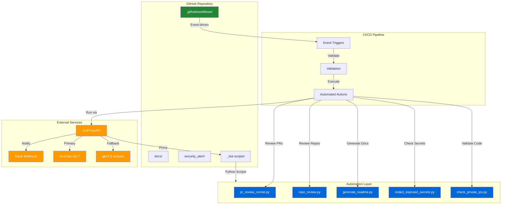
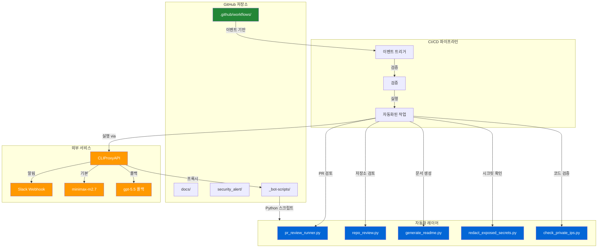

# Splunk Security Alert System for FortiGate

[](https://docs.fortinet.com/product/fortigate/)
[](https://docs.splunk.com/Documentation/SPL)
[](./LICENSE)
[](#automation-inventory)
[](https://cliproxy.jclee.me)

> **English** | [한국어](#개요)

---

## Overview

This repository contains the **Splunk Security Alert System** designed for FortiGate firewall monitoring. It provides **15 production-ready security alerts** with state-aware alerting capabilities that ensure zero duplicate notifications.

### Key Characteristics

| Characteristic | Description |
|----------------|-------------|
| **Alert Count** | 15 production alerts for FortiGate security events |
| **Architecture** | SPL-First: All logic implemented in Splunk Search Processing Language |
| **Alerting Model** | State-aware with deduplication to prevent alert storms |
| **Notification** | Single-line Slack messages for efficient incident response |
| **Configuration** | Macro-based for easy customization and air-gapped deployment |
| **Deployment** | Air-gapped environment ready |

---

## Features

### Core Capabilities

- **15 Production Security Alerts** covering critical FortiGate events:
  - Brute force detection
  - Intrusion prevention system (IPS) alerts
  - Malware detection
  - Policy violations
  - Anomaly detection
  - And more...

- **State-Aware Alerting Engine**
  - Tracks alert state across evaluation windows
  - Eliminates duplicate notifications
  - Maintains alert history for correlation

- **SPL-First Architecture**
  - All detection logic written in Splunk Search Processing Language
  - No external dependencies for alert execution
  - Portable across Splunk infrastructure

- **Slack Integration**
  - Real-time notification delivery
  - Single-line format for rapid comprehension
  - Configurable webhook endpoints

---

## Architecture



---

## Automation Inventory

### GitHub Actions Workflows (32 Total)

| Workflow File | Purpose |
|---------------|---------|
| [01_branch-to-pr.yml](./.github/workflows/01_branch-to-pr.yml) | Convert branches to pull requests |
| [02_issue-to-branch.yml](./.github/workflows/02_issue-to-branch.yml) | Create branches from issues |
| [03_pr-checks.yml](./.github/workflows/03_pr-checks.yml) | PR validation checks |
| [04_actionlint.yml](./.github/workflows/04_actionlint.yml) | Workflow syntax validation |
| [05_gitleaks.yml](./.github/workflows/05_gitleaks.yml) | Secret scanning |
| [06_codeql.yml](./.github/workflows/06_codeql.yml) | Code quality analysis |
| [07_dependency-review.yml](./.github/workflows/07_dependency-review.yml) | Dependency vulnerability review |
| [08_scorecard.yml](./.github/workflows/08_scorecard.yml) | Security scorecard assessment |
| [09_semantic-pr.yml](./.github/workflows/09_semantic-pr.yml) | Semantic PR validation |
| [10_pr-review.yml](./.github/workflows/10_pr-review.yml) | Automated PR review |
| [12_dependabot-auto-merge.yml](./.github/workflows/12_dependabot-auto-merge.yml) | Auto-merge Dependabot PRs |
| [13_pr-auto-merge.yml](./.github/workflows/13_pr-auto-merge.yml) | Auto-merge qualifying PRs |
| [14_bot-auto-fix.yml](./.github/workflows/14_bot-auto-fix.yml) | Automated bot fixes |
| [15_merged-pr-cleanup.yml](./.github/workflows/15_merged-pr-cleanup.yml) | Post-merge cleanup |
| [18_issue-management.yml](./.github/workflows/18_issue-management.yml) | Issue lifecycle management |
| [19_issue-backfill.yml](./.github/workflows/19_issue-backfill.yml) | Issue data backfill |
| [20_readme-gen.yml](./.github/workflows/20_readme-gen.yml) | README generation |
| [21_docs-sync.yml](./.github/workflows/21_docs-sync.yml) | Documentation synchronization |
| [24_release-notes.yml](./.github/workflows/24_release-notes.yml) | Release notes generation |
| [25_release-publish.yml](./.github/workflows/25_release-publish.yml) | Release publication |
| [29_downstream-health-check.yml](./.github/workflows/29_downstream-health-check.yml) | Downstream dependency health |
| [37_ci-failure-issues.yml](./.github/workflows/37_ci-failure-issues.yml) | Create issues for CI failures |
| [42_reusable-docs-sync.yml](./.github/workflows/42_reusable-docs-sync.yml) | Reusable docs sync workflow |
| [43_reusable-issue-management.yml](./.github/workflows/43_reusable-issue-management.yml) | Reusable issue management |
| [44_reusable-pr-checks.yml](./.github/workflows/44_reusable-pr-checks.yml) | Reusable PR checks |
| [45_reusable-gitleaks.yml](./.github/workflows/45_reusable-gitleaks.yml) | Reusable secret scanning |
| [60_ci-auto-heal.yml](./.github/workflows/60_ci-auto-heal.yml) | CI self-healing automation |
| [auto-merge.yml](./.github/workflows/auto-merge.yml) | Generic auto-merge workflow |
| [ci.yml](./.github/workflows/ci.yml) | Primary CI workflow |
| [labeler.yml](./.github/workflows/labeler.yml) | PR label automation |
| [welcome.yml](./.github/workflows/welcome.yml) | New contributor welcome |
| [security/11_pr-review.yml](./.github/workflows/security/11_pr-review.yml) | Security-focused PR review |

### Automation Scripts

| Script | Description |
|--------|-------------|
| [pr_review_runner.py](./_bot-scripts/scripts/pr_review_runner.py) | Executes automated PR reviews via CLIProxyAPI |
| [repo_review.py](./_bot-scripts/scripts/repo_review.py) | Repository-level review automation |
| [generate_readme.py](./.github/workflows/generate_readme.py) | README.md generation |
| [redact_exposed_secrets.py](./_bot-scripts/scripts/redact_exposed_secrets.py) | Secret redaction in logs/outputs |
| [check_private_ips.py](./_bot-scripts/scripts/check_private_ips.py) | Validates no RFC1918 addresses exposed |
| [check_private_ips_test.py](./_bot-scripts/scripts/check_private_ips_test.py) | Unit tests for IP checker |
| [pr_review_runner_test.py](./_bot-scripts/scripts/pr_review_runner_test.py) | Unit tests for PR reviewer |

---

## Quick Start

### Prerequisites

- Python 3.10+
- Access to Splunk Enterprise/Cloud
- FortiGate firewall with log forwarding configured
- Slack webhook for notifications

### Installation

1. Clone the repository:

```bash
git clone https://github.com/your-org/splunk-fortigate-security.git
cd splunk-fortigate-security
```

2. Install dependencies:

```bash
pip install -r _bot-scripts/requirements.txt
```

3. Configure Splunk:

```bash
# Copy alert configurations to your Splunk instance
cp -r security_alert/ $SPLUNK_HOME/etc/apps/
```

4. Set up Slack webhook:

```bash
export SLACK_WEBHOOK_URL="https://hooks.slack.com/services/YOUR/WEBHOOK/URL"
```

### Initial Setup

1. Configure macro variables in each alert for your environment:
   - `dest_ip` - Your FortiGate management IP
   - `threshold` - Alert-specific thresholds

2. Verify connectivity:

```bash
| makeresults | eval message="Test connectivity"
```

---

## Local Development

### Repository Structure

```
splunk-fortigate-security/
├── _bot-scripts/          # GitHub automation bot scripts
│   ├── scripts/           # Python automation scripts
│   │   ├── pr_review_runner.py
│   │   ├── repo_review.py
│   │   ├── generate_readme.py
│   │   ├── redact_exposed_secrets.py
│   │   └── check_private_ips.py
│   ├── Dockerfile.github_action
│   ├── Dockerfile.github_app
│   └── docker-compose.github_app.yml
├── .github/
│   └── workflows/         # 32 GitHub Actions workflows
├── docs/                  # Documentation
│   ├── QUICK-START.md
│   ├── DEPLOYMENT.md
│   └── RELEASE-NOTES.md
├── security_alert/        # Splunk alert definitions
│   ├── app.manifest
│   └── lib/
└── tests/                # Test suite
```

### Development Environment

```bash
# Create virtual environment
python3 -m venv venv
source venv/bin/activate

# Install development dependencies
pip install -r _bot-scripts/requirements-dev.txt

# Run tests
python -m pytest _bot-scripts/scripts/

# Lint code
python -m flake8 _bot-scripts/scripts/
```

### Bot Scripts Development

The `_bot-scripts/` directory contains a standalone Python package for GitHub automation. It can be containerized using the provided Dockerfiles:

```bash
# Build GitHub Action container
docker build -f _bot-scripts/Dockerfile.github_action -t bot-action .

# Build GitHub App container
docker build -f _bot-scripts/Dockerfile.github_app -t bot-app .
```

---

## Commands Reference

### Python Automation Scripts

| Command | Description |
|---------|-------------|
| `python scripts/pr_review_runner.py` | Run PR review via API |
| `python scripts/repo_review.py` | Run repository review |
| `python scripts/generate_readme.py` | Generate README.md |
| `python scripts/check_private_ips.py` | Scan for exposed private IPs |
| `python scripts/redact_exposed_secrets.py` | Redact secrets from output |

### GitHub Actions Workflows

Trigger workflows using repository dispatch events or scheduled cron:

```bash
# Trigger README generation
gh workflow run 20_readme-gen.yml

# Trigger docs sync
gh workflow run 21_docs-sync.yml

# Trigger release publication
gh workflow run 25_release-publish.yml
```

### CLIProxyAPI Usage

The bot uses CLIProxyAPI for LLM-powered automation:

```bash
# Direct API call
curl -X POST https://cliproxy.jclee.me/v1/chat/completions \
  -H "Content-Type: application/json" \
  -d '{
    "model": "minimax-m2.7",
    "messages": [{"role": "user", "content": "Review this PR"}]
  }'

# With fallback
curl -X POST https://cliproxy.jclee.me/v1/chat/completions \
  -H "Content-Type: application/json" \
  -d '{
    "model": "gpt-5.5",
    "messages": [{"role": "user", "content": "Review this PR"}]
  }'
```

---

## Contribution Guide

Contributions are welcome. Please follow these guidelines:

### Workflow Development

1. All new workflows must be placed in `.github/workflows/`
2. Use the numeric prefix convention for ordering (e.g., `22_new-workflow.yml`)
3. Validate workflow syntax with [actionlint](https://github.com/rhysd/actionlint)
4. Test workflows in a feature branch before merging to main

### Script Development

1. All Python scripts must pass linting and type checking
2. Include unit tests for new functionality
3. Document functions using docstrings
4. Follow the existing code style in `_bot-scripts/scripts/`

### Pull Request Process

1. Create a feature branch from `main`
2. Ensure all checks pass (CI workflow `ci.yml`)
3. Update documentation if needed
4. Request review from maintainers
5. Squash and merge

### Security Considerations

- Never commit secrets or API keys
- Use the `check_private_ips.py` script to validate no RFC1918 addresses are exposed
- Run `redact_exposed_secrets.py` before posting outputs publicly
- Follow the [SECURITY.md](./_bot-scripts/SECURITY.md) guidelines

---

## License

Proprietary - See [LICENSE](./LICENSE) for details.

---

## Contact

- Documentation: [docs/](./docs/)
- Security Issues: [SECURITY.md](./_bot-scripts/SECURITY.md)
- Automation Bot: [CLIProxyAPI](https://cliproxy.jclee.me)

---

# Splunk FortiGate 보안 알림 시스템

[](https://docs.fortinet.com/product/fortigate/)
[](https://docs.splunk.com/Documentation/SPL)
[](./LICENSE)
[](#자동화-인벤토리)
[](https://cliproxy.jclee.me)

---

## 개요

이 저장소는 **FortiGate 방화벽 모니터링**을 위한 Splunk 보안 알림 시스템을 포함합니다. **중복 알림을 방지하는 상태 인식 기능**과 함께 **15개의 프로덕션 보안 알림**을 제공합니다.

### 주요 특성

| 특성 | 설명 |
|------|------|
| **알림 수** | FortiGate 보안 이벤트용 15개 프로덕션 알림 |
| **아키텍처** | SPL 우선: Splunk 검색 처리 언어로 모든 로직 구현 |
| **알림 모델** | 중복 방지를 위한 상태 인식 및 중복 제거 |
| **알림** | 효율적인 인시던트 대응을 위한 단일 줄 Slack 메시지 |
| **구성** | 쉬운 사용자 정의 및 воздух隔绝 배포를 위한 매크로 기반 |
| **배포** | воздух隔绝 환경 준비 완료 |

---

## 주요 기능

### 핵심 기능

- **15개 프로덕션 보안 알림** - 주요 FortiGate 이벤트 포함:
  - 무차별 대입 공격 감지
  - 침입 방지 시스템(IPS) 알림
  - 맬웨어 감지
  - 정책 위반
  - 이상 감지
  - 기타...

- **상태 인식 알림 엔진**
  - 평가 창 전반의 알림 상태 추적
  - 중복 알림 제거
  - 상관 관계를 위한 알림 기록 유지

- **SPL 우선 아키텍처**
  - Splunk 검색 처리 언어로 작성된 모든 감지 로직
  - 알림 실행을 위한 외부 종속성 없음
  - Splunk 인프라 전반 이식 가능

- **Slack 통합**
  - 실시간 알림 전달
  - 빠른 이해를 위한 단일 줄 형식
  - 구성 가능한 웹훅 엔드포인트

---

## 아키텍처



---

## 자동화 인벤토리

### GitHub Actions 워크플로우 (32개)

| 워크플로우 파일 | 목적 |
|----------------|--------|
| [01_branch-to-pr.yml](./.github/workflows/01_branch-to-pr.yml) | 브랜치를 Pull Request로 변환 |
| [02_issue-to-branch.yml](./.github/workflows/02_issue-to-branch.yml) | 이슈에서 브랜치 생성 |
| [03_pr-checks.yml](./.github/workflows/03_pr-checks.yml) | PR 검증 검사 |
| [04_actionlint.yml](./.github/workflows/04_actionlint.yml) | 워크플로우 구문 검증 |
| [05_gitleaks.yml](./.github/workflows/05_gitleaks.yml) | 시크릿 스캔 |
| [06_codeql.yml](./.github/workflows/06_codeql.yml) | 코드 품질 분석 |
| [07_dependency-review.yml](./.github/workflows/07_dependency-review.yml) | 종속성 취약점 검토 |
| [08_scorecard.yml](./.github/workflows/08_scorecard.yml) | 보안 점수 평가 |
| [09_semantic-pr.yml](./.github/workflows/09_semantic-pr.yml) | 시맨틱 PR 검증 |
| [10_pr-review.yml](./.github/workflows/10_pr-review.yml) | 자동화된 PR 검토 |
| [12_dependabot-auto-merge.yml](./.github/workflows/12_dependabot-auto-merge.yml) | Dependabot PR 자동 병합 |
| [13_pr-auto-merge.yml](./.github/workflows/13_pr-auto-merge.yml) | 적합한 PR 자동 병합 |
| [14_bot-auto-fix.yml](./.github/workflows/14_bot-auto-fix.yml) | 자동화된 봇 수정 |
| [15_merged-pr-cleanup.yml](./.github/workflows/15_merged-pr-cleanup.yml) | 병합 후 정리 |
| [18_issue-management.yml](./.github/workflows/18_issue-management.yml) | 이슈 수명 주기 관리 |
| [19_issue-backfill.yml](./.github/workflows/19_issue-backfill.yml) | 이슈 데이터 백필 |
| [20_readme-gen.yml](./.github/workflows/20_readme-gen.yml) | README 생성 |
| [21_docs-sync.yml](./.github/workflows/21_docs-sync.yml) | 문서 동기화 |
| [24_release-notes.yml](./.github/workflows/24_release-notes.yml) | 릴리스 노트 생성 |
| [25_release-publish.yml](./.github/workflows/25_release-publish.yml) | 릴리스 게시 |
| [29_downstream-health-check.yml](./.github/workflows/29_downstream-health-check.yml) | 하류 종속성 상태 확인 |
| [37_ci-failure-issues.yml](./.github/workflows/37_ci-failure-issues.yml) | CI 실패용 이슈 생성 |
| [42_reusable-docs-sync.yml](./.github/workflows/42_reusable-docs-sync.yml) | 재사용可能な 문서 동기화 워크플로우 |
| [43_reusable-issue-management.yml](./.github/workflows/43_reusable-issue-management.yml) | 재사용 가능한 이슈 관리 |
| [44_reusable-pr-checks.yml](./.github/workflows/44_reusable-pr-checks.yml) | 재사용 가능한 PR 검사 |
| [45_reusable-gitleaks.yml](./.github/workflows/45_reusable-gitleaks.yml) | 재사용 가능한 시크릿 스캔 |
| [60_ci-auto-heal.yml](./.github/workflows/60_ci-auto-heal.yml) | CI 자체 복구 자동화 |
| [auto-merge.yml](./.github/workflows/auto-merge.yml) | 범용 자동 병합 워크플로우 |
| [ci.yml](./.github/workflows/ci.yml) | 기본 CI 워크플로우 |
| [labeler.yml](./.github/workflows/labeler.yml) | PR 레이블 자동화 |
| [welcome.yml](./.github/workflows/welcome.yml) | 새로운 기여자 환영 |
| [security/11_pr-review.yml](./.github/workflows/security/11_pr-review.yml) | 보안 중심 PR 검토 |

### 자동화 스크립트

| 스크립트 | 설명 |
|----------|------|
| [pr_review_runner.py](./_bot-scripts/scripts/pr_review_runner.py) | CLIProxyAPI를 통해 자동 PR 검토 실행 |
| [repo_review.py](./_bot-scripts/scripts/repo_review.py) | 저장소 수준 검토 자동화 |
| [generate_readme.py](./.github/workflows/generate_readme.py) | README.md 생성 |
| [redact_exposed_secrets.py](./_bot-scripts/scripts/redact_exposed_secrets.py) | 로그/출력에서 시크릿 수정 |
| [check_private_ips.py](./_bot-scripts/scripts/check_private_ips.py) | 노출된 RFC1918 주소 검증 |
| [check_private_ips_test.py](./_bot-scripts/scripts/check_private_ips_test.py) | IP 검사기 단위 테스트 |
| [pr_review_runner_test.py](./_bot-scripts/scripts/pr_review_runner_test.py) | PR 검토기 단위 테스트 |

---

## 빠른 시작

### 전제 조건

- Python 3.10+
- Splunk Enterprise/Cloud 액세스
- 로그 전달이 구성된 FortiGate 방화벽
- 알림용 Slack 웹훅

### 설치

1. 저장소 복제:

```bash
git clone https://github.com/your-org/splunk-fortigate-security.git
cd splunk-fortigate-security
```

2. 종속성 설치:

```bash
pip install -r _bot-scripts/requirements.txt
```

3. Splunk 구성:

```bash
# Splunk 인스턴스에 알림 구성 복사
cp -r security_alert/ $SPLUNK_HOME/etc/apps/
```

4. Slack 웹훅 설정:

```bash
export SLACK_WEBHOOK_URL="https://hooks.slack.com/services/YOUR/WEBHOOK/URL"
```

### 초기 설정

1. 환경에 맞게 각 알림의 매크로 변수 구성:
   - `dest_ip` - FortiGate 관리 IP
   - `threshold` - 알림별 임계값

2. 연결 확인:

```bash
| makeresults | eval message="Test connectivity"
```

---

## 로컬 개발

### 저장소 구조

```
splunk-fortigate-security/
├── _bot-scripts/          # GitHub 자동화 봇 스크립트
│   ├── scripts/           # Python 자동화 스크립트
│   │   ├── pr_review_runner.py
│   │   ├── repo_review.py
│   │   ├── generate_readme.py
│   │   ├── redact_exposed_secrets.py
│   │   └── check_private_ips.py
│   ├── Dockerfile.github_action
│   ├── Dockerfile.github_app
│   └── docker-compose.github_app.yml
├── .github/
│   └── workflows/         # 32개 GitHub Actions 워크플로우
├── docs/                  # 문서
│   ├── QUICK-START.md
│   ├── DEPLOYMENT.md
│   └── RELEASE-NOTES.md
├── security_alert/        # Splunk 알림 정의
│   ├── app.manifest
│   └── lib/
└── tests/                # 테스트 제품군
```

### 개발 환경

```bash
# 가상 환경 생성
python3 -m venv venv
source venv/bin/activate

# 개발 종속성 설치
pip install -r _bot-scripts/requirements-dev.txt

# 테스트 실행
python -m pytest _bot-scripts/scripts/

# 코드 린트
python -m flake8 _bot-scripts/scripts/
```

### 봇 스크립트 개발

`_bot-scripts/` 디렉토리는 GitHub 자동화를 위한 독립 실행형 Python 패키지를 포함합니다. 제공된 Dockerfiles를 사용하여 컨테이너화할 수 있습니다:

```bash
# GitHub Action 컨테이너 빌드
docker build -f _bot-scripts/Dockerfile.github_action -t bot-action .

# GitHub App 컨테이너 빌드
docker build -f _bot-scripts/Dockerfile.github_app -t bot-app .
```

---

## 명령어 참고

### Python 자동화 스크립트

| 명령어 | 설명 |
|--------|------|
| `python scripts/pr_review_runner.py` | API를 통해 PR 검토 실행 |
| `python scripts/repo_review.py` | 저장소 검토 실행 |
| `python scripts/generate_readme.py` | README.md 생성 |
| `python scripts/check_private_ips.py` | 노출된 개인 IP 스캔 |
| `python scripts/redact_exposed_secrets.py` | 출력에서 시크릿 수정 |

### GitHub Actions 워크플로우

저장소 디스패치 이벤트 또는 예약된 cron을 사용하여 워크플로우 트리거:

```bash
# README 생성 트리거
gh workflow run 20_readme-gen.yml

# 문서 동기화 트리거
gh workflow run 21_docs-sync.yml

# 릴리스 게시 트리거
gh workflow run 25_release-publish.yml
```

### CLIProxyAPI 사용법

봇은 LLM 기반 자동화를 위해 CLIProxyAPI를 사용합니다:

```bash
# 직접 API 호출
curl -X POST https://cliproxy.jclee.me/v1/chat/completions \
  -H "Content-Type: application/json" \
  -d '{
    "model": "minimax-m2.7",
    "messages": [{"role": "user", "content": "Review this PR"}]
  }'

# 폴백 포함
curl -X POST https://cliproxy.jclee.me/v1/chat/completions \
  -H "Content-Type: application/json" \
  -d '{
    "model": "gpt-5.5",
    "messages": [{"role": "user", "content": "Review this PR"}]
  }'
```

---

## 기여 가이드

기여를 환영합니다. 다음 지침을 따르세요:

### 워크플로우 개발

1. 모든 새 워크플로우는 `.github/workflows/`에 배치해야 합니다
2. 순서를 위해 숫자 접두사 규칙 사용 (예: `22_new-workflow.yml`)
3. [actionlint](https://github.com/rhysd/actionlint)로 워크플로우 구문 검증
4. main에 병합하기 전에 기능 브랜치에서 워크플로우 테스트

### 스크립트 개발

1. 모든 Python 스크립트는 린트 및 타입 검사를 통과해야 합니다
2. 새 기능에 대해 단위 테스트 포함
3. docstrings를 사용하여 함수 문서화
4. `_bot-scripts/scripts/`의 기존 코드 스타일 따르기

### Pull Request 프로세스

1. `main`에서 기능 브랜치 생성
2. 모든检查 통과 확인 (CI 워크플로우 `ci.yml`)
3. 필요시 문서 업데이트
4. 유지 관리자에게 검토 요청
5. 스쿼시 후 병합

### 보안 고려 사항

- 시크릿이나 API 키를 커밋하지 마세요
- `check_private_ips.py` 스크립트를 사용하여 RFC1918 주소가 노출되지 않도록 검증
- 공개적으로 출력하기 전에 `redact_exposed_secrets.py` 실행
- [SECURITY.md](./_bot-scripts/SECURITY.md) 지침 따르기

---

## 라이선스

독점 - 세부사항은 [LICENSE](./LICENSE)를 참조하세요.

---

## 연락처

- 문서: [docs/](./docs/)
- 보안 문제: [SECURITY.md](./_bot-scripts/SECURITY.md)
- 자동화 봇: [CLIProxyAPI](https://cliproxy.jclee.me)
