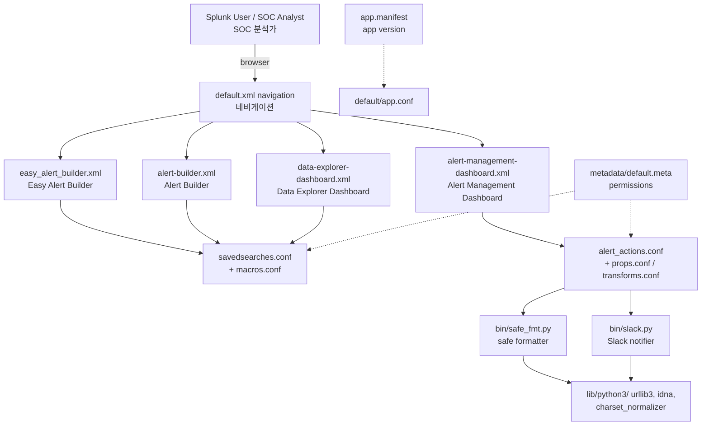

# Security Alert (Splunk App) / 보안 알림 (Splunk 앱)

A production-grade Splunk add-on that ships a unified alert-management dashboard, an easy alert builder, and a data-explorer view, bundled with a safe-formatting helper and a Slack notifier. This repository also preserves historical and resume-style documentation under `resume/` and operational notes under `docs/`.

프로덕션급 Splunk 애드온으로, 통합 알림 관리 대시보드, 손쉬운 알림 빌더, 데이터 탐색기 뷰를 제공하며 안전한 포맷팅 헬퍼와 Slack 알림 스크립트를 함께 번들합니다. 본 저장소는 `resume/` 및 `docs/` 아래에 운영/아카이브 문서를 함께 보관합니다.

---

## 1. Overview / 개요

`security_alert/` is a Splunk app that:

- Replaces ad-hoc alerting with a guided **Easy Alert Builder** and a richer **Alert Builder** form.
- Provides a centralized **Alert Management Dashboard** to triage and audit alerts.
- Provides a **Data Explorer Dashboard** to investigate the underlying events that triggered alerts.
- Includes a **Slack notification script** (`bin/slack.py`) and a **safe formatter** (`bin/safe_fmt.py`) used by alert actions and custom commands.
- Vendors a self-contained Python 3 runtime under `lib/python3/` (urllib3, idna, charset-normalizer) so the app works on air-gapped Splunk instances without pip.

`security_alert/`는 다음과 같은 Splunk 앱입니다.

- 일회성 알림 작성을 **Easy Alert Builder**와 풍부한 **Alert Builder** 폼으로 표준화합니다.
- 알림을 분류·감사할 수 있는 중앙 집중식 **Alert Management Dashboard**를 제공합니다.
- 알림을 트리거한 이벤트를 조사할 수 있는 **Data Explorer Dashboard**를 제공합니다.
- 알림 액션과 커스텀 명령이 사용하는 **Slack 알림 스크립트**(`bin/slack.py`) 및 **안전 포맷터**(`bin/safe_fmt.py`)를 포함합니다.
- 폐쇄망 Splunk 인스턴스에서도 pip 없이 동작하도록 `lib/python3/` 아래에 urllib3, idna, charset-normalizer 등 Python 3 런타임을 자체 번들합니다.

### Intended audience / 대상 사용자

- Splunk administrators running Security Operations or IT Operations use cases.
- SOC analysts who need a self-service way to author, review, and triage alerts.
- Detection engineers who want versioned, code-reviewable alert definitions.

---

## 2. Features / 기능

| Area | Feature |
| --- | --- |
| Alerting | Easy Alert Builder — guided, low-friction alert authoring. |
| Alerting | Alert Builder — full-power form for complex saved searches. |
| Operations | Alert Management Dashboard — bulk enable/disable, ownership, and status. |
| Investigation | Data Explorer Dashboard — pivots from an alert into raw events. |
| Notifications | Slack alert action with safe string formatting (`safe_fmt.py`). |
| Portability | Self-contained Python 3 runtime — no external PyPI dependencies. |
| Lifecycle | App manifest (`app.manifest`) for Splunkbase-style packaging. |

| 영역 | 기능 |
| --- | --- |
| 알림 작성 | Easy Alert Builder — 단계별 가이드로 알림을 손쉽게 생성. |
| 알림 작성 | Alert Builder — 복잡한 saved search를 위한 풀 폼 빌더. |
| 운영 | Alert Management Dashboard — 일괄 활성화/비활성화, 소유자, 상태 관리. |
| 조사 | Data Explorer Dashboard — 알림에서 원시 이벤트로 피벗. |
| 알림 전송 | 안전한 문자열 포맷팅을 사용하는 Slack 알림 액션(`safe_fmt.py`). |
| 이식성 | 자체 포함 Python 3 런타임 — 외부 PyPI 의존성 없음. |
| 수명주기 | Splunkbase 스타일 패키징을 위한 앱 매니페스트(`app.manifest`). |

---

## 3. Architecture / 아키텍처

The app follows the standard Splunk app layout: configuration under `default/`, view XML under `data/ui/`, scripts under `bin/`, and vendored Python under `lib/python3/`. Alert actions and saved searches are wired through the standard Splunk configuration layers (props/transforms/macros/alert_actions).

이 앱은 표준 Splunk 앱 레이아웃을 따릅니다. 설정은 `default/`, 뷰 XML은 `data/ui/`, 스크립트는 `bin/`, 번들 Python은 `lib/python3/`에 위치합니다. 알림 액션과 saved search는 Splunk 표준 설정 계층(props/transforms/macros/alert_actions)을 통해 연결됩니다.



> Note / 참고: Any node label that contains `<` or `>` is quoted and HTML-escaped (e.g. `&lt;...&gt;`) so that GitHub renders the Mermaid diagram correctly.

---

## 4. Repository Layout / 저장소 구조

```
.
├── CONTRIBUTING.md
├── LICENSE
├── README.md
├── resume/
│   ├── API.md
│   ├── ARCHITECTURE.md
│   ├── DEPLOYMENT.md
│   └── TROUBLESHOOTING.md
├── docs/
│   ├── ALERT-REPOSITORY-XWIKI.md
│   ├── DEPLOYMENT.md
│   ├── LEGACY-CLEANUP-REPORT.md
│   ├── QUICK-START.md
│   └── RELEASE-NOTES.md
├── demo/
│   └── README.md
└── security_alert/
    ├── README.md
    ├── app.manifest
    ├── bin/
    │   ├── safe_fmt.py
    │   ├── six.py
    │   └── slack.py
    ├── metadata/
    │   └── default.meta
    ├── default/
    │   ├── alert_actions.conf
    │   ├── app.conf
    │   ├── macros.conf
    │   ├── props.conf
    │   ├── savedsearches.conf
    │   ├── transforms.conf
    │   └── data/
    │       └── ui/
    │           ├── nav/default.xml
    │           └── views/
    │               ├── alert-builder.xml
    │               ├── alert-management-dashboard.xml
    │               ├── data-explorer-dashboard.xml
    │               └── easy_alert_builder.xml
    └── lib/
        └── python3/
            ├── idna-3.11.dist-info/
            ├── urllib3/
            └── charset_normalizer-3.4.4.dist-info/
```

---

## 5. Quick Start / 빠른 시작

### 5.1 Prerequisites / 사전 요구 사항

- Splunk Enterprise or Splunk Cloud (version compatible with the app's `app.conf`).
- Write access to `$SPLUNK_HOME/etc/apps/` on the deployment server or search head.
- (Optional) An incoming webhook URL for Slack notifications.

### 5.2 Install the app / 앱 설치

```bash
# 1. Clone or download this repository
git clone <your-internal-git-host>/security_alert.git
cd security_alert

# 2. Copy the app directory into Splunk's apps folder
cp -r security_alert "$SPLUNK_HOME/etc/apps/security_alert"

# 3. Validate that the app is recognized
"$SPLUNK_HOME/bin/splunk" display app security_alert

# 4. (Re)start Splunk if required
"$SPLUNK_HOME/bin/splunk" restart
```

### 5.3 Verify the dashboards / 대시보드 확인

1. Sign in to Splunk Web.
2. Open the **Security Alert** app from the app picker.
3. Confirm that the following views are listed in the navigation:
   - Easy Alert Builder
   - Alert Builder
   - Alert Management Dashboard
   - Data Explorer Dashboard

### 5.4 First alert (no Slack) / 첫 알림 (Slack 없이)

1. Navigate to **Easy Alert Builder**.
2. Pick an index, give the alert a name, and submit.
3. Open **Alert Management Dashboard** and confirm the new saved search appears.
4. Run the saved search manually once to validate the query.

---

## 6. Configuration / 설정

All configuration files live under `security_alert/default/`. The most common knobs are:

| File | Purpose |
| --- | --- |
| `app.conf` | App metadata, label, version, UI nav visibility. |
| `savedsearches.conf` | The alert definitions that drive the dashboards. |
| `alert_actions.conf` | Maps alert actions (Slack, etc.) to the scripts in `bin/`. |
| `macros.conf` | Reusable SPL macros referenced by saved searches. |
| `props.conf` / `transforms.conf` | Field extractions used by the alert pipeline. |
| `metadata/default.meta` | Capability/ownership for app objects. |

| 파일 | 용도 |
| --- | --- |
| `app.conf` | 앱 메타데이터, 라벨, 버전, UI 네비게이션 노출 여부. |
| `savedsearches.conf` | 대시보드를 구동하는 알림 정의. |
| `alert_actions.conf` | 알림 액션(Slack 등)을 `bin/` 스크립트에 매핑. |
| `transforms.conf` | 알림 파이프라인이 사용하는 필드 추출. |
| `macros.conf` | saved search에서 참조하는 재사용 SPL 매크로. |
| `props.conf` | 인덱스/소스별 필드 추출 규칙. |
| `metadata/default.meta` | 앱 객체에 대한 권한/소유자. |

### 6.1 Slack alert action / Slack 알림 액션

The bundled `bin/slack.py` reads a webhook URL from an alert action parameter. To enable:

1. In Splunk Web, go to **Settings → Alert actions**.
2. Create or edit the Slack action and paste the incoming webhook URL.
3. In `alert_actions.conf`, ensure the script is referenced as `slack.py`.
4. Test by triggering a saved search with the action enabled.

> Security tip / 보안 팁: Do not commit webhook URLs into the repository. Use Splunk's encrypted credential storage or a secrets manager and reference the secret from the alert action configuration.

### 6.2 Permissions / 권한

Edit `metadata/default.meta` to grant read/write access to specific roles. The default config ships with conservative capabilities suitable for SOC teams.

---

## 7. Commands Reference / 명령어 참조

| Command | Description |
| --- | --- |
| `splunk display app security_alert` | Confirm the app is installed and valid. |
| `splunk restart` | Apply app.conf / nav changes. |
| `splunk search '| savedsearch "security_alert:<name>"'` | Manually run a shipped alert. |
| `splunk cmd python bin/safe_fmt.py < input.json` | Smoke-test the safe formatter locally. |
| `splunk cmd python bin/slack.py < input.json` | Smoke-test the Slack script locally. |

| 명령어 | 설명 |
| --- | --- |
| `splunk display app security_alert` | 앱 설치 및 유효성 확인. |
| `splunk restart` | app.conf/네비게이션 변경 사항 적용. |
| `splunk search '| savedsearch "security_alert:<name>"'` | 포함된 알림을 수동 실행. |
| `splunk cmd python bin/safe_fmt.py < input.json` | 안전 포맷터 로컬 스모크 테스트. |
| `splunk cmd python bin/slack.py < input.json` | Slack 스크립트 로컬 스모크 테스트. |

> Replace `<input.json>` with a small JSON document that matches the script's expected keys, or pipe from a real saved-search payload.

---

## 8. Local Development / 로컬 개발

### 8.1 Recommended workflow / 권장 워크플로

1. Develop the app on a dedicated search head or a Splunk Docker container.
2. Symlink `security_alert/` into `$SPLUNK_HOME/etc/apps/` so edits are picked up without re-installation.
3. After editing any `*.conf` file, run `splunk restart` or use `splunk _internal call /services/apps/local/security_alert/_reload`.
4. After editing any XML view, refresh the browser; Splunk caches views aggressively.

### 8.2 Editing views / 뷰 편집

- The four dashboards under `default/data/ui/views/` are plain XML.
- Use the Splunk Web **Source** editor to iterate, then copy the resulting XML back into the file.
- Validate that no `<` or `>` characters leak into Mermaid snippets in the dashboard's inline markdown panels.

### 8.3 Editing scripts / 스크립트 편집

- `bin/safe_fmt.py` and `bin/slack.py` are pure Python 3.
- The vendored runtime under `lib/python3/` is read-only; do not modify it in place. If you need a newer dependency, add a `.dist-info` directory and the corresponding top-level package alongside the existing ones.
- Keep all imports local to the app; do not assume the Splunk system Python has the modules you need.

### 8.4 Reference docs in this repo / 저장소 내 참고 문서

- `docs/QUICK-START.md` — step-by-step bring-up.
- `docs/DEPLOYMENT.md` — deployment server and app distribution notes.
- `docs/RELEASE-NOTES.md` — version history.
- `docs/LEGACY-CLEANUP-REPORT.md` — historical cleanup summary.
- `docs/ALERT-REPOSITORY-XWIKI.md` — cross-references to the internal XWiki alert catalog.
- `resume/API.md`, `resume/ARCHITECTURE.md`, `resume/DEPLOYMENT.md`, `resume/TROUBLESHOOTING.md` — preserved design/operations writeups.
- `demo/README.md` — description of the demo environment.

---

## 9. Testing / 테스트

There is no automated test suite checked in; verification is done in Splunk. Recommended checks before shipping a change:

1. **Lint configs** — validate `*.conf` files with `splunk btool`:

   ```bash
   "$SPLUNK_HOME/bin/splunk" btool check --app=security_alert
   ```

2. **Validate XML** — `xmllint --noout security_alert/default/data/ui/views/*.xml`.
3. **Smoke-test scripts** — feed known JSON payloads into `bin/safe_fmt.py` and `bin/slack.py` and assert expected output.
4. **Manual saved-search run** — run one of the shipped saved searches end-to-end, including the alert action.
5. **Dashboard render** — open each of the four views in a browser and confirm panels render with sample data.

자동화된 테스트 스위트는 포함되어 있지 않으며, 검증은 Splunk 내부에서 수행합니다. 변경 사항을 출시하기 전 다음을 권장합니다.

1. **설정 린트** — `splunk btool`로 `*.conf` 검증.
2. **XML 검증** — `xmllint --noout`로 뷰 XML 검증.
3. **스크립트 스모크 테스트** — 알려진 JSON 페이로드를 `bin/safe_fmt.py` 및 `bin/slack.py`에 입력하고 예상 출력 확인.
4. **수동 saved search 실행** — 알림 액션 포함하여 포함된 saved search를 종단 간 실행.
5. **대시보드 렌더링** — 네 개 뷰를 브라우저에서 열어 샘플 데이터로 패널이 렌더링되는지 확인.

---

## 10. Contribution Guide / 기여 가이드

Please read [`CONTRIBUTING.md`](./CONTRIBUTING.md) before opening a pull request. The high-level rules:

- Branch from `main`. Use descriptive branch names (`feature/easy-alert-template`, `fix/slack-empty-payload`, ...).
- Keep changes scoped: one app concern per PR (configs, views, scripts, docs).
- Update `docs/RELEASE-NOTES.md` and bump the version in `security_alert/app.manifest` when user-visible behavior changes.
- Do not commit secrets, webhook URLs, customer data, or internal hostnames.
- For Splunk `.conf` files, preserve section ordering and four-space indentation to minimize merge noise.

PR을 열기 전에 [`CONTRIBUTING.md`](./CONTRIBUTING.md)를 먼저 읽어 주세요. 핵심 규칙은 다음과 같습니다.

- `main`에서 브랜치 생성. 브랜치 이름은 서술적으로 작성합니다.
- 변경 범위는 PR당 하나의 앱 관심사(설정/뷰/스크립트/문서)로 제한합니다.
- 사용자가 인지하는 동작이 바뀌면 `docs/RELEASE-NOTES.md`를 갱신하고 `security_alert/app.manifest`의 버전을 올립니다.
- 비밀값, 웹훅 URL, 고객 데이터, 내부 호스트명은 커밋하지 않습니다.
- Splunk `.conf` 파일은 섹션 순서와 4-space 들여쓰기를 유지하여 머지 충돌을 최소화합니다.

---

## 11. License / 라이선스

This project is released under the terms described in [`LICENSE`](./LICENSE).

본 프로젝트는 [`LICENSE`](./LICENSE)에 명시된 조건에 따라 배포됩니다.