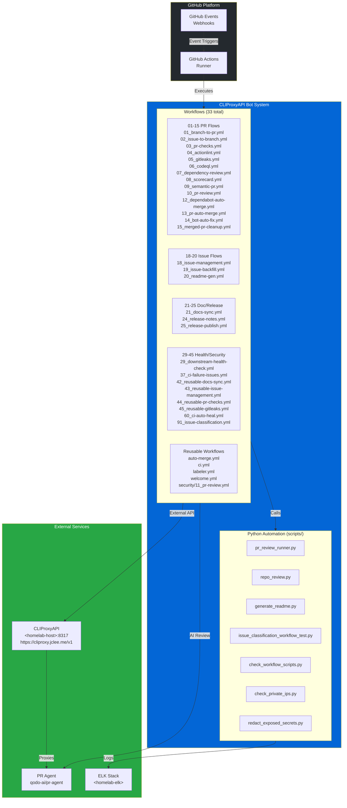

# GitHub Automation Bot — CLIProxyAPI v2.0

[](https://cliproxy.jclee.me)
[](#automation-inventory--자동화-인벤토리)
[](https://www.python.org/)
[](./LICENSE)

> **English** | [**한국어**](#개요)

---

## Table of Contents

- [Overview](#overview--개요)
- [Features](#features--주요-기능)
- [Architecture](#architecture--아키텍처)
- [Automation Inventory](#automation-inventory--자동화-인벤토리)
- [Quick Start](#quick-start--빠른-시작)
- [Local Development](#local-development--로컬-개발)
- [Commands Reference](#commands-reference--명령어-참조)
- [Contribution Guide](#contribution-guide--기여-가이드)

---

## Overview | 개요

This repository contains the **CLIProxyAPI v2.0 GitHub Automation Bot** — a comprehensive system of **33 GitHub Actions workflows** and Python-based automation tools that provide automated code review, issue management, PR handling, documentation generation, and release automation for GitHub repositories.

이 저장소는 **CLIProxyAPI v2.0 GitHub 자동화 봇**을 포함하고 있으며, GitHub 저장소에 대한 자동화된 코드 리뷰, 이슈 관리, PR 처리, 문서 생성 및 릴리스 자동화를 제공하는 **33개의 GitHub Actions 워크플로우**와 Python 기반 자동화 도구의 종합 시스템입니다.

### Key Characteristics | 주요 특성

| Characteristic 특성 | Description 설명 |
|---|---|
| **Architecture** 아키텍처 | Python-based GitHub App + GitHub Actions |
| **Automation Scope** 자동화 범위 | 33 workflows covering PR, issues, security, releases |
| **Core Scripts** 핵심 스크립트 | `scripts/` (Python automation tools) |
| **External Services** 외부 서비스 | CLIProxyAPI (`cliproxy.jclee.me`), PR Agent (`qodo-ai/pr-agent`) |
| **Logging** 로깅 | ELK stack (`<homelab-elk>`) |

---

## Features | 주요 기능

### Automated Code Review | 자동화 코드 리뷰

- **PR Agent Integration**: AI-powered code reviews using `qodo-ai/pr-agent`
- **PR Review Workflow**: Automated review assignment and comment management via `10_pr-review.yml` and `security/11_pr-review.yml`
- **Gitleaks Scanning**: Secret detection in PRs via `05_gitleaks.yml`
- **CodeQL Analysis**: Security vulnerability scanning via `06_codeql.yml`

### Issue Management | 이슈 관리

- **Auto Branch Creation**: Automatically create branches from issues via `02_issue-to-branch.yml`
- **Issue Classification**: Categorize and label issues automatically via `91_issue-classification.yml`
- **Issue Backfill**: Synchronize issues across repositories via `19_issue-backfill.yml`
- **Auto Issue Creation**: Create issues from CI failures via `37_ci-failure-issues.yml`

### Pull Request Automation | 풀 리퀘스트 자동화

- **Branch to PR**: Convert branches to pull requests via `01_branch-to-pr.yml`
- **Semantic PR Validation**: Enforce conventional commit messages via `09_semantic-pr.yml`
- **Auto Merge**: Automatically merge PRs based on conditions via `13_pr-auto-merge.yml`
- **Dependabot Auto Merge**: Handle dependency updates via `12_dependabot-auto-merge.yml`
- **PR Auto Fix**: Automatically fix common issues via `14_bot-auto-fix.yml`
- **Merged PR Cleanup**: Clean up after PR merges via `15_merged-pr-cleanup.yml`

### Documentation | 문서화

- **README Generation**: Automatically generate and update README files via `20_readme-gen.yml`
- **Docs Sync**: Synchronize documentation across repositories via `21_docs-sync.yml` and `42_reusable-docs-sync.yml`

### Release Automation | 릴리스 자동화

- **Release Notes**: Generate release notes automatically via `24_release-notes.yml`
- **Release Publishing**: Publish releases via `25_release-publish.yml`

### Security & Compliance | 보안 및 규정 준수

- **Dependency Review**: Scan dependencies for vulnerabilities via `07_dependency-review.yml`
- **Scorecard Security**: OpenSSF security scorecard via `08_scorecard.yml`
- **Actionlint**: Lint GitHub Actions workflows via `04_actionlint.yml`

### Health Monitoring | 상태 모니터링

- **Downstream Health Check**: Monitor downstream repository health via `29_downstream-health-check.yml`
- **CI Auto Heal**: Automatically fix CI failures via `60_ci-auto-heal.yml`

---

## Architecture | 아키텍처



---

## Automation Inventory | 자동화 인벤토리

### Workflow Files | 워크플로우 파일

#### PR & Branch Automation | PR 및 브랜치 자동화

| Workflow File | Description 설명 |
|---|---|
| `01_branch-to-pr.yml` | Automatically create pull requests from branches |
| `02_issue-to-branch.yml` | Create branches from issues |
| `03_pr-checks.yml` | Run checks on pull requests |
| `09_semantic-pr.yml` | Validate commit message format |
| `13_pr-auto-merge.yml` | Automatically merge qualifying PRs |
| `15_merged-pr-cleanup.yml` | Clean up after PR merge |
| `auto-merge.yml` | Reusable auto-merge workflow |

#### Code Review & Security | 코드 리뷰 및 보안

| Workflow File | Description 설명 |
|---|---|
| `05_gitleaks.yml` | Scan for secrets and credentials |
| `06_codeql.yml` | CodeQL security analysis |
| `10_pr-review.yml` | Automated PR review |
| `security/11_pr-review.yml` | Security-focused PR review |
| `44_reusable-pr-checks.yml` | Reusable PR check workflow |
| `45_reusable-gitleaks.yml` | Reusable Gitleaks workflow |

#### Issue Management | 이슈 관리

| Workflow File | Description 설명 |
|---|---|
| `18_issue-management.yml` | Manage issue lifecycle |
| `19_issue-backfill.yml` | Sync issues across repos |
| `37_ci-failure-issues.yml` | Create issues from CI failures |
| `43_reusable-issue-management.yml` | Reusable issue management |
| `91_issue-classification.yml` | Classify and label issues |

#### Documentation | 문서화

| Workflow File | Description 설명 |
|---|---|
| `20_readme-gen.yml` | Generate README files |
| `21_docs-sync.yml` | Synchronize documentation |
| `42_reusable-docs-sync.yml` | Reusable docs sync workflow |

#### Release & Deployment | 릴리스 및 배포

| Workflow File | Description 설명 |
|---|---|
| `24_release-notes.yml` | Generate release notes |
| `25_release-publish.yml` | Publish releases |

#### Health & Monitoring | 상태 및 모니터링

| Workflow File | Description 설명 |
|---|---|
| `29_downstream-health-check.yml` | Monitor downstream repos |
| `60_ci-auto-heal.yml` | Auto-fix CI failures |

#### Additional Workflows | 추가 워크플로우

| Workflow File | Description 설명 |
|---|---|
| `04_actionlint.yml` | Lint GitHub Actions |
| `07_dependency-review.yml` | Dependency vulnerability review |
| `08_scorecard.yml` | OpenSSF Scorecard |
| `12_dependabot-auto-merge.yml` | Auto-merge Dependabot PRs |
| `14_bot-auto-fix.yml` | Auto-fix common issues |
| `ci.yml` | Main CI workflow |
| `labeler.yml` | Auto-label issues/PRs |
| `welcome.yml` | Welcome new contributors |

### Python Automation Scripts | Python 자동화 스크립트

| Script | Description 설명 |
|---|---|
| `pr_review_runner.py` | Runs AI-powered PR reviews |
| `repo_review.py` | Repository-wide review automation |
| `generate_readme.py` | README generation |
| `check_workflow_scripts.py` | Validate workflow files |
| `check_private_ips.py` | Scan for hardcoded private IPs |
| `check_hardcode_scan_patterns_test.py` | Check for hardcoded patterns |
| `issue_classification_workflow_test.py` | Issue classification logic |
| `issue_classifier_js_test.py` | JavaScript issue classifier tests |
| `pr_review_runner_test.py` | PR review tests |
| `readme_mermaid_test.py` | Mermaid diagram validation |
| `redact_exposed_secrets.py` | Redact sensitive data |
| `check_workflow_scripts_test.py` | Workflow validation tests |
| `check_private_ips_test.py` | Private IP check tests |

---

## Quick Start | 빠른 시작

### Prerequisites | 사전 요구사항

- Python 3.x
- Git
- GitHub CLI (optional)
- Docker (for containerized development)

### Installation | 설치

```bash
# Clone the repository
git clone https://github.com/jclee941/.github
cd CLIProxyAPI

# Install dependencies
pip install -r _bot-scripts/requirements.txt
pip install -r _bot-scripts/requirements-dev.txt

# Install the package in development mode
cd _bot-scripts
pip install -e .
```

### Basic Setup | 기본 설정

1. **Set up environment variables:**

```bash
export CLIPROXY_API_URL="https://cliproxy.jclee.me/v1"
export GITHUB_TOKEN="your_github_token"
export ELK_HOST="<homelab-elk>"
```

2. **Configure webhooks** for your GitHub App

3. **Review workflow configurations** in `.github/workflows/`

---

## Local Development | 로컬 개발

### Development Environment | 개발 환경

```bash
# Navigate to bot scripts directory
cd _bot-scripts

# Run tests
make test

# Run linting
make lint

# Format code
make format
```

### Running Workflows Locally | 로컬에서 워크플로우 실행

```bash
# Using act (GitHub Actions local runner)
act -l  # List available workflows
act -W .github/workflows/10_pr-review.yml

# Or run individual scripts directly
python scripts/pr_review_runner.py --pr-url https://github.com/owner/repo/pull/123
```

### Docker Development | Docker 개발

```bash
# Build GitHub App image
cd _bot-scripts
docker build -f Dockerfile.github_app -t cli-proxy-app .

# Build GitHub Action image
docker build -f Dockerfile.github_action -t cli-proxy-action .

# Run with docker-compose
docker-compose -f docker-compose.github_app.yml up
```

### Testing | 테스트

```bash
# Run all tests
cd _bot-scripts
python -m pytest tests/ -v

# Run specific test categories
python -m pytest tests/test_pr_review.py -v
python -m pytest tests/test_issue_classifier.py -v

# Run with coverage
python -m pytest --cov=. --cov-report=html
```

---

## Commands Reference | 명령어 참조

### Makefile Commands (in `_bot-scripts/`) | Makefile 명령어

```bash
make help              # Show available commands
make install          # Install dependencies
make install-dev      # Install dev dependencies
make test            # Run tests
make lint            # Run linting
make format          # Format code
make build           # Build package
make clean           # Clean build artifacts
```

### Python Scripts | Python 스크립트

```bash
# PR Review Runner
python scripts/pr_review_runner.py --pr-url <pr_url> [--config <config_path>]

# Repository Review
python scripts/repo_review.py --repo <owner/repo> [--output <output_path>]

# README Generator
python scripts/generate_readme.py --template <template> --output <output>

# Private IP Checker
python scripts/check_private_ips.py --path <path> [--exclude <pattern>]

# Workflow Scripts Checker
python scripts/check_workflow_scripts.py --workflows-dir .github/workflows

# Secret Redactor
python scripts/redact_exposed_secrets.py --input <file> --output <file>
```

### Docker Commands | Docker 명령어

```bash
# GitHub App
docker build -f _bot-scripts/Dockerfile.github_app -t cli-proxy-app .
docker run -p 8000:8000 cli-proxy-app

# GitHub Action
docker build -f _bot-scripts/Dockerfile.github_action -t cli-proxy-action .
docker run cli-proxy-action

# docker-compose
docker-compose -f _bot-scripts/docker-compose.github_app.yml up -d
```

---

## Contribution Guide | 기여 가이드

### How to Contribute | 기여 방법

1. **Fork the repository**
2. **Create a feature branch:**

   ```bash
   git checkout -b feature/your-feature-name
   ```

3. **Make your changes** following the coding standards
4. **Run tests:**

   ```bash
   cd _bot-scripts
   make test
   ```

5. **Commit your changes** using conventional commits:

   ```bash
   git commit -m "feat: add new feature"
   ```

6. **Push and create a Pull Request**

### Coding Standards | 코딩 표준

- Follow **PEP 8** for Python code
- Use **type hints** where possible
- Write **docstrings** for all public functions
- Include **tests** for new functionality
- Run **linting** before committing:

  ```bash
  make lint
  make format
  ```

### Commit Message Format | 커밋 메시지 형식

```
<type>(<scope>): <description>

[optional body]

[optional footer]
```

**Types:**

| Type | Description |
|------|-------------|
| `feat` | New feature |
| `fix` | Bug fix |
| `docs` | Documentation changes |
| `style` | Code style changes |
| `refactor` | Code refactoring |
| `test` | Test changes |
| `chore` | Maintenance tasks |

### Workflow Development Guidelines | 워크플로우 개발 가이드라인

- Place new workflows in `.github/workflows/` with numeric prefix
- Follow naming convention: `{priority}_{workflow-name}.yml`
- Include `on.push` and `on.pull_request` triggers where applicable
- Use reusable workflows from `44_reusable-*.yml` when possible
- Add appropriate permissions to workflow files

### Adding New Automation | 새로운 자동화 추가

1. **Python Scripts**: Add to `scripts/` directory with accompanying tests
2. **Workflows**: Create in `.github/workflows/` following existing patterns
3. **Documentation**: Update relevant docs in `docs/`
4. **Tests**: Add tests in `tests/` directory

### Reporting Issues | 이슈 신고

- Use GitHub Issues for bug reports and feature requests
- Include reproduction steps for bugs
- Label appropriately using `18_issue-management.yml` automation

### License | 라이선스

This project is proprietary. See [LICENSE](./LICENSE) for details.

---

## Support | 지원

- **Documentation**: See `docs/` directory
- **Demo**: See `demo/README.md`
- **Security Alerts**: See `security_alert/README.md`

---

## Links | 링크

| Resource | URL |
|----------|-----|
| CLIProxyAPI | <https://cliproxy.jclee.me> |
| PR Agent | <https://qodo-ai/pr-agent> |
| Bot Dashboard | <https://bot.jclee.me> |

```

**Note:** The repository structure shows `_bot-scripts/` as a transient CI checkout path used by automation workflows, not a permanent directory in the actual repository layout.
