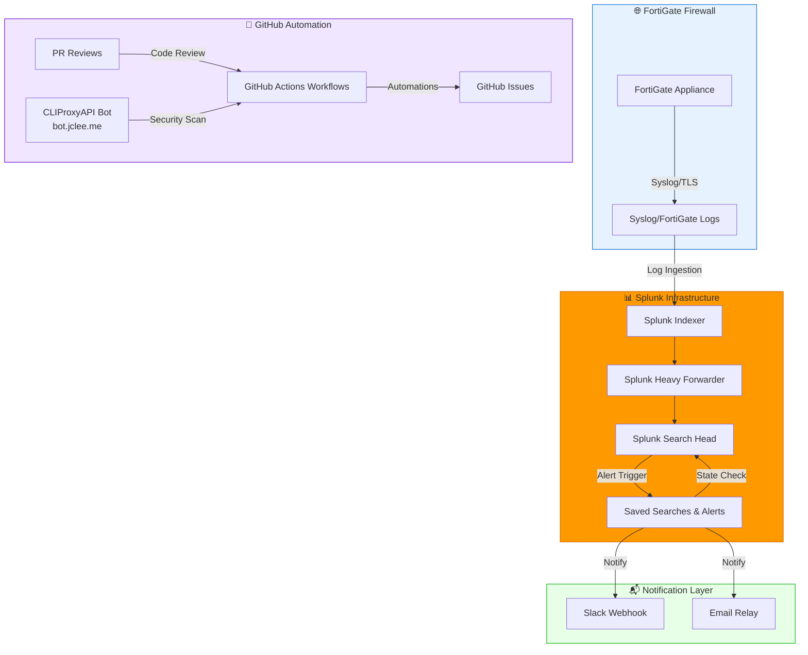

# Splunk Security Alert System for FortiGate

[](https://docs.fortinet.com/product/fortigate/)
[](https://docs.splunk.com/Documentation/SPL)
[](./LICENSE)
[](#automation-inventory)
[](https://cliproxy.jclee.me)

> **English** | [한국어](#개요)

---

## Table of Contents

- [Overview](#overview--개요)
- [Features](#features--주요-기능)
- [Architecture](#architecture--아키텍처)
- [Automation Inventory](#automation-inventory--자동화-인벤토리)
- [Quick Start](#quick-start--빠른-시작)
- [Local Development](#local-development--로컬-개발)
- [Commands Reference](#commands-reference--명령어-참조)
- [Contribution Guide](#contribution-guide--기여-가이드)

---

## Overview | 개요

This repository contains the **Splunk Security Alert System** designed for FortiGate firewall monitoring. It provides **15 production-ready security alerts** with state-aware alerting capabilities that ensure zero duplicate notifications.

이 저장소는 FortiGate 방화벽 모니터링을 위한 **Splunk 보안 경보 시스템**을 포함하고 있습니다. 중복 알림을 방지하는 상태 인식 기능과 함께 **15개의 프로덕션 준비된 보안 경보**를 제공합니다.

### Key Characteristics | 주요 특성

| Characteristic 특성 | Description 설명 |
|---------------------|------------------|
| **Alert Count 경보 수** | 15 production alerts for FortiGate security events FortiGate 보안 이벤트용 15개의 프로덕션 경보 |
| **Architecture 아키텍처** | SPL-First: All logic implemented in Splunk Search Processing Language Splunk 검색 처리 언어로 구현된 모든 로직 |
| **Alerting Model 경보 모델** | State-aware with deduplication to prevent alert storms 경보 폭풍을 방지하기 위한 중복 제거가 있는 상태 인식 |
| **Notification 알림** | Single-line Slack messages for efficient incident response 효율적인 인시던트 대응을 위한 단일 라인 Slack 메시지 |
| **Configuration 설정** | Macro-based for easy customization and air-gapped deployment 쉬운 사용자 정의 및.air-gapped 배포를 위한 매크로 기반 |
| **Deployment 배포** | Air-gapped environment ready/air-gapped 환경 준비完了 |

### Use Case | 사용 사례

This system is designed for security operations teams managing FortiGate firewalls in:

- Enterprise corporate networks
- Data center environments
- Government and compliance-focused deployments
- Air-gapped (internet-isolated) environments

이 시스템은 다음 환경에서 FortiGate 방화벽을 관리하는 보안 운영 팀을 위해 설계되었습니다:

- 기업 네트워크
- 데이터 센터 환경
- 정부 및 컴플라이언스 중심 배포
- Air-gapped (인터넷 격리) 환경

---

## Features | 주요 기능

### Core Capabilities | 핵심 기능

- **15 Production Security Alerts** covering critical FortiGate events:
  - Brute force detection
  - Intrusion prevention system (IPS) alerts
  - Malware detection
  - Policy violations
  - Anomaly detection
  - And more...

- **15개의 FortiGate 이벤트용 프로덕션 보안 경보**:
  - 무차별 대입 공격 탐지
  - 침입 방지 시스템(IPS) 경보
  - 맬웨어 탐지
  - 정책 위반
  - 이상 탐지
  - 기타...

- **State-Aware Alerting Engine**
  - Tracks alert state across evaluation windows
  - Eliminates duplicate notifications
  - Maintains alert history for correlation

- **상태 인식 경보 엔진**
  - 평가 창 전체에서 경보 상태 추적
  - 중복 알림 제거
  - 상관 관계를 위한 경보 기록 유지

- **SPL-First Architecture**
  - All detection logic implemented in Splunk SPL
  - No external dependencies for detection logic
  - Portable across Splunk instances

- **SPL 우선 아키텍처**
  - 모든 탐지 로직이 Splunk SPL로 구현
  - 탐지 로직에 대한 외부 종속성 없음
  - Splunk 인스턴스 간 이식 가능

### Security Automation | 보안 자동화

This repository utilizes **CLIProxyAPI** (a GitHub App bot) for automated code review and security scanning. The bot is accessible at [bot.jclee.me](https://bot.jclee.me) and provides:

이 저장소는 자동화된 코드 검토 및 보안 스캔을 위해 **CLIProxyAPI**(GitHub App 봇)를 활용합니다. 봇은 [bot.jclee.me](https://bot.jclee.me)에서 액세스할 수 있으며 다음을 제공합니다:

- Automated PR reviews using [qodo-ai/pr-agent](https://github.com/qodo-ai/pr-agent)
- Security vulnerability detection
- Private IP address exposure scanning
- Hardcoded credential detection
- Workflow script validation

---

## Architecture | 아키텍처



### Data Flow | 데이터 흐름

1. **Collection**: FortiGate devices send logs via Syslog/TLS to Splunk Indexer
2. **Processing**: Logs are parsed, normalized, and enriched in Splunk Heavy Forwarder
3. **Detection**: Saved Searches execute SPL queries against indexed data
4. **State Management**: Alert macros track previous states to prevent duplicates
5. **Notification**: State transitions trigger Slack/Email notifications
6. **Automation**: GitHub Actions and CLIProxyAPI bot manage repository operations

1. **수집**: FortiGate 장치가 Syslog/TLS를 통해 Splunk Indexer로 로그 전송
2. **처리**: 로그가 Splunk Heavy Forwarder에서 파싱, 정규화, Enrich됨
3. **탐지**: Saved Searches가 인덱스된 데이터에 대해 SPL 쿼리 실행
4. **상태 관리**: 경보 매크로가 중복 방지를 위해 이전 상태 추적
5. **알림**: 상태 전환이 Slack/Email 알림 트리거
6. **자동화**: GitHub Actions 및 CLIProxyAPI 봇이 저장소 작업 관리

---

## Automation Inventory | 자동화 인벤토리

### GitHub Actions Workflows | GitHub Actions 워크플로우

This repository contains **32 active workflow files** providing comprehensive automation:

이 저장소는 포괄적인 자동화를 제공하는 **32개의 활성 워크플로우 파일**을 포함합니다:

#### Pull Request Automation | 풀 리퀘스트 자동화

| Workflow File | Description |
|---------------|-------------|
| `01_branch-to-pr.yml` | Links branches to PRs for tracking |
| `02_issue-to-branch.yml` | Auto-creates branches from issues |
| `03_pr-checks.yml` | Core PR validation checks |
| `04_actionlint.yml` | GitHub Actions workflow linting |
| `05_gitleaks.yml` | Secret scanning in PRs |
| `06_codeql.yml` | CodeQL security analysis |
| `07_dependency-review.yml` | Dependency vulnerability checking |
| `08_scorecard.yml` | OpenSSF security scorecard |
| `09_semantic-pr.yml` | Semantic PR title validation |
| `10_pr-review.yml` | Automated PR review via CLIProxyAPI |
| `12_dependabot-auto-merge.yml` | Auto-merge Dependabot updates |
| `13_pr-auto-merge.yml` | Auto-merge qualified PRs |
| `14_bot-auto-fix.yml` | Bot-triggered auto-fixes |
| `15_merged-pr-cleanup.yml` | Post-merge cleanup tasks |
| `44_reusable-pr-checks.yml` | Reusable PR check workflow |
| `45_reusable-gitleaks.yml` | Reusable gitleaks workflow |
| `security/11_pr-review.yml` | Security-focused PR review |

#### Issue Management | 이슈 관리

| Workflow File | Description |
|---------------|-------------|
| `18_issue-management.yml` | Automated issue lifecycle management |
| `19_issue-backfill.yml` | Backfill issues from external sources |
| `43_reusable-issue-management.yml` | Reusable issue management |
| `37_ci-failure-issues.yml` | Auto-create issues from CI failures |

#### Documentation | 문서화

| Workflow File | Description |
|---------------|-------------|
| `20_readme-gen.yml` | Auto-generate README updates |
| `21_docs-sync.yml` | Synchronize documentation |
| `24_release-notes.yml` | Generate release notes |
| `25_release-publish.yml` | Publish releases |
| `42_reusable-docs-sync.yml` | Reusable docs sync workflow |

#### Release & Deployment | 릴리스 및 배포

| Workflow File | Description |
|---------------|-------------|
| `24_release-notes.yml` | Release note generation |
| `25_release-publish.yml` | Release publishing automation |
| `29_downstream-health-check.yml` | Downstream system health checks |

#### Repository Maintenance | 저장소 유지보수

| Workflow File | Description |
|---------------|-------------|
| `auto-merge.yml` | General auto-merge logic |
| `ci.yml` | Primary CI pipeline |
| `labeler.yml` | Auto-label PRs/issues |
| `welcome.yml` | Welcome message for contributors |
| `60_ci-auto-heal.yml` | CI self-healing automation |

### Automation Tools | 자동화 도구

| Tool | Purpose | Integration |
|------|---------|-------------|
| **CLIProxyAPI** | PR review automation via [cliproxy.jclee.me](https://cliproxy.jclee.me) | GitHub App |
| **qodo-ai/pr-agent** | AI-powered code review | Via CLIProxyAPI |
| **gitleaks** | Secret scanning | Workflow: `05_gitleaks.yml` |
| **actionlint** | Workflow validation | Workflow: `04_actionlint.yml` |
| **CodeQL** | Static analysis | Workflow: `06_codeql.yml` |
| **OpenSSF Scorecard** | Security scoring | Workflow: `08_scorecard.yml` |
| **Dependency Review** | Dependency analysis | Workflow: `07_dependency-review.yml` |

---

## Quick Start | 빠른 시작

### Prerequisites | 사전 요구사항

- Splunk Enterprise or Splunk Cloud
- FortiGate devices with logging enabled
- GitHub App permissions for automation features

### Installation | 설치

1. **Clone the repository**

   ```bash
   git clone https://github.com/<owner>/<repo>.git
   cd <repo>
   ```

2. **Install Splunk content**
   - Import saved searches from `security_alert/` directory
   - Configure Splunk macros for your environment
   - Set up syslog inputs for FortiGate logs

3. **Configure notifications**

   ```bash
   # Set Slack webhook URL
   export SLACK_WEBHOOK_URL="https://hooks.slack.com/services/YOUR/WEBHOOK/URL"
   
   # Set notification preferences
   export ALERT_NOTIFY_SLACK="true"
   export ALERT_NOTIFY_EMAIL="true"
   ```

4. **Install bot dependencies** (for local development)

   ```bash
   cd _bot-scripts
   pip install -r requirements.txt
   ```

---

## Local Development | 로컬 개발

### Repository Structure | 저장소 구조

```
/
├── _bot-scripts/              # CLIProxyAPI bot application
│   ├── scripts/               # Python automation scripts
│   ├── Dockerfile.github_app # Bot container definition
│   ├── requirements.txt      # Python dependencies
│   └── ...
├── security_alert/            # Splunk security alert definitions
│   ├── app.manifest          # Splunk app manifest
│   └── lib/                  # Python dependencies for Splunk
├── docs/                      # Documentation
│   ├── QUICK-START.md        # Quick start guide
│   ├── DEPLOYMENT.md          # Deployment instructions
│   └── RELEASE-NOTES.md       # Release information
├── tests/                     # Test suite
├── demo/                      # Demo materials
├── .github/
│   └── workflows/            # GitHub Actions workflows (32 files)
├── CONTRIBUTING.md            # Contribution guidelines
└── LICENSE                    # License file
```

### Development Setup | 개발 환경 설정

```bash
# Clone and enter repository
git clone https://github.com/<owner>/<repo>.git
cd <repo>

# Set up Python virtual environment for bot development
python3 -m venv venv
source venv/bin/activate

# Install bot dependencies
cd _bot-scripts
pip install -r requirements.txt
pip install -r requirements-dev.txt

# Install pre-commit hooks
cd ..
pre-commit install
```

### Testing | 테스트

```bash
# Run bot script tests
cd _bot-scripts
python -m pytest scripts/ -v

# Run specific test
python -m pytest scripts/check_private_ips_test.py -v

# Run workflow validation locally
actionlint -color .
```

---

## Commands Reference | 명령어 참조

### Bot Scripts | 봇 스크립트

| Command | Description |
|---------|-------------|
| `python scripts/repo_review.py` | Run full repository review |
| `python scripts/pr_review_runner.py` | Execute PR review pipeline |
| `python scripts/check_private_ips.py` | Scan for hardcoded private IPs |
| `python scripts/check_hardcode_scan_patterns_test.py` | Validate scan patterns |
| `python scripts/redact_exposed_secrets.py` | Redact detected secrets |
| `python scripts/check_workflow_scripts.py` | Validate workflow scripts |

### GitHub Actions (Manual Triggers) | GitHub Actions (手動 트리거)

| Workflow | Trigger | Purpose |
|----------|---------|---------|
| `20_readme-gen.yml` | workflow_dispatch | Regenerate README documentation |
| `21_docs-sync.yml` | workflow_dispatch | Sync documentation updates |
| `24_release-notes.yml` | workflow_dispatch | Generate release notes |
| `25_release-publish.yml` | workflow_dispatch | Publish a release |
| `29_downstream-health-check.yml` | workflow_dispatch | Check downstream systems |
| `60_ci-auto-heal.yml` | workflow_dispatch | Heal CI pipeline |

### Make Commands (Bot Scripts) | Make 명령어 (봇 스크립트)

```bash
# From _bot-scripts/ directory
make help              # Show available targets
make install           # Install dependencies
make test              # Run test suite
make lint              # Run linters
make format            # Format code
```

---

## Contribution Guide | 기여 가이드

### Getting Started | 시작하기

1. **Fork the repository**
2. **Create a feature branch**

   ```bash
   git checkout -b feature/your-feature-name
   ```

3. **Make your changes**
   - Follow existing code style
   - Add tests for new functionality
   - Update documentation as needed

4. **Run checks locally**

   ```bash
   # Lint your changes
   actionlint -color .
   
   # Run tests
   cd _bot-scripts && python -m pytest
   
   # Check for secrets
   gitleaks detect --source . --verbose
   ```

5. **Submit a pull request**
   - Use a clear, descriptive title
   - Reference any related issues
   - Ensure all CI checks pass

### Commit Message Format | 커밋 메시지 형식

This project follows **Conventional Commits** specification:

```
<type>(<scope>): <description>

[optional body]

[optional footer(s)]
```

**Types:**

- `feat`: New feature
- `fix`: Bug fix
- `docs`: Documentation changes
- `style`: Code style changes
- `refactor`: Code refactoring
- `test`: Test changes
- `chore`: Maintenance tasks

**Examples:**

```
feat(alerts): add new IPS detection alert
fix(state): resolve duplicate notification issue
docs(readme): update architecture diagram
```

### Code Review Process | 코드 검토 프로세스

All PRs require:

1. At least one approval (or CLIProxyAPI automated review)
2. All automated checks passing
3. No unresolved conversations
4. Branch up to date with base branch

### Security Reporting | 보안 보고

For security vulnerabilities, please refer to [SECURITY.md](./_bot-scripts/SECURITY.md) in the `_bot-scripts/` directory.

---

## Support | 지원

- **Documentation**: See [`docs/`](./docs/) directory
- **Demo**: See [`demo/`](./demo/README.md) for feature demonstrations
- **Issues**: Use GitHub Issues for bug reports and feature requests
- **Bot Status**: Check [bot.jclee.me](https://bot.jclee.me) for bot availability

---

## License | 라이선스

See [LICENSE](./LICENSE) and [`_bot-scripts/LICENSE`](./_bot-scripts/LICENSE) for details.

---

## Acknowledgments | 감사

- FortiGate documentation: [docs.fortinet.com](https://docs.fortinet.com/product/fortigate/)
- Splunk documentation: [docs.splunk.com](https://docs.splunk.com/Documentation/SPL)
- PR Agent: [qodo-ai/pr-agent](https://github.com/qodo-ai/pr-agent)
- CLIProxyAPI: [cliproxy.jclee.me](https://cliproxy.jclee.me)

---

*Last updated: Auto-generated by [20_readme-gen.yml](./.github/workflows/20_readme-gen.yml)*
