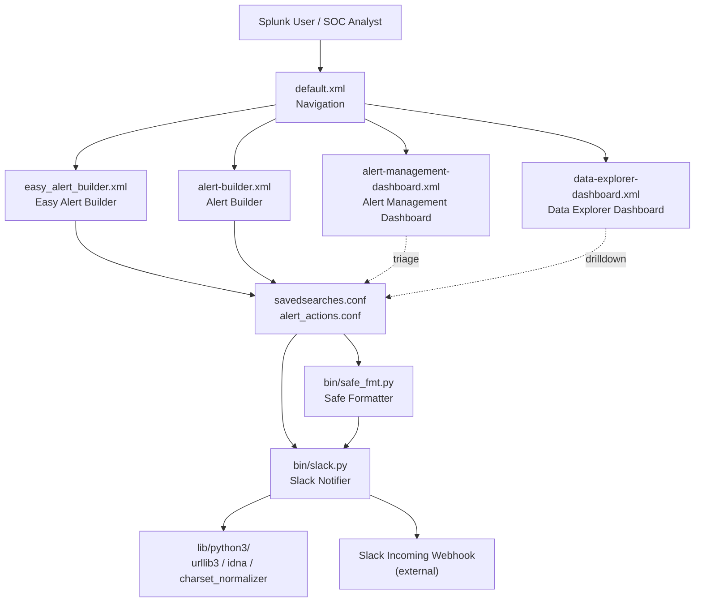

# Security Alert (Splunk App) / 보안 알림 (Splunk 앱)

A production-grade Splunk add-on that ships a unified alert-management dashboard, an easy alert builder, and a data-explorer view, bundled with a safe-formatting helper and a Slack notifier. This repository also preserves historical and resume-style documentation under `resume/` and operational notes under `docs/`.

프로덕션급 Splunk 애드온으로, 통합 알림 관리 대시보드, 손쉬운 알림 빌더, 데이터 탐색기 뷰를 제공하며 안전한 포맷팅 헬퍼와 Slack 알림 스크립트를 함께 번들합니다. 본 저장소는 `resume/` 및 `docs/` 아래에 운영/아카이브 문서를 함께 보관합니다.

---

## 1. Overview / 개요

`security_alert/` is a Splunk app that:

- Replaces ad-hoc alerting with a guided **Easy Alert Builder** and a richer **Alert Builder** form.
- Provides a centralized **Alert Management Dashboard** to triage and audit alerts.
- Provides a **Data Explorer Dashboard** to investigate the underlying events that triggered alerts.
- Includes a **Slack notification script** (`bin/slack.py`) and a **safe formatter** (`bin/safe_fmt.py`) used by alert actions and custom commands.
- Vendors a self-contained Python 3 runtime under `lib/python3/` (urllib3, idna, charset-normalizer) so the app works on air-gapped Splunk instances without pip.

`security_alert/`는 다음과 같은 Splunk 앱입니다.

- 일회성 알림 작성을 **Easy Alert Builder**와 풍부한 **Alert Builder** 폼으로 표준화합니다.
- 알림을 분류·감사할 수 있는 중앙 집중식 **Alert Management Dashboard**를 제공합니다.
- 알림을 트리거한 이벤트를 조사할 수 있는 **Data Explorer Dashboard**를 제공합니다.
- 알림 액션과 커스텀 명령이 사용하는 **Slack 알림 스크립트**(`bin/slack.py`) 및 **안전 포맷터**(`bin/safe_fmt.py`)를 포함합니다.
- 폐쇄망 Splunk 인스턴스에서도 pip 없이 동작하도록 `lib/python3/` 아래에 urllib3, idna, charset-normalizer 등 Python 3 런타임을 자체 번들합니다.

### Intended audience / 대상 사용자

- **Splunk administrators / Splunk 관리자** running Security Operations or IT Operations use cases.
- **SOC analysts / SOC 분석가** who need a self-service way to author, review, and triage alerts.
- **Detection engineers / 탐지 엔지니어** who want versioned, code-reviewable alert definitions.

---

## 2. Features / 기능

| Area / 영역 | Feature / 기능 | Description / 설명 |
| --- | --- | --- |
| Alerting / 알림 | Easy Alert Builder | Guided, low-friction form for analysts to create a saved search with a sensible default schedule. 분석가가 기본 일정을 손쉽게 적용해 저장된 검색을 만들 수 있는 가이드형 폼입니다. |
| Alerting / 알림 | Alert Builder | Full-featured form for power users exposing SPL, throttling, suppression, and trigger conditions. SPL, 스로틀링, 억제, 트리거 조건을 모두 노출하는 파워 유저용 폼입니다. |
| Triage / 분류 | Alert Management Dashboard | Centralized view to list, filter, and acknowledge alerts across saved searches. 모든 저장된 검색의 알림을 한 곳에서 필터링하고 인지(ack) 처리합니다. |
| Investigation / 조사 | Data Explorer Dashboard | Drill from an alert back to the raw events that produced it. 알림을 발생시킨 원시 이벤트로 드릴다운합니다. |
| Notification / 알림 전송 | Slack notifier (`bin/slack.py`) | Posts alert payloads to a Slack incoming webhook with retries. 재시도 로직과 함께 Slack Incoming Webhook으로 알림을 전송합니다. |
| Safety / 안전 | Safe formatter (`bin/safe_fmt.py`) | Escapes and validates alert messages before they reach a downstream sink. 다운스트림 채널로 전달되기 전에 알림 메시지를 이스케이프·검증합니다. |
| Portability / 이식성 | Vendored Python 3 runtime | Bundles `urllib3`, `idna`, `charset_normalizer` under `lib/python3/`, no `pip install` required on the Splunk host. `lib/python3/`에 `urllib3`, `idna`, `charset_normalizer`를 번들하여 Splunk 호스트에 pip 설치가 필요 없습니다. |
| Config / 설정 | Splunk-native `.conf` files | `app.conf`, `props.conf`, `transforms.conf`, `macros.conf`, `savedsearches.conf`, `alert_actions.conf` are first-class. 모든 설정은 표준 Splunk `.conf` 파일로 관리됩니다. |

---

## 3. Repository Structure / 저장소 구조

```
.
├── CONTRIBUTING.md            # Contribution guidelines / 기여 가이드
├── LICENSE                    # License / 라이선스
├── README.md                  # This document / 본 문서
├── resume/                    # Historical / resume-style docs / 이력 문서
│   ├── API.md
│   ├── ARCHITECTURE.md
│   ├── DEPLOYMENT.md
│   └── TROUBLESHOOTING.md
├── docs/                      # Operational notes / 운영 문서
│   ├── ALERT-REPOSITORY-XWIKI.md
│   ├── DEPLOYMENT.md
│   ├── LEGACY-CLEANUP-REPORT.md
│   ├── QUICK-START.md
│   └── RELEASE-NOTES.md
├── demo/
│   └── README.md              # Demo instructions / 데모 안내
└── security_alert/            # The Splunk app package / Splunk 앱 패키지
    ├── README.md              # In-app README / 앱 내 README
    ├── app.manifest           # Splunk app manifest / 앱 매니페스트
    ├── bin/                   # Executable scripts / 실행 스크립트
    │   ├── safe_fmt.py
    │   ├── six.py
    │   └── slack.py
    ├── metadata/
    │   └── default.meta
    ├── default/               # Default conf files / 기본 설정
    │   ├── alert_actions.conf
    │   ├── app.conf
    │   ├── macros.conf
    │   ├── props.conf
    │   ├── savedsearches.conf
    │   ├── transforms.conf
    │   └── data/
    │       └── ui/
    │           ├── nav/
    │           │   └── default.xml
    │           └── views/
    │               ├── alert-builder.xml
    │               ├── alert-management-dashboard.xml
    │               ├── data-explorer-dashboard.xml
    │               └── easy_alert_builder.xml
    └── lib/
        └── python3/           # Vendored Python 3 runtime / 번들 Python 3 런타임
            ├── idna-3.11.dist-info/
            ├── urllib3/
            └── charset_normalizer-3.4.4.dist-info/
```

---

## 4. Architecture / 아키텍처

The app is a self-contained Splunk package. Splunk loads `app.conf` and the `default/` configuration, then renders the views referenced by `default/data/ui/nav/default.xml`. Saved searches call alert actions implemented by the scripts in `bin/`, which may post to Slack. The vendored Python runtime under `lib/python3/` is added to `sys.path` automatically by Splunk, so `bin/slack.py` and `bin/safe_fmt.py` can import `urllib3` and friends without an external `pip install`.

Splunk는 `app.conf`와 `default/` 설정을 로드한 뒤 `default/data/ui/nav/default.xml`이 참조하는 뷰를 렌더링합니다. 저장된 검색은 `bin/` 안의 스크립트로 구현된 알림 액션을 호출하며, 이 스크립트는 Slack으로 메시지를 전송할 수 있습니다. `lib/python3/` 아래에 번들된 런타임은 Splunk가 자동으로 `sys.path`에 추가하므로 `bin/slack.py`와 `bin/safe_fmt.py`가 외부 pip 설치 없이 `urllib3` 등을 임포트할 수 있습니다.



### Key components / 핵심 컴포넌트

- **`default/data/ui/nav/default.xml`** — Top-level navigation that exposes the four dashboards to logged-in Splunk users.
- **`default/data/ui/views/*.xml`** — Dashboard definitions (Simple XML). One file per view.
- **`default/savedsearches.conf` + `alert_actions.conf`** — Declarative alert definitions. Each saved search may invoke one or more alert actions.
- **`bin/safe_fmt.py`** — Pure-Python helper that escapes user-controlled fields (search names, tokens, result values) before they are formatted into a Slack message.
- **`bin/slack.py`** — Alert action script that posts a JSON payload to a Slack incoming webhook using the vendored `urllib3`.
- **`lib/python3/`** — A read-only filesystem tree of pre-built Python 3 packages. Splunk appends this directory to `sys.path` for scripts under `bin/`.

---

## 5. Quick Start / 빠른 시작

### 5.1 Prerequisites / 사전 요구 사항

- Splunk Enterprise or Splunk Cloud (version compatible with the app — see `app.conf`).
- File-system or Splunkbase-style access to deploy a `.tar.gz` / `.spl` package.
- (Optional) A Slack workspace with permission to create an Incoming Webhook.

### 5.2 Install on a single Splunk instance / 단일 Splunk 인스턴스에 설치

1. Build or download the package from this repository.
2. Copy the `security_alert/` directory into `$SPLUNK_HOME/etc/apps/`:

   ```bash
   rsync -av security_alert/ "$SPLUNK_HOME/etc/apps/security_alert/"
   ```

3. Restart Splunk, or sign in as `admin` and reload the deployment server / bundle.

   ```bash
   "$SPLUNK_HOME/bin/splunk" restart
   ```

4. In Splunk Web, navigate to **Apps → Manage Apps → security_alert** and confirm the app is **Enabled**.
5. Open **security_alert** from the app launcher; you should see four entries: *Easy Alert Builder*, *Alert Builder*, *Alert Management Dashboard*, and *Data Explorer Dashboard*.

### 5.3 Configure the Slack notifier / Slack 알림 설정

The Slack notifier is wired in by `alert_actions.conf`. Provide a webhook URL through a Splunk credential (recommended) or a custom alert-action parameter:

1. In Splunk Web, go to **Settings → Alert Actions → security_alert Slack**.
2. Set `webhook_url` to your Slack Incoming Webhook URL.
3. (Optional) Set `channel`, `username`, and `icon_emoji` to override the defaults.
4. Click **Save**.

### 5.4 Create your first alert / 첫 알림 만들기

1. Open **Easy Alert Builder** from the app navigation.
2. Enter an alert name, source index, and a simple SPL filter.
3. Choose a schedule (default: every 5 minutes).
4. Enable the Slack alert action and submit.
5. Switch to **Alert Management Dashboard** to verify the new saved search is listed.

---

## 6. Configuration / 설정

All configuration is performed by editing files under `security_alert/default/` (or, in production, under `local/` which is git-ignored). The most relevant files:

| File | Purpose / 용도 |
| --- | --- |
| `app.conf` | App metadata: `id`, `version`, visibility, UI label. 앱 메타데이터(식별자, 버전, 표시 이름). |
| `props.conf` | Field extractions, indexing-time settings. 필드 추출 및 인덱싱 시점 설정. |
| `transforms.conf` | Lookup/regex transforms referenced by `props.conf`. 룩업/정규식 변환 정의. |
| `macros.conf` | Reusable SPL macros for shared search logic. 재사용 가능한 SPL 매크로. |
| `savedsearches.conf` | Declarative alert definitions, schedules, throttling. 알림 정의, 일정, 스로틀링. |
| `alert_actions.conf` | Custom alert action bindings (e.g. Slack). 커스텀 알림 액션 바인딩. |
| `default.xml` (nav) | Navigation entries visible in the app launcher. 앱 실행기의 네비게이션 항목. |
| `data/ui/views/*.xml` | Simple XML dashboards. Simple XML 대시보드. |

### Recommended override pattern / 권장 오버라이드 패턴

Keep customizations in `local/`, not `default/`:

```bash
mkdir -p "$SPLUNK_HOME/etc/apps/security_alert/local"
cp security_alert/default/savedsearches.conf \
   "$SPLUNK_HOME/etc/apps/security_alert/local/savedsearches.conf"
"$EDITOR" "$SPLUNK_HOME/etc/apps/security_alert/local/savedsearches.conf"
```

Splunk merges `local/` over `default/`, so upstream updates can be pulled without losing local overrides.

---

## 7. Commands Reference / 명령어 레퍼런스

These are the primary entry points for operators and developers.

### 7.1 Splunk CLI / Splunk 명령어

| Command | Description / 설명 |
| --- | --- |
| `splunk start` / `splunk restart` | Start or restart the Splunk service after deploying the app. 앱 배포 후 Splunk 서비스를 시작/재시작합니다. |
| `splunk reload deploy-server` | Reload deployment server bundles (for distributed deploys). 배포 서버 번들을 리로드합니다(분산 배포용). |
| `splunk list app` | List installed apps and verify `security_alert` is present. 설치된 앱 목록에 `security_alert`가 있는지 확인합니다. |
| `splunk search '| rest /services/saved/searches'` | Inspect alert saved searches from the CLI. CLI에서 알림 저장 검색을 조회합니다. |

### 7.2 In-app scripts / 앱 내 스크립트

| Script | Usage |
| --- | --- |
| `bin/safe_fmt.py` | `python3 safe_fmt.py --input <file>` — validate / escape an alert payload. 알림 페이로드를 검증·이스케이프합니다. |
| `bin/slack.py` | Invoked automatically by the alert action; can be called manually for testing: `python3 bin/slack.py --webhook <url> --text <message>`. 알림 액션에 의해 자동 호출되며, 수동 테스트도 가능합니다. |
| `bin/six.py` | Vendored compatibility shim used by older Python 2 callers. Python 2 호환을 위한 번들 셰임입니다. |

### 7.3 Custom SPL / 커스텀 SPL

`macros.conf` exposes reusable search macros, for example:

```spl
`security_alert_macro_top_sources(index="main")`
| stats count by src
| sort -count
| head 10
```

Refer to `default/macros.conf` for the full list of available macros.

---

## 8. Local Development / 로컬 개발

### 8.1 Repository layout convention / 저장소 레이아웃 규칙

The `security_alert/` directory at the repository root **is** a Splunk app directory. To make iteration fast, symlink it into a local Splunk install:

```bash
ln -s "$(pwd)/security_alert" "$SPLUNK_HOME/etc/apps/security_alert"
```

This lets you edit files in your working tree and reload Splunk (or just the app) without re-copying.

### 8.2 Edit-reload cycle / 편집-리로드 주기

1. Edit a file under `security_alert/default/`.
2. From Splunk Web, choose **Settings → User interface → Reload** (or run `splunk _internal call /services/configs/conf-` reload for a specific conf).
3. Refresh the browser. Cached Simple XML may need a hard reload (`Ctrl+Shift+R`).

### 8.3 Working on Python helpers / Python 헬퍼 작업

- `bin/slack.py` and `bin/safe_fmt.py` are executed by Splunk under the bundled Python 3 runtime.
- To run them locally for quick checks, set `PYTHONPATH` to include the vendored runtime:

  ```bash
  PYTHONPATH="$(pwd)/security_alert/lib/python3" \
      python3 security_alert/bin/safe_fmt.py --help
  ```

- Do **not** add new third-party dependencies via `pip`; place a vendored copy under `security_alert/lib/python3/` so the app remains air-gap friendly.

### 8.4 Building a release package / 릴리스 패키지 빌드

```bash
tar -czf security_alert.tgz \
    --exclude='security_alert/local' \
    --exclude='**/__pycache__' \
    security_alert
```

The resulting `security_alert.tgz` is suitable for distribution via Splunkbase or a deployment server.

---

## 9. Testing / 테스트

| Layer / 계층 | Approach / 방식 | Notes / 참고 |
| --- | --- | --- |
| Unit tests / 단위 테스트 | `python3 -m unittest discover` against scripts under `bin/` | Cover `safe_fmt.py` escaping edge cases and `slack.py` payload assembly. |
| Smoke tests / 스모크 테스트 | Deploy to a throwaway Splunk instance and confirm the four nav entries load. | Use the symlink workflow in §8.1. |
| Integration / 통합 | Trigger a saved search and verify a Slack message is posted. | Use a private Slack channel and a throwaway webhook. |
| Linting / 린팅 | `python3 -m pyflakes security_alert/bin` | Catches unused imports and obvious mistakes. |
| Splunk config validation / 설정 검증 | `splunk btool savedsearches list --app=security_alert` | Confirms the app's `.conf` files are syntactically valid. |

Example unit-test invocation:

```bash
python3 -m unittest discover -s tests -p "test_*.py"
```

---

## 10. Operational Notes / 운영 메모

- **`docs/QUICK-START.md`** — Step-by-step install walkthrough.
- **`docs/DEPLOYMENT.md`** — Deployment-server and clustered Splunk guidance.
- **`docs/RELEASE-NOTES.md`** — Per-version change log.
- **`docs/ALERT-REPOSITORY-XWIKI.md`** — Notes on the upstream alert repository and its XWiki export.
- **`docs/LEGACY-CLEANUP-REPORT.md`** — Audit of files removed during the modern rewrite.
- **`resume/`** — Historical architecture, API, deployment, and troubleshooting documents kept for reference. Treat them as **archival**: prefer `docs/` for current guidance.

긴급 문제 발생 시 `docs/` 안의 가이드를 먼저 확인하고, 그 다음 `resume/TROUBLESHOOTING.md`의 아카이브 항목을 참고하세요.

---

## 11. Contribution Guide / 기여 가이드

Contributions of all sizes are welcome.

1. Read `CONTRIBUTING.md` at the repository root for the full process.
2. Create a feature branch from `main`:
   ```bash
   git checkout -b feat/<short-description>
   ```
3. Keep changes inside the right directory:
   - Splunk app code → `security_alert/`
   - Operational docs → `docs/`
   - Historical / archival material → `resume/`
4. Run the test suite (§9) and `splunk btool` validation before pushing.
5. Open a pull request describing the change, the SPL it affects (if any), and any new dashboard views.
6. Sign the Contributor License Agreement (CLA) if the project requires one; see `CONTRIBUTING.md` for details.

### Coding style / 코딩 스타일

- Python 3, PEP 8.
- Splunk Simple XML: prefer built-in visualizations; keep custom JS minimal.
- `.conf` files: alphabetically ordered stanzas, lowercase keys, 4-space indentation for readability.

### Commit messages / 커밋 메시지

Use Conventional Commits:

```
feat(alerts): add suppression window to easy alert builder
fix(slack): retry on HTTP 5xx with exponential backoff
docs: expand deployment runbook
```

---

## 12. Security Considerations / 보안 고려 사항

- **Never commit webhook URLs or API tokens.** Store them in Splunk's encrypted credential store or in `local/` (which is git-ignored).
- `bin/safe_fmt.py` is the single chokepoint for user-controlled strings that flow into Slack messages. Any new field rendered into a notification **must** be passed through it.
- The vendored Python runtime is a snapshot; when upgrading, audit the `dist-info` `METADATA` for license and CVE status.

---

## 13. License / 라이선스

This project is released under the license described in the `LICENSE` file at the repository root. Vendored Python packages retain their original licenses (see `lib/python3/*/licenses/` and the corresponding `*.dist-info/METADATA`).

본 프로젝트는 저장소 루트의 `LICENSE` 파일에 명시된 라이선스 하에 배포됩니다. 번들된 Python 패키지는 원래 라이선스를 그대로 유지합니다(`lib/python3/*/licenses/` 및 `*.dist-info/METADATA` 참고).

---

## 14. See Also / 관련 문서

- [`CONTRIBUTING.md`](./CONTRIBUTING.md) — How to contribute.
- [`docs/QUICK-START.md`](./docs/QUICK-START.md) — Condensed install guide.
- [`docs/DEPLOYMENT.md`](./docs/DEPLOYMENT.md) — Production deployment playbook.
- [`docs/RELEASE-NOTES.md`](./docs/RELEASE-NOTES.md) — Version history.
- [`docs/LEGACY-CLEANUP-REPORT.md`](./docs/LEGACY-CLEANUP-REPORT.md) — Modernization audit.
- [`resume/ARCHITECTURE.md`](./resume/ARCHITECTURE.md) — Historical architecture notes.
- [`resume/API.md`](./resume/API.md), [`resume/DEPLOYMENT.md`](./resume/DEPLOYMENT.md), [`resume/TROUBLESHOOTING.md`](./resume/TROUBLESHOOTING.md) — Archival references.
- [`security_alert/README.md`](./security_alert/README.md) — In-app README, surfaced after installation.