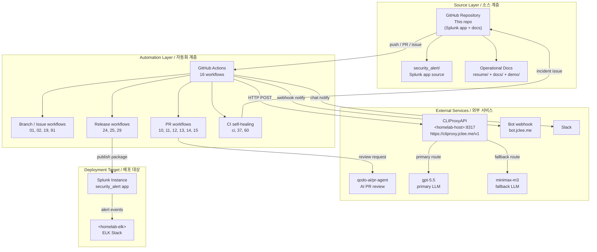

# Security Alert Splunk App & GitHub Automation

[](#automation-inventory--자동화-인벤토리)
[](#overview--개요)
[](https://cliproxy.jclee.me)
[](./LICENSE)
[](https://github.com/qodo-ai/pr-agent)

> English | 한국어
> 이 README는 영문/한글 이중 언어로 작성되었습니다. Each major section contains English and Korean descriptions side by side or in clearly labeled subsections.

---

## Table of Contents

- [Overview | 개요](#overview--개요)
- [Features | 주요 기능](#features--주요-기능)
- [Architecture | 아키텍처](#architecture--아키텍처)
- [Automation Inventory | 자동화 인벤토리](#automation-inventory--자동화-인벤토리)
- [Repository Structure | 저장소 구조](#repository-structure--저장소-구조)
- [Quick Start | 빠른 시작](#quick-start--빠른-시작)
- [Local Development | 로컬 개발](#local-development--로컬-개발)
- [Commands Reference | 명령어 참조](#commands-reference--명령어-참조)
- [Contribution Guide | 기여 가이드](#contribution-guide--기여-가이드)

---

## Overview | 개요

### English

This repository hosts a Splunk application named `security_alert` together with a comprehensive GitHub automation layer. The Splunk app ships alert actions, dashboards, saved searches, macros, transforms, navigation views, helper Python scripts in `bin/`, and a bundled Python runtime in `lib/python3/`. Operational documentation is maintained under `docs/` and `resume/`, while `demo/` provides usage examples.

The automation layer is implemented with **16 GitHub Actions workflow files**. These workflows cover the full lifecycle: branch creation from issues, automatic PR review (including a security-focused variant), Dependabot auto-merge, bot-driven self-fixes, merged-PR cleanup, issue backfill, issue classification, release notes generation, release publishing, downstream health checks, CI failure issue creation, and CI auto-healing. The AI-assisted PR review is powered by [qodo-ai/pr-agent](https://github.com/qodo-ai/pr-agent), and the LLM call path uses CLIProxyAPI as a proxy/gateway. The README generation primary model is **gpt-5.5**, with **minimax-m3 (via CLIProxyAPI)** as the documented fallback.

### 한국어

이 저장소는 `security_alert`라는 Splunk 앱과 포괄적인 GitHub 자동화 계층을 함께 제공합니다. Splunk 앱은 알림 액션, 대시보드, 저장된 검색, 매크로, transforms, 내비게이션 뷰, `bin/`의 Python 헬퍼 스크립트, `lib/python3/`의 번들 Python 런타임을 포함합니다. 운영 문서는 `docs/`와 `resume/`에서 관리되며, `demo/`는 사용 예시를 제공합니다.

자동화 계층은 **16개의 GitHub Actions 워크플로우 파일**로 구현되어 있으며, 다음 라이프사이클 전체를 다룹니다: 이슈에서 브랜치 생성, 자동 PR 리뷰(보안 전용 변형 포함), Dependabot 자동 병합, 봇 기반 자가 수정, 병합된 PR 정리, 이슈 백필, 이슈 분류, 릴리스 노트 생성, 릴리스 게시, 다운스트림 헬스 체크, CI 실패 이슈 생성, CI 자가 치유. AI 기반 PR 리뷰는 [qodo-ai/pr-agent](https://github.com/qodo-ai/pr-agent)로 구동되며, LLM 호출 경로는 CLIProxyAPI를 프록시/게이트웨이로 사용합니다. README 생성 기본 모델은 **gpt-5.5**, 문서화된 폴백은 **minimax-m3 (CLIProxyAPI 경유)** 입니다.

---

## Features | 주요 기능

### English

- **Splunk-native alert app**: alert_actions, macros, props, transforms, savedsearches, and four dashboard XML views (alert-builder, alert-management-dashboard, data-explorer-dashboard, easy_alert_builder).
- **Bundled Python runtime**: `idna`, `urllib3` (with `util`, `http2`, `contrib` submodules), and `charset_normalizer` packaged under `lib/python3/` so the app runs on locked-down Splunk instances.
- **Helper scripts in `bin/`**: `safe_fmt.py`, `slack.py`, `six.py` for formatting, Slack delivery, and Python 2/3 compatibility shims.
- **16 GitHub Actions workflows** spanning PR review, security scanning, issue triage, release publishing, and CI self-healing.
- **AI-assisted reviews** routed through CLIProxyAPI at `https://cliproxy.jclee.me/v1`, with gpt-5.5 as the primary model and minimax-m3 as fallback.
- **Operational documentation** under `resume/` (`API.md`, `ARCHITECTURE.md`, `DEPLOYMENT.md`, `TROUBLESHOOTING.md`) and `docs/` (`QUICK-START.md`, `DEPLOYMENT.md`, `RELEASE-NOTES.md`, plus specialized guides).
- **Bot webhook integration** at `bot.jclee.me` for outbound notifications and bidirectional automation.

### 한국어

- **Splunk 네이티브 알림 앱**: alert_actions, macros, props, transforms, savedsearches 및 4개의 대시보드 XML 뷰(alert-builder, alert-management-dashboard, data-explorer-dashboard, easy_alert_builder).
- **번들된 Python 런타임**: 잠긴 Splunk 인스턴스에서도 동작하도록 `idna`, `urllib3`(`util`, `http2`, `contrib` 서브모듈 포함), `charset_normalizer`가 `lib/python3/`에 패키징되어 있습니다.
- **`bin/`의 헬퍼 스크립트**: 포맷팅용 `safe_fmt.py`, Slack 전송용 `slack.py`, Python 2/3 호환성 셰임용 `six.py`.
- **16개의 GitHub Actions 워크플로우**: PR 리뷰, 보안 스캔, 이슈 분류, 릴리스 게시, CI 자가 치유까지 폭넓게 다룹니다.
- **AI 기반 리뷰**: `https://cliproxy.jclee.me/v1`의 CLIProxyAPI를 경유하며, 기본 모델은 gpt-5.5, 폴백은 minimax-m3입니다.
- **`resume/`의 운영 문서**: `API.md`, `ARCHITECTURE.md`, `DEPLOYMENT.md`, `TROUBLESHOOTING.md`. **`docs/` 문서**: `QUICK-START.md`, `DEPLOYMENT.md`, `RELEASE-NOTES.md` 및 전문 가이드.
- **`bot.jclee.me`의 봇 웹훅 통합**: 외부 알림 및 양방향 자동화를 제공합니다.

---

## Architecture | 아키텍처

### English

The diagram below shows how this repository fits into the larger automation pipeline. Source changes flow from the GitHub repository into GitHub Actions. Workflows call into AI services (qodo-ai/pr-agent for review, CLIProxyAPI for LLM routing) and into the bot webhook, then publish to Splunk, which in turn emits alerts to the downstream ELK stack. All sensitive host references are kept as placeholders (`<homelab-host>`, `<homelab-elk>`) — no private IPs or LXC container numbers are hardcoded.

### 한국어

아래 다이어그램은 이 저장소가 더 큰 자동화 파이프라인에 어떻게 연결되는지 보여줍니다. 소스 변경은 GitHub 저장소에서 GitHub Actions로 흘러가고, 워크플로우는 AI 서비스(qodo-ai/pr-agent 리뷰, CLIProxyAPI LLM 라우팅)와 봇 웹훅을 호출한 뒤 Splunk으로 게시하며, Splunk은 다시 다운스트림 ELK 스택으로 알림을 발생시킵니다. 모든 민감한 호스트 참조는 자리표시자(`<homelab-host>`, `<homelab-elk>`)로 유지되며 사설 IP나 LXC 컨테이너 번호는 하드코딩되지 않습니다.



---

## Automation Inventory | 자동화 인벤토리

### English

The repository ships exactly **16 GitHub Actions workflow files**. There are **no Go automation tools** in this repository — the `bin/` directory only contains Python helper scripts. File names use a numeric prefix for ordering and grouping.

### 한국어

이 저장소에는 정확히 **16개의 GitHub Actions 워크플로우 파일**이 포함되어 있습니다. 이 저장소에는 **Go 자동화 도구가 없습니다** — `bin/` 디렉터리는 Python 헬퍼 스크립트만 포함합니다. 파일명은 정렬 및 그룹화를 위해 숫자 접두사를 사용합니다.

### Workflows | 워크플로우

| # | File | Purpose / 목적 |
|---|------|----------------|
| 01 | `01_branch-to-pr.yml` | Create a branch from an issue and open a PR / 이슈에서 브랜치 생성 및 PR 열기 |
| 02 | `02_issue-to-branch.yml` | Convert a labeled issue into a feature branch / 라벨된 이슈를 기능 브랜치로 변환 |
| 10 | `10_pr-review.yml` | AI-assisted PR review via qodo-ai/pr-agent / qodo-ai/pr-agent 기반 AI PR 리뷰 |
| 11 | `11_security-pr-review.yml` | Security-focused PR review variant / 보안 중심 PR 리뷰 변형 |
| 12 | `12_dependabot-auto-merge.yml` | Auto-merge Dependabot PRs that pass checks / Dependabot PR 자동 병합 |
| 13 | `13_pr-auto-merge.yml` | Auto-merge PRs that meet merge criteria / 병합 조건 충족 PR 자동 병합 |
| 14 | `14_bot-auto-fix.yml` | Bot-driven automated fixes on PR feedback / PR 피드백 기반 봇 자동 수정 |
| 15 | `15_merged-pr-cleanup.yml` | Clean up after a PR is merged / PR 병합 후 정리 |
| 19 | `19_issue-backfill.yml` | Backfill issues from external trackers / 외부 트래커에서 이슈 백필 |
| 24 | `24_release-notes.yml` | Generate release notes from merged PRs / 병합된 PR로 릴리스 노트 생성 |
| 25 | `25_release-publish.yml` | Publish a release artifact / 릴리스 아티팩트 게시 |
| 29 | `29_downstream-health-check.yml` | Probe downstream service health / 다운스트림 서비스 헬스 체크 |
| 37 | `37_ci-failure-issues.yml` | Open an issue automatically on CI failure / CI 실패 시 자동 이슈 생성 |
| 60 | `60_ci-auto-heal.yml` | Attempt CI auto-healing before paging humans / 사람 호출 전 CI 자가 치유 시도 |
| 91 | `91_issue-classification.yml` | Classify incoming issues by labels and routing / 들어오는 이슈를 라벨/라우팅별로 분류 |
| — | `ci.yml` | General CI pipeline (lint, validate, build) / 일반 CI 파이프라인(lint, validate, build) |

### Helper scripts in `security_alert/bin/` | `security_alert/bin/`의 헬퍼 스크립트

| File | Purpose / 목적 |
|------|----------------|
| `safe_fmt.py` | Safe formatting helper used by alert action handlers / 알림 액션 핸들러용 안전한 포맷팅 헬퍼 |
| `slack.py` | Slack delivery wrapper for alert notifications / 알림 전송용 Slack 래퍼 |
| `six.py` | Python 2/3 compatibility shim / Python 2/3 호환성 셰임 |

### Bundled Python runtime (`security_alert/lib/python3/`) | 번들된 Python 런타임

The app vendorizes `idna`, `urllib3` (with `util`, `http2`, `contrib`, `contrib/emscripten` submodules), and `charset_normalizer` so it can run on isolated Splunk Python environments. 앱은 격리된 Splunk Python 환경에서도 동작하도록 `idna`, `urllib3`(`util`, `http2`, `contrib`, `contrib/emscripten` 서브모듈 포함), `charset_normalizer`를 번들합니다.

---

## Repository Structure | 저장소 구조

### English / 한국어

The top-level layout reflects the actual on-disk structure. `_bot-scripts/` and similar transient CI checkout paths are intentionally omitted.

```
/
├── CONTRIBUTING.md
├── LICENSE
├── README.md
├── resume/
│   ├── API.md
│   ├── ARCHITECTURE.md
│   ├── DEPLOYMENT.md
│   └── TROUBLESHOOTING.md
├── docs/
│   ├── ALERT-REPOSITORY-XWIKI.md
│   ├── DEPLOYMENT.md
│   ├── LEGACY-CLEANUP-REPORT.md
│   ├── QUICK-START.md
│   └── RELEASE-NOTES.md
├── demo/
│   └── README.md
└── security_alert/
    ├── README.md
    ├── app.manifest
    ├── bin/
    │   ├── safe_fmt.py
    │   ├── six.py
    │   └── slack.py
    ├── metadata/
    │   └── default.meta
    ├── default/
    │   ├── alert_actions.conf
    │   ├── app.conf
    │   ├── macros.conf
    │   ├── props.conf
    │   ├── savedsearches.conf
    │   ├── transforms.conf
    │   └── data/
    │       └── ui/
    │           ├── nav/
    │           │   └── default.xml
    │           └── views/
    │               ├── alert-builder.xml
    │               ├── alert-management-dashboard.xml
    │               ├── data-explorer-dashboard.xml
    │               └── easy_alert_builder.xml
    └── lib/
        └── python3/
            ├── idna-3.11.dist-info/
            ├── urllib3/
            │   ├── __init__.py
            │   ├── connection.py
            │   ├── connectionpool.py
            │   ├── exceptions.py
            │   ├── response.py
            │   ├── util/
            │   ├── http2/
            │   └── contrib/
            │       └── emscripten/
            └── charset_normalizer-3.4.4.dist-info/
```

---

## Quick Start | 빠른 시작

### English

1. **Clone the repository**
   ```bash
   git clone <this-repo-url>
   cd <repo-dir>
   ```
2. **Review the Splunk app layout** under `security_alert/`. The app is self-contained — Python dependencies are vendored.
3. **Inspect automation** by opening any `.github/workflows/*.yml` file. The numeric prefix indicates execution order/grouping.
4. **Configure secrets** in your repository settings for: `CLI_PROXY_URL` (default `https://cliproxy.jclee.me/v1`), `CLI_PROXY_TOKEN`, `BOT_WEBHOOK_URL` (default `https://bot.jclee.me`), and any Splunk deployment tokens.
5. **Trigger a workflow** to validate: open a draft PR and watch `10_pr-review.yml` execute.

### 한국어

1. **저장소 클론**
   ```bash
   git clone <this-repo-url>
   cd <repo-dir>
   ```
2. **`security_alert/` 아래의 Splunk 앱 구조 검토**. 앱은 자체 완결형이며 Python 의존성이 번들되어 있습니다.
3. **자동화 검토**: `.github/workflows/*.yml` 파일을 열어보세요. 숫자 접두사는 실행 순서/그룹화를 나타냅니다.
4. **시크릿 설정**: 저장소 설정에서 `CLI_PROXY_URL`(기본 `https://cliproxy.jclee.me/v1`), `CLI_PROXY_TOKEN`, `BOT_WEBHOOK_URL`(기본 `https://bot.jclee.me`), Splunk 배포 토큰을 설정합니다.
5. **워크플로우 트리거 검증**: 초안 PR을 열고 `10_pr-review.yml`이 실행되는지 확인합니다.

---

## Local Development | 로컬 개발

### English

- **Lint/validate Splunk conf**: use `btool check` from a Splunk CLI instance against the `default/` directory.
- **Edit dashboards**: `default/data/ui/views/*.xml` — restart Splunk or use the Splunk UI `?_reload=1` query parameter.
- **Edit Python helpers**: files under `security_alert/bin/` and `lib/python3/`; do **not** modify vendored library source — add a local override under `bin/` instead.
- **Test workflows**: use `act` (the GitHub Actions local runner) for fast iteration. Example:
  ```bash
  act pull_request -W .github/workflows/10_pr-review.yml
  ```
- **Update documentation**: prefer editing `docs/` (canonical) and have `24_release-notes.yml` propagate summaries to `resume/`.

### 한국어

- **Splunk conf 린트/검증**: Splunk CLI 인스턴스에서 `default/` 디렉터리에 대해 `btool check`를 사용하세요.
- **대시보드 편집**: `default/data/ui/views/*.xml` — Splunk을 재시작하거나 Splunk UI의 `?_reload=1` 쿼리 파라미터를 사용하세요.
- **Python 헬퍼 편집**: `security_alert/bin/` 및 `lib/python3/` 하위 파일을 수정하세요. **번들된 라이브러리 소스는 수정하지 말고** `bin/` 아래에 로컬 오버라이드를 추가하세요.
- **워크플로우 테스트**: 빠른 반복을 위해 `act`(GitHub Actions 로컬 러너)를 사용하세요.
  ```bash
  act pull_request -W .github/workflows/10_pr-review.yml
  ```
- **문서 업데이트**: 정본은 `docs/`를 편집하고, `24_release-notes.yml`이 `resume/`으로 요약을 전파하도록 하세요.

---

## Commands Reference | 명령어 참조

### GitHub CLI workflow operations / GitHub CLI 워크플로우 작업

```bash
# List all workflows
gh workflow list

# Run a specific workflow manually
gh workflow run 10_pr-review.yml

# View workflow runs
gh run list --workflow=10_pr-review.yml

# Re-run a failed job
gh run rerun <run-id> --failed
```

### Splunk-side operations / Splunk 측 작업

```bash
# Validate conf files
splunk btool check --app=security_alert

# Reload the app without restart
splunk reload app security_alert

# Inspect merged app metadata
splunk display app security_alert
```

### CLIProxyAPI / LLM routing / LLM 라우팅

The CLIProxyAPI endpoint is `https://cliproxy.jclee.me/v1`. The primary README-generation model is **gpt-5.5**; the fallback is **minimax-m3**. Example request shape (compatible with the OpenAI Chat Completions API):
CLIProxyAPI 엔드포인트는 `https://cliproxy.jclee.me/v1`입니다. README 생성 기본 모델은 **gpt-5.5**, 폴백은 **minimax-m3**입니다. 요청 형식 예시(OpenAI Chat Completions API 호환):

```bash
curl -X POST https://cliproxy.jclee.me/v1/chat/completions \
  -H "Authorization: Bearer $CLI_PROXY_TOKEN" \
  -H "Content-Type: application/json" \
  -d '{
    "model": "gpt-5.5",
    "fallback_model": "minimax-m3",
    "messages": [{"role":"user","content":"Summarize this diff"}]
  }'
```

### Splunk app Python helper usage / Splunk 앱 Python 헬퍼 사용

```python
# security_alert/bin/safe_fmt.py is invoked by alert_actions.conf handlers
# save search / alert handler invokes this with the event dict
import sys
sys.path.insert(0, "/opt/splunk/etc/apps/security_alert/bin")
import safe_fmt
print(safe_fmt.format_event(event))
```

---

## Contribution Guide | 기여 가이드

### English

- Read [`CONTRIBUTING.md`](./CONTRIBUTING.md) before opening a PR.
- All PRs flow through `10_pr-review.yml` (general review) and `11_security-pr-review.yml` (security review).
- Dependabot PRs go through `12_dependabot-auto-merge.yml`.
- After a PR merges, `15_merged-pr-cleanup.yml` runs housekeeping.
- Issues are classified by `91_issue-classification.yml` — pick the right labels so routing works.
- For releases, `24_release-notes.yml` aggregates changes and `25_release-publish.yml` performs the publish step. `29_downstream-health-check.yml` validates post-publish.
- For CI hygiene, `37_ci-failure-issues.yml` opens tickets on failure and `60_ci-auto-heal.yml` attempts an automatic fix first.

### 한국어

- PR을 열기 전에 [`CONTRIBUTING.md`](./CONTRIBUTING.md)를 읽어 주세요.
- 모든 PR은 `10_pr-review.yml`(일반 리뷰)와 `11_security-pr-review.yml`(보안 리뷰)를 거칩니다.
- Dependabot PR은 `12_dependabot-auto-merge.yml`을 거칩니다.
- PR이 병합된 후에는 `15_merged-pr-cleanup.yml`이 정리 작업을 수행합니다.
- 이슈는 `91_issue-classification.yml`로 분류되므로, 라우팅이 동작하도록 올바른 라벨을 선택하세요.
- 릴리스 시 `24_release-notes.yml`이 변경 사항을 집계하고 `25_release-publish.yml`이 게시 단계를 수행합니다. `29_downstream-health-check.yml`이 게시 후 검증을 담당합니다.
- CI 위생 측면에서 `37_ci-failure-issues.yml`은 실패 시 티켓을 열고, `60_ci-auto-heal.yml`은 먼저 자동 수정을 시도합니다.

### Coding conventions / 코딩 컨벤션

- **Splunk conf**: keep stanza names and field names consistent across `*.conf` files; never edit vendored files under `lib/`.
- **Python**: prefer Python 3 idioms but stay compatible with Splunk's bundled interpreter; reuse `six.py` only where unavoidable.
- **Workflows**: keep the numeric prefix when adding or renaming workflow files; the prefix order matters for documentation and review tooling.
- **Docs**: prefer `docs/` as the source of truth and let automation propagate to `resume/`.

---

## License / 라이선스

See [`LICENSE`](./LICENSE). / [`LICENSE`](./LICENSE) 파일을 참조하세요.

## External links / 외부 링크

- PR review service: [qodo-ai/pr-agent](https://github.com/qodo-ai/pr-agent)
- LLM proxy gateway: [cliproxy.jclee.me](https://cliproxy.jclee.me)
- Bot webhook: [bot.jclee.me](https://bot.jclee.me)