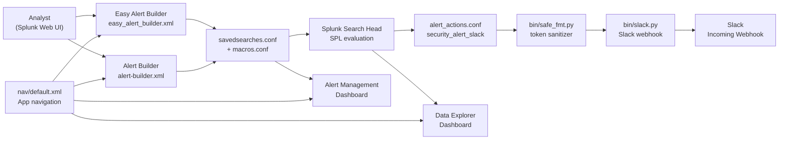

# Security Alert (Splunk App) / 보안 알림 (Splunk 앱)

A production-grade Splunk add-on that ships a unified **Alert Management Dashboard**, an **Easy Alert Builder**, a richer **Alert Builder**, and a **Data Explorer Dashboard**, bundled with a safe-formatting helper and a Slack notifier. The repository also preserves historical and resume-style documentation under `resume/` and operational notes under `docs/`.

프로덕션급 Splunk 애드온으로, 통합 **알림 관리 대시보드**, **손쉬운 알림 빌더**, 풍부한 **알림 빌더**, 그리고 **데이터 탐색기 뷰**를 제공하며, 안전한 포맷팅 헬퍼와 Slack 알림 스크립트를 함께 번들합니다. 본 저장소는 `resume/` 및 `docs/` 아래에 운영·아카이브 문서를 함께 보관합니다.

---

## Table of Contents / 목차

1. [Overview / 개요](#1-overview--개요)
2. [Features / 주요 기능](#2-features--주요-기능)
3. [Architecture / 아키텍처](#3-architecture--아키텍처)
4. [Repository Layout / 저장소 구조](#4-repository-layout--저소-구조)
5. [Quick Start / 빠른 시작](#5-quick-start--빠른-시작)
6. [Configuration / 설정](#6-configuration--설정)
7. [Component Reference / 구성 요소 참조](#7-component-reference--구성-요소-참조)
8. [Local Development / 로컬 개발](#8-local-development--로컬-개발)
9. [Testing / 테스트](#9-testing--테스트)
10. [Operations / 운영](#10-operations--운영)
11. [Documentation Index / 문서 인덱스](#11-documentation-index--문서-인덱스)
12. [Contributing / 기여](#12-contributing--기여)
13. [License / 라이선스](#13-license--라이선스)

---

## 1. Overview / 개요

`security_alert/` is a self-contained Splunk app that turns ad-hoc alerting into a repeatable workflow. It is aimed at SOC analysts, detection engineers, and Splunk administrators who need to:

- Author alerts through a guided **Easy Alert Builder** or a feature-complete **Alert Builder**.
- Triage, audit, and acknowledge alerts from a single **Alert Management Dashboard**.
- Investigate the events behind alerts via a **Data Explorer Dashboard**.
- Route alerts to Slack using the bundled `bin/slack.py` custom alert action.
- Run on air-gapped Splunk instances because the Python runtime dependencies (`urllib3`, `idna`, `charset-normalizer`) are vendored under `security_alert/lib/python3/`.

The app is packaged as a regular Splunk app directory and is loaded by placing or symlinking `security_alert/` under `$SPLUNK_HOME/etc/apps/`. No external `pip` install is required at runtime.

`security_alert/`는 단일 Splunk 앱 디렉터리로 동작하는 셀프 컨테이너형 애드온입니다. 임의의 알림 작성을 반복 가능한 워크플로우로 전환하며, SOC 분석가·디텍션 엔지니어·Splunk 관리자를 주요 사용 대상으로 합니다. 가이드형 **Easy Alert Builder**, 풀 기능 **Alert Builder**, 단일 **알림 관리 대시보드**, 그리고 **데이터 탐색기 대시보드**를 통해 알림을 작성·분류·조사할 수 있고, 번들된 `bin/slack.py`를 통해 Slack으로 라우팅할 수 있습니다. Python 런타임 의존성은 `security_alert/lib/python3/`에 벤더링되어 있으므로 폐쇄망 Splunk 인스턴스에서도 별도 `pip` 설치 없이 동작합니다.

---

## 2. Features / 주요 기능

### Authoring / 작성
- **Easy Alert Builder** (`default/data/ui/views/easy_alert_builder.xml`) — A guided, low-friction form for one-click common alert patterns.
- **Alert Builder** (`default/data/ui/views/alert-builder.xml`) — A richer authoring surface for power users, with full SPL control and action wiring.

### Triage / 분류
- **Alert Management Dashboard** (`default/data/ui/views/alert-management-dashboard.xml`) — Centralized view to inspect, acknowledge, and audit alerts created from the builders.

### Investigation / 조사
- **Data Explorer Dashboard** (`default/data/ui/views/data-explorer-dashboard.xml`) — Drill from a triggered alert into the underlying events for root-cause analysis.

### Notification / 알림
- **Slack notifier** (`bin/slack.py`) — Custom alert action that posts formatted alert payloads to a Slack incoming webhook.
- **Safe formatter** (`bin/safe_fmt.py`) — Sanitizes event tokens before they are interpolated into messages, preventing template-injection and encoding mishaps.

### Runtime / 런타임
- **Vendored Python 3 libraries** (`lib/python3/`) — `urllib3`, `idna`, `charset-normalizer`, and `six` so HTTP egress works without internet access.
- **Packaged metadata** (`app.manifest`, `metadata/default.meta`, `default/app.conf`) — Standard Splunk app packaging for upgrade-safe deployment.

### 주요 기능 요약 / Feature Summary
- 손쉬운 알림 빌더와 풀 기능 알림 빌더를 통한 알림 작성
- 통합 알림 관리 대시보드를 통한 알림 분류 및 감사
- 데이터 탐색기 대시보드를 통한 근본 원인 조사
- Slack 인커밍 웹훅 기반 알림 액션
- 안전한 포맷팅 헬퍼를 통한 메시지 인젝션 방지
- 폐쇄망 환경을 위한 Python 의존성 벤더링

---

## 3. Architecture / 아키텍처

The app is structured as a standard Splunk app package. The data flow is: an analyst authors a saved search using the builders → Splunk evaluates the SPL → on trigger the configured alert action calls `slack.py` → the payload is sanitized by `safe_fmt.py` → the message is posted to Slack → the dashboards read `savedsearches.conf` and audit indexes to render management and investigation views.



### Layer breakdown / 계층 구조

| Layer | Path | Responsibility |
|---|---|---|
| UI views | `security_alert/default/data/ui/views/` | Authoring and dashboards |
| Navigation | `security_alert/default/data/ui/nav/default.xml` | App menu entries |
| Configuration | `security_alert/default/{app,alert_actions,macros,props,savedsearches,transforms}.conf` | SPL, saved searches, field extraction, action wiring |
| Scripts | `security_alert/bin/{slack.py,safe_fmt.py,six.py}` | Outbound notification and helpers |
| Vendored runtime | `security_alert/lib/python3/` | `urllib3`, `idna`, `charset-normalizer`, `six` |
| App metadata | `security_alert/app.manifest`, `security_alert/metadata/default.meta` | Splunk packaging |

---

## 4. Repository Layout / 저장소 구조

```
/
├── CONTRIBUTING.md
├── LICENSE
├── README.md
├── resume/
│   ├── API.md
│   ├── ARCHITECTURE.md
│   ├── DEPLOYMENT.md
│   └── TROUBLESHOOTING.md
├── docs/
│   ├── ALERT-REPOSITORY-XWIKI.md
│   ├── DEPLOYMENT.md
│   ├── LEGACY-CLEANUP-REPORT.md
│   ├── QUICK-START.md
│   └── RELEASE-NOTES.md
├── demo/
│   └── README.md
└── security_alert/                  # The Splunk app
    ├── README.md
    ├── app.manifest
    ├── bin/
    │   ├── safe_fmt.py
    │   ├── six.py
    │   └── slack.py
    ├── metadata/
    │   └── default.meta
    ├── default/
    │   ├── alert_actions.conf
    │   ├── app.conf
    │   ├── macros.conf
    │   ├── props.conf
    │   ├── savedsearches.conf
    │   ├── transforms.conf
    │   └── data/
    │       └── ui/
    │           ├── nav/
    │           │   └── default.xml
    │           └── views/
    │               ├── alert-builder.xml
    │               ├── alert-management-dashboard.xml
    │               ├── data-explorer-dashboard.xml
    │               └── easy_alert_builder.xml
    └── lib/
        └── python3/
            ├── urllib3/             # vendored
            ├── idna-3.11.dist-info/ # vendored
            └── charset_normalizer-3.4.4.dist-info/ # vendored
```

> The `resume/` directory preserves legacy and historical narrative documentation. The `docs/` directory is the active operational documentation set. Use `docs/QUICK-START.md` for a quick install walk-through and `docs/DEPLOYMENT.md` for production-grade deployment guidance.

> `resume/` 폴더는 레거시 및 이력형 문서를 보관하며, `docs/` 폴더는 현행 운영 문서입니다. 빠른 설치는 `docs/QUICK-START.md`, 운영 배포는 `docs/DEPLOYMENT.md`를 참조하세요.

---

## 5. Quick Start / 빠른 시작

### Prerequisites / 사전 요구 사항
- Splunk Enterprise or Splunk Cloud (the app targets the Splunk app layout; no specific version pin is enforced in `app.manifest`).
- A Slack workspace with permission to create an incoming webhook.
- Optional: a `default.meta` permit for the indexes you want the dashboards to read (audit, summary, main).

### Install / 설치
1. Clone or download this repository onto the Splunk instance.
2. Copy or symlink the app directory into Splunk's apps folder:
   ```bash
   cp -R security_alert/ "$SPLUNK_HOME/etc/apps/"
   # or
   ln -s "$(pwd)/security_alert" "$SPLUNK_HOME/etc/apps/security_alert"
   ```
3. Restart Splunk or reload the app:
   ```bash
   "$SPLUNK_HOME/bin/splunk" reload deploy-server -class $SPLUNK_HOME/etc/apps/security_alert
   ```
4. In the Splunk Web UI, navigate to **Apps → Security Alert**.
5. Configure a Slack incoming webhook and store its URL in the alert action (see [Configuration](#6-configuration--설정)).

For a more detailed walk-through, read `docs/QUICK-START.md`.

### 첫 알림 만들기
1. 앱 메뉴에서 **Easy Alert Builder** 또는 **Alert Builder**를 엽니다.
2. 검색어, 트리거 조건, 알림 메시지를 입력합니다.
3. Alert Action으로 `security_alert_slack`을 선택하고 웹훅 URL을 지정합니다.
4. 저장을 누르면 `savedsearches.conf`에 항목이 추가되며, 조건 충족 시 Slack으로 발송됩니다.

---

## 6. Configuration / 설정

### `app.conf`
Declares app identity, label, vendor, and version. Edit the `[ui]` and `[install]` stanzas in `security_alert/default/app.conf` to customize the display label and version. The app version is also declared in `security_alert/app.manifest`.

### `savedsearches.conf`
Stores saved searches authored through the Easy Alert Builder and the Alert Builder. Each entry includes the SPL, schedule, and the alert action to invoke.

### `alert_actions.conf`
Wires the custom alert action that calls `bin/slack.py`. Configure the webhook URL and default channel here (or override per saved search).

### `macros.conf`
Defines reusable SPL macros consumed by the dashboards and the builders to keep SPL DRY.

### `props.conf` and `transforms.conf`
Used by the data-explorer and alert-management views to extract and normalize fields such as alert severity, owner, and acknowledge status.

### `metadata/default.meta`
Declares the default capability (usually `read`/`write` for the `security_alert` app context) and per-view ACLs for the four dashboards.

### Slack webhook
The Slack notifier posts to a Slack incoming webhook URL. Treat the URL as a secret — store it in a Splunk credential store or a secret manager rather than committing it to the repository.

### 설정 요약
- `app.conf`: 앱 라벨·버전·UI 설정
- `savedsearches.conf`: 빌더가 생성한 저장 검색
- `alert_actions.conf`: `bin/slack.py` 호출 및 웹훅 설정
- `macros.conf`: 재사용 SPL 매크로
- `props.conf`/`transforms.conf`: 알림 필드 추출 및 정규화
- `metadata/default.meta`: 뷰별 ACL

---

## 7. Component Reference / 구성 요소 참조

### UI views / UI 뷰

| View | File | Purpose |
|---|---|---|
| Easy Alert Builder | `default/data/ui/views/easy_alert_builder.xml` | Guided alert authoring |
| Alert Builder | `default/data/ui/views/alert-builder.xml` | Full-featured alert authoring |
| Alert Management Dashboard | `default/data/ui/views/alert-management-dashboard.xml` | Triage and audit |
| Data Explorer Dashboard | `default/data/ui/views/data-explorer-dashboard.xml` | Event investigation |

### Navigation / 내비게이션
`default/data/ui/nav/default.xml` registers the four views in the app's left-hand menu.

### Scripts / 스크립트

| Script | Purpose |
|---|---|
| `bin/slack.py` | Posts alert payloads to a Slack incoming webhook |
| `bin/safe_fmt.py` | Sanitizes event tokens before interpolation |
| `bin/six.py` | Vendored `six` compatibility shim for Python 2/3 |

### Vendored libraries / 벤더링 라이브러리

| Library | Path | Use |
|---|---|---|
| urllib3 | `lib/python3/urllib3/` | HTTP client used by `slack.py` |
| idna 3.11 | `lib/python3/idna-3.11.dist-info/` | Internationalized domain name handling |
| charset-normalizer 3.4.4 | `lib/python3/charset_normalizer-3.4.4.dist-info/` | Encoding detection |

These libraries are intentionally vendored so the app works on air-gapped Splunk deployments without external `pip` resolution.

---

## 8. Local Development / 로컬 개발

### Layout for development / 개발용 레이아웃
1. Clone the repository onto a Splunk search head.
2. Symlink the app into `$SPLUNK_HOME/etc/apps/` so edits are picked up without copying.
   ```bash
   ln -s "$(pwd)/security_alert" "$SPLUNK_HOME/etc/apps/security_alert"
   ```
3. After editing any file under `default/` or `bin/`, restart or reload the app:
   ```bash
   "$SPLUNK_HOME/bin/splunk" restart
   # or for a lighter reload:
   "$SPLUNK_HOME/bin/splunk" reload deploy-server
   ```
4. Use the browser dev console against the dashboards to inspect SPL generated by the builders.

### Iterating on UI / UI 반복 개발
- Edit the XML in `default/data/ui/views/` and reload the page in Splunk Web. Hard-refresh the browser if a Simple XML dashboard caches an old copy.
- Use `messages.log` (`$SPLUNK_HOME/var/log/splunk/messages.log`) to surface any XML parsing errors.

### Iterating on scripts / 스크립트 반복 개발
- Edit `bin/slack.py` or `bin/safe_fmt.py` directly. Any alert-action invocation will pick up the new code on the next trigger.
- If you import a new third-party library, vendor it under `lib/python3/` rather than relying on system Python.

### Demo / 데모
The `demo/` directory ships a small demo script and accompanying notes; see `demo/README.md` for what it demonstrates and how to run it.

---

## 9. Testing / 테스트

The repository does not currently include a packaged automated test suite. Recommended manual test paths:

- **Builder smoke test** — Author a saved search via the Easy Alert Builder, set a short schedule (e.g. `*/5 * * * *`), and confirm it appears in the Alert Management Dashboard within one cycle.
- **Slack delivery test** — Use a webhook URL pointed at a test channel and trigger the saved search manually to confirm payload formatting.
- **Sanitization test** — Feed event tokens containing backticks, braces, and HTML into a saved search that exercises `bin/safe_fmt.py` and verify the Slack message.
- **Air-gapped test** — On a host without outbound `pip` access, install the app and confirm that `slack.py` resolves `urllib3` from `lib/python3/`.

End-to-end checks can also be performed against a non-production Splunk instance using a webhook URL that posts into a sandbox Slack workspace.

> 자동화된 테스트 슈트는 본 저장소에 포함되어 있지 않습니다. 위의 수동 시나리오를 회귀 테스트 체크리스트로 활용하세요.

---

## 10. Operations / 운영

- **Deployment topology** — The app can be deployed as a single-instance app, a search-head deployable app, or via a deployment server. See `docs/DEPLOYMENT.md` for the recommended topology and `resume/DEPLOYMENT.md` for historical context.
- **Troubleshooting** — See `docs/LEGACY-CLEANUP-REPORT.md` for known issues that have been retired, and `resume/TROUBLESHOOTING.md` for narrative troubleshooting guidance.
- **Release notes** — See `docs/RELEASE-NOTES.md` for the change log and `docs/ALERT-REPOSITORY-XWIKI.md` for cross-references to related Splunk artifacts.
- **Architecture decisions** — The deeper architectural rationale lives in `resume/ARCHITECTURE.md` and `resume/API.md`.
- **Logging** — Splunk's standard `messages.log`, `web_service.log`, and Python prints from `bin/` are the primary diagnostic surfaces.

### 운영 체크리스트
- 검색 헤드 배포 시 `deployment-apps` 경로에 `security_alert/` 업로드 후 서버 클래스 적용
- 웹훅 URL은 외부 Secret Manager 또는 Splunk Credential Store에 보관
- 매크로/저장 검색 변경 시 `savedsearches.conf` 및 `macros.conf` diff 검토
- 대시보드 패널 변경 시 `messages.log`에서 XML 파싱 오류 확인

---

## 11. Documentation Index / 문서 인덱스

### Active operational docs / 현행 운영 문서 (`docs/`)
- `docs/QUICK-START.md` — install and first-alert walk-through
- `docs/DEPLOYMENT.md` — production deployment guidance
- `docs/RELEASE-NOTES.md` — change log
- `docs/ALERT-REPOSITORY-XWIKI.md` — cross-reference to related Splunk artifacts
- `docs/LEGACY-CLEANUP-REPORT.md` — retired components and their replacements

### Resume / historical docs / 이력 문서 (`resume/`)
- `resume/ARCHITECTURE.md` — historical architecture notes
- `resume/API.md` — historical API notes
- `resume/DEPLOYMENT.md` — historical deployment notes
- `resume/TROUBLESHOOTING.md` — historical troubleshooting notes

### App-local / 앱 내부 문서
- `security_alert/README.md` — in-app README
- `demo/README.md` — demo script notes

---

## 12. Contributing / 기여

1. Read `CONTRIBUTING.md` for the project's contribution policy.
2. Make changes on a topic branch.
3. Keep the vendored libraries under `security_alert/lib/python3/` in sync with the version pin recorded in `app.manifest`.
4. Run the manual test paths in [Testing](#9-testing--테스트) before opening a pull request.
5. Update `docs/RELEASE-NOTES.md` with any user-visible change.

### 기여 절차
1. 토픽 브랜치를 생성합니다.
2. `security_alert/lib/python3/`의 벤더링 라이브러리는 `app.manifest`의 버전 핀과 일치시킵니다.
3. 변경 사항에 대한 수동 시나리오를 검증합니다.
4. 사용자가 인지할 수 있는 변경은 `docs/RELEASE-NOTES.md`에 기록합니다.

---

## 13. License / 라이선스

This project is released under the terms described in the [`LICENSE`](./LICENSE) file at the repository root.

본 프로젝트는 저장소 루트의 [`LICENSE`](./LICENSE) 파일에 명시된 조건에 따라 배포됩니다.