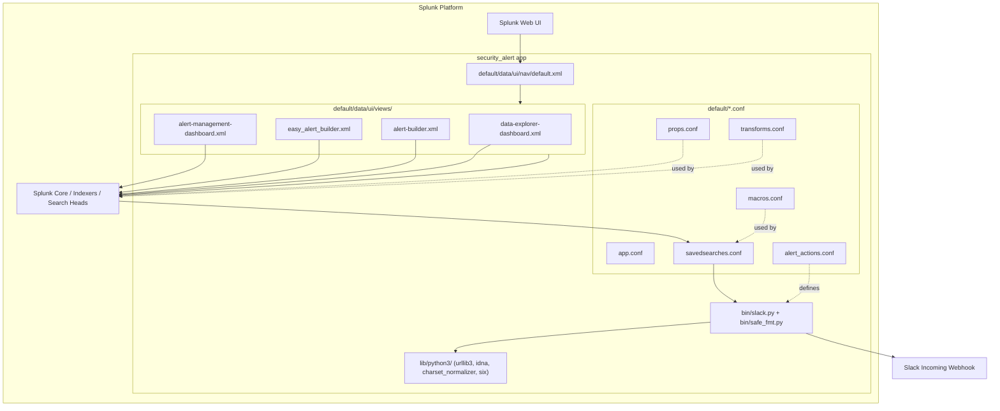

# Security Alert (Splunk App) / 보안 알림 (Splunk 앱)

A production-grade Splunk add-on that delivers a unified **Alert Management Dashboard**, a guided **Easy Alert Builder**, a feature-complete **Alert Builder**, and an exploratory **Data Explorer Dashboard**. The app ships with a safe-formatting helper and a Slack custom alert action, and bundles its Python runtime dependencies so it runs on air-gapped Splunk deployments.

프로덕션급 Splunk 애드온으로, 통합 **알림 관리 대시보드**, 안내형 **손쉬운 알림 빌더**, 풀-기능 **알림 빌더**, 그리고 탐색형 **데이터 탐색기 대시보드**를 제공합니다. 안전한 포맷팅 헬퍼와 Slack 커스텀 알림 액션을 함께 제공하며, Python 런타임 의존성을 번들하여 격리(air-gapped) Splunk 환경에서도 동작합니다.

---

## Table of Contents / 목차

1. [Overview / 개요](#1-overview--개요)
2. [Features / 주요 기능](#2-features--주요-기능)
3. [Architecture / 아키텍처](#3-architecture--아키텍처)
4. [Repository Layout / 저장소 구조](#4-repository-layout--저장소-구조)
5. [Quick Start / 빠른 시작](#5-quick-start--빠른-시작)
6. [Configuration / 설정](#6-configuration--설정)
7. [Component Reference / 구성 요소 참조](#7-component-reference--구성-요소-참조)
8. [Local Development / 로컬 개발](#8-local-development--로컬-개발)
9. [Testing / 테스트](#9-testing--테스트)
10. [Operations / 운영](#10-operations--운영)
11. [Documentation Index / 문서 인덱스](#11-documentation-index--문서-인덱스)
12. [Contributing / 기여](#12-contributing--기여)
13. [License / 라이선스](#13-license--라이선스)

---

## 1. Overview / 개요

`security_alert/` is a self-contained Splunk app that converts ad-hoc alerting into a repeatable, auditable workflow. It targets SOC analysts, detection engineers, and Splunk administrators who need to:

- Author alerts through either a guided **Easy Alert Builder** or a full **Alert Builder** UI.
- Triage, acknowledge, and audit alerts from one **Alert Management Dashboard**.
- Investigate the events behind alerts in a **Data Explorer Dashboard**.
- Route alerts to Slack using the bundled `bin/slack.py` custom alert action.
- Operate on isolated Splunk instances, because the Python runtime dependencies (`urllib3`, `idna`, `charset_normalizer`, `six`) are vendored under `security_alert/lib/python3/`.

`security_alert/`는 일회성 알림 작성을 반복 가능하고 감사 가능한 워크플로우로 전환하는 독립형 Splunk 앱입니다. SOC 분석가, 디텍션 엔지니어, Splunk 관리자를 대상으로 하며, 다음과 같은 가치를 제공합니다.

- 안내형 **손쉬운 알림 빌더** 또는 풀-기능 **알림 빌더** UI로 알림을 작성합니다.
- 단일 **알림 관리 대시보드**에서 알림을 분류·승인·감사합니다.
- **데이터 탐색기 대시보드**에서 알림의 근거 이벤트를 조사합니다.
- 번들된 `bin/slack.py` 커스텀 알림 액션으로 알림을 Slack으로 라우팅합니다.
- Python 런타임 의존성(`urllib3`, `idna`, `charset_normalizer`, `six`)이 `security_alert/lib/python3/` 아래에 번들되어 있어 격리된 Splunk 인스턴스에서도 동작합니다.

---

## 2. Features / 주요 기능

| Area | Capability |
| --- | --- |
| Dashboards / 대시보드 | Alert Management Dashboard, Easy Alert Builder, Alert Builder, Data Explorer Dashboard |
| Alert authoring / 알림 작성 | Form-driven Easy mode and feature-complete Advanced mode |
| Triage / 분류 | Centralized view with acknowledgment and audit fields |
| Notification / 알림 전송 | Slack custom alert action (`bin/slack.py`) with safe formatting |
| Formatting / 포맷팅 | `bin/safe_fmt.py` helper for safe, predictable text rendering |
| Portability / 이식성 | Vendored `urllib3`, `idna`, `charset_normalizer`, `six` under `lib/python3/` |
| Configuration / 설정 | Standard Splunk `.conf` files under `default/` |
| Navigation / 탐색 | Custom nav XML registered in `default/data/ui/nav/default.xml` |

| 영역 | 기능 |
| --- | --- |
| 대시보드 | 알림 관리, 손쉬운 알림 빌더, 알림 빌더, 데이터 탐색기 |
| 알림 작성 | 폼 기반 Easy 모드와 풀-기능 Advanced 모드 |
| 분류 | 승인 및 감사 필드를 갖춘 중앙 집중 뷰 |
| 알림 전송 | 안전한 포맷팅을 지원하는 Slack 커스텀 알림 액션 (`bin/slack.py`) |
| 포맷팅 | 안전하고 예측 가능한 텍스트 렌더링을 위한 `bin/safe_fmt.py` 헬퍼 |
| 이식성 | `lib/python3/` 아래 `urllib3`, `idna`, `charset_normalizer`, `six` 번들 |
| 설정 | `default/` 아래 표준 Splunk `.conf` 파일 |
| 탐색 | `default/data/ui/nav/default.xml`에 등록된 커스텀 내비게이션 |

---

## 3. Architecture / 아키텍처

The app is layered around a small set of standard Splunk surfaces (dashboards, saved searches, macros, transforms, props, and a custom alert action). The custom alert action delegates HTTP work to the vendored `urllib3`, which is the reason those libraries ship inside the app.

본 앱은 소수의 표준 Splunk 인터페이스(대시보드, 저장 검색, 매크로, transforms, props, 커스텀 알림 액션)를 중심으로 계층화되어 있습니다. 커스텀 알림 액션은 HTTP 작업을 번들된 `urllib3`에 위임하며, 이것이 해당 라이브러리가 앱 내부에 포함된 이유입니다.



Key flows / 주요 흐름:

- A user opens the app from the Splunk nav (`default.xml`), which surfaces the four views under `default/data/ui/views/`.
- Alert authoring uses one of the builder views; the produced definition is stored as a saved search in `savedsearches.conf` and may reference macros from `macros.conf`.
- When a saved search triggers, Splunk invokes the custom alert action declared in `alert_actions.conf`, which runs `bin/slack.py`. That script formats the payload using `bin/safe_fmt.py` and posts to a Slack webhook through the vendored `urllib3`.
- `props.conf` and `transforms.conf` provide field extraction and lookup plumbing consumed by the dashboards.

- 사용자는 Splunk 내비게이션(`default.xml`)에서 앱을 열어 `default/data/ui/views/` 아래의 네 가지 뷰에 접근합니다.
- 알림 작성은 빌더 뷰 중 하나를 사용하며, 결과 정의는 `savedsearches.conf`에 저장 검색으로 기록되고 `macros.conf`의 매크로를 참조할 수 있습니다.
- 저장 검색이 트리거되면 Splunk는 `alert_actions.conf`에 선언된 커스텀 알림 액션을 호출하여 `bin/slack.py`를 실행합니다. 이 스크립트는 `bin/safe_fmt.py`로 페이로드를 포맷하고 번들된 `urllib3`을 통해 Slack 웹훅으로 POST합니다.
- `props.conf`와 `transforms.conf`는 대시보드가 소비하는 필드 추출 및 룩업 파이프라인을 제공합니다.

---

## 4. Repository Layout / 저장소 구조

```
/
├── CONTRIBUTING.md
├── LICENSE
├── README.md
├── resume/
│   ├── API.md
│   ├── ARCHITECTURE.md
│   ├── DEPLOYMENT.md
│   └── TROUBLESHOOTING.md
├── docs/
│   ├── ALERT-REPOSITORY-XWIKI.md
│   ├── DEPLOYMENT.md
│   ├── LEGACY-CLEANUP-REPORT.md
│   ├── QUICK-START.md
│   └── RELEASE-NOTES.md
├── demo/
│   └── README.md
└── security_alert/
    ├── README.md
    ├── app.manifest
    ├── bin/
    │   ├── safe_fmt.py
    │   ├── six.py
    │   └── slack.py
    ├── metadata/
    │   └── default.meta
    ├── default/
    │   ├── alert_actions.conf
    │   ├── app.conf
    │   ├── macros.conf
    │   ├── props.conf
    │   ├── savedsearches.conf
    │   ├── transforms.conf
    │   └── data/
    │       └── ui/
    │           ├── nav/
    │           │   └── default.xml
    │           └── views/
    │               ├── alert-builder.xml
    │               ├── alert-management-dashboard.xml
    │               ├── data-explorer-dashboard.xml
    │               └── easy_alert_builder.xml
    └── lib/
        └── python3/
            ├── idna-3.11.dist-info/
            ├── urllib3/
            ├── charset_normalizer-3.4.4.dist-info/
            └── (additional vendored packages)
```

Top-level responsibilities / 최상위 디렉터리 역할:

| Path | Purpose / 용도 |
| --- | --- |
| `CONTRIBUTING.md` | Contribution guidelines / 기여 가이드라인 |
| `LICENSE` | Project license / 프로젝트 라이선스 |
| `README.md` | This document / 본 문서 |
| `resume/` | Historical and resume-style reference docs / 이력·레쥬메형 참고 문서 |
| `docs/` | Operational notes, release notes, legacy reports / 운영 노트, 릴리스 노트, 레거시 리포트 |
| `demo/` | Demonstration assets / 데모 자산 |
| `security_alert/` | The Splunk app itself / Splunk 앱 본체 |

Inside `security_alert/` / `security_alert/` 내부:

| Path | Purpose / 용도 |
| --- | --- |
| `app.manifest` | Splunk app manifest (id, version, author) / Splunk 앱 메타데이터 |
| `bin/` | Executable scripts invoked by Splunk / Splunk가 호출하는 실행 스크립트 |
| `metadata/default.meta` | App-level ACL defaults / 앱 수준 ACL 기본값 |
| `default/*.conf` | Splunk configuration files / Splunk 설정 파일 |
| `default/data/ui/nav/` | Navigation entry point / 내비게이션 진입점 |
| `default/data/ui/views/` | Dashboard XML definitions / 대시보드 XML 정의 |
| `lib/python3/` | Vendored Python runtime / 번들된 Python 런타임 |

---

## 5. Quick Start / 빠른 시작

The recommended path is to deploy the app onto an existing Splunk instance. Splunk apps are simply directories placed under `$SPLUNK_HOME/etc/apps/`.

권장 경로는 기존 Splunk 인스턴스에 앱을 배포하는 것입니다. Splunk 앱은 `$SPLUNK_HOME/etc/apps/` 아래에 위치하는 단순한 디렉터리입니다.

### 5.1 Prerequisites / 사전 요구 사항

- A supported Splunk Enterprise version compatible with the app's XML dashboards.
- Read/write access to `$SPLUNK_HOME/etc/apps/` on the deployment target.
- (Optional) An account at `demo/` if you intend to load the bundled demo content.

- 앱의 XML 대시보드와 호환되는 지원 버전의 Splunk Enterprise.
- 배포 대상의 `$SPLUNK_HOME/etc/apps/`에 대한 읽기/쓰기 권한.
- (선택) 번들된 데모 콘텐츠를 로드하려는 경우 `demo/`의 안내.

### 5.2 Install / 설치

1. Clone or download this repository.
2. Copy the `security_alert/` directory into `$SPLUNK_HOME/etc/apps/security_alert/`.
3. (Optional) Confirm ownership and permissions match your Splunk user.
4. Restart Splunk or reload the app bundle from the CLI:

```bash
# Step 1 / 1단계
git clone <repository-url>
cd <repository-directory>

# Step 2 / 2단계
cp -r security_alert "$SPLUNK_HOME/etc/apps/security_alert"

# Step 4 / 4단계
"$SPLUNK_HOME/bin/splunk" reload deploy-server
# or / 또는
"$SPLUNK_HOME/bin/splunk" restart
```

5. In Splunk Web, navigate to **Apps → Manage Apps** and confirm that `security_alert` is listed and enabled.
6. Launch the app from the app picker; the custom nav should expose the four dashboards.

5. Splunk Web에서 **Apps → Manage Apps**로 이동하여 `security_alert`가 나열되고 활성화되어 있는지 확인합니다.
6. 앱 선택기에서 앱을 실행하면 커스텀 내비게이션이 네 가지 대시보드를 노출합니다.

### 5.3 Configure the Slack alert action / Slack 알림 액션 설정

The Slack notifier reads settings from `alert_actions.conf`. After copying the app, supply your own webhook URL and any channel overrides in a `local/` overlay so your settings survive upgrades.

Slack 알리미는 `alert_actions.conf`의 설정을 읽습니다. 앱을 복사한 후 업그레이드에 대비하여 `local/` 오버레이에 자체 웹훅 URL과 채널 재정의를 추가하세요.

```bash
mkdir -p "$SPLUNK_HOME/etc/apps/security_alert/local"
```

`$SPLUNK_HOME/etc/apps/security_alert/local/alert_actions.conf`:

```ini
[slack]
webhook_url = https://hooks.slack.com/services/REPLACE/ME/HERE
channel = #security-alerts
username = Splunk
icon_emoji = :shield:
```

Then restart or reload the app:

```bash
"$SPLUNK_HOME/bin/splunk" reload deploy-server
```

자세한 단계는 `docs/QUICK-START.md`를 참조하세요.

---

## 6. Configuration / 설정

The app follows Splunk's standard `default/` + `local/` pattern: anything in `default/` is shipped with the app and overwritten on upgrade, while `local/` overlays persist your edits.

본 앱은 Splunk 표준 `default/` + `local/` 패턴을 따릅니다. `default/`에 포함된 모든 것은 앱과 함께 제공되며 업그레이드 시 덮어쓰여지고, `local/` 오버레이의 편집은 유지됩니다.

### 6.1 `app.conf`

`security_alert/default/app.conf` declares the app's identity (label, version, visibility). Edit in `local/` if you need a private fork.

`security_alert/default/app.conf`는 앱의 정체성(라벨, 버전, 표시 여부)을 선언합니다. 개인 포크가 필요한 경우 `local/`에서 편집하세요.

### 6.2 `alert_actions.conf`

Declares the custom Slack alert action and any of its parameters (webhook, channel, formatting options referenced by `bin/slack.py`).

Slack 커스텀 알림 액션과 그 매개변수(웹훅, 채널, `bin/slack.py`가 참조하는 포맷 옵션)를 선언합니다.

### 6.3 `savedsearches.conf`

Holds the alert definitions produced through the builder views. Each entry typically specifies the search, schedule, throttle, and the alert action to invoke.

빌더 뷰를 통해 생성된 알림 정의를 보관합니다. 각 항목은 일반적으로 검색어, 일정, 스로틀링, 호출할 알림 액션을 지정합니다.

### 6.4 `macros.conf`

Defines reusable search fragments that builder views and saved searches share. Keeping them in macros lets you change a token once and have it propagate everywhere.

빌더 뷰와 저장 검색이 공유하는 재사용 가능한 검색 조각을 정의합니다. 매크로로 유지하면 한 번만 변경해도 모든 곳에 전파됩니다.

### 6.5 `props.conf` and `transforms.conf`

Provide field extractions, field aliases, and lookup definitions that the dashboards rely on.

대시보드가 의존하는 필드 추출, 필드 별칭, 룩업 정의를 제공합니다.

### 6.6 `metadata/default.meta`

App-level default permissions (read/write roles, sharing level). Override in `local/metadata/local.meta` for environment-specific ACLs.

앱 수준 기본 권한(읽기/쓰기 역할, 공유 수준). 환경별 ACL은 `local/metadata/local.meta`에서 재정의하세요.

### 6.7 Vendored Python / 번들된 Python

`security_alert/lib/python3/` contains wheels and modules for `urllib3`, `idna`, `charset_normalizer`, and `six`. Splunk's Python interpreter adds this directory to `sys.path` automatically, which is why the app does not require external PyPI access.

`security_alert/lib/python3/`에는 `urllib3`, `idna`, `charset_normalizer`, `six`의 휠과 모듈이 포함되어 있습니다. Splunk Python 인터프리터는 이 디렉터리를 자동으로 `sys.path`에 추가하므로 외부 PyPI 액세스가 필요하지 않습니다.

---

## 7. Component Reference / 구성 요소 참조

### 7.1 Dashboards / 대시보드

| File / 파일 | View / 뷰 | Role / 역할 |
| --- | --- | --- |
| `default/data/ui/views/alert-management-dashboard.xml` | Alert Management | Triage, acknowledge, audit alerts / 알림 분류, 승인, 감사 |
| `default/data/ui/views/easy_alert_builder.xml` | Easy Alert Builder | Guided, form-driven authoring / 폼 기반 안내 작성 |
| `default/data/ui/views/alert-builder.xml` | Alert Builder | Advanced authoring with full options / 전체 옵션을 갖춘 고급 작성 |
| `default/data/ui/views/data-explorer-dashboard.xml` | Data Explorer | Investigate underlying events / 원본 이벤트 조사 |

### 7.2 Scripts / 스크립트

| File / 파일 | Purpose / 용도 |
| --- | --- |
| `bin/slack.py` | Custom alert action. Formats the alert and POSTs to a Slack webhook via vendored `urllib3`. / 커스텀 알림 액션. 알림을 포맷하여 번들된 `urllib3`으로 Slack 웹훅에 POST합니다. |
| `bin/safe_fmt.py` | Safe formatting helper used by `slack.py` to render predictable text. / `slack.py`가 사용하는 안전한 포맷팅 헬퍼. |
| `bin/six.py` | Python 2/3 compatibility shim. / Python 2/3 호환성 셰임. |

### 7.3 Navigation / 내비게이션

`default/data/ui/nav/default.xml` registers the app's four views in Splunk's app menu. Adjust labels or order by copying the file to `local/data/ui/nav/default.xml` and editing there.

`default/data/ui/nav/default.xml`은 Splunk 앱 메뉴에 네 가지 뷰를 등록합니다. 파일을 `local/data/ui/nav/default.xml`로 복사하여 라벨이나 순서를 조정하세요.

### 7.4 App manifest / 앱 매니페스트

`security_alert/app.manifest` declares the canonical app metadata (id, version, author). Splunk reads this on startup; bump the version field when shipping a release.

`security_alert/app.manifest`는 표준 앱 메타데이터(id, 버전, 작성자)를 선언합니다. Splunk는 시작 시 이를 읽으며, 릴리스 시 버전 필드를 올립니다.

---

## 8. Local Development / 로컬 개발

### 8.1 Recommended workflow / 권장 워크플로우

1. Keep your working copy outside `$SPLUNK_HOME/etc/apps/` and symlink it during development:

```bash
ln -s "$(pwd)/security_alert" "$SPLUNK_HOME/etc/apps/security_alert"
```

2. Edit `.conf`, `.xml`, and `.py` files in place; reload with `splunk reload deploy-server`.
3. For Python changes, restart the Splunk Python interpreter by reloading the app context.
4. Mirror your edits under `local/` whenever you want them to persist across reinstalls.

2. `.conf`, `.xml`, `.py` 파일을 그대로 편집하고 `splunk reload deploy-server`로 리로드합니다.
3. Python 변경 사항은 앱 컨텍스트를 리로드하여 Splunk Python 인터프리터를 다시 시작합니다.
4. 재설치 후에도 유지하려는 편집은 항상 `local/` 아래에 미러링하세요.

### 8.2 Editing dashboards / 대시보드 편집

Dashboards are Simple XML. Use Splunk Web's **Edit → Source** view to tweak XML in-browser, or edit the files directly in your editor and reload.

대시보드는 Simple XML입니다. Splunk Web의 **Edit → Source** 뷰로 브라우저에서 XML을 조정하거나, 에디터에서 직접 편집한 뒤 리로드하세요.

### 8.3 Adding a new alert action parameter / 새 알림 액션 매개변수 추가

1. Add the parameter to `default/alert_actions.conf` and document it in `README.md` (this file).
2. Update `bin/slack.py` to read the parameter via the `settings` argument Splunk passes in.
3. Add a corresponding form field to `easy_alert_builder.xml` and `alert-builder.xml`.
4. Provide a sample value in `local/alert_actions.conf` for testing.

1. `default/alert_actions.conf`에 매개변수를 추가하고 `README.md`(본 파일)에 문서화합니다.
2. Splunk가 전달하는 `settings` 인수를 통해 매개변수를 읽도록 `bin/slack.py`를 업데이트합니다.
3. `easy_alert_builder.xml` 및 `alert-builder.xml`에 해당 폼 필드를 추가합니다.
4. 테스트를 위해 `local/alert_actions.conf`에 샘플 값을 제공합니다.

### 8.4 Updating vendored libraries / 번들 라이브러리 업데이트

`lib/python3/` is committed to the repository precisely so the app stays self-contained. To bump a library:

`lib/python3/`은 앱이 자체 완결성을 유지하도록 의도적으로 저장소에 커밋됩니다. 라이브러리를 업데이트하려면 다음을 수행합니다.

```bash
cd security_alert/lib/python3
# Refresh from a vendor wheel on a developer machine with PyPI access
pip install --target . --no-deps urllib3==<version> idna==<version> charset-normalizer==<version> six
```

Then copy the matching `.dist-info/` directories from your local pip cache into `lib/python3/` so Splunk's interpreter can import the new versions cleanly.

그 다음 로컬 pip 캐시에서 일치하는 `.dist-info/` 디렉터리를 `lib/python3/`로 복사하여 Splunk 인터프리터가 새 버전을 깨끗하게 임포트할 수 있도록 합니다.

---

## 9. Testing / 테스트

Because the app is a mix of XML dashboards, `.conf` validation, and Python alert actions, testing has three layers:

앱은 XML 대시보드, `.conf` 검증, Python 알림 액션의 조합이므로 테스트는 세 개의 계층으로 구성됩니다.

1. **Syntax checks / 구문 검사.**
   - Validate XML with `xmllint --noout security_alert/default/data/ui/views/*.xml`.
   - Validate Python with `python3 -m py_compile security_alert/bin/slack.py security_alert/bin/safe_fmt.py`.
   - Validate `.conf` files with Splunk's `btool`:

   ```bash
   "$SPLUNK_HOME/bin/splunk" btool check --app=security_alert
   ```

2. **Manual dashboard smoke test / 대시보드 수동 스모크 테스트.**
   - Open each of the four views in Splunk Web.
   - Verify that saved searches load and panels render without error.
   - Trigger an alert manually and confirm Slack delivery against a sandbox webhook.

   - Splunk Web에서 네 가지 뷰를 각각 엽니다.
   - 저장 검색이 로드되고 패널이 오류 없이 렌더링되는지 확인합니다.
   - 알림을 수동으로 트리거하여 샌드박스 웹훅에 대해 Slack 전송을 확인합니다.

3. **Script-level tests / 스크립트 단위 테스트.**
   - For `slack.py`, run it with a fixture event file to confirm payload shape and exit codes without making a real HTTP call. Mocking the vendored `urllib3` keeps tests offline.

   - `slack.py`의 경우 픽스처 이벤트 파일로 실행하여 실제 HTTP 호출 없이 페이로드 형태와 종료 코드를 확인합니다. 번들된 `urllib3`을 모킹하면 오프라인 테스트가 가능합니다.

If you add a CI pipeline, run the `btool check` and `py_compile` steps as required gates before any deploy.

CI 파이프라인을 추가하는 경우 배포 전 필수 게이트로 `btool check` 및 `py_compile` 단계를 실행하세요.

---

## 10. Operations / 운영

### 10.1 Deployment / 배포

Detailed deployment instructions live in `docs/DEPLOYMENT.md` and `resume/DEPLOYMENT.md`. The short version is: distribute the `security_alert/` directory using your standard Splunk deployment mechanism (deployer, forwarder management, or app packaging), then restart search-head members of the app's shcluster/s2.

상세 배포 지침은 `docs/DEPLOYMENT.md` 및 `resume/DEPLOYMENT.md`에 있습니다. 간단히 말하면, 표준 Splunk 배포 메커니즘(deployer, forwarder 관리, 또는 앱 패키징)을 사용하여 `security_alert/` 디렉터리를 배포한 다음 앱의 shcluster/s2 검색 헤드 멤버를 재시작합니다.

### 10.2 Troubleshooting / 트러블슈팅

- If the Slack alert action does nothing, check `alert_actions.conf` parameters and the Splunk internal log for the script name.
- If a dashboard panel is empty, verify the underlying saved search and the macros it references.
- If imports fail at runtime, ensure `lib/python3/` was uploaded intact (vendored `.dist-info/` directories must be present alongside their packages).

- Slack 알림 액션이 동작하지 않으면 `alert_actions.conf` 매개변수와 Splunk 내부 로그에서 스크립트 이름을 확인하세요.
- 대시보드 패널이 비어 있으면 기본 저장 검색과 참조된 매크로를 확인하세요.
- 런타임에 임포트가 실패하면 `lib/python3/`가 온전히 업로드되었는지 확인하세요(번들된 `.dist-info/` 디렉터리가 패키지와 함께 존재해야 합니다).

See `resume/TROUBLESHOOTING.md` and `docs/LEGACY-CLEANUP-REPORT.md` for additional context.

추가 컨텍스트는 `resume/TROUBLESHOOTING.md` 및 `docs/LEGACY-CLEANUP-REPORT.md`를 참조하세요.

### 10.3 Upgrade hygiene / 업그레이드 위생

Always edit configuration in `local/` rather than `default/` so upgrades are clean. Keep a small change log per environment under `docs/RELEASE-NOTES.md`.

업그레이드를 깔끔하게 유지하려면 항상 `default/`가 아닌 `local/`에서 설정을 편집하세요. 환경별 작은 변경 로그는 `docs/RELEASE-NOTES.md` 아래에 보관하세요.

---

## 11. Documentation Index / 문서 인덱스

| Document / 문서 | Path | Audience / 대상 |
| --- | --- | --- |
| Architecture (legacy / resume) | `resume/ARCHITECTURE.md` | Engineers / 엔지니어 |
| API reference (legacy / resume) | `resume/API.md` | Integrators / 통합 담당자 |
| Deployment (legacy / resume) | `resume/DEPLOYMENT.md` | Operators / 운영자 |
| Troubleshooting (legacy / resume) | `resume/TROUBLESHOOTING.md` | Operators / 운영자 |
| Deployment (current) | `docs/DEPLOYMENT.md` | Operators / 운영자 |
| Quick start | `docs/QUICK-START.md` | New users / 신규 사용자 |
| Release notes | `docs/RELEASE-NOTES.md` | Everyone / 전체 |
| Legacy cleanup report | `docs/LEGACY-CLEANUP-REPORT.md` | Maintainers / 메인테이너 |
| Alert repository xWiki | `docs/ALERT-REPOSITORY-XWIKI.md` | Detection engineers / 디텍션 엔지니어 |
| Demo content | `demo/README.md` | Evaluators / 평가자 |

The `resume/` documents are preserved as historical reference; prefer the `docs/` set for current operational guidance.

`resume/` 문서는 역사적 참고 자료로 보존되며, 현재 운영 지침은 `docs/` 세트를 우선 사용하세요.

---

## 12. Contributing / 기여

Please read `CONTRIBUTING.md` before opening an issue or pull request. At a high level:

- Keep edits in `local/`-style overlays where possible; reserve `default/` for app-wide changes.
- When changing dashboards, validate the XML and visually confirm in Splunk Web.
- When changing scripts, run `py_compile` and the manual smoke test from [Section 9](#9-testing--테스트).
- When adding vendored libraries, follow the procedure in [Section 8.4](#84-updating-vendored-libraries--번들-라이브러리-업데이트) and keep `.dist-info/` in sync.
- Update `docs/RELEASE-NOTES.md` with a short entry describing the change.

이슈나 풀 리퀘스트를 열기 전에 `CONTRIBUTING.md`를 읽어 주세요. 요약하면 다음과 같습니다.

- 가능한 경우 `local/` 스타일 오버레이에서 편집하고, `default/`는 앱 전반의 변경에만 사용하세요.
- 대시보드를 변경할 때는 XML을 검증하고 Splunk Web에서 시각적으로 확인하세요.
- 스크립트를 변경할 때는 [9장](#9-testing--테스트)의 `py_compile` 및 수동 스모크 테스트를 수행하세요.
- 번들 라이브러리를 추가할 때는 [8.4절](#84-updating-vendored-libraries--번들-라이브러리-업데이트) 절차를 따르고 `.dist-info/`를 동기화하세요.
- `docs/RELEASE-NOTES.md`에 변경 사항을 간략히 기록하세요.

---

## 13. License / 라이선스

This repository is distributed under the terms of the `LICENSE` file at the root of the project. Vendored third-party libraries (under `security_alert/lib/python3/`) retain their original licenses as recorded in their respective `.dist-info/METADATA` and `licenses/` directories.

본 저장소는 프로젝트 루트의 `LICENSE` 파일 조건에 따라 배포됩니다. `security_alert/lib/python3/` 아래의 번들된 타사 라이브러리는 각 `.dist-info/METADATA` 및 `licenses/` 디렉터리에 기록된 원본 라이선스를 그대로 유지합니다.