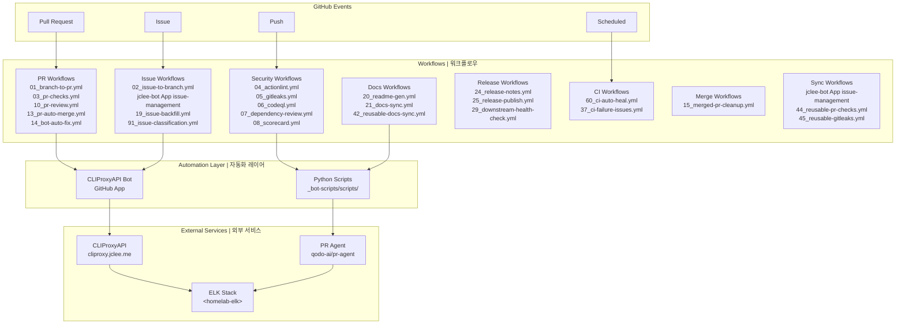

# GitHub Automation Bot — CLIProxyAPI v2.0

[](https://cliproxy.jclee.me)
[](#automation-inventory--자동화-인벤토리)
[](https://www.python.org/)
[](./LICENSE)

> **English** | [**한국어**](#개요)

---

## Table of Contents

- [Overview](#overview--개요)
- [Features](#features--주요-기능)
- [Architecture](#architecture--아키텍처)
- [Automation Inventory](#automation-inventory--자동화-인벤토리)
- [Quick Start](#quick-start--빠른-시작)
- [Local Development](#local-development--로컬-개발)
- [Commands Reference](#commands-reference--명령어-참조)
- [Contribution Guide](#contribution-guide--기여-가이드)

---

## Overview | 개요

This repository contains the **CLIProxyAPI v2.0 GitHub Automation Bot** — a comprehensive system of **33 GitHub Actions workflows** and Python-based automation tools that provide automated code review, issue management, PR handling, documentation generation, and release automation for GitHub repositories.

이 저장소는 **CLIProxyAPI v2.0 GitHub 자동화 봇**을 포함하고 있으며, GitHub 저장소에 대한 자동화된 코드 리뷰, 이슈 관리, PR 처리, 문서 생성 및 릴리스 자동화를 제공하는 **33개의 GitHub Actions 워크플로우**와 Python 기반 자동화 도구의 종합 시스템입니다.

### Key Characteristics | 주요 특성

| Characteristic 특성 | Description 설명 |
|---|---|
| **Architecture** 아키텍처 | Python-based GitHub App + GitHub Actions |
| **Automation Scope** 자동화 범위 | 33 workflows covering PR, issues, security, releases |
| **Core Scripts** 핵심 스크립트 | `_bot-scripts/scripts/` (Python automation tools) |
| **External Services** 외부 서비스 | CLIProxyAPI (`cliproxy.jclee.me`), PR Agent (`qodo-ai/pr-agent`) |
| **Logging** 로깅 | ELK stack (`<homelab-elk>`) |

---

## Features | 주요 기능

### Automated Code Review | 자동화 코드 리뷰

- **PR Agent Integration**: AI-powered code reviews using `qodo-ai/pr-agent`
- **PR Review Workflow**: Automated review assignment and feedback
- **Security Scanning**: Gitleaks, CodeQL, and dependency vulnerability detection

### Issue Management | 이슈 관리

- **Automated Triage**: Classification and labeling via `91_issue-classification.yml`
- **Branch Creation**: Automatic branch generation from issues via `02_issue-to-branch.yml`
- **Backfill Automation**: Issue metadata enrichment via `19_issue-backfill.yml`

### Pull Request Automation | 풀 리퀘스트 자동화

- **Auto Merge**: Automatic merge when checks pass via `13_pr-auto-merge.yml`
- **Dependabot Auto Merge**: Automatic dependency updates via `12_dependabot-auto-merge.yml`
- **PR Checks**: Comprehensive validation via `03_pr-checks.yml`
- **Auto Fix**: Bot-initiated fixes via `14_bot-auto-fix.yml`

### Documentation | 문서화

- **README Generation**: Auto-generated documentation via `20_readme-gen.yml`
- **Docs Sync**: Synchronized documentation updates via `21_docs-sync.yml`
- **Release Notes**: Automated release note generation via `24_release-notes.yml`

### Release Automation | 릴리스 자동화

- **Release Publishing**: Automated release publication via `25_release-publish.yml`
- **Downstream Health Check**: Monitoring release health via `29_downstream-health-check.yml`

### CI/CD Intelligence | CI/CD 지능화

- **Auto Heal**: Automatic CI failure recovery via `60_ci-auto-heal.yml`
- **CI Failure Issues**: Automatic issue creation for CI failures via `37_ci-failure-issues.yml`

---

## Architecture | 아키텍처



---

## Automation Inventory | 자동화 인벤토리

### Workflow Files | 워크플로우 파일

| # | File Name 파일명 | Purpose 목적 | Category 카테고리 |
|---|---|---|---|
| 1 | `01_branch-to-pr.yml` | Branch to PR synchronization | PR |
| 2 | `02_issue-to-branch.yml` | Issue to branch creation | Issue |
| 3 | `03_pr-checks.yml` | PR validation and checks | PR |
| 4 | `04_actionlint.yml` | GitHub Actions linting | Security |
| 5 | `05_gitleaks.yml` | Secret scanning | Security |
| 6 | `06_codeql.yml` | Code quality analysis | Security |
| 7 | `07_dependency-review.yml` | Dependency vulnerability review | Security |
| 8 | `08_scorecard.yml` | Security scorecard | Security |
| 9 | `09_semantic-pr.yml` | Semantic PR validation | PR |
| 10 | `10_pr-review.yml` | PR review automation | PR |
| 12 | `12_dependabot-auto-merge.yml` | Dependabot PR auto-merge | PR |
| 13 | `13_pr-auto-merge.yml` | PR auto-merge | PR |
| 14 | `14_bot-auto-fix.yml` | Bot-initiated auto-fix | PR |
| 15 | `15_merged-pr-cleanup.yml` | Post-merge cleanup | PR |
| 18 | `jclee-bot App issue-management` | Issue management | Issue |
| 19 | `19_issue-backfill.yml` | Issue metadata backfill | Issue |
| 20 | `20_readme-gen.yml` | README generation | Docs |
| 21 | `21_docs-sync.yml` | Documentation sync | Docs |
| 24 | `24_release-notes.yml` | Release notes generation | Release |
| 25 | `25_release-publish.yml` | Release publication | Release |
| 29 | `29_downstream-health-check.yml` | Downstream health monitoring | Release |
| 37 | `37_ci-failure-issues.yml` | CI failure issue creation | CI |
| 42 | `42_reusable-docs-sync.yml` | Reusable docs sync workflow | Docs |
| 43 | `jclee-bot App issue-management` | Reusable issue management | Issue |
| 44 | `44_reusable-pr-checks.yml` | Reusable PR checks | PR |
| 45 | `45_reusable-gitleaks.yml` | Reusable Gitleaks scan | Security |
| 60 | `60_ci-auto-heal.yml` | CI auto-healing | CI |
| 91 | `91_issue-classification.yml` | Issue classification | Issue |
| - | `auto-merge.yml` | General auto-merge | PR |
| - | `ci.yml` | General CI workflow | CI |
| - | `labeler.yml` | Issue/PR labeling | Issue |
| - | `welcome.yml` | New contributor welcome | Community |
| - | `security/11_pr-review.yml` | Security PR review | Security |

### Python Automation Scripts | Python 자동화 스크립트

| Script 스크립트 | Purpose 목적 |
|---|---|
| `pr_review_runner.py` | PR review execution runner |
| `check_workflow_scripts.py` | Workflow validation script |
| `check_private_ips.py` | Private IP detection scanner |
| `check_hardcode_scan_patterns_test.py` | Hardcoded pattern scanner test |
| `generate_readme.py` | README generation utility |
| `issue_classification_workflow_test.py` | Issue classification test |
| `repo_review.py` | Repository review utility |
| `redact_exposed_secrets.py` | Secret redaction tool |
| `readme_mermaid_test.py` | README Mermaid validation test |
| `pr_review_runner_test.py` | PR review runner tests |

---

## Quick Start | 빠른 시작

### Prerequisites | 필수 조건

- Python 3.x
- Docker (for containerized execution)
- GitHub App credentials for CLIProxyAPI

### Installation | 설치

```bash
# Clone the repository
git clone https://github.com/jclee941/.github
cd CLIProxyAPI

# Install dependencies
pip install -r _bot-scripts/requirements.txt

# Install development dependencies
pip install -r _bot-scripts/requirements-dev.txt
```

### Initial Setup | 초기 설정

1. Register a GitHub App for CLIProxyAPI
2. Configure webhook endpoints in your repository settings
3. Set required secrets in GitHub repository settings:
   - `CLI_PROXY_API_KEY`
   - `ELK_ENDPOINT` (`<homelab-elk>`)
   - `PR_AGENT_TOKEN`

---

## Local Development | 로컬 개발

### Development Environment | 개발 환경

```bash
# Set up virtual environment
python -m venv venv
source venv/bin/activate  # Linux/Mac
# or
.\venv\Scripts\activate   # Windows

# Install dependencies
pip install -r _bot-scripts/requirements.txt
pip install -r _bot-scripts/requirements-dev.txt
```

### Running Tests | 테스트 실행

```bash
# Run all tests
make test

# Run specific test files
python -m pytest _bot-scripts/scripts/pr_review_runner_test.py
python -m pytest _bot-scripts/scripts/check_private_ips_test.py
python -m pytest _bot-scripts/scripts/check_workflow_scripts_test.py
```

### Docker-based Development | Docker 기반 개발

```bash
# Build GitHub Action image
docker build -f _bot-scripts/Dockerfile.github_action -t cli-proxy-action .

# Build GitHub App image
docker build -f _bot-scripts/Dockerfile.github_app -t cli-proxy-app .

# Run with docker-compose
docker-compose -f _bot-scripts/docker-compose.github_app.yml up
```

### Local Workflow Testing | 로컬 워크플로우 테스트

```bash
# Validate workflow syntax
actionlint -local _bot-scripts/scripts _bot-scripts/.. .github/workflows/

# Test Gitleaks locally
docker run -v $(pwd):/data aquasec/gitleaks detect --source /data
```

---

## Commands Reference | 명령어 참조

### Makefile Commands | Makefile 명령어

| Command 명령어 | Description 설명 |
|---|---|
| `make install` | Install dependencies |
| `make test` | Run test suite |
| `make lint` | Run linting checks |
| `make format` | Format code |
| `make docker-build` | Build Docker images |
| `make docker-push` | Push Docker images |

### Python Scripts | Python 스크립트

| Command 명령어 | Description 설명 |
|---|---|
| `python scripts/generate_readme.py` | Generate README documentation |
| `python scripts/pr_review_runner.py` | Run PR review automation |
| `python scripts/repo_review.py` | Run repository review |
| `python scripts/check_private_ips.py` | Scan for private IPs |
| `python scripts/check_workflow_scripts.py` | Validate workflow scripts |
| `python scripts/redact_exposed_secrets.py` | Redact exposed secrets |
| `python scripts/issue_classification_workflow_test.py` | Test issue classification |

### GitHub Actions Workflows | GitHub Actions 워크플로우

| Workflow 워크플로우 | Trigger 트리거 | Description 설명 |
|---|---|---|
| `03_pr-checks.yml` | `pull_request` | Run PR validation checks |
| `10_pr-review.yml` | `pull_request` | Run AI-powered PR review |
| `13_pr-auto-merge.yml` | `pull_request` | Auto-merge approved PRs |
| `20_readme-gen.yml` | `push`, `schedule` | Generate/update README |
| `91_issue-classification.yml` | `issues` | Classify new issues |

---

## Contribution Guide | 기여 가이드

### Contributing Process | 기여 프로세스

1. **Fork** the repository
2. **Create a feature branch**: `git checkout -b feature/my-feature`
3. **Make changes** and commit with clear messages
4. **Run tests**: `make test`
5. **Submit a Pull Request** with a description of changes
6. **Await review** from maintainers

### Code Standards | 코드 표준

- Follow PEP 8 Python style guidelines
- Include type hints where applicable
- Write unit tests for new functionality
- Update documentation for any API changes

### Reporting Issues | 이슈 보고

- Use issue templates for bug reports and feature requests
- Include reproduction steps for bugs
- Specify environment details (Python version, OS, etc.)

### Documentation | 문서화

- Update `CONTRIBUTING.md` for process changes
- Keep `AGENTS.md` current for agent behavior changes
- Update `docs/` for structural/documentation changes

---

## License | 라이선스

See [LICENSE](./LICENSE) for details.

---

## Contact | 연락처

- Documentation: [docs/](docs/)
- Security: [SECURITY.md](./_bot-scripts/SECURITY.md)
- Main project: [CLIProxyAPI](https://cliproxy.jclee.me)

---

*Generated by CLIProxyAPI v2.0 — README Generator*
