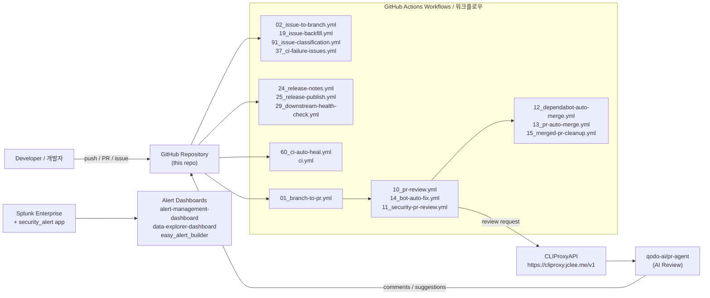

# Security Alert Splunk App & GitHub Automation

[](#automation-inventory--자동화-인벤토리)
[](#overview--개요)
[](https://cliproxy.jclee.me)
[](./LICENSE)

> English | 한국어
> 이 README는 영문/한글 이중 언어로 작성되었습니다. Each major section contains English and Korean descriptions.

---

## Table of Contents

- [Overview | 개요](#overview--개요)
- [Features | 주요 기능](#features--주요-기능)
- [Architecture | 아키텍처](#architecture--아키텍처)
- [Automation Inventory | 자동화 인벤토리](#automation-inventory--자동화-인벤토리)
- [Repository Structure | 저장소 구조](#repository-structure--저장소-구조)
- [Quick Start | 빠른 시작](#quick-start--빠른-시작)
- [Local Development | 로컬 개발](#local-development--로컬-개발)
- [Commands Reference | 명령어 참조](#commands-reference--명령어-참조)
- [Contribution Guide | 기여 가이드](#contribution-guide--기여-가이드)

---

## Overview | 개요

### English

This repository contains a Splunk application named `security_alert` together with an extensive GitHub automation layer for pull request review, security scanning, documentation maintenance, release handling, issue triage, and CI self-healing.

The Splunk app provides alert actions, dashboards, saved searches, macros, transforms, and bundled Python dependencies used by the app runtime. The repository also contains operational documentation under `docs/` and `resume/`, plus a `demo/` area for examples.

GitHub automation is implemented with 16 workflow files that integrate GitHub Actions, security scanners, PR review bots, documentation generation, release publishing, and external AI-assisted services through CLIProxyAPI. AI-assisted reviews use [qodo-ai/pr-agent](https://github.com/qodo-ai/pr-agent) routed through the local proxy at [https://cliproxy.jclee.me/v1](https://cliproxy.jclee.me).

### 한국어

이 저장소는 `security_alert`라는 Splunk 애플리케이션과 PR 리뷰, 보안 스캔, 문서 자동 관리, 릴리스 처리, 이슈 분류, CI 자동 복구(self-healing) 기능을 포함하는 광범위한 GitHub 자동화 레이어를 제공합니다.

Splunk 앱은 경보 액션(alert actions), 대시보드, 저장된 검색(saved searches), 매크로, 변환(transforms) 및 앱 런타임에 사용되는 번들 Python 의존성을 제공합니다. 저장소에는 `docs/` 및 `resume/` 아래 운영 문서와 예제용 `demo/` 영역이 포함되어 있습니다.

GitHub 자동화는 16개의 워크플로우 파일로 구현되어 GitHub Actions, 보안 스캐너, PR 리뷰 봇, 문서 자동 생성, 릴리스 게시, 그리고 CLIProxyAPI를 통한 외부 AI 지원 서비스를 통합합니다. AI 지원 리뷰는 [qodo-ai/pr-agent](https://github.com/qodo-ai/pr-agent)를 [https://cliproxy.jclee.me/v1](https://cliproxy.jclee.me)의 로컬 프록시를 통해 라우팅하여 사용합니다.

---

## Features | 주요 기능

### English

- **Splunk Security Alert App** — Modular Splunk app (`security_alert`) with alert actions, macros, transforms, props, saved searches, and an easy alert builder UI.
- **Dashboard Suite** — Pre-built dashboards for alert management, data exploration, and easy alert building.
- **Bundled Python Runtime** — Vendored third-party libraries (`urllib3`, `charset_normalizer`, `idna`) under `security_alert/lib/python3/` to ensure consistent app behavior.
- **GitHub Automation** — 16 GitHub Actions workflows covering PR review, security review, auto-merge, Dependabot handling, issue triage, release notes, release publishing, downstream health checks, CI failure-to-issue tracking, and CI auto-heal.
- **AI-Assisted Review** — PR-Agent style reviews via CLIProxyAPI with fallback model handling.
- **Self-Healing CI** — Workflows detect and remediate recurring CI failures automatically.
- **Operational Documentation** — Architecture, deployment, troubleshooting, release notes, and alert repository guides.

### 한국어

- **Splunk 보안 경보 앱** — `security_alert` 모듈식 Splunk 앱. 경보 액션, 매크로, 변환, props, 저장된 검색 및 easy alert builder UI 포함.
- **대시보드 스위트** — 경보 관리, 데이터 탐색, easy alert building용 사전 구축 대시보드 제공.
- **번들 Python 런타임** — `security_alert/lib/python3/` 아래에 벤더링된 써드파티 라이브러리(`urllib3`, `charset_normalizer`, `idna`)로 일관된 앱 동작 보장.
- **GitHub 자동화** — PR 리뷰, 보안 리뷰, 자동 머지, Dependabot 처리, 이슈 분류, 릴리스 노트, 릴리스 게시, 다운스트림 헬스 체크, CI 실패 → 이슈 추적, CI 자동 복구를 다루는 16개의 GitHub Actions 워크플로우.
- **AI 지원 리뷰** — CLIProxyAPI를 통한 PR-Agent 스타일 리뷰와 폴백 모델 처리.
- **자가 복구 CI** — 반복되는 CI 실패를 자동 감지하고 복구하는 워크플로우.
- **운영 문서** — 아키텍처, 배포, 트러블슈팅, 릴리스 노트, 알림 저장소 가이드 포함.

---

## Architecture | 아키텍처

### English

The system is composed of two cooperating layers: the **Splunk app** consumed by Splunk Enterprise, and the **GitHub automation** that maintains this repository. PR review requests are routed to the PR-Agent service via CLIProxyAPI, which exposes an OpenAI-compatible endpoint at `https://cliproxy.jclee.me/v1`. CI failures generate issues automatically, and the auto-heal workflow attempts remediation.

### 한국어

이 시스템은 두 개의 협력 레이어로 구성됩니다: Splunk Enterprise에서 사용되는 **Splunk 앱**과 이 저장소를 유지 관리하는 **GitHub 자동화**입니다. PR 리뷰 요청은 CLIProxyAPI의 OpenAI 호환 엔드포인트 `https://cliproxy.jclee.me/v1`을 통해 PR-Agent 서비스로 라우팅됩니다. CI 실패는 자동으로 이슈를 생성하며 자동 복구 워크플로우가 해결을 시도합니다.



---

## Automation Inventory | 자동화 인벤토리

### English

The repository contains **16 GitHub Actions workflow files** (numbered by lifecycle phase) plus **0 Go-based automation tools** in this checkout. All workflows live alongside the application code and are triggered by GitHub events such as `push`, `pull_request`, `issues`, `schedule`, and `workflow_dispatch`.

### Workflow Files | 워크플로우 파일 목록

| # | File | Purpose (EN) | 목적 (KR) |
|---|------|--------------|-----------|
| 01 | `01_branch-to-pr.yml` | Converts a pushed branch into a pull request draft. | 푸시된 브랜치를 PR 초안으로 변환합니다. |
| 02 | `02_issue-to-branch.yml` | Creates a branch from an issue when labeled. | 이슈에 라벨이 지정되면 브랜치를 생성합니다. |
| 10 | `10_pr-review.yml` | Runs PR-Agent AI review on pull requests. | Pull request에 대해 PR-Agent AI 리뷰를 실행합니다. |
| 11 | `11_security-pr-review.yml` | Security-focused PR review and advisory posting. | 보안 중심 PR 리뷰 및 권고 게시. |
| 12 | `12_dependabot-auto-merge.yml` | Auto-merges Dependabot PRs after checks. | Dependabot PR을 검사 후 자동 머지합니다. |
| 13 | `13_pr-auto-merge.yml` | Auto-merges approved PRs that pass CI. | 승되고 CI를 통과한 PR을 자동 머지합니다. |
| 14 | `14_bot-auto-fix.yml` | Bot applies automated fixes from review comments. | 봇이 리뷰 코멘트의 자동 수정 사항을 적용합니다. |
| 15 | `15_merged-pr-cleanup.yml` | Cleans up branches and stale references after merge. | 머지 후 브랜치 및 오래된 참조를 정리합니다. |
| 19 | `19_issue-backfill.yml` | Backfills metadata on existing issues. | 기존 이슈의 메타데이터를 백필합니다. |
| 24 | `24_release-notes.yml` | Generates release notes from merged PRs. | 머지된 PR로부터 릴리스 노트를 생성합니다. |
| 25 | `25_release-publish.yml` | Publishes a GitHub Release with artifacts. | GitHub 릴리스를 아티팩트와 함께 게시합니다. |
| 29 | `29_downstream-health-check.yml` | Validates downstream consumers after release. | 릴리스 후 다운스트림 컨슈머 상태를 검증합니다. |
| 37 | `37_ci-failure-issues.yml` | Files an issue when CI fails on the default branch. | 기본 브랜치에서 CI 실패 시 이슈를 등록합니다. |
| 60 | `60_ci-auto-heal.yml` | Attempts automated remediation of recurring CI failures. | 반복되는 CI 실패에 대한 자동 복구를 시도합니다. |
| 91 | `91_issue-classification.yml` | Classifies new issues by area and priority. | 신규 이슈를 영역 및 우선순위로 분류합니다. |
| — | `ci.yml` | Default CI pipeline: lint, build, tests. | 기본 CI 파이프라인: 린트, 빌드, 테스트. |

### Automation Tools | 자동화 도구

This repository currently ships with **0 Go automation tools** in this checkout. Automation is implemented entirely as GitHub Actions workflows plus the bundled Splunk app scripts under `security_alert/bin/`.

### 한국어

저장소에는 **16개의 GitHub Actions 워크플로우 파일**(라이프사이클 단계별 번호 부여)과 본 체크아웃에는 **Go 기반 자동화 도구가 0개** 포함되어 있습니다. 모든 워크플로우는 애플리케이션 코드와 함께 위치하며 `push`, `pull_request`, `issues`, `schedule`, `workflow_dispatch` 등 GitHub 이벤트에 의해 트리거됩니다.

---

## Repository Structure | 저장소 구조

### English

The top-level layout reflects the actual repository contents:

### 한국어

최상위 레이아웃은 실제 저장소 내용을 반영합니다:

```
/
├── CONTRIBUTING.md                # Contribution guidelines
├── LICENSE                       # Repository license
├── README.md                     # This document
├── resume/                       # Resumed/operations docs
│   ├── API.md
│   ├── ARCHITECTURE.md
│   ├── DEPLOYMENT.md
│   └── TROUBLESHOOTING.md
├── docs/                         # Operational documentation
│   ├── ALERT-REPOSITORY-XWIKI.md
│   ├── DEPLOYMENT.md
│   ├── LEGACY-CLEANUP-REPORT.md
│   ├── QUICK-START.md
│   └── RELEASE-NOTES.md
├── demo/                         # Demos and examples
│   └── README.md
└── security_alert/               # Splunk application package
    ├── README.md
    ├── app.manifest              # Splunk app manifest
    ├── bin/                      # Python scripts shipped with the app
    │   ├── safe_fmt.py
    │   ├── six.py
    │   └── slack.py
    ├── metadata/                 # Splunk app metadata
    │   └── default.meta
    └── default/                  # Splunk knowledge objects
        ├── alert_actions.conf
        ├── app.conf
        ├── macros.conf
        ├── props.conf
        ├── savedsearches.conf
        ├── transforms.conf
        └── data/
            └── ui/
                ├── nav/default.xml
                └── views/
                    ├── alert-builder.xml
                    ├── alert-management-dashboard.xml
                    ├── data-explorer-dashboard.xml
                    └── easy_alert_builder.xml
```

> Note: Vendored third-party Python packages (`urllib3`, `charset_normalizer`, `idna`) live under `security_alert/lib/python3/`. Workflow files are tracked at the repository root or under `.github/workflows/` depending on the configuration; their **filenames** (e.g. `10_pr-review.yml`) are the canonical identifiers used throughout this README.

---

## Quick Start | 빠른 시작

### English

1. **Clone the repository**
   ```bash
   git clone <repository-url>
   cd <repository-name>
   ```

2. **Review the Splunk app**
   - Inspect `security_alert/default/app.conf` for app metadata.
   - Inspect `security_alert/default/alert_actions.conf` and `savedsearches.conf` for alert definitions.

3. **Install into Splunk**
   - Copy the `security_alert/` directory into `$SPLUNK_HOME/etc/apps/`.
   - Restart Splunk or run `splunk reload deploy-server`.

4. **Inspect automation**
   - Workflows are referenced by filename (e.g. `10_pr-review.yml`, `13_pr-auto-merge.yml`).
   - Configure repository secrets as needed (`CLI_PROXY_TOKEN`, GitHub token, etc.).

5. **Read operational docs**
   - See `docs/QUICK-START.md` and `docs/DEPLOYMENT.md` for the canonical deployment guide.

### 한국어

1. **저장소 클론**
   ```bash
   git clone <repository-url>
   cd <repository-name>
   ```

2. **Splunk 앱 검토**
   - `security_alert/default/app.conf`에서 앱 메타데이터를 확인합니다.
   - `security_alert/default/alert_actions.conf` 및 `savedsearches.conf`에서 경보 정의를 확인합니다.

3. **Splunk에 설치**
   - `security_alert/` 디렉터리를 `$SPLUNK_HOME/etc/apps/`로 복사합니다.
   - Splunk를 재시작하거나 `splunk reload deploy-server`를 실행합니다.

4. **자동화 검토**
   - 워크플로우는 파일명(예: `10_pr-review.yml`, `13_pr-auto-merge.yml`)으로 참조됩니다.
   - 필요에 따라 저장소 시크릿(`CLI_PROXY_TOKEN`, GitHub token 등)을 설정합니다.

5. **운영 문서 확인**
   - 표준 배포 가이드는 `docs/QUICK-START.md` 및 `docs/DEPLOYMENT.md`를 참조하세요.

---

## Local Development | 로컬 개발

### English

- **Splunk app changes** — Edit `.conf` files under `security_alert/default/`. Restart Splunk or reload the app to pick up changes.
- **Alert actions** — Modify Python scripts in `security_alert/bin/`. Test by triggering the corresponding alert action.
- **Dashboards** — Modify Simple XML in `security_alert/default/data/ui/views/*.xml`. Validate by reloading the dashboard.
- **Workflows** — Edit YAML files in place. Trigger manually via `workflow_dispatch` or by pushing to a test branch.
- **Dependencies** — Vendored Python packages under `security_alert/lib/python3/` should not be modified directly; rebuild only when an upstream security fix is required.

### 한국어

- **Splunk 앱 변경** — `security_alert/default/` 아래 `.conf` 파일을 편집합니다. Splunk를 재시작하거나 앱을 리로드하여 변경 사항을 적용합니다.
- **경보 액션** — `security_alert/bin/`의 Python 스크립트를 수정합니다. 해당 경보 액션을 트리거하여 테스트합니다.
- **대시보드** — `security_alert/default/data/ui/views/*.xml`의 Simple XML을 수정합니다. 대시보드를 리로드하여 검증합니다.
- **워크플로우** — YAML 파일을 직접 편집합니다. `workflow_dispatch`로 수동 트리거하거나 테스트 브랜치에 푸시합니다.
- **의존성** — `security_alert/lib/python3/`의 벤더링된 Python 패키지는 직접 수정하지 마십시오. 업스트림 보안 수정이 필요한 경우에만 재빌드합니다.

---

## Commands Reference | 명령어 참조

### English

Commonly used commands when working with this repository:

| Command | Purpose |
|---------|---------|
| `git clone <repo-url>` | Clone the repository locally. |
| `git checkout -b feat/<name>` | Create a feature branch. |
| `git push origin feat/<name>` | Push a branch; `01_branch-to-pr.yml` will draft a PR. |
| `gh pr create --fill` | Open a pull request; `10_pr-review.yml` will review. |
| `gh issue create --label triage` | Open an issue; `02_issue-to-branch.yml` may spawn a branch. |
| `splunk reload deploy-server` | Reload Splunk apps on the deployer. |
| `python3 security_alert/bin/safe_fmt.py` | Run the safe formatter helper. |
| `python3 security_alert/bin/slack.py` | Run the Slack notifier helper. |

### 한국어

이 저장소 작업 시 자주 사용되는 명령어:

| 명령어 | 목적 |
|--------|------|
| `git clone <repo-url>` | 저장소를 로컬에 클론합니다. |
| `git checkout -b feat/<name>` | 기능 브랜치를 생성합니다. |
| `git push origin feat/<name>` | 브랜치를 푸시하면 `01_branch-to-pr.yml`이 PR 초안을 만듭니다. |
| `gh pr create --fill` | Pull request를 열고 `10_pr-review.yml`이 리뷰를 수행합니다. |
| `gh issue create --label triage` | 이슈를 열면 `02_issue-to-branch.yml`이 브랜치를 생성할 수 있습니다. |
| `splunk reload deploy-server` | Splunk deployer에서 앱을 리로드합니다. |
| `python3 security_alert/bin/safe_fmt.py` | safe formatter 헬퍼를 실행합니다. |
| `python3 security_alert/bin/slack.py` | Slack 알림 헬퍼를 실행합니다. |

---

## Contribution Guide | 기여 가이드

### English

Contributions are welcome. Please follow these steps:

1. **Read** `CONTRIBUTING.md` for the full contribution policy.
2. **Open or pick an issue.** New issues are auto-classified by `91_issue-classification.yml`.
3. **Create a branch** using the convention suggested by `02_issue-to-branch.yml` (e.g. `feat/<issue-number>-<slug>`).
4. **Implement your change** under the appropriate directory:
   - Splunk app changes → `security_alert/`
   - Documentation → `docs/` or `resume/`
   - Automation changes → corresponding workflow YAML file
5. **Open a pull request.** `10_pr-review.yml` will request a review and `11_security-pr-review.yml` will run a security pass.
6. **Address review feedback.** `14_bot-auto-fix.yml` may apply suggested fixes automatically.
7. **Merge.** When checks pass and approvals are in place, `13_pr-auto-merge.yml` handles the merge.
8. **Post-merge** — `15_merged-pr-cleanup.yml` cleans up the branch. Releases are produced via `24_release-notes.yml` and `25_release-publish.yml`.

### 한국어

기여를 환영합니다. 다음 절차를 따라 주십시오:

1. 전체 기여 정책은 **`CONTRIBUTING.md`를 먼저 읽어 주십시오.**
2. **이슈를 열거나 선택합니다.** 신규 이슈는 `91_issue-classification.yml`에 의해 자동 분류됩니다.
3. **`02_issue-to-branch.yml`이 제안하는 규칙(예: `feat/<이슈번호>-<slug>`)에 따라 브랜치를 생성합니다.**
4. **변경 사항을 적절한 디렉터리에 구현합니다:**
   - Splunk 앱 변경 → `security_alert/`
   - 문서 → `docs/` 또는 `resume/`
   - 자동화 변경 → 해당 워크플로우 YAML 파일
5. **Pull request를 엽니다.** `10_pr-review.yml`이 리뷰를 요청하고 `11_security-pr-review.yml`이 보안 패스를 실행합니다.
6. **리뷰 피드백을 반영합니다.** `14_bot-auto-fix.yml`이 제안된 수정을 자동 적용할 수 있습니다.
7. **머지합니다.** 검사를 통과하고 승인이 완료되면 `13_pr-auto-merge.yml`이 머지를 처리합니다.
8. **머지 후** — `15_merged-pr-cleanup.yml`이 브랜치를 정리합니다. 릴리스는 `24_release-notes.yml` 및 `25_release-publish.yml`을 통해 생성됩니다.

---

## License | 라이선스

See [`LICENSE`](./LICENSE) for the repository license. All third-party Python packages vendored under `security_alert/lib/python3/` retain their original licenses (see each `*.dist-info/METADATA` and `licenses/` subdirectory for details).

저장소 라이선스는 [`LICENSE`](./LICENSE)를 참조하십시오. `security_alert/lib/python3/` 아래에 벤더링된 모든 써드파티 Python 패키지는 원래 라이선스를 유지합니다(자세한 내용은 각 `*.dist-info/METADATA` 및 `licenses/` 하위 디렉터리 참조).

---

## Service Endpoints | 서비스 엔드포인트

| Service | URL | Purpose |
|---------|-----|---------|
| CLIProxyAPI | [https://cliproxy.jclee.me](https://cliproxy.jclee.me) | Local AI proxy fronting upstream models. |
| CLIProxyAPI OpenAI-compatible endpoint | `https://cliproxy.jclee.me/v1` | Used by `10_pr-review.yml` and friends. |
| PR-Agent reference | [qodo-ai/pr-agent](https://github.com/qodo-ai/pr-agent) | The AI review tooling integrated via the proxy. |

> README generated by gpt-5.5 (fallback: minimax-m3 via CLIProxyAPI).