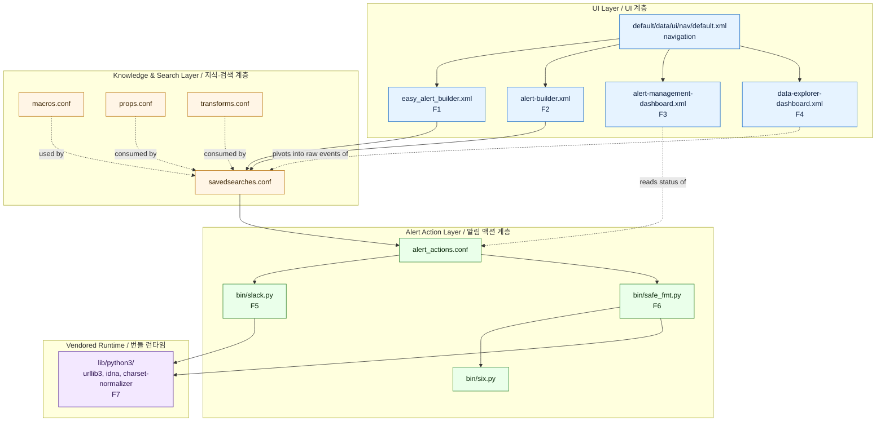

# Security Alert (Splunk App) / 보안 알림 (Splunk 앱)

A production-grade Splunk add-on that ships a unified **alert-management dashboard**, an **easy alert builder**, a richer **alert builder**, and a **data-explorer view**, bundled with a safe-formatting helper and a Slack notifier. The repository also preserves historical and resume-style documentation under `resume/` and operational notes under `docs/`.

프로덕션급 Splunk 애드온으로, 통합 **알림 관리 대시보드**, **손쉬운 알림 빌더**, 풍부한 **알림 빌더**, 그리고 **데이터 탐색기 뷰**를 제공하며, 안전한 포맷팅 헬퍼와 Slack 알림 스크립트를 함께 번들합니다. 본 저장소는 `resume/` 및 `docs/` 아래에 운영/아카이브 문서를 함께 보관합니다.

---

## Table of Contents / 목차

1. [Overview / 개요](#1-overview--개요)
2. [Features / 주요 기능](#2-features--주요-기능)
3. [Architecture / 아키텍처](#3-architecture--아키텍처)
4. [Repository Layout / 저장소 구조](#4-repository-layout--저장소-구조)
5. [Quick Start / 빠른 시작](#5-quick-start--빠른-시작)
6. [Configuration / 설정](#6-configuration--설정)
7. [Component Reference / 구성 요소 참조](#7-component-reference--구성-요소-참조)
8. [Local Development / 로컬 개발](#8-local-development--로컬-개발)
9. [Testing / 테스트](#9-testing--테스트)
10. [Operations / 운영](#10-operations--운영)
11. [Documentation Index / 문서 인덱스](#11-documentation-index--문서-인덱스)
12. [Contributing / 기여](#12-contributing--기여)
13. [License / 라이선스](#13-license--라이선스)

---

## 1. Overview / 개요

`security_alert/` is a Splunk app that:

- Standardizes ad-hoc alerting through a guided **Easy Alert Builder** and a richer **Alert Builder** form.
- Provides a centralized **Alert Management Dashboard** to triage and audit alerts.
- Provides a **Data Explorer Dashboard** to investigate the underlying events that triggered alerts.
- Includes a **Slack notification script** (`bin/slack.py`) and a **safe formatter** (`bin/safe_fmt.py`) used by alert actions and custom commands.
- Vendors a self-contained Python 3 runtime under `lib/python3/` (urllib3, idna, charset-normalizer) so the app works on air-gapped Splunk instances without `pip`.
- Ships navigation, default metadata, and `app.manifest` so the app is discoverable and installable on standard Splunk Enterprise and Splunk Cloud environments.

`security_alert/`는 다음과 같은 Splunk 앱입니다.

- 일회성 알림 작성을 **Easy Alert Builder**와 풍부한 **Alert Builder** 폼으로 표준화합니다.
- 알림을 분류·감사할 수 있는 중앙 집중식 **Alert Management Dashboard**를 제공합니다.
- 알림을 트리거한 이벤트를 조사할 수 있는 **Data Explorer Dashboard**를 제공합니다.
- 알림 액션과 커스텀 명령이 사용하는 **Slack 알림 스크립트**(`bin/slack.py`) 및 **안전 포맷터**(`bin/safe_fmt.py`)를 포함합니다.
- 폐쇄망 Splunk 인스턴스에서도 `pip` 없이 동작하도록 `lib/python3/` 아래에 urllib3, idna, charset-normalizer 등 Python 3 런타임을 자체 번들합니다.
- 탐색, 기본 메타데이터, `app.manifest`를 함께 제공하여 표준 Splunk Enterprise 및 Splunk Cloud 환경에서 검색·설치할 수 있습니다.

### Intended Audience / 대상 사용자

- **Splunk administrators / Splunk 관리자** who own alerting hygiene, false-positive reduction, and on-call escalation paths.
  알림 위생, 오탐 감소, 온콜 에스컬레이션 경로를 책임지는 Splunk 관리자.
- **Detection engineers / 위협 헌터·탐지 엔지니어** who need a repeatable, auditable way to author and tune alerts.
  알림 작성 및 튜닝을 반복 가능하고 감사 가능한 방식으로 수행해야 하는 탐지 엔지니어.
- **SOC analysts / SOC 분석가** who triage alerts and pivot to the underlying raw events.
  알림을 분류하고 원본 이벤트로 피벗해야 하는 SOC 분석가.

---

## 2. Features / 주요 기능

| # | Feature (EN) | 기능 (KO) | Where it lives / 위치 |
|---|---|---|---|
| F1 | Guided **Easy Alert Builder** with sensible defaults for quick one-off alerting. | 빠른 일회성 알림을 위한 합리적 기본값을 갖춘 **Easy Alert Builder**. | `security_alert/default/data/ui/views/easy_alert_builder.xml` |
| F2 | Richer **Alert Builder** form for advanced multi-condition alerts. | 다중 조건의 고급 알림을 위한 풍부한 **Alert Builder**. | `security_alert/default/data/ui/views/alert-builder.xml` |
| F3 | Centralized **Alert Management Dashboard** for triage, status, and audit. | 분류·상태·감사를 위한 중앙 집중식 **Alert Management Dashboard**. | `security_alert/default/data/ui/views/alert-management-dashboard.xml` |
| F4 | **Data Explorer Dashboard** to pivot from an alert into raw events. | 알림에서 원시 이벤트로 피벗하기 위한 **Data Explorer Dashboard**. | `security_alert/default/data/ui/views/data-explorer-dashboard.xml` |
| F5 | **Slack notifier** (`bin/slack.py`) wired through custom alert actions. | 커스텀 알림 액션을 통해 연결되는 **Slack 알림 스크립트**(`bin/slack.py`). | `security_alert/bin/slack.py` |
| F6 | **Safe formatter** (`bin/safe_fmt.py`) used by alert actions and custom commands to avoid injection-prone template rendering. | 인젝션에 취약한 템플릿 렌더링을 피하기 위해 알림 액션과 커스텀 명령이 사용하는 **안전 포맷터**(`bin/safe_fmt.py`). | `security_alert/bin/safe_fmt.py` |
| F7 | Self-contained Python 3 runtime for offline / air-gapped Splunk deployments. | 오프라인/폐쇄망 Splunk 배포를 위한 자체 포함 Python 3 런타임. | `security_alert/lib/python3/` |
| F8 | Standard Splunk packaging with `app.manifest`, `app.conf`, navigation, and metadata. | `app.manifest`, `app.conf`, 탐색, 메타데이터를 갖춘 표준 Splunk 패키징. | `security_alert/app.manifest`, `security_alert/default/` |

---

## 3. Architecture / 아키텍처

The app follows the standard Splunk add-on layout: a **UI layer** (dashboards and forms in `default/data/ui/views/` plus navigation in `default/data/ui/nav/`), a **search/knowledge layer** (`savedsearches.conf`, `macros.conf`, `props.conf`, `transforms.conf`), an **alert-action layer** (`alert_actions.conf` plus scripts in `bin/`), and a **vendored runtime** under `lib/python3/` for offline use.

본 앱은 표준 Splunk 애드온 레이아웃을 따릅니다. **UI 계층**(`default/data/ui/views/`의 대시보드/폼 및 `default/data/ui/nav/`의 탐색), **검색/지식 계층**(`savedsearches.conf`, `macros.conf`, `props.conf`, `transforms.conf`), **알림 액션 계층**(`alert_actions.conf` 및 `bin/`의 스크립트), 오프라인 환경을 위한 `lib/python3/`의 **번들 런타임**으로 구성됩니다.



Notes / 참고:
- Solid arrows represent runtime invocation; dashed arrows represent configuration reference.
  실선은 런타임 호출, 점선은 설정 참조를 의미합니다.
- The `<br/>` line breaks inside node labels are intentional so Mermaid renders cleanly on GitHub.
  GitHub에서 Mermaid가 깨지지 않도록 노드 라벨 내부의 `<br/>` 줄바꿈을 의도적으로 사용했습니다.

---

## 4. Repository Layout / 저장소 구조

```
/
├── CONTRIBUTING.md                       Contribution guidelines / 기여 가이드
├── LICENSE                               License file / 라이선스 파일
├── README.md                             This file / 본 문서
├── resume/                               Historical / resume-style docs / 아카이브·이력 문서
│   ├── API.md
│   ├── ARCHITECTURE.md
│   ├── DEPLOYMENT.md
│   └── TROUBLESHOOTING.md
├── docs/                                 Operational notes / 운영 문서
│   ├── ALERT-REPOSITORY-XWIKI.md
│   ├── DEPLOYMENT.md
│   ├── LEGACY-CLEANUP-REPORT.md
│   ├── QUICK-START.md
│   └── RELEASE-NOTES.md
├── demo/                                 Demo materials / 데모 자료
│   └── README.md
└── security_alert/                       Splunk app payload / Splunk 앱 본체
    ├── README.md                         App-level README / 앱 단위 README
    ├── app.manifest                      Splunk app manifest / 앱 매니페스트
    ├── bin/                              Executable scripts / 실행 스크립트
    │   ├── safe_fmt.py
    │   ├── six.py
    │   └── slack.py
    ├── metadata/                         App-level metadata / 앱 메타데이터
    │   └── default.meta
    ├── default/                          Default configuration / 기본 설정
    │   ├── alert_actions.conf
    │   ├── app.conf
    │   ├── macros.conf
    │   ├── props.conf
    │   ├── savedsearches.conf
    │   ├── transforms.conf
    │   └── data/
    │       └── ui/
    │           ├── nav/
    │           │   └── default.xml
    │           └── views/
    │               ├── alert-builder.xml
    │               ├── alert-management-dashboard.xml
    │               ├── data-explorer-dashboard.xml
    │               └── easy_alert_builder.xml
    └── lib/                              Vendored Python runtime / 번들 Python 런타임
        └── python3/
            ├── idna-3.11.dist-info/
            ├── urllib3/
            └── charset_normalizer-3.4.4.dist-info/
```

---

## 5. Quick Start / 빠른 시작

The recommended install path is to drop the `security_alert/` folder into Splunk's `apps/` directory and restart `splunkd`. The app is self-contained, including its Python 3 runtime, so no `pip install` is required.

권장 설치 경로는 `security_alert/` 폴더를 Splunk의 `apps/` 디렉터리에 배치한 뒤 `splunkd`를 재시작하는 것입니다. 앱은 Python 3 런타임까지 자체 포함하므로 `pip install`이 필요 없습니다.

### 5.1 Prerequisites / 사전 요구 사항

- **Splunk Enterprise** 9.x or **Splunk Cloud** (a version compatible with the Python 3 runtime vendored under `lib/python3/`).
  Splunk Enterprise 9.x 또는 Splunk Cloud (앱이 번들한 Python 3 런타임과 호환되는 버전).
- Filesystem access to `$SPLUNK_HOME/etc/apps/` on the deployment target.
  배포 대상의 `$SPLUNK_HOME/etc/apps/`에 대한 파일 시스템 접근 권한.
- For Slack notifications: a Slack incoming webhook URL and outbound HTTPS access from the Splunk instance.
  Slack 알림 사용 시: Slack Incoming Webhook URL 및 Splunk 인스턴스의 아웃바운드 HTTPS 접근.

### 5.2 Install / 설치

```bash
# 1. Clone or download the repository
#    저장소를 클론하거나 다운로드합니다.
git clone <repository-url> security-alert
cd security-alert

# 2. Copy the app directory into Splunk's apps folder
#    앱 디렉터리를 Splunk 앱 폴더로 복사합니다.
cp -r security_alert "$SPLUNK_HOME/etc/apps/"

# 3. Set ownership so the splunkd user can read it
#    splunkd 사용자가 읽을 수 있도록 소유권을 설정합니다.
chown -R "$(id -un):$(id -gn)" "$SPLUNK_HOME/etc/apps/security_alert"

# 4. Restart splunkd so it picks up the new app
#    splunkd가 새 앱을 인식하도록 재시작합니다.
"$SPLUNK_HOME/bin/splunk" restart
```

After restart, open Splunk Web → **Apps → Manage Apps** and confirm that `security_alert` appears with status **Enabled**. Then visit **Security Alert** from the app navigation.

재시작 후 Splunk Web에서 **Apps → Manage Apps**로 이동하여 `security_alert`가 **Enabled** 상태로 표시되는지 확인합니다. 이후 앱 탐색에서 **Security Alert**를 엽니다.

### 5.3 First-Run Smoke Test / 첫 실행 점검

1. Open the **Easy Alert Builder** and create a low-frequency saved search (for example, `index=_internal | head 1`).
   **Easy Alert Builder**를 열고 저빈도 저장 검색(예: `index=_internal | head 1`)을 생성합니다.
2. Trigger it manually from **Settings → Searches, reports, and alerts**.
   **Settings → Searches, reports, and alerts**에서 수동으로 실행합니다.
3. Open the **Alert Management Dashboard** and confirm the new alert appears.
   **Alert Management Dashboard**를 열고 새 알림이 표시되는지 확인합니다.
4. Click through to the **Data Explorer Dashboard** to verify the underlying events render correctly.
   **Data Explorer Dashboard**로 이동해 원본 이벤트가 정상 렌더링되는지 확인합니다.

For a faster, scripted path, also see `docs/QUICK-START.md`.
더 빠른 스크립트 경로는 `docs/QUICK-START.md`를 참조하세요.

---

## 6. Configuration / 설정

All default configuration lives under `security_alert/default/`. Splunk merges `local/` overrides on top, so prefer creating `local/*.conf` files for environment-specific changes instead of editing `default/` directly.

모든 기본 설정은 `security_alert/default/` 아래에 있습니다. Splunk는 `local/`의 오버라이드를 그 위에 병합하므로, 환경별 변경은 `default/`를 직접 수정하지 말고 `local/*.conf` 파일을 만들어 적용하세요.

### 6.1 `app.conf`

Identifies the app to Splunk (label, version, vendor, UI nav color). Edit `local/app.conf` if you need to override identity, contact, or launcher settings for your deployment.

앱의 정체성(라벨, 버전, 벤더, UI 색상)을 Splunk에 알립니다. 배포 환경에 맞게 식별자·연락처·런처 설정을 오버라이드하려면 `local/app.conf`를 수정하세요.

### 6.2 `alert_actions.conf`

Defines custom alert actions such as the Slack notifier. Common knobs:

커스텀 알림 액션(예: Slack 알림)을 정의합니다. 주요 항목:

- `label` — display name shown in the alert action picker. / 알림 액션 선택기에 표시되는 이름.
- `param.webhook_url` — Slack incoming webhook URL. Prefer setting this in `local/alert_actions.conf` and never commit secrets. / Slack Incoming Webhook URL. 비밀값이 커밋되지 않도록 반드시 `local/alert_actions.conf`에서 설정하세요.
- `param.channel`, `param.mention`, `param.severity` — routing controls. / 라우팅 제어를 위한 채널/멘션/심각도.

### 6.3 `savedsearches.conf`, `macros.conf`, `props.conf`, `transforms.conf`

- `savedsearches.conf` — pre-canned alerts surfaced by the dashboards. / 대시보드가 노출하는 사전 정의 알림.
- `macros.conf` — reusable SPL fragments. / 재사용 가능한 SPL 조각.
- `props.conf` — field extraction and timestamp rules. / 필드 추출 및 타임스탬프 규칙.
- `transforms.conf` — lookup and regex transforms consumed by `props.conf` or search-time commands. / `props.conf` 또는 검색 시점 명령에서 소비하는 룩업/정규식 변환.

### 6.4 Navigation / 탐색

`default/data/ui/nav/default.xml` registers the four views. Add or remove `<view>` entries to control what appears in the app's left-hand nav.

`default/data/ui/nav/default.xml`이 네 개 뷰를 등록합니다. 좌측 탐색에 표시할 항목을 조정하려면 `<view>` 항목을 추가하거나 제거하세요.

### 6.5 Slack Webhook (recommended pattern) / Slack Webhook 권장 패턴

```ini
# security_alert/local/alert_actions.conf
# 본 예시는 local/alert_actions.conf에 비밀값을 보관하는 권장 패턴입니다.
[slack]
label = Slack Notification
param.webhook_url = https://hooks.slack.com/services/REPLACE/ME/WITH/WEBHOOK
param.channel = #soc-alerts
param.mention = @oncall
param.severity_field = severity
```

---

## 7. Component Reference / 구성 요소 참조

### 7.1 Scripts / 스크립트

| Script / 스크립트 | Purpose / 용도 | Called by / 호출 주체 |
|---|---|---|
| `bin/slack.py` | Posts alert payloads to a Slack incoming webhook. / 알림 페이로드를 Slack Incoming Webhook으로 전송. | `alert_actions.conf` custom action. / `alert_actions.conf` 커스텀 액션. |
| `bin/safe_fmt.py` | Renders alert message templates with input sanitization to avoid formatting / injection issues. / 포맷팅/인젝션 문제를 피하기 위해 입력을 살균해 알림 메시지 템플릿을 렌더링. | Alert actions and custom commands. / 알림 액션과 커스텀 명령. |
| `bin/six.py` | Vendored `six` compatibility shim, present for Python 2/3 portability of helper modules. / 헬퍼 모듈의 Python 2/3 호환을 위한 번들 `six` 셔임. | Imported by `safe_fmt.py`. / `safe_fmt.py`가 임포트. |

### 7.2 Views / 뷰

| View / 뷰 | Purpose / 용도 |
|---|---|
| `easy_alert_builder.xml` | Low-friction alert authoring for ad-hoc use. / 일회성 사용을 위한 손쉬운 알림 작성. |
| `alert-builder.xml` | Richer alert authoring for advanced conditions. / 고급 조건을 위한 풍부한 알림 작성. |
| `alert-management-dashboard.xml` | Centralized triage and audit of alerts. / 알림의 중앙 집중식 분류·감사. |
| `data-explorer-dashboard.xml` | Pivot into the raw events behind an alert. / 알림 배후의 원시 이벤트로 피벗. |

### 7.3 Vendored Runtime / 번들 런타임

The `lib/python3/` directory ships pre-installed distributions (with `.dist-info/`) so the app can `import urllib3`, `idna`, and `charset_normalizer` without contacting PyPI. This is required for air-gapped Splunk deployments.

`lib/python3/` 디렉터리는 `.dist-info/`와 함께 사전 설치된 배포본을 번들하여, PyPI에 접속하지 않고도 `urllib3`, `idna`, `charset_normalizer`를 임포트할 수 있도록 합니다. 이는 폐쇄망 Splunk 배포에 필요합니다.

---

## 8. Local Development / 로컬 개발

### 8.1 Iterating on the App / 앱 반복 개발

The fastest loop is a shared development install:

가장 빠른 반복은 공유 개발 설치를 사용하는 것입니다.

```bash
# Symlink the repo into $SPLUNK_HOME/etc/apps so edits are picked up live
# 저장소를 심볼릭 링크하여 수정 사항이 즉시 반영되도록 합니다.
ln -s "$(pwd)/security_alert" "$SPLUNK_HOME/etc/apps/security_alert"

# Reload the app without restarting splunkd when possible
# 가능하면 splunkd를 재시작하지 않고 앱만 리로드합니다.
curl -k -u admin:changeme \
  --data "output_mode=json" \
  "https://localhost:8089/services/apps/local/security_alert/_reload"
```

> If `bin/` scripts are not executable after a fresh clone, run `chmod +x security_alert/bin/*.py`.
> 클론 직후 `bin/` 스크립트가 실행 가능하지 않은 경우 `chmod +x security_alert/bin/*.py`를 실행하세요.

### 8.2 Editing UI Views / UI 뷰 편집

The four views in `default/data/ui/views/` are Simple XML dashboards. After editing any of them, hard-refresh the browser (or restart the view) so Splunk re-parses the XML.

`default/data/ui/views/`의 네 개 뷰는 Simple XML 대시보드입니다. 수정 후에는 브라우저를 강력 새로고침(또는 뷰를 재시작)하여 Splunk가 XML을 다시 파싱하도록 하세요.

### 8.3 Editing `bin/` Scripts / `bin/` 스크립트 편집

- Keep `bin/safe_fmt.py` deterministic and free of network I/O so it stays testable.
  `bin/safe_fmt.py`는 결정론적으로 유지하고 네트워크 I/O 없이 작성해 테스트 가능하게 유지하세요.
- `bin/slack.py` should always handle non-2xx responses and timeouts explicitly so alert pipelines don't hang.
  `bin/slack.py`는 비-2xx 응답과 타임아웃을 항상 명시적으로 처리해 알림 파이프라인이 멈추지 않도록 하세요.
- Avoid adding new top-level dependencies; if one is required, vendor it under `lib/python3/`.
  최상위 의존성을 추가하지 마세요. 필요한 경우 `lib/python3/` 아래에 번들하세요.

---

## 9. Testing / 테스트

This repository does not yet ship an automated test harness inside `security_alert/`. While adding one, follow these conventions:

본 저장소에는 아직 `security_alert/` 내부 자동 테스트 하네스가 포함되어 있지 않습니다. 추가할 때는 다음 규칙을 따르세요.

### 9.1 Manual Verification Checklist / 수동 검증 체크리스트

1. Install into a clean Splunk instance via section 5.2.
   5.2节的 절차대로干净的 Splunk 인스턴스에 설치합니다.
2. Create one alert via **Easy Alert Builder** and one via **Alert Builder**; confirm both show up in **Alert Management Dashboard**.
   **Easy Alert Builder**와 **Alert Builder**로 알림을 각각 하나씩 생성하고, 두 알림 모두 **Alert Management Dashboard**에 표시되는지 확인합니다.
3. Force-trigger a saved search and confirm the Slack action delivers a message (or fails gracefully when the webhook is unset).
   저장 검색을 강제 실행해 Slack 액션이 메시지를 전송하는지(또는 webhook이 설정되지 않은 경우 정상적으로 실패하는지) 확인합니다.
4. From the alert row, pivot to **Data Explorer Dashboard** and verify events load within a reasonable timeout.
   알림 행에서 **Data Explorer Dashboard**로 피벗하여 이벤트가 합리적인 시간 내에 로드되는지 확인합니다.

### 9.2 Unit-Testing `safe_fmt.py` / `safe_fmt.py` 단위 테스트

Because `safe_fmt.py` is pure-Python with no Splunk imports, it can be unit-tested directly from the repo root. Suggested entry point:

`safe_fmt.py`는 Splunk 의존성이 없는 순수 Python이므로 저장소 루트에서 직접 단위 테스트할 수 있습니다. 권장 진입점:

```bash
# Add bin/ to PYTHONPATH and run your preferred test runner
# bin/을 PYTHONPATH에 추가하고 선호하는 테스트 러너를 실행합니다.
PYTHONPATH="$(pwd)/security_alert/bin" python -m unittest discover -s tests -p "test_safe_fmt.py"
```

### 9.3 Smoke-Testing `slack.py` / `slack.py` 스모크 테스트

```bash
# Dry-run mode (if implemented) or with a webhook sink such as webhook.site
# 드라이런 모드(구현된 경우) 또는 webhook.site 같은 webhook 싱크로 테스트합니다.
PYTHONPATH="$(pwd)/security_alert/bin:$(pwd)/security_alert/lib/python3" \
  python security_alert/bin/slack.py --webhook https://example.invalid --channel "#test" --text "ping"
```

---

## 10. Operations / 운영

For deployment topology, upgrade procedure, and incident handling, refer to the dedicated documents in this repository. Placeholders are used for any environment-specific network details; replace them with values appropriate to your infrastructure.

배포 토폴로지, 업그레이드 절차, 인시던트 처리는 본 저장소의 전용 문서를 참조하세요. 환경에 종속적인 네트워크 정보는 자리표시자로 표기되어 있으므로, 인프라에 맞는 값으로 교체하세요.

- Deployment / 배포: `docs/DEPLOYMENT.md`, `resume/DEPLOYMENT.md`
- Troubleshooting / 트러블슈팅: `resume/TROUBLESHOOTING.md`
- Release notes / 릴리스 노트: `docs/RELEASE-NOTES.md`
- Legacy cleanup / 레거시 정리: `docs/LEGACY-CLEANUP-REPORT.md`
- Demo walkthrough / 데모 안내: `demo/README.md`

### 10.1 Recommended Health Checks / 권장 헬스 체크

- `https://<splunk-host>:8089/services/apps/local/security_alert` returns `200 OK`.
- `bin/safe_fmt.py` and `bin/slack.py` are executable (`-rwxr-xr-x`) under the `splunk` user.
- `lib/python3/urllib3/__init__.py` imports without `ImportError` from the app's PYTHONPATH.
- The four views render without a `404` for their referenced static content.

---

## 11. Documentation Index / 문서 인덱스

| Path / 경로 | Description / 설명 |
|---|---|
| `README.md` | This document. / 본 문서. |
| `CONTRIBUTING.md` | How to contribute. / 기여 방법. |
| `LICENSE` | Project license. / 프로젝트 라이선스. |
| `resume/API.md` | API-level notes (historical). / API 수준 노트(아카이브). |
| `resume/ARCHITECTURE.md` | Architectural notes (historical). / 아키텍처 노트(아카이브). |
| `resume/DEPLOYMENT.md` | Deployment notes (historical). / 배포 노트(아카이브). |
| `resume/TROUBLESHOOTING.md` | Troubleshooting playbook (historical). / 트러블슈팅 플레이북(아카이브). |
| `docs/ALERT-REPOSITORY-XWIKI.md` | Cross-wiki index for alert repository docs. / 알림 저장소 문서의 크로스 위키 인덱스. |
| `docs/DEPLOYMENT.md` | Current deployment guide. / 현행 배포 가이드. |
| `docs/LEGACY-CLEANUP-REPORT.md` | Report on legacy code removal. / 레거시 코드 정리 보고서. |
| `docs/QUICK-START.md` | Streamlined installation and first run. / 간소화된 설치·첫 실행. |
| `docs/RELEASE-NOTES.md` | Per-version change log. / 버전별 변경 로그. |
| `demo/README.md` | Demo scenarios. / 데모 시나리오. |
| `security_alert/README.md` | App-level overview from inside the Splunk payload. / Splunk 페이로드 내부의 앱 단위 개요. |

---

## 12. Contributing / 기여

Please read `CONTRIBUTING.md` before opening an issue or pull request. In short:

이슈나 풀 리퀘스트를 열기 전에 `CONTRIBUTING.md`를 먼저 읽어 주세요. 요약하면 다음과 같습니다.

1. **Do not commit secrets.** Webhook URLs, tokens, and similar values belong in `security_alert/local/*.conf`, never in `default/`.
   **비밀값을 커밋하지 마세요.** Webhook URL, 토큰 등은 반드시 `security_alert/local/*.conf`에 보관하며 `default/`에는 두지 않습니다.
2. **Preserve the vendored runtime layout.** If you add a dependency, add it under `security_alert/lib/python3/` with its `.dist-info`.
   **번들 런타임 레이아웃을 유지하세요.** 의존성을 추가할 때는 `.dist-info`와 함께 `security_alert/lib/python3/` 아래에 두세요.
3. **Keep `bin/safe_fmt.py` dependency-light.** It is reused by alert actions and custom commands.
   **`bin/safe_fmt.py`는 의존성을 가볍게 유지하세요.** 알림 액션과 커스텀 명령에서 재사용됩니다.
4. **Update `docs/RELEASE-NOTES.md`** for any user-visible change.
   사용자에게 보이는 변경 사항은 `docs/RELEASE-NOTES.md`에 반영하세요.

---

## 13. License / 라이선스

This project is released under the terms described in [`LICENSE`](./LICENSE). By contributing, you agree that your contributions will be distributed under the same terms.

본 프로젝트는 [`LICENSE`](./LICENSE)에 명시된 조건에 따라 배포됩니다. 기여함으로써 귀하의 기여물도 동일한 조건으로 배포됨에 동의하는 것으로 간주됩니다.