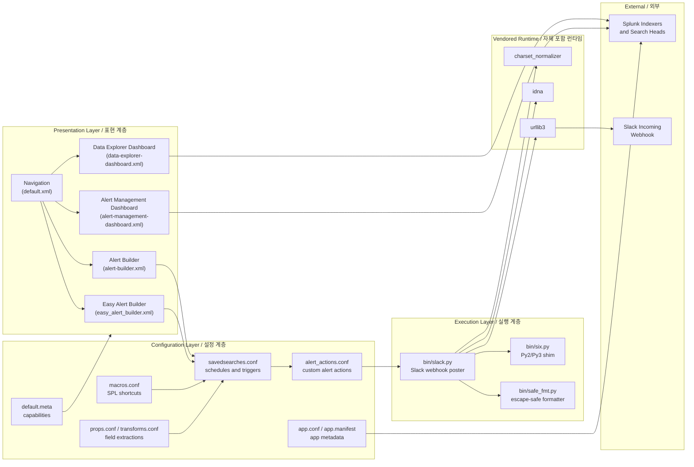

# Security Alert (Splunk App) / 보안 알림 (Splunk 앱)

A production-grade Splunk add-on that ships a unified alert-management dashboard, an easy alert builder, and a data-explorer view, bundled with a safe-formatting helper and a Slack notifier. This repository also preserves historical and resume-style documentation under `resume/` and operational notes under `docs/`.

프로덕션급 Splunk 애드온으로, 통합 알림 관리 대시보드, 손쉬운 알림 빌더, 데이터 탐색기 뷰를 제공하며 안전한 포맷팅 헬퍼와 Slack 알림 스크립트를 함께 번들합니다. 본 저장소는 `resume/` 및 `docs/` 아래에 운영/아카이브 문서를 함께 보관합니다.

---

## 1. Overview / 개요

`security_alert/` is a Splunk app that:

- Replaces ad-hoc alerting with a guided **Easy Alert Builder** and a richer **Alert Builder** form.
- Provides a centralized **Alert Management Dashboard** to triage and audit alerts.
- Provides a **Data Explorer Dashboard** to investigate the underlying events that triggered alerts.
- Includes a **Slack notification script** (`bin/slack.py`) and a **safe formatter** (`bin/safe_fmt.py`) used by alert actions and custom commands.
- Vendors a self-contained Python 3 runtime under `lib/python3/` (urllib3, idna, charset-normalizer) so the app works on air-gapped Splunk instances without pip.

`security_alert/`는 다음과 같은 Splunk 앱입니다.

- 일회성 알림 작성을 **Easy Alert Builder**와 풍부한 **Alert Builder** 폼으로 표준화합니다.
- 알림을 분류·감사할 수 있는 중앙 집중식 **Alert Management Dashboard**를 제공합니다.
- 알림을 트리거한 이벤트를 조사할 수 있는 **Data Explorer Dashboard**를 제공합니다.
- 알림 액션과 커스텀 명령이 사용하는 **Slack 알림 스크립트**(`bin/slack.py`) 및 **안전 포맷터**(`bin/safe_fmt.py`)를 포함합니다.
- 폐쇄망 Splunk 인스턴스에서도 pip 없이 동작하도록 `lib/python3/` 아래에 urllib3, idna, charset-normalizer 등 Python 3 런타임을 자체 번들합니다.

### Intended audience / 대상 사용자

- **Splunk administrators / Splunk 관리자** running Security Operations or IT Operations use cases.
- **SOC analysts / SOC 분석가** who need a self-service way to author, review, and triage alerts.
- **Detection engineers / 탐지 엔지니어** who want versioned, code-reviewable alert definitions.

---

## 2. Features / 기능

| Area / 영역 | Feature / 기능 | Where / 위치 |
| --- | --- | --- |
| Alert Authoring / 알림 작성 | Guided **Easy Alert Builder** form for non-experts / 비전문가용 단계별 빌더 | `default/data/ui/views/easy_alert_builder.xml` |
| Alert Authoring / 알림 작성 | Advanced **Alert Builder** form with full SPL options / 전체 SPL 옵션의 고급 빌더 | `default/data/ui/views/alert-builder.xml` |
| Triage & Audit / 분류 및 감사 | Centralized **Alert Management Dashboard** / 통합 알림 관리 대시보드 | `default/data/ui/views/alert-management-dashboard.xml` |
| Investigation / 조사 | **Data Explorer Dashboard** for raw-event drill-down / 원본 이벤트 드릴다운용 데이터 탐색기 | `default/data/ui/views/data-explorer-dashboard.xml` |
| Notification / 알림 | Slack webhook notifier script / Slack 웹훅 알림 스크립트 | `bin/slack.py` |
| Safety / 안전성 | Escape-aware message formatter / 이스케이프 처리된 메시지 포맷터 | `bin/safe_fmt.py` |
| Compatibility / 호환성 | Python 2/3 shim / Python 2/3 호환 셔틈 | `bin/six.py` |
| Offline / 오프라인 | Self-contained Python 3 runtime (urllib3, idna, charset-normalizer) / 자체 포함된 Python 3 런타임 | `lib/python3/` |
| Search / 검색 | Reusable SPL macros, field extractions, transforms / 재사용 가능한 SPL 매크로·필드 추출·변환 | `default/macros.conf`, `default/props.conf`, `default/transforms.conf` |
| Permissions / 권한 | Per-stanza capability metadata / 스탠자별 권한 메타데이터 | `metadata/default.meta` |
| Navigation / 탐색 | Custom app navigation entries / 앱 전용 탐색 항목 | `default/data/ui/nav/default.xml` |

---

## 3. Architecture / 아키텍처

The app follows the standard Splunk add-on layout: presentation layer (XML views + nav), configuration layer (`.conf` files), execution layer (`bin/` scripts), and a vendored Python runtime for offline operation.

이 앱은 표준 Splunk 애드온 레이아웃을 따릅니다. 표현 계층(XML 뷰 + 탐색), 설정 계층(`.conf` 파일), 실행 계층(`bin/` 스크립트), 그리고 오프라인 운영을 위한 자체 포함 Python 런타임으로 구성됩니다.



### Component responsibilities / 구성 요소 책임

- **Presentation / 표현 계층** — XML dashboards and forms rendered by Splunk Web; navigation XML controls the app menu.
- **Configuration / 설정 계층** — `savedsearches.conf` schedules searches, `alert_actions.conf` declares the custom Slack action, `macros.conf` exposes reusable SPL, `props.conf` + `transforms.conf` extract fields, `app.conf` registers the app, `default.meta` gates capabilities.
- **Execution / 실행 계층** — `bin/slack.py` is invoked by the alert action, formats the payload with `bin/safe_fmt.py`, and POSTs via the vendored `urllib3` (which in turn uses `idna` and `charset_normalizer` for internationalized URLs and encodings). `bin/six.py` keeps the call sites Python 2/3 compatible.
- **Vendored Runtime / 자체 포함 런타임** — Pure-Python wheels shipped under `lib/python3/`, loaded by Splunk's bundled interpreter so no PyPI access is required.

---

## 4. Repository Layout / 저장소 구조

```
.
├── CONTRIBUTING.md              Contribution guide / 기여 가이드
├── LICENSE                      License file / 라이선스
├── README.md                    This document / 본 문서
├── resume/                      Historical / resume-style documentation
│   ├── API.md
│   ├── ARCHITECTURE.md
│   ├── DEPLOYMENT.md
│   └── TROUBLESHOOTING.md
├── docs/                        Operational notes
│   ├── ALERT-REPOSITORY-XWIKI.md
│   ├── DEPLOYMENT.md
│   ├── LEGACY-CLEANUP-REPORT.md
│   ├── QUICK-START.md
│   └── RELEASE-NOTES.md
├── demo/                        Demo assets and walkthroughs
│   └── README.md
└── security_alert/              Splunk app package (install root)
    ├── README.md                App-local readme / 앱 로컬 설명
    ├── app.manifest             App packaging manifest
    ├── bin/                     Executable scripts invoked by Splunk
    │   ├── safe_fmt.py
    │   ├── six.py
    │   └── slack.py
    ├── metadata/                Capability metadata
    │   └── default.meta
    ├── default/                 Default app configuration
    │   ├── alert_actions.conf
    │   ├── app.conf
    │   ├── macros.conf
    │   ├── props.conf
    │   ├── savedsearches.conf
    │   ├── transforms.conf
    │   └── data/
    │       └── ui/
    │           ├── nav/
    │           │   └── default.xml
    │           └── views/
    │               ├── alert-builder.xml
    │               ├── alert-management-dashboard.xml
    │               ├── data-explorer-dashboard.xml
    │               └── easy_alert_builder.xml
    └── lib/                     Vendored Python dependencies
        └── python3/
            ├── charset_normalizer-3.4.4.dist-info/
            ├── idna-3.11.dist-info/
            └── urllib3/
                ├── __init__.py
                ├── connection.py
                ├── connectionpool.py
                ├── ...
                ├── http2/
                ├── util/
                └── contrib/
```

---

## 5. Quick Start / 빠른 시작

### 5.1 Prerequisites / 사전 요구 사항

- Splunk Enterprise or Splunk Cloud (version compatible with the app's `app.conf`; check `security_alert/default/app.conf`).
- A Slack workspace with permission to create an **Incoming Webhook** URL.
- Optional: a deployment server or any method to distribute the `security_alert/` directory to `$SPLUNK_HOME/etc/apps/`.

### 5.2 Install on a single Splunk instance / 단일 Splunk 인스턴스에 설치

```bash
# 1. Clone this repository
git clone <repo-url> security-alert && cd security-alert

# 2. Copy (or symlink) the app directory into Splunk's apps folder
cp -R security_alert "$SPLUNK_HOME/etc/apps/"

# 3. Restart Splunk so it picks up the new app
"$SPLUNK_HOME/bin/splunk" restart
```

If you have a deployment server, package `security_alert/` as a `.tar`/`.spl` and assign it to the appropriate server class instead. See `docs/DEPLOYMENT.md` for full instructions.

배포 서버를 사용하는 경우 `security_alert/` 디렉터리를 `.tar` 또는 `.spl`로 패키징하여 해당 서버 클래스에 할당하세요. 자세한 절차는 `docs/DEPLOYMENT.md`를 참조하세요.

### 5.3 First-run walkthrough / 최초 실행 순서

1. In Splunk Web, log in as a user with the `admin` role.
2. Navigate to **Apps → Manage Apps** and confirm that **Security Alert** appears and is **Enabled**.
3. Open the app; the navigation exposes **Easy Alert Builder**, **Alert Builder**, **Alert Management Dashboard**, and **Data Explorer Dashboard**.
4. Open **Easy Alert Builder**, complete the wizard, and save. The result is a new stanza in `savedsearches.conf` plus an entry in `alert_actions.conf` for the Slack action.
5. Confirm the alert fires and a message reaches Slack.

Splunk Web에 `admin` 권한으로 로그인 → **Apps → Manage Apps**에서 **Security Alert**가 활성화되어 있는지 확인 → 앱을 열고 **Easy Alert Builder** 마법사를 완료하여 저장 → 알림이 트리거되고 Slack에 도달하는지 확인합니다.

---

## 6. Configuration / 설정

All configuration lives under `security_alert/default/`. The most common keys are summarized below. Treat `*.conf` as the source of truth — values documented here may be out of date; cross-check with the file in your checked-out copy.

모든 설정은 `security_alert/default/` 아래에 있습니다. 가장 자주 사용하는 키는 아래 표에 정리되어 있습니다. 아래 표보다 저장소의 `*.conf` 파일을 항상 우선하세요.

### 6.1 `app.conf` — app metadata / 앱 메타데이터

| Key | Purpose / 용도 |
| --- | --- |
| `install` | `true` once the app is installed. Do not edit by hand / 설치 후 `true`로 설정되며 수동 편집하지 마세요. |
| `is_configured` | Flip to `true` after the operator enters a Slack webhook URL / Slack 웹훅 입력 후 `true`로 변경 |
| `label` | Display name shown in Splunk Web / Splunk Web에 표시되는 이름 |
| `version` | App version, used by upgrade logic / 업그레이드 로직이 사용하는 버전 |

### 6.2 `alert_actions.conf` — custom action registration / 커스텀 액션 등록

Each stanza here maps an alert-action name to a command line that Splunk invokes when an alert fires. Typical keys:

| Key | Purpose / 용도 |
| --- | --- |
| `label` | Friendly name shown in the alert editor / 알림 편집기에 표시되는 이름 |
| `description` | Long-form description for the editor / 편집기에 표시되는 설명 |
| `icon_path` | Path to the icon asset / 아이콘 자산 경로 |
| `command` | Command line to execute (typically references `bin/slack.py`) / 실행할 커맨드 라인 (보통 `bin/slack.py` 호출) |
| `param.<name>` | User-editable parameters surfaced in the alert editor / 알림 편집기에서 사용자가 편집하는 매개변수 |

### 6.3 `savedsearches.conf` — scheduled searches / 예약 검색

Each stanza describes one alert:

| Key | Purpose / 용도 |
| --- | --- |
| `search` | SPL query / SPL 쿼리 |
| `cron_schedule` | Cron expression for the trigger / 트리거용 cron 표현식 |
| `dispatch.<action>.<param>` | Action parameters, e.g. `dispatch.slack.webhook_url` / 액션 매개변수 (예: `dispatch.slack.webhook_url`) |
| `enable` | `true` to activate the saved search / 활성화하려면 `true` |
| `alert_threshold`, `alert.suppress`, `alert.digest_mode` | Standard Splunk alert semantics / 표준 Splunk 알림 옵션 |

### 6.4 `macros.conf`, `props.conf`, `transforms.conf`

- `macros.conf` exposes reusable SPL building blocks, e.g. `(security_alert_index=*)`.
- `props.conf` declares source types and field extractions used by the dashboards.
- `transforms.conf` defines the actual regex / lookup that `props.conf` references.

### 6.5 `metadata/default.meta` — capabilities / 권한

By default the app grants `read` to all roles. If you need to restrict access to the Easy Alert Builder or the Slack action, add per-stanza `access = read : [ role1 role2 ], write : [ admin ]` entries.

기본적으로 모든 역할에 `read` 권한이 부여됩니다. Easy Alert Builder 또는 Slack 액션을 제한하려면 스탠자별로 `access = read : [ role1 role2 ], write : [ admin ]` 항목을 추가하세요.

### 6.6 `app.manifest`

Generated by Splunk's packaging tooling. Lists the app's `schemaVersion`, `name`, `version`, `author`, and any dependencies. Update it whenever you bump `app.conf`'s `version` so that distributed deployments stay consistent.

Splunk 패키징 도구가 생성하며, `schemaVersion`, `name`, `version`, `author`, 의존성을 포함합니다. 분산 배포 환경의 일관성을 위해 `app.conf`의 `version`을 변경할 때마다 함께 갱신하세요.

---

## 7. Commands & Scripts / 명령 및 스크립트

The two user-facing scripts in `security_alert/bin/` are designed to be called by Splunk (alert action or custom search command) but are also runnable from a shell for debugging.

`security_alert/bin/`의 두 스크립트는 Splunk(알림 액션 또는 커스텀 검색 명령)에서 호출되도록 설계되었지만 디버깅을 위해 셸에서도 직접 실행할 수 있습니다.

### 7.1 `bin/safe_fmt.py` — escape-safe formatter / 안전 포맷터

Used by `slack.py` (and any other script that builds user-facing messages) to interpolate Splunk field values into a template while escaping characters that would break the surrounding format or introduce injection.

`slack.py` 및 사용자용 메시지를 만드는 다른 스크립트가 Splunk 필드 값을 템플릿에 삽입할 때, 포맷을 깨뜨리거나 인젝션을 유발하는 문자를 이스케이프하기 위해 사용합니다.

```bash
# Format a template against one result
python3 security_alert/bin/safe_fmt.py \
    --template "Host {host} triggered {count} events" \
    --fields '{"host":"web01", "count":3}'
```

### 7.2 `bin/slack.py` — Slack notifier / Slack 알림 스크립트

Invoked by the alert action declared in `alert_actions.conf`. Reads the alert payload from stdin (or from named parameters), formats it, and POSTs to a Slack Incoming Webhook.

`alert_actions.conf`에 선언된 알림 액션에 의해 호출됩니다. 알림 페이로드를 stdin(또는 명명된 매개변수)에서 읽어 포맷한 뒤 Slack Incoming Webhook으로 POST합니다.

```bash
# Dry run: validate formatting without sending
python3 security_alert/bin/slack.py \
    --webhook-url "<your-webhook-url>" \
    --channel "#soc-alerts" \
    --dry-run

# Send a real alert
echo "suspicious login from <homelab-host>" | \
    python3 security_alert/bin/slack.py \
        --webhook-url "<your-webhook-url>" \
        --channel "#soc-alerts"
```

> Note: `<homelab-host>` above is a placeholder example. Replace it with your real source IP at runtime; never commit credentials or internal addresses. / 위 예시의 `<homelab-host>`은 자리표시자입니다. 실제 소스 IP로 교체하며, 자격증명이나 내부 주소는 커밋하지 마세요.

Run `python3 security_alert/bin/slack.py --help` for the full list of flags (`--thread-ts`, `--icon-emoji`, `--username`, etc.).

전체 플래그 목록은 `python3 security_alert/bin/slack.py --help`로 확인하세요 (`--thread-ts`, `--icon-emoji`, `--username` 등).

---

## 8. Local Development / 로컬 개발

### 8.1 Work with the source tree / 소스 트리로 작업

```bash
git clone <repo-url> security-alert
cd security-alert
# Symlink into your dev Splunk so changes are picked up after a reload
ln -s "$(pwd)/security_alert" "$SPLUNK_HOME/etc/apps/security_alert"
```

After editing any `.conf`, XML, or Python file, trigger a refresh:

```bash
"$SPLUNK_HOME/bin/splunk" reload deploy-server   # or restart the instance
```

### 8.2 Linting & sanity checks / 린트 및 정합성 검사

- **Python**: `python3 -m py_compile security_alert/bin/*.py` to catch syntax errors. The vendored `lib/python3/` packages should not be modified locally — they are upstream wheels.
- **XML views**: Validate the dashboard XML with `xmllint --noout security_alert/default/data/ui/views/*.xml`.
- **Confs**: Splunk's own `btool` is the source of truth for `.conf` syntax:
  ```bash
  "$SPLUNK_HOME/bin/splunk" btool --app=security_alert check
  ```

### 8.3 Vendoring additional Python dependencies / 추가 Python 의존성 번들링

If a new dependency is needed and the environment must remain air-gapped:

1. Build a manylinux wheel for the target Python version on a machine with PyPI access.
2. Place the wheel's contents under `security_alert/lib/python3/<package>/`.
3. Add a sibling `<package>-<version>.dist-info/` directory mirroring the upstream `METADATA` / `RECORD` / `WHEEL` files.
4. Verify with `python3 -c "import <package>; print(<package>.__file__)"` from `$SPLUNK_HOME/bin/`.

---

## 9. Testing / 테스트

This repository does not currently ship an automated test suite; verification is performed against a running Splunk instance. Recommended steps:

본 저장소에는 현재 자동화된 테스트 스위트가 포함되어 있지 않습니다. 검증은 실행 중인 Splunk 인스턴스에서 수행합니다. 권장 절차는 다음과 같습니다.

1. **Unit-style script tests** — call `bin/safe_fmt.py` and `bin/slack.py --dry-run` from the shell with representative inputs and assert on the produced output.
2. **Saved-search smoke test** — author a low-frequency saved search (e.g. `cron_schedule = */5 * * * *`) in a non-production index, confirm a real Slack message lands in the target channel, then promote the change.
3. **Dashboard smoke test** — open each view (`alert-management-dashboard.xml`, `data-explorer-dashboard.xml`, `alert-builder.xml`, `easy_alert_builder.xml`) in Splunk Web with a non-admin role to confirm `default.meta` permissions are correct.
4. **Regression checklist** — see `docs/RELEASE-NOTES.md` for version-specific scenarios to re-run.

For broader testing strategy notes and historical incidents, consult `resume/TROUBLESHOOTING.md` and `docs/LEGACY-CLEANUP-REPORT.md`.

보다 광범위한 테스트 전략과 이력은 `resume/TROUBLESHOOTING.md`와 `docs/LEGACY-CLEANUP-REPORT.md`를 참조하세요.

---

## 10. Documentation Map / 문서 안내

| Path / 경로 | Purpose / 용도 |
| --- | --- |
| `README.md` (this file) | Entry point and reference / 진입점 및 참고 문서 |
| `CONTRIBUTING.md` | Contribution conventions / 기여 규칙 |
| `security_alert/README.md` | App-local description, surfaced inside Splunk / 앱 내부 설명 |
| `resume/API.md` | API-level reference (historical) / API 레퍼런스 (이력) |
| `resume/ARCHITECTURE.md` | Long-form architecture notes (historical) / 아키텍처 노트 (이력) |
| `resume/DEPLOYMENT.md` | Deployment recipes (historical) / 배포 절차 (이력) |
| `resume/TROUBLESHOOTING.md` | Past incident write-ups / 과거 장애 기록 |
| `docs/QUICK-START.md` | Step-by-step bring-up guide / 단계별 기동 가이드 |
| `docs/DEPLOYMENT.md` | Current deployment guide / 최신 배포 가이드 |
| `docs/RELEASE-NOTES.md` | Version-by-version changes / 버전별 변경 사항 |
| `docs/LEGACY-CLEANUP-REPORT.md` | What was removed during the last cleanup / 최근 정리 시 제거된 항목 |
| `docs/ALERT-REPOSITORY-XWIKI.md` | Cross-wiki pointer for the alert repository / 알림 저장소 크로스 위키 포인터 |
| `demo/README.md` | Demo walkthrough assets / 데모 자료 |

---

## 11. Contribution Guide / 기여 가이드

1. Fork the repository and create a feature branch (`git checkout -b feature/my-change`).
2. Make focused commits. Keep `*.conf` changes isolated from code changes when possible so Splunk administrators can review the configuration diff in isolation.
3. Run the smoke tests described in [§9 Testing / 테스트](#9-testing--테스트) before opening a pull request.
4. Update `docs/RELEASE-NOTES.md` with a short entry describing the change.
5. Open a pull request describing the motivation, the SPL or script change, and any new permissions in `default.meta`.
6. Reviewers will validate with `btool --app=security_alert check` and a live Splunk instance.

See `CONTRIBUTING.md` for the full contribution policy.

전체 기여 정책은 `CONTRIBUTING.md`를 참조하세요.

---

## 12. License / 라이선스

Released under the terms described in [`LICENSE`](./LICENSE). By contributing, you agree that your contributions will be distributed under the same license.

[`LICENSE`](./LICENSE) 파일에 명시된 조건 하에 배포됩니다. 기여 시 귀하의 기여물도 동일한 라이선스 하에 배포됨에 동의한 것으로 간주합니다.