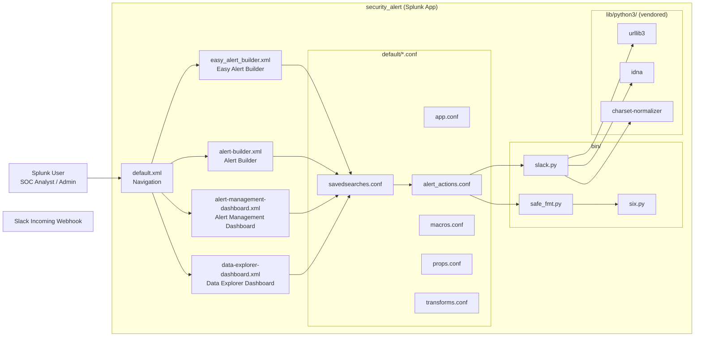

# Security Alert (Splunk App) / 보안 알림 (Splunk 앱)

A production-grade Splunk add-on that ships a unified **alert-management dashboard**, an **easy alert builder**, a richer **alert builder**, and a **data-explorer view**, bundled with a safe-formatting helper and a Slack notifier. The repository also preserves historical and resume-style documentation under `resume/` and operational notes under `docs/`.

프로덕션급 Splunk 애드온으로, 통합 **알림 관리 대시보드**, **손쉬운 알림 빌더**, 풍부한 **알림 빌더**, 그리고 **데이터 탐색기 뷰**를 제공하며, 안전한 포맷팅 헬퍼와 Slack 알림 스크립트를 함께 번들합니다. 본 저장소는 `resume/` 및 `docs/` 아래에 운영/아카이브 문서를 함께 보관합니다.

---

## 1. Overview / 개요

`security_alert/` is a Splunk app that:

- Standardizes ad-hoc alerting through a guided **Easy Alert Builder** and a richer **Alert Builder** form.
- Provides a centralized **Alert Management Dashboard** to triage and audit alerts.
- Provides a **Data Explorer Dashboard** to investigate the underlying events that triggered alerts.
- Includes a **Slack notification script** (`bin/slack.py`) and a **safe formatter** (`bin/safe_fmt.py`) used by alert actions and custom commands.
- Vendors a self-contained Python 3 runtime under `lib/python3/` (urllib3, idna, charset-normalizer) so the app works on air-gapped Splunk instances without `pip`.
- Ships navigation, default metadata, and `app.manifest` so the app is discoverable and installable on standard Splunk Enterprise and Splunk Cloud environments.

`security_alert/`는 다음과 같은 Splunk 앱입니다.

- 일회성 알림 작성을 **Easy Alert Builder**와 풍부한 **Alert Builder** 폼으로 표준화합니다.
- 알림을 분류·감사할 수 있는 중앙 집중식 **Alert Management Dashboard**를 제공합니다.
- 알림을 트리거한 이벤트를 조사할 수 있는 **Data Explorer Dashboard**를 제공합니다.
- 알림 액션과 커스텀 명령이 사용하는 **Slack 알림 스크립트**(`bin/slack.py`) 및 **안전 포맷터**(`bin/safe_fmt.py`)를 포함합니다.
- 폐쇄망 Splunk 인스턴스에서도 `pip` 없이 동작하도록 `lib/python3/` 아래에 urllib3, idna, charset-normalizer 등 Python 3 런타임을 자체 번들합니다.
- 탐색, 기본 메타데이터, `app.manifest`를 함께 제공하여 표준 Splunk Enterprise 및 Splunk Cloud 환경에서 검색·설치할 수 있습니다.

### Intended audience / 대상 사용자

- **Splunk administrators / Splunk 관리자** running Security Operations or IT Operations use cases.
- **SOC analysts / SOC 분석가** who need a self-service way to author, review, and triage alerts.
- **Detection engineers / 탐지 엔지니어** who want versioned, code-reviewable alert definitions.

---

## 2. Features / 기능

| Area / 영역 | Feature / 기능 |
|---|---|
| Alert authoring / 알림 작성 | Easy Alert Builder UI (`easy_alert_builder.xml`) for guided, low-friction alert creation. |
| Alert authoring / 알림 작성 | Alert Builder form (`alert-builder.xml`) for advanced, fine-grained alert definitions. |
| Triage & audit / 분류·감사 | Alert Management Dashboard (`alert-management-dashboard.xml`) for centralized review of alert state. |
| Investigation / 조사 | Data Explorer Dashboard (`data-explorer-dashboard.xml`) to pivot from alerts back to raw events. |
| Notification / 알림 전달 | `bin/slack.py` script that posts alert payloads to a Slack incoming webhook. |
| Safe formatting / 안전한 포맷팅 | `bin/safe_fmt.py` helper to safely format fields and template strings in alert actions. |
| Python 2 bridge / Python 2 브리지 | `bin/six.py` shim for writing code that runs on both legacy Python 2 and Python 3 Splunk runtimes. |
| Air-gapped install / 폐쇄망 설치 | Vendored Python 3 libraries under `lib/python3/` (urllib3, idna, charset-normalizer) so the app does not require outbound PyPI access. |
| Splunk integration / Splunk 통합 | Standard Splunk app layout: `default/app.conf`, `default/alert_actions.conf`, `default/macros.conf`, `default/props.conf`, `default/savedsearches.conf`, `default/transforms.conf`, navigation XML, and `app.manifest`. |

---

## 3. Repository structure / 저장소 구조

```
.
├── CONTRIBUTING.md
├── LICENSE
├── README.md
├── demo/
│   └── README.md
├── docs/
│   ├── ALERT-REPOSITORY-XWIKI.md
│   ├── DEPLOYMENT.md
│   ├── LEGACY-CLEANUP-REPORT.md
│   ├── QUICK-START.md
│   └── RELEASE-NOTES.md
├── resume/
│   ├── API.md
│   ├── ARCHITECTURE.md
│   ├── DEPLOYMENT.md
│   └── TROUBLESHOOTING.md
└── security_alert/
    ├── app.manifest
    ├── bin/
    │   ├── safe_fmt.py
    │   ├── six.py
    │   └── slack.py
    ├── default/
    │   ├── alert_actions.conf
    │   ├── app.conf
    │   ├── macros.conf
    │   ├── props.conf
    │   ├── savedsearches.conf
    │   ├── transforms.conf
    │   └── data/
    │       └── ui/
    │           ├── nav/
    │           │   └── default.xml
    │           └── views/
    │               ├── alert-builder.xml
    │               ├── alert-management-dashboard.xml
    │               ├── data-explorer-dashboard.xml
    │               └── easy_alert_builder.xml
    ├── lib/
    │   └── python3/
    │       ├── charset_normalizer-3.4.4.dist-info/
    │       ├── idna-3.11.dist-info/
    │       └── urllib3/
    └── metadata/
        └── default.meta
```

- `security_alert/` — the installable Splunk app; copy or symlink this directory into `$SPLUNK_HOME/etc/apps/`.
- `docs/` — deployment, quick-start, release notes, legacy cleanup report, and an XWiki alert-repository note.
- `resume/` — historical architecture, API, deployment, and troubleshooting references.
- `demo/` — walk-through and demo material referenced from `demo/README.md`.
- `CONTRIBUTING.md` — contribution conventions.
- `LICENSE` — project license.

---

## 4. Architecture / 아키텍처

### 4.1 Component map / 구성 요소



### 4.2 Request flow / 요청 흐름

1. The user opens the Splunk app and lands on the navigation defined in `default/data/ui/nav/default.xml`.
2. They pick a view: **Easy Alert Builder**, **Alert Builder**, **Alert Management Dashboard**, or **Data Explorer Dashboard**.
3. The **Easy Alert Builder** and **Alert Builder** write new entries into `default/savedsearches.conf` and corresponding alert-action wiring in `default/alert_actions.conf`.
4. The **Alert Management Dashboard** reads saved searches and their status to provide a triage surface.
5. The **Data Explorer Dashboard** pivots from an alert row back to the raw events behind it.
6. When an alert fires, `alert_actions.conf` invokes `bin/slack.py`, which formats its payload using `bin/safe_fmt.py` and posts to a Slack incoming webhook using the vendored `lib/python3/urllib3`, `idna`, and `charset-normalizer` libraries.
7. `bin/six.py` provides Python 2/3 compatibility shims for any custom search command or helper that still targets the legacy runtime.

### 4.3 Layout conventions / 레이아웃 규칙

- Splunk requires an app to live under `$SPLUNK_HOME/etc/apps/<app_name>/`. The repository's top-level `security_alert/` directory maps directly to that layout; the directory name is also the Splunk app name.
- `app.manifest` declares the app's identity (id, version, author, requirements) for Splunk Cloud and the Splunkbase upload pipeline.
- `metadata/default.meta` controls visibility of the app's capabilities (e.g. which roles can write saved searches).
- All UI views live under `default/data/ui/views/`; navigation lives under `default/data/ui/nav/`.

---

## 5. Quick start / 빠른 시작

### 5.1 Prerequisites / 사전 요구 사항

- Splunk Enterprise 8.x or later (also tested on supported Splunk Cloud versions).
- A user account with permission to install apps and write saved searches on the target instance.
- (Optional) A Slack workspace and an **incoming webhook URL** for the Slack notifier.
- Network egress to your Slack webhook endpoint. The vendored `lib/python3/` runtime covers HTTP, IDNA, and encoding so outbound PyPI access is **not** required.

### 5.2 Install the app / 앱 설치

1. Clone or download this repository.
2. Copy the `security_alert/` directory to your Splunk apps folder:

   ```bash
   cp -r security_alert/ "$SPLUNK_HOME/etc/apps/security_alert"
   ```

   Or symlink it for iterative development:

   ```bash
   ln -s "$(pwd)/security_alert" "$SPLUNK_HOME/etc/apps/security_alert"
   ```

3. Restart Splunk (or reload the app from the **Apps** management page if your version supports it).
4. Confirm the app is listed under **Settings → Apps → Manage Apps** as `security_alert`.

### 5.3 First run / 최초 실행

1. Open the app from the Splunk launcher.
2. Pick **Easy Alert Builder** to author a first alert, or **Alert Builder** for advanced options.
3. Open **Alert Management Dashboard** to confirm your alert is registered and its evaluation status is visible.
4. Open **Data Explorer Dashboard** to pivot from an alert row back to its triggering events.
5. (Optional) Configure Slack delivery (see §6.4) and trigger a test alert.

### 5.4 Demo / 데모

`demo/README.md` contains a guided walk-through, screenshots, and sample queries you can use to demonstrate the app's capabilities to stakeholders.

---

## 6. Configuration / 설정

All configuration lives inside `security_alert/default/`. Edit the files in place after installation, or override them in a sibling local app (`$SPLUNK_HOME/etc/apps/security_alert_local/`) so that upgrades do not overwrite your changes.

### 6.1 `app.conf` — app metadata / 앱 메타데이터

Declares the app label, visibility, and any UI accelerators. Edit the `[ui]` and `[install]` stanzas to customize branding and the launcher.

### 6.2 `savedsearches.conf` — alert definitions / 알림 정의

Each alert is a stanzas entry that pairs a search with scheduling, trigger conditions, and an action. The **Alert Builder** and **Easy Alert Builder** UIs write here for you, but you can also edit it directly for code-reviewable changes.

### 6.3 `alert_actions.conf` — what happens on trigger / 트리거 시 동작

Maps alert-action names to scripts and arguments. To add a new action type, append a stanza such as:

```ini
[slack]
display_name = Slack Notification
type = slack
icon_path = slack.png
script = slack.py
param.webhook_url = https://hooks.slack.com/services/REPLACE/ME/HERE
param.channel = #soc-alerts
```

The script name resolves to `security_alert/bin/slack.py`.

### 6.4 Slack webhook / Slack 웹훅

1. In Slack, create an **Incoming Webhook** for the target channel.
2. Put the webhook URL into `alert_actions.conf` (see `param.webhook_url` above) or pass it as a parameter on the alert.
3. Restart Splunk so the alert action is re-registered.

### 6.5 `macros.conf` — reusable SPL / 재사용 SPL

Holds shared SPL fragments referenced by saved searches, so dashboards and alert definitions stay consistent.

### 6.6 `props.conf` and `transforms.conf` — field handling / 필드 처리

- `props.conf` declares field extractions, indexes, and field aliases for the event types the app expects.
- `transforms.conf` declares reusable regex/lookup transforms referenced from `props.conf` and from searches.

### 6.7 `metadata/default.meta` — capability scoping / 권한 범위

Limits which Splunk roles can view or write to the app's objects. Review this before granting access to non-admin roles.

### 6.8 `app.manifest` — install metadata / 설치 메타데이터

Update `app.manifest` (id, version, author, requirements) before re-packaging the app for Splunkbase or Splunk Cloud distribution.

---

## 7. Commands reference / 명령어 참조

### 7.1 `bin/slack.py` — Slack notifier / Slack 알림 스크립트

Posts an alert payload to a Slack incoming webhook using the vendored HTTP stack.

Typical usage from `alert_actions.conf`:

```ini
[slack]
script = slack.py
param.webhook_url = https://hooks.slack.com/services/REPLACE/ME/HERE
param.channel = #soc-alerts
param.username = Splunk Alerts
```

Each Splunk alert that selects the `slack` action will pipe its result row(s) into the script.

### 7.2 `bin/safe_fmt.py` — safe formatter / 안전한 포맷터

A helper module that alert actions and custom search commands can import to safely format field values into template strings. Import it from a custom search command under `bin/` or call it directly from another script:

```python
import sys, os
sys.path.insert(0, os.path.join(os.path.dirname(__file__)))
import safe_fmt
print(safe_fmt.render("{severity} on {host}: {message}", fields))
```

This avoids template injection issues when alert payloads include attacker-controlled strings.

### 7.3 `bin/six.py` — Py2/Py3 compatibility / Py2/Py3 호환

Vendored compatibility shim. Custom search commands that need to run on both Python 2 and Python 3 Splunk runtimes can `import six` from this path.

---

## 8. Local development / 로컬 개발

### 8.1 Iterative install / 반복 설치

For day-to-day development, symlink the app directory into Splunk instead of copying:

```bash
ln -s "$(pwd)/security_alert" "$SPLUNK_HOME/etc/apps/security_alert"
```

Edits to `default/*.conf` files and `bin/*.py` scripts are picked up after a Splunk restart or a reload from **Settings → Apps → Manage Apps**. XML view changes typically only require a browser refresh.

### 8.2 Editing UI views / UI 뷰 편집

- The XML views under `default/data/ui/views/` follow the Splunk Simple XML (and Dashboard Studio) format.
- Keep the navigation file (`default/data/ui/nav/default.xml`) in sync when adding or renaming views.
- Validate XML well-formedness before reloading; an invalid view can break the entire app landing page.

### 8.3 Editing scripts / 스크립트 편집

- Make scripts in `bin/` executable (`chmod +x`) if you copy rather than symlink.
- Keep imports compatible with the vendored `lib/python3/` runtime; if you need a new third-party library, vendor it under `lib/python3/` rather than relying on system `pip`.
- For Py2/Py3 compatibility in custom search commands, use the bundled `bin/six.py`.

### 8.4 Pack the app / 앱 패키징

Before distributing, produce a `.tar.gz` Splunk app bundle:

```bash
cd security_alert
tar czf ../security_alert.tgz .
```

The resulting tarball can be installed via **Manage Apps → Install app from file** or uploaded to Splunkbase.

---

## 9. Testing / 테스트

- **Manual UI smoke tests**: load each of the four views and confirm the navigation, search panels, and drill-downs render without errors.
- **Alert firing test**: author a low-frequency alert (for example, `index=_internal | head 1`) and confirm the configured action (Slack, log, etc.) fires once.
- **Slack delivery test**: trigger a saved search that uses the `slack` action and confirm the message arrives in the configured channel.
- **Python syntax check**: run `python3 -m py_compile security_alert/bin/*.py` to catch syntax errors before reloading.
- **XML validation**: open each `*.xml` in `default/data/ui/` in a browser or run an XML validator to confirm well-formedness.
- **Capability check**: log in as a non-admin role with only the permissions you intend to grant, and verify they can author or view alerts as expected.

Refer to `docs/TROUBLESHOOTING.md` (or `resume/TROUBLESHOOTING.md` for historical notes) when a test fails.

---

## 10. Operational references / 운영 참고 자료

- `docs/QUICK-START.md` — concise setup walk-through.
- `docs/DEPLOYMENT.md` — production deployment guidance.
- `docs/RELEASE-NOTES.md` — version history and notable changes.
- `docs/LEGACY-CLEANUP-REPORT.md` — what was removed from the legacy app.
- `docs/ALERT-REPOSITORY-XWIKI.md` — notes on the alert-repository wiki integration.
- `resume/ARCHITECTURE.md` — historical architecture notes.
- `resume/API.md` — historical API references for alert scripts.
- `resume/DEPLOYMENT.md` — historical deployment notes.
- `resume/TROUBLESHOOTING.md` — historical troubleshooting runbook.
- `demo/README.md` — demo walk-through and sample content.

---

## 11. Contribution guide / 기여 가이드

Contributions are welcome. Please read `CONTRIBUTING.md` first; it covers:

- Coding style for Python scripts under `bin/`.
- Naming conventions for saved searches and alert actions in `default/*.conf`.
- Pull-request review expectations (UI screenshots, test alert output, configuration diff).
- Versioning and changelog updates expected in `docs/RELEASE-NOTES.md`.

For larger changes (new dashboards, new alert actions, new vendored libraries), open an issue first to discuss scope before sending a patch.

기여를 환영합니다. 먼저 `CONTRIBUTING.md`를 읽어 주십시오. 본 문서는 다음 내용을 다룹니다.

- `bin/` 아래 Python 스크립트의 코딩 스타일.
- `default/*.conf`에서 saved search 및 alert action의 명명 규칙.
- PR 리뷰 기준 (UI 스크린샷, 테스트 알림 출력, 설정 변경 diff).
- `docs/RELEASE-NOTES.md`에 반영해야 할 버전 및 변경 로그 업데이트.

대규모 변경 (새 대시보드, 새 알림 액션, 새 번들 라이브러리) 시에는 패치 제출 전에 먼저 이슈를 열어 범위를 논의해 주십시오.

---

## 12. License / 라이선스

This project is released under the terms described in the `LICENSE` file at the root of the repository.

본 프로젝트는 저장소 루트의 `LICENSE` 파일에 명시된 조건에 따라 배포됩니다.