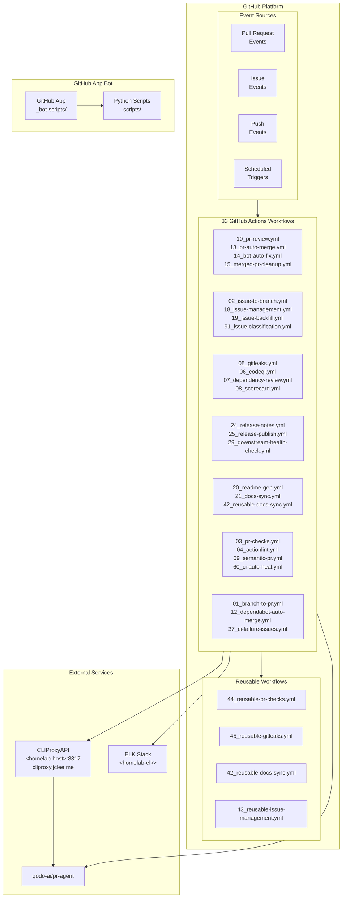

# GitHub Automation Bot — CLIProxyAPI v2.0

[](https://cliproxy.jclee.me)
[](#automation-inventory--자동화-인벤토리)
[](https://www.python.org/)
[](./LICENSE)

> **English** | [**한국어**](#개요)

---

## Table of Contents

- [Overview](#overview--개요)
- [Features](#features--주요-기능)
- [Architecture](#architecture--아키텍처)
- [Automation Inventory](#automation-inventory--자동화-인벤토리)
- [Quick Start](#quick-start--빠른-시작)
- [Local Development](#local-development--로컬-개발)
- [Commands Reference](#commands-reference--명령어-참조)
- [Contribution Guide](#contribution-guide--기여-가이드)

---

## Overview | 개요

This repository contains the **CLIProxyAPI v2.0 GitHub Automation Bot** — a comprehensive system of **33 GitHub Actions workflows** and Python-based automation tools that provide automated code review, issue management, PR handling, documentation generation, and release automation for GitHub repositories.

이 저장소는 **CLIProxyAPI v2.0 GitHub 자동화 봇**을 포함하고 있으며, GitHub 저장소에 대한 자동화된 코드 리뷰, 이슈 관리, PR 처리, 문서 생성 및 릴리스 자동화를 제공하는 **33개의 GitHub Actions 워크플로우**와 Python 기반 자동화 도구의 종합 시스템입니다.

### Key Characteristics | 주요 특성

| Characteristic 특성 | Description 설명 |
|---|---|
| **Architecture** 아키텍처 | Python-based GitHub App + GitHub Actions |
| **Automation Scope** 자동화 범위 | 33 workflows covering PR, issues, security, releases |
| **Core Scripts** 핵심 스크립트 | `_bot-scripts/scripts/` (Python automation tools) |
| **External Services** 외부 서비스 | CLIProxyAPI (`cliproxy.jclee.me`), PR Agent (`qodo-ai/pr-agent`) |
| **Logging** 로깅 | ELK stack (`<homelab-elk>`) |

---

## Features | 주요 기능

### Automated Code Review | 자동화 코드 리뷰

- **PR Agent Integration**: AI-powered code reviews using `qodo-ai/pr-agent`
- **Gitleaks Scanning**: Automated secret detection in pull requests
- **CodeQL Analysis**: Static security analysis for vulnerability detection
- **Dependency Review**: Automated checking of dependency changes

### Issue Management | 이슈 관리

- **Automatic Branch Creation**: Branch creation from issue templates
- **PR-auto-link**: Linking issues to pull requests automatically
- **Issue Classification**: AI-powered issue categorization
- **Backfill Automation**: Historical issue data management

### Pull Request Automation | 풀 리퀘스트 자동화

- **Semantic PR Validation**: Enforcement of conventional commit messages
- **Auto-Merge**: Automatic merging based on status checks
- **Auto-Fix**: Bot-initiated fixes for common issues
- **Cleanup**: Automatic branch cleanup after merge

### Security Automation | 보안 자동화

- **Dependency Scanning**: Review of dependency changes for vulnerabilities
- **Scorecard Analysis**: Security metrics and best practices validation
- **Secret Redaction**: Automated redaction of exposed secrets
- **Private IP Detection**: Scanning for hardcoded internal references

### Documentation | 문서화

- **README Generation**: Automated documentation updates
- **Docs Sync**: Synchronization between repositories
- **Release Notes**: Automatic changelog and release note generation

### Release Management | 릴리스 관리

- **Semantic Versioning**: Automated version management
- **Release Publishing**: Multi-channel release distribution
- **Downstream Health Checks**: Monitoring of dependent repositories

---

## Architecture | 아키텍처



---

## Automation Inventory | 자동화 인벤토리

### Workflow Files | 워크플로우 파일

#### Pull Request Workflows | 풀 리퀘스트 워크플로우

| Workflow | File | Description |
|----------|------|-------------|
| **PR Review** | `10_pr-review.yml` | AI-powered code review using PR Agent |
| **PR Checks** | `03_pr-checks.yml` | Comprehensive CI checks for PRs |
| **PR Auto-Merge** | `13_pr-auto-merge.yml` | Automatic merging based on conditions |
| **Bot Auto-Fix** | `14_bot-auto-fix.yml` | Bot-initiated automatic fixes |
| **Merged PR Cleanup** | `15_merged-pr-cleanup.yml` | Post-merge branch and artifact cleanup |
| **Semantic PR** | `09_semantic-pr.yml` | Conventional commit validation |
| **Security PR Review** | `security/11_pr-review.yml` | Security-focused PR review |
| **Auto-Merge** | `auto-merge.yml` | Generic auto-merge workflow |
| **CI** | `ci.yml` | Continuous integration pipeline |

#### Issue Workflows | 이슈 워크플로우

| Workflow | File | Description |
|----------|------|-------------|
| **Issue to Branch** | `02_issue-to-branch.yml` | Automatic branch creation from issues |
| **Issue Management** | `18_issue-management.yml` | Issue lifecycle automation |
| **Issue Backfill** | `19_issue-backfill.yml` | Historical issue data management |
| **Issue Classification** | `91_issue-classification.yml` | AI-powered issue categorization |
| **CI Failure Issues** | `37_ci-failure-issues.yml` | Automatic issue creation for CI failures |

#### Security Workflows | 보안 워크플로우

| Workflow | File | Description |
|----------|------|-------------|
| **Gitleaks** | `05_gitleaks.yml` | Secret detection scanning |
| **CodeQL** | `06_codeql.yml` | Static security analysis |
| **Dependency Review** | `07_dependency-review.yml` | Dependency vulnerability scanning |
| **Scorecard** | `08_scorecard.yml` | Security best practices validation |
| **Security PR Review** | `security/11_pr-review.yml` | Security-focused code review |

#### Documentation Workflows | 문서화 워크플로우

| Workflow | File | Description |
|----------|------|-------------|
| **README Generation** | `20_readme-gen.yml` | Automated README updates |
| **Docs Sync** | `21_docs-sync.yml` | Cross-repository documentation sync |
| **Reusable Docs Sync** | `42_reusable-docs-sync.yml` | Reusable documentation synchronization |

#### Release Workflows | 릴리스 워크플로우

| Workflow | File | Description |
|----------|------|-------------|
| **Release Notes** | `24_release-notes.yml` | Automatic changelog generation |
| **Release Publish** | `25_release-publish.yml` | Multi-channel release distribution |
| **Downstream Health Check** | `29_downstream-health-check.yml` | Dependent repository monitoring |

#### CI/QA Workflows | CI/QA 워크플로우

| Workflow | File | Description |
|----------|------|-------------|
| **Actionlint** | `04_actionlint.yml` | GitHub Actions workflow linting |
| **CI Auto-Heal** | `60_ci-auto-heal.yml` | Automatic CI failure recovery |
| **Labeler** | `labeler.yml` | Automatic PR/issue labeling |
| **Welcome** | `welcome.yml` | New contributor greeting |

#### Utility Workflows | 유틸리티 워크플로우

| Workflow | File | Description |
|----------|------|-------------|
| **Branch to PR** | `01_branch-to-pr.yml` | Automatic PR from branch |
| **Dependabot Auto-Merge** | `12_dependabot-auto-merge.yml` | Dependabot update automation |

#### Reusable Workflows | 재사용 가능한 워크플로우

| Workflow | File | Description |
|----------|------|-------------|
| **Reusable PR Checks** | `44_reusable-pr-checks.yml` | Reusable PR validation |
| **Reusable Gitleaks** | `45_reusable-gitleaks.yml` | Reusable secret scanning |
| **Reusable Docs Sync** | `42_reusable-docs-sync.yml` | Reusable documentation sync |
| **Reusable Issue Management** | `43_reusable-issue-management.yml` | Reusable issue automation |

### Python Automation Scripts | Python 자동화 스크립트

Located in `_bot-scripts/scripts/`:

| Script | Purpose |
|--------|---------|
| `pr_review_runner.py` | Orchestrates PR review automation |
| `generate_readme.py` | Generates and updates README documentation |
| `check_private_ips.py` | Scans for hardcoded private IP addresses |
| `check_hardcode_scan_patterns_test.py` | Pattern scanning for sensitive data |
| `check_workflow_scripts.py` | Validates workflow file integrity |
| `issue_classification_workflow_test.py` | Tests issue classification logic |
| `issue_classifier_js_test.py` | JavaScript issue classification tests |
| `pr_review_runner_test.py` | Tests for PR review runner |
| `readme_mermaid_test.py` | Validates Mermaid diagram syntax |
| `redact_exposed_secrets.py` | Redacts detected secrets from logs |
| `repo_review.py` | Repository-wide review automation |
| `check_workflow_scripts_test.py` | Tests for workflow validation |
| `check_private_ips_test.py` | Tests for private IP detection |

### External Integrations | 외부 통합

| Service | Endpoint | Purpose |
|---------|----------|---------|
| **CLIProxyAPI** | `https://cliproxy.jclee.me/v1` | API proxy for GitHub operations |
| **PR Agent** | `qodo-ai/pr-agent` | AI-powered code review |
| **ELK Stack** | `<homelab-elk>` | Centralized logging |
| **HomeLab Host** | `<homelab-host>` | Internal automation host |

---

## Quick Start | 빠른 시작

### Prerequisites | 사전 요구사항

- Python 3.x
- Docker (for containerized development)
- GitHub App credentials (for bot deployment)
- Access to CLIProxyAPI endpoint

### Installation | 설치

```bash
# Clone the repository
git clone https://github.com/jclee941/.github
cd CLIProxyAPI

# Install Python dependencies
pip install -r _bot-scripts/requirements.txt

# Install development dependencies
pip install -r _bot-scripts/requirements-dev.txt
```

### Initial Setup | 초기 설정

1. **Configure GitHub App**:
   - Create a GitHub App in your organization settings
   - Generate private key and download it
   - Set required permissions for issues, pull requests, and repository contents

2. **Set Environment Variables**:

   ```bash
   export GITHUB_APP_ID=<your-app-id>
   export GITHUB_APP_PRIVATE_KEY=<your-private-key>
   export CLIPROXY_API_URL=https://cliproxy.jclee.me/v1
   export ELK_HOST=<homelab-elk>
   ```

3. **Build Docker Images**:

   ```bash
   cd _bot-scripts
   docker build -f Dockerfile.github_app -t cliproxy-bot:latest .
   ```

---

## Local Development | 로컬 개발

### Development Environment | 개발 환경

```bash
# Create a virtual environment
python -m venv venv
source venv/bin/activate  # On Windows: venv\Scripts\activate

# Install dependencies
pip install -r _bot-scripts/requirements.txt
pip install -r _bot-scripts/requirements-dev.txt

# Install the package in development mode
cd _bot-scripts
pip install -e .
```

### Running Tests | 테스트 실행

```bash
# Run all tests
make test

# Run specific test suites
python -m pytest _bot-scripts/scripts/check_private_ips_test.py
python -m pytest _bot-scripts/scripts/pr_review_runner_test.py
python -m pytest _bot-scripts/scripts/readme_mermaid_test.py

# Run with coverage
python -m pytest --cov=_bot-scripts/scripts --cov-report=html
```

### Docker-based Development | Docker 기반 개발

```bash
# Build GitHub App image
docker build -f _bot-scripts/Dockerfile.github_app -t cliproxy-bot:dev .

# Run with docker-compose
docker-compose -f _bot-scripts/docker-compose.github_app.yml up

# Run in LXC environment
docker-compose -f _bot-scripts/docker-compose.github_app.yml.lxc up
```

### Local Workflow Testing | 로컬 워크플로우 테스트

```bash
# Test PR review automation locally
python _bot-scripts/scripts/pr_review_runner.py \
    --repo-owner <owner> \
    --repo-name <repo> \
    --pr-number <pr-number> \
    --api-url https://cliproxy.jclee.me/v1

# Scan for private IPs
python _bot-scripts/scripts/check_private_ips.py \
    --path ./tests/fixtures \
    --verbose

# Generate README
python _bot-scripts/scripts/generate_readme.py \
    --repo-root . \
    --output README.md
```

---

## Commands Reference | 명령어 참조

### Makefile Commands | Makefile 명령어

| Command | Description |
|---------|-------------|
| `make test` | Run all test suites |
| `make lint` | Run linting checks |
| `make format` | Format code |
| `make build` | Build Docker images |
| `make clean` | Clean build artifacts |

### Python Scripts | Python 스크립트

| Script | Command | Options |
|--------|---------|---------|
| **PR Review Runner** | `python pr_review_runner.py` | `--repo-owner`, `--repo-name`, `--pr-number`, `--api-url` |
| **Private IP Checker** | `python check_private_ips.py` | `--path`, `--verbose`, `--fail-on-find` |
| **README Generator** | `python generate_readme.py` | `--repo-root`, `--output`, `--dry-run` |
| **Repo Review** | `python repo_review.py` | `--repo-path`, `--scan-secrets`, `--scan-patterns` |
| **Secret Redaction** | `python redact_exposed_secrets.py` | `--input`, `--output`, `--patterns` |
| **Workflow Checker** | `python check_workflow_scripts.py` | `--workflow-dir`, `--scripts-dir` |

### GitHub Actions Workflows | GitHub Actions 워크플로우

| Workflow Name | Trigger | File |
|---------------|---------|------|
| Branch to PR | push, pull_request | `01_branch-to-pr.yml` |
| Issue to Branch | issues, pull_request | `02_issue-to-branch.yml` |
| PR Checks | pull_request | `03_pr-checks.yml` |
| Actionlint | push, pull_request | `04_actionlint.yml` |
| Gitleaks | push, pull_request | `05_gitleaks.yml` |
| CodeQL | push, pull_request | `06_codeql.yml` |
| Dependency Review | pull_request | `07_dependency-review.yml` |
| Scorecard | push | `08_scorecard.yml` |
| Semantic PR | pull_request | `09_semantic-pr.yml` |
| PR Review | pull_request | `10_pr-review.yml` |
| Security PR Review | pull_request | `security/11_pr-review.yml` |
| Dependabot Auto-Merge | pull_request | `12_dependabot-auto-merge.yml` |
| PR Auto-Merge | pull_request | `13_pr-auto-merge.yml` |
| Bot Auto-Fix | pull_request | `14_bot-auto-fix.yml` |
| Merged PR Cleanup | pull_request | `15_merged-pr-cleanup.yml` |
| Issue Management | issues, pull_request | `18_issue-management.yml` |
| Issue Backfill | schedule, workflow_dispatch | `19_issue-backfill.yml` |
| README Gen | push, workflow_dispatch | `20_readme-gen.yml` |
| Docs Sync | push | `21_docs-sync.yml` |
| Release Notes | push | `24_release-notes.yml` |
| Release Publish | push | `25_release-publish.yml` |
| Downstream Health Check | schedule | `29_downstream-health-check.yml` |
| CI Failure Issues | push | `37_ci-failure-issues.yml` |
| Reusable Docs Sync | workflow_call | `42_reusable-docs-sync.yml` |
| Reusable Issue Management | workflow_call | `43_reusable-issue-management.yml` |
| Reusable PR Checks | workflow_call | `44_reusable-pr-checks.yml` |
| Reusable Gitleaks | workflow_call | `45_reusable-gitleaks.yml` |
| CI Auto-Heal | schedule | `60_ci-auto-heal.yml` |
| Issue Classification | issues | `91_issue-classification.yml` |
| Labeler | pull_request | `labeler.yml` |
| Welcome | pull_request | `welcome.yml` |

---

## Contribution Guide | 기여 가이드

### Contributing to This Repository | 이 저장소에 기여하기

Please read our [CONTRIBUTING.md](./CONTRIBUTING.md) before submitting any contributions.

모든 기여를 제출하기 전에 [CONTRIBUTING.md](./CONTRIBUTING.md)를 읽어주세요.

### Types of Contributions | 기여 유형

- **Bug Reports**: Report bugs via GitHub Issues
- **Feature Suggestions**: Propose new automation features
- **Workflow Improvements**: Improve existing GitHub Actions workflows
- **Script Enhancements**: Enhance Python automation scripts
- **Documentation**: Improve README and documentation files

### Development Workflow | 개발 워크플로우

1. **Fork the Repository**
2. **Create a Feature Branch**

   ```bash
   git checkout -b feature/your-feature-name
   ```

3. **Make Changes**

   ```bash
   # Edit files and make your changes
   # Run tests to verify
   make test
   ```

4. **Commit Changes**

   ```bash
   git commit -m "feat: add new automation feature"
   ```

5. **Push and Create PR**

   ```bash
   git push origin feature/your-feature-name
   ```

### Coding Standards | 코딩 표준

- Follow PEP 8 for Python code
- Use type hints where applicable
- Write unit tests for new functionality
- Ensure all tests pass before submitting PR
- Update documentation for any changed functionality

### Commit Message Format | 커밋 메시지 형식

```
<type>(<scope>): <description>

[optional body]

[optional footer]
```

**Types**: `feat`, `fix`, `docs`, `style`, `refactor`, `test`, `chore`

### Security Considerations | 보안 고려사항

- Never commit secrets or credentials
- Use environment variables for sensitive data
- Run `check_private_ips.py` before committing
- Follow the security guidelines in [SECURITY.md](./_bot-scripts/SECURITY.md)

---

## Documentation | 추가 문서

- [Quick Start Guide](./docs/QUICK-START.md) — Quick start instructions
- [Deployment Guide](./docs/DEPLOYMENT.md) — Deployment configuration
- [Release Notes](./docs/RELEASE-NOTES.md) — Version history
- [Legacy Cleanup Report](./docs/LEGACY-CLEANUP-REPORT.md) — Cleanup documentation
- [Security Alert](./security_alert/README.md) — Security procedures
- [Demo Documentation](./demo/README.md) — Demo instructions
- [Tests Documentation](./tests/README.md) — Test suite details

---

## License | 라이선스

Copyright (c) 2024 CLIProxyAPI Contributors. All rights reserved.

See [LICENSE](./LICENSE) and [_bot-scripts/LICENSE](./_bot-scripts/LICENSE) for details.

---

## Contact | 연락처

- **Documentation**: [CLIProxyAPI](https://cliproxy.jclee.me)
- **Bot Service**: [bot.jclee.me](https://bot.jclee.me)
- **PR Agent**: [qodo-ai/pr-agent](https://github.com/qodo-ai/pr-agent)

---

*Last updated: 2024*
