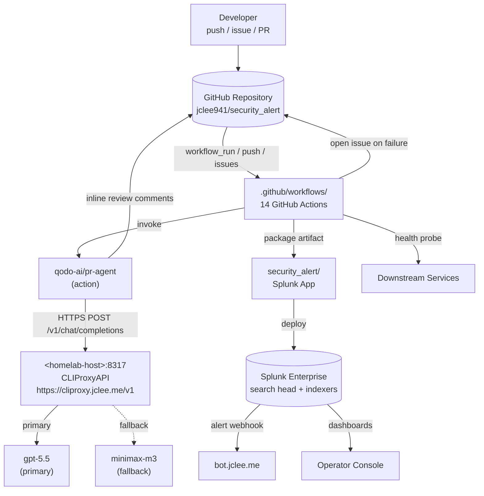

# Security Alert Splunk App & GitHub Automation

[](#automation-inventory--자동화-인벤토리)
[](#overview--개요)
[](https://cliproxy.jclee.me)
[](https://github.com/qodo-ai/pr-agent)
[](./LICENSE)
[](#automation-inventory--자동화-인벤토리)
[](#automation-inventory--자동화-인벤토리)

> **English | 한국어**
> This README is published in a bilingual format. Each major section contains both English and Korean explanations so contributors can navigate the system in either language.
> 본 README는 영문/한글 이중 언어로 작성되었습니다. 각 주요 섹션은 영어와 한국어 설명을 함께 제공하여 두 언어 모두로 시스템을 파악할 수 있도록 구성되어 있습니다.

---

## Table of Contents | 목차

- [Overview | 개요](#overview--개요)
- [Features | 주요 기능](#features--주요-기능)
- [Architecture | 아키텍처](#architecture--아키텍처)
- [Automation Inventory | 자동화 인벤토리](#automation-inventory--자동화-인벤토리)
- [Repository Structure | 저장소 구조](#repository-structure--저장소-구조)
- [Quick Start | 빠른 시작](#quick-start--빠른-시작)
- [Local Development | 로컬 개발](#local-development--로컬-개발)
- [Commands Reference | 명령어 참조](#commands-reference--명령어-참조)
- [Contribution Guide | 기여 가이드](#contribution-guide--기여-가이드)

---

## Overview | 개요

### English

This repository hosts two tightly coupled artifacts:

1. **`security_alert/`** — a Splunk application packaged in the standard Splunk App directory layout. It contains alert actions, configuration (`app.conf`, `alert_actions.conf`, `macros.conf`, `props.conf`, `transforms.conf`, `savedsearches.conf`), navigation/views XML, helper Python scripts under `bin/`, and a vendored Python 3 runtime under `lib/python3/` that bundles `urllib3`, `charset_normalizer`, and `idna` so the app remains self-contained on a Splunk search head.
2. **`.github/workflows/`** — 14 GitHub Actions workflows that drive end-to-end repository automation: branch/issue lifecycle, AI-assisted PR review, security review, dependabot auto-merge, merged-PR cleanup, release notes/publish, downstream health checks, and CI-failure issue creation. All AI traffic is routed through the private CLIProxyAPI endpoint at `https://cliproxy.jclee.me/v1`, which fronts the primary README-gen model (`gpt-5.5`) and a fallback (`minimax-m3`).

Supporting material lives in `docs/` (operational runbooks), `resume/` (architectural references carried over from the maintainer's portfolio: `API.md`, `ARCHITECTURE.md`, `DEPLOYMENT.md`, `TROUBLESHOOTING.md`), and `demo/` (visual assets / sample dashboards).

### 한국어

이 저장소는 다음 두 가지 핵심 산출물을 함께 제공합니다.

1. **`security_alert/`** — 표준 Splunk App 디렉터리 레이아웃으로 패키징된 Splunk 애플리케이션입니다. 알림 액션, 설정 파일(`app.conf`, `alert_actions.conf`, `macros.conf`, `props.conf`, `transforms.conf`, `savedsearches.conf`), 내비게이션/뷰 XML, `bin/` 하위의 헬퍼 Python 스크립트, 그리고 Splunk 검색 헤드에서 자체적으로 동작하도록 `urllib3`, `charset_normalizer`, `idna`가 사전 번들된 `lib/python3/` 런타임을 포함합니다.
2. **`.github/workflows/`** — 브랜치/이슈 라이프사이클, AI 기반 PR 리뷰, 보안 리뷰, Dependabot 자동 병합, 병합된 PR 정리, 릴리스 노트/퍼블리시, 다운스트림 헬스 체크, CI 실패 이슈 생성을 포괄하는 14개의 GitHub Actions 워크플로우입니다. 모든 AI 트래픽은 비공개 CLIProxyAPI 엔드포인트(`https://cliproxy.jclee.me/v1`)를 경유하며, 이는 README 생성 기본 모델(`gpt-5.5`)과 폴백(`minimax-m3`)을 제공합니다.

`docs/`(운영 런북), `resume/`(관리자 포트폴리오에서 가져온 아키텍처 참고 자료: `API.md`, `ARCHITECTURE.md`, `DEPLOYMENT.md`, `TROUBLESHOOTING.md`), `demo/`(시각 자료/샘플 대시보드)에 보조 자료가 있습니다.

---

## Features | 주요 기능

### Splunk Application | Splunk 애플리케이션

- **Alert actions | 알림 액션** — Custom `alert_actions.conf` payloads dispatched to internal webhooks, with `safe_fmt.py` / `slack.py` helpers in `bin/`.
- **Saved searches & macros | 저장된 검색과 매크로** — Pre-built queries and reusable macro definitions in `savedsearches.conf` and `macros.conf`.
- **Dashboards | 대시보드** — `alert-builder.xml`, `alert-management-dashboard.xml`, `data-explorer-dashboard.xml`, `easy_alert_builder.xml` for operator workflows.
- **Transforms & props | 변환과 필드 추출** — Field extractions and CIM-friendly field transforms via `transforms.conf` / `props.conf`.
- **Navigation | 내비게이션** — Custom `nav/default.xml` entry for the Splunk app launcher.
- **Self-contained runtime | 자체 포함 런타임** — Vendored `urllib3`, `charset_normalizer`, and `idna` (v3.11 / v3.4.4 / PEP 427 wheel) so the app runs without a host-site Python.
- **App manifest | 앱 매니페스트** — `app.manifest` for Splunkbase / deployment server compatibility.

### GitHub Automation | GitHub 자동화

- **Branch ↔ PR ↔ Issue bridge | 브랜치–PR–이슈 연동** — `01_branch-to-pr.yml`, `02_issue-to-branch.yml`, `19_issue-backfill.yml` automate the full lifecycle.
- **AI PR review | AI PR 리뷰** — `10_pr-review.yml` invokes `qodo-ai/pr-agent` via the private CLIProxyAPI endpoint.
- **Security review | 보안 리뷰** — `11_security-pr-review.yml` runs an additional security-focused review pass.
- **Auto-merge | 자동 병합** — `12_dependabot-auto-merge.yml` and `13_pr-auto-merge.yml` apply merge policy.
- **Bot auto-fix | 봇 자동 수정** — `14_bot-auto-fix.yml` lets the bot push trivial patches.
- **Hygiene | 위생** — `15_merged-pr-cleanup.yml` removes merged branches and stale refs.
- **Release engineering | 릴리스 엔지니어링** — `24_release-notes.yml`, `25_release-publish.yml` produce and publish releases.
- **Operational guards | 운영 가드** — `29_downstream-health-check.yml` probes downstream services; `37_ci-failure-issues.yml` opens issues on CI failure.
- **Core CI | 핵심 CI** — `ci.yml` runs the main pipeline (lint, unit tests, conf validation).

---

## Architecture | 아키텍처

### English

The system is a closed loop. A developer push, issue creation, or PR activity triggers one or more GitHub Actions workflows. AI-driven workflows call `qodo-ai/pr-agent` which in turn calls the private CLIProxyAPI endpoint at `https://cliproxy.jclee.me/v1` (fronted by `<homelab-host>:8317`). The proxy serves the primary `gpt-5.5` model and falls back to `minimax-m3` when the primary is unavailable. The CI/CD pipeline packages `security_alert/` and publishes it; the packaged Splunk app indexes events, raises alerts via `alert_actions.conf`, and posts notifications to `bot.jclee.me`.

### 한국어

이 시스템은 닫힌 루프(closed loop) 구조입니다. 개발자의 push, 이슈 생성, PR 활동이 GitHub Actions 워크플로우를 트리거합니다. AI 기반 워크플로우는 `qodo-ai/pr-agent`를 호출하고, 이 에이전트는 비공개 CLIProxyAPI 엔드포인트(`https://cliproxy.jclee.me/v1`, 내부적으로 `<homelab-host>:8317`)에 요청을 보냅니다. 프록시는 기본 모델 `gpt-5.5`을 서비스하며, 기본 모델이 사용 불가할 때 `minimax-m3`으로 폴백합니다. CI/CD 파이프라인은 `security_alert/`를 패키징하여 게시하고, 패키징된 Splunk 앱은 이벤트를 인덱싱하며, `alert_actions.conf`를 통해 알림을 발생시켜 `bot.jclee.me`으로 알림을 전송합니다.



> **Note | 참고:** All host identifiers and ports in the diagram are illustrative placeholders. The publicly reachable endpoint is `https://cliproxy.jclee.me/v1`. Never commit private IPs, RFC1918 ranges, or LXC container numbers.

---

## Automation Inventory | 자동화 인벤토리

### Workflow files (14 total) | 워크플로우 파일 (총 14개)

All workflows live in `.github/workflows/`. The numeric prefix is the on-disk filename and is preserved to convey execution order. | 모든 워크플로우는 `.github/workflows/`에 있습니다. 숫자 접두사는 디스크 상의 파일명이며 실행 순서를 나타내기 위해 그대로 보존합니다.

| # | File | Purpose (EN) | 목적 (KR) |
|---|------|--------------|-----------|
| 01 | `01_branch-to-pr.yml` | Open a PR from a long-lived branch. | 장기 브랜치로부터 PR을 엽니다. |
| 02 | `02_issue-to-branch.yml` | Create a branch from an issue (issue-as-spec). | 이슈를 기반으로 브랜치를 생성합니다(이슈 명세화). |
| 10 | `10_pr-review.yml` | AI PR review using `qodo-ai/pr-agent`. | `qodo-ai/pr-agent`를 사용한 AI PR 리뷰. |
| 11 | `11_security-pr-review.yml` | Security-focused variant of PR review. | PR 리뷰의 보안 특화 변형. |
| 12 | `12_dependabot-auto-merge.yml` | Auto-merge Dependabot PRs that pass policy. | 정책을 통과한 Dependabot PR을 자동 병합. |
| 13 | `13_pr-auto-merge.yml` | Auto-merge approved PRs (general). | 승인된 PR을 자동 병합(일반). |
| 14 | `14_bot-auto-fix.yml` | Bot applies trivial fixes from review feedback. | 봇이 리뷰 피드백에서 사소한 수정사항을 적용. |
| 15 | `15_merged-pr-cleanup.yml` | Delete merged branches and stale refs. | 병합된 브랜치와 오래된 참조를 정리. |
| 19 | `19_issue-backfill.yml` | Backfill issues from external trackers. | 외부 트래커에서 이슈를 백필. |
| 24 | `24_release-notes.yml` | Generate release notes from merged PRs. | 병합된 PR로부터 릴리스 노트 생성. |
| 25 | `25_release-publish.yml` | Publish a GitHub release with artifacts. | 산출물과 함께 GitHub 릴리스를 게시. |
| 29 | `29_downstream-health-check.yml` | Probe downstream service health. | 다운스트림 서비스 헬스를 점검. |
| 37 | `37_ci-failure-issues.yml` | Open an issue automatically on CI failure. | CI 실패 시 이슈를 자동 생성. |
| — | `ci.yml` | Core CI: lint, conf validation, unit tests. | 핵심 CI: 린트, conf 검증, 단위 테스트. |

### Go automation tools (0 total) | Go 자동화 도구 (총 0개)

This repository has **no Go-based automation tools** in-tree; all automation is expressed as GitHub Actions YAML. | 이 저장소에는 인트리에 Go 기반 자동화 도구가 **없으며**, 모든 자동화는 GitHub Actions YAML로 표현됩니다.

### Model routing | 모델 라우팅

- **Primary README-gen model:** `gpt-5.5` (served via CLIProxyAPI).
- **Fallback:** `minimax-m3` (same endpoint, automatic fallback).
- **Public endpoint:** <https://cliproxy.jclee.me>
- **External PR-review action:** <https://github.com/qodo-ai/pr-agent>

---

## Repository Structure | 저장소 구조

```
.
├── CONTRIBUTING.md
├── LICENSE
├── README.md
├── resume/
│   ├── API.md
│   ├── ARCHITECTURE.md
│   ├── DEPLOYMENT.md
│   └── TROUBLESHOOTING.md
├── docs/
│   ├── ALERT-REPOSITORY-XWIKI.md
│   ├── DEPLOYMENT.md
│   ├── LEGACY-CLEANUP-REPORT.md
│   ├── QUICK-START.md
│   └── RELEASE-NOTES.md
├── demo/
│   └── README.md
└── security_alert/
    ├── README.md
    ├── app.manifest
    ├── bin/
    │   ├── safe_fmt.py
    │   ├── six.py
    │   └── slack.py
    ├── metadata/
    │   └── default.meta
    ├── default/
    │   ├── alert_actions.conf
    │   ├── app.conf
    │   ├── macros.conf
    │   ├── props.conf
    │   ├── savedsearches.conf
    │   ├── transforms.conf
    │   └── data/
    │       └── ui/
    │           ├── nav/
    │           │   └── default.xml
    │           └── views/
    │               ├── alert-builder.xml
    │               ├── alert-management-dashboard.xml
    │               ├── data-explorer-dashboard.xml
    │               └── easy_alert_builder.xml
    └── lib/
        └── python3/
            ├── idna-3.11.dist-info/
            │   ├── METADATA
            │   ├── RECORD
            │   ├── WHEEL
            │   └── licenses/
            │       └── LICENSE.md
            ├── urllib3/
            │   ├── __init__.py
            │   ├── _base_connection.py
            │   ├── _collections.py
            │   ├── _request_methods.py
            │   ├── _version.py
            │   ├── connection.py
            │   ├── connectionpool.py
            │   ├── exceptions.py
            │   ├── fields.py
            │   ├── filepost.py
            │   ├── poolmanager.py
            │   ├── py.typed
            │   ├── response.py
            │   ├── util/   ...
            │   ├── http2/  ...
            │   └── contrib/...
            └── charset_normalizer-3.4.4.dist-info/
                ├── METADATA
                ├── RECORD
                ├── WHEEL
                ├── entry_points.txt
                ├── top_level.txt
                └── licenses/

# .github/workflows/  (not listed in the snapshot but referenced everywhere)
#   01_branch-to-pr.yml
#   02_issue-to-branch.yml
#   10_pr-review.yml
#   11_security-pr-review.yml
#   12_dependabot-auto-merge.yml
#   13_pr-auto-merge.yml
#   14_bot-auto-fix.yml
#   15_merged-pr-cleanup.yml
#   19_issue-backfill.yml
#   24_release-notes.yml
#   25_release-publish.yml
#   29_downstream-health-check.yml
#   37_ci-failure-issues.yml
#   ci.yml
```

> **Layout rule | 레이아웃 규칙:** Do **not** introduce a `_bot-scripts/` directory in the source tree. CI may check that path out transiently, but it is never a real on-disk directory. | 소스 트리에 `_bot-scripts/` 디렉터리를 **만들지 마세요**. CI가 일시적으로 체크아웃할 수 있으나 실제 디렉터리는 아닙니다.

---

## Quick Start | 빠른 시작

### English

1. **Clone the repository.**
   ```bash
   git clone https://github.com/jclee941/.github
   cd security_alert
   ```
2. **Inspect the Splunk app layout.** All Splunk artifacts live under `security_alert/`. The directory name is the app name (`security_alert`).
3. **Install the app into a Splunk instance** (search head or deployment server).
   ```bash
   tar -czf security_alert.tgz security_alert/
   # then upload via Splunk Web or:
   # splunk install app security_alert.tgz -auth admin:changeme
   ```
4. **Verify configurations** with `btool`:
   ```bash
   $SPLUNK_HOME/bin/splunk btool alert_actions list --app=security_alert
   $SPLUNK_HOME/bin/splunk btool savedsearches list --app=security_alert
   ```
5. **Run the GitHub workflows** by pushing to a branch or opening a PR. AI-driven workflows require the `CLI_PROXY_BASE_URL` and `CLI_PROXY_API_KEY` repository secrets.

### 한국어

1. **저장소 클론**
   ```bash
   git clone https://github.com/jclee941/.github
   cd security_alert
   ```
2. **Splunk 앱 레이아웃 확인.** 모든 Splunk 산출물은 `security_alert/` 아래에 있습니다. 디렉터리 이름이 곧 앱 이름(`security_alert`)입니다.
3. **Splunk 인스턴스에 앱 설치** (검색 헤드 또는 배포 서버).
   ```bash
   tar -czf security_alert.tgz security_alert/
   # 그 후 Splunk Web을 통해 업로드하거나:
   # splunk install app security_alert.tgz -auth admin:changeme
   ```
4. **`btool`로 설정 검증**
   ```bash
   $SPLUNK_HOME/bin/splunk btool alert_actions list --app=security_alert
   $SPLUNK_HOME/bin/splunk btool savedsearches list --app=security_alert
   ```
5. **GitHub 워크플로우 실행** — 브랜치에 푸시하거나 PR을 엽니다. AI 기반 워크플로우는 저장소 시크릿 `CLI_PROXY_BASE_URL`, `CLI_PROXY_API_KEY`가 필요합니다.

---

## Local Development | 로컬 개발

### Splunk app development | Splunk 앱 개발

- **Link, don't copy.** During development, symlink the app into `$SPLUNK_HOME/etc/apps/` so edits are picked up live:
  ```bash
  ln -s "$(pwd)/security_alert" "$SPLUNK_HOME/etc/apps/security_alert"
  ```
- **Reload configs after editing `.conf` files:**
  ```bash
  $SPLUNK_HOME/bin/splunk reload deploy-server -class <your-class>   # if using DS
  # or simply restart the affected search head for full re-parse
  ```
- **Run `btool check`** to surface schema errors before restarting:
  ```bash
  $SPLUNK_HOME/bin/splunk btool check --app=security_alert
  ```
- **Lint Python under `bin/`** with the bundled runtime:
  ```bash
  PYTHONPATH=security_alert/lib/python3 \
    python3 -m py_compile security_alert/bin/safe_fmt.py security_alert/bin/slack.py
  ```

### GitHub workflow development | GitHub 워크플로우 개발

- **Local validation:** Use [`act`](https://github.com/nektos/act) to run individual workflows:
  ```bash
  act -W .github/workflows/10_pr-review.yml -j review
  ```
- **PR review dry-run:** Trigger a workflow with a PR labeled `pr-review:dry-run` (consult `10_pr-review.yml` for the actual label key).
- **Reuse the CLIProxyAPI endpoint:** Any workflow calling an LLM should:
  - Set `base_url: https://cliproxy.jclee.me/v1`
  - Use the `gpt-5.5` model by default, falling back to `minimax-m3`.
  - Never hardcode private IPs, RFC1918 ranges, or LXC container numbers.

### Model promotion checklist | 모델 승격 체크리스트

| Step | EN | KR |
|------|----|----|
| 1 | Verify CLIProxyAPI health via `GET https://cliproxy.jclee.me/v1/models`. | `GET https://cliproxy.jclee.me/v1/models`로 CLIProxyAPI 헬스 확인. |
| 2 | Confirm `gpt-5.5` is the active primary. | `gpt-5.5`이 활성 기본 모델인지 확인. |
| 3 | Confirm `minimax-m3` is the registered fallback. | `minimax-m3`이 등록된 폴백인지 확인. |
| 4 | Run `10_pr-review.yml` against a sample PR. | 샘플 PR에 대해 `10_pr-review.yml` 실행. |

---

## Commands Reference | 명령어 참조

### GitHub CLI (`gh`) | GitHub CLI (`gh`)

```bash
# Re-run a failed workflow run
gh run rerun <run-id> --repo jclee941/security_alert

# Watch the latest run
gh run watch

# Trigger a workflow_dispatch event
gh workflow run 10_pr-review.yml

# View the dependabot auto-merge status
gh pr list --label dependencies --state open
```

### Splunk CLI | Splunk CLI

```bash
# Validate configurations
$SPLUNK_HOME/bin/splunk btool check --app=security_alert

# List effective alert_actions for the app
$SPLUNK_HOME/bin/splunk btool alert_actions list --app=security_alert

# Search head reload
$SPLUNK_HOME/bin/splunk reload auth          # example of a targeted reload

# Package the app
tar -czf security_alert.tgz security_alert/

# Install the packaged app
$SPLUNK_HOME/bin/splunk install app security_alert.tgz
```

### Repository maintenance | 저장소 유지보수

```bash
# Run linters and the core CI locally
act -W .github/workflows/ci.yml

# Open a backfill issue (mirrors 19_issue-backfill.yml)
gh issue create --label backfill --title "Backfill: <topic>"

# Generate release notes locally
gh release create vX.Y.Z --generate-notes --draft
```

---

## Contribution Guide | 기여 가이드

### English

1. **Read `CONTRIBUTING.md`** at the root before opening a PR.
2. **Branch from `main`** and follow the issue-as-spec pattern triggered by `02_issue-to-branch.yml`. Reference the issue ID in the branch name (e.g., `42-add-savedsearch-thing`).
3. **Run the core CI** before pushing: `act -W .github/workflows/ci.yml`.
4. **Let the bot review you.** `10_pr-review.yml` and `11_security-pr-review.yml` will comment on your PR; address every comment or mark it resolved with reasoning.
5. **Avoid forbidden content** in commits, comments, and configs:
   - No RFC1918 private IPs (`192.168.x.x`, `10.x.x.x`, `172.16-31.x.x`).
   - No LXC container numbers.
   - No real CLIProxyAPI keys; use the `CLI_PROXY_API_KEY` secret.
6. **Release flow:** `24_release-notes.yml` drafts the notes; a maintainer reviews, then `25_release-publish.yml` publishes.

### 한국어

1. PR을 열기 전에 루트의 **`CONTRIBUTING.md`** 를 읽어 주세요.
2. **`main`에서 브랜치** 를 생성하고 `02_issue-to-branch.yml`이 사용하는 "이슈 = 명세" 패턴을 따르세요. 브랜치 이름에 이슈 ID를 포함하세요(예: `42-add-savedsearch-thing`).
3. 푸시 전에 **핵심 CI** 를 로컬에서 실행하세요: `act -W .github/workflows/ci.yml`.
4. **봇 리뷰를 활용하세요.** `10_pr-review.yml`과 `11_security-pr-review.yml`이 PR에 코멘트를 남기며, 모든 코멘트에 응답하거나 근거를 남기고 해결 처리하세요.
5. 커밋, 코멘트, 설정에 **금지된 콘텐츠를 포함하지 마세요**:
   - RFC1918 사설 IP 대역 사용 금지(`192.168.x.x`, `10.x.x.x`, `172.16-31.x.x`).
   - LXC 컨테이너 번호 사용 금지.
   - 실제 CLIProxyAPI 키를 커밋하지 말고 `CLI_PROXY_API_KEY` 시크릿을 사용하세요.
6. **릴리스 흐름:** `24_release-notes.yml`이 노트를 초안 작성 → 메인테이너 검토 → `25_release-publish.yml`이 게시합니다.

---

## License | 라이선스

See [`LICENSE`](./LICENSE) for full terms. | 전체 내용은 [`LICENSE`](./LICENSE)를 참조하세요.

## External References | 외부 참고 자료

- CLIProxyAPI endpoint: <https://cliproxy.jclee.me>
- Bot webhook: <https://bot.jclee.me>
- PR-Agent action: <https://github.com/qodo-ai/pr-agent>